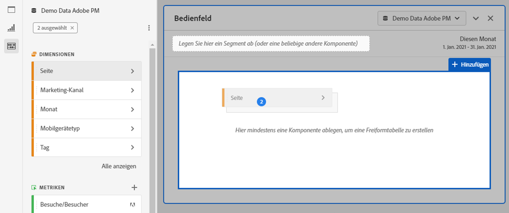

# Freiformtabellen - Übersicht {#freeform-table-overview}

<!-- markdownlint-disable MD034 -->

>[!CONTEXTUALHELP]
>id="cja_workspace_freeformtable_button"
>title="Freiformtabelle"
>abstract="Erstellen Sie eine leere Freiformtabellen-Visualisierung, die Sie mithilfe von Dimensionen, Segmenten, Metriken und Datumsbereichen erstellen können. Sie können die Freiformtabelle als Grundlage für andere Visualisierungen verwenden."

<!-- markdownlint-enable MD034 -->

In Analysis Workspace bildet die Visualisierung einer  **[!UICONTROL Freiformtabelle]** die Grundlage für die interaktive Datenanalyse. Sie können eine Kombination von [Komponenten](https://experienceleague.adobe.com/en/docs/analytics/analyze/analysis-workspace/components/analysis-workspace-components) per Drag und Drop in die Zeilen und Spalten ziehen, um eine benutzerdefinierte Tabelle für Ihre Analyse zu erstellen. Wenn jede Komponente abgelegt wird, wird die Tabelle sofort aktualisiert, damit Sie schnell analysieren und tiefer gehen können.

So erstellen und konfigurieren Sie eine [!UICONTROL Freiformtabelle]:

* Fügen Sie eine Visualisierung für die  **[!UICONTROL Freiformtabelle]** hinzu. Siehe [Hinzufügen einer Visualisierung zu einem Bedienfeld](../freeform-analysis-visualizations.md#add-visualizations-to-a-panel).

## Automatisierte Tabellen

Am schnellsten können Sie eine Tabelle erstellen, indem Sie Komponenten direkt in ein leeres Projekt, ein leeres Bedienfeld oder eine Freiformtabelle ablegen. Eine Freiformtabelle wird für Sie in einem empfohlenen Format erstellt. [Tutorial ansehen](https://experienceleague.adobe.com/en/docs/analytics-learn/tutorials/analysis-workspace/building-freeform-tables/auto-build-freeform-tables-in-analysis-workspace).

## Freiformtabellen-Builder

Wenn Sie Ihrer Tabelle lieber zuerst mehrere Komponenten hinzufügen und dann die Daten rendern möchten, können Sie **[!UICONTROL Tabellenerstellung aktivieren]** auswählen. Wenn der Builder aktiviert ist, können Sie Dimensionen, Aufschlüsselungen, Metriken und Filter per Drag-and-Drop verschieben, um Tabellen zu erstellen, die komplexere Fragen beantworten. Die Daten werden aktualisiert, sobald Sie **[!UICONTROL Build]** auswählen.

## Interaktionen

Es gibt verschiedene Arten, mit Freiformtabellen zu interagieren und sie anzupassen:

### Filtern und Sortieren

* Sie können die Daten in einer Tabelle [ filtern und sortieren.](filter-and-sort.md)

### Zeilen

* Mit  können Sie eine neue Visualisierung ](../freeform-analysis-visualizations.md#visualize) schnell aus einer oder mehreren Zeilen erstellen.[
* Sie können mehr Zeilen in einen einzigen Bildschirm einpassen, indem Sie die [Anzeigedichte](https://experienceleague.adobe.com/en/docs/analytics/analyze/analysis-workspace/build-workspace-project/view-density) des Projekts anpassen.
* Jede Dimensionsreihe kann bis zu 400 Zeilen anzeigen, bevor die Paginierung erfolgt. Wählen Sie in der ersten Spaltenüberschrift die Zahl neben **[!UICONTROL Zeilen]** aus, um weitere Zeilen auf einer Seite anzuzeigen. Navigieren Sie mit  in der ersten Spaltenüberschrift zu einer anderen Seite.
* Sie können Zeilen nach zusätzlichen Komponenten aufschlüsseln. Um mehrere Zeilen gleichzeitig aufzuschlüsseln, wählen Sie mehrere Zeilen aus und ziehen Sie dann die nächste Komponente auf die ausgewählten Zeilen. Weitere Informationen zu [Aufschlüsselungen](https://experienceleague.adobe.com/en/docs/analytics/analyze/analysis-workspace/components/dimensions/t-breakdown-fa).
* Zeilen können [gefiltert](https://experienceleague.adobe.com/en/docs/analytics/analyze/analysis-workspace/visualizations/freeform-table/filter-and-sort) werden, um einen reduzierte Anzahl von Elementen anzuzeigen. Weitere Einstellungen finden Sie unter [Zeileneinstellungen](https://experienceleague.adobe.com/en/docs/analytics/analyze/analysis-workspace/visualizations/freeform-table/column-row-settings/table-settings).

### Spalten

* Komponenten können innerhalb von Spalten gestapelt werden, um gefilterte Metriken, tabellenübergreifende Analysen und mehr zu erstellen.
* Die Ansicht jeder Spalte kann unter den [Spalteneinstellungen](https://experienceleague.adobe.com/en/docs/analytics-platform/using/cja-workspace/visualizations/freeform-table/column-row-settings/column-settings) angepasst werden.
* Im [Kontextmenü](https://experienceleague.adobe.com/en/docs/analytics-learn/tutorials/analysis-workspace/navigating-workspace-projects/right-click-for-workspace-efficiency) sind mehrere Aktionen verfügbar. Das Menü enthält verschiedene Aktionen, je nachdem, ob Sie die Tabellenüberschrift, die Zeilen oder die Spalten auswählen.

## Einstellungen

Wählen Sie  aus, um die **[!UICONTROL Tabelleneinstellungen]** anzuzeigen. Die folgende spezifische Visualisierung [settings](../freeform-analysis-visualizations.md#settings) ist verfügbar:

### Datenquelle

| Option | Beschreibung |
|---|---|
| **[!UICONTROL Verknüpfte Visualisierungen]**. | Listet alle verknüpften Visualisierungen auf. |
| **[!UICONTROL Datenquelle anzeigen]** | Wenn diese Option deaktiviert ist, wird die Freiformtabelle, die als Datenquelle für die Visualisierung dient, in Workspace ausgeblendet. |

### Einstellungen

| Option | Beschreibung |
|---|---|
| **[!UICONTROL Richten Sie die Daten aus den einzelnen Spalten so aus, dass sie alle in derselben Zeile beginnen]** | So richten Sie die Daten in den einzelnen Spalten aus oder richten sie nicht aus, sodass sie alle in derselben Zeile beginnen. |

## Kontextmenü

Die folgenden [Kontextmenüoptionen](../freeform-analysis-visualizations.md#context-menu) sind in der Kopfzeile der Visualisierung verfügbar:

| Option | Beschreibung |
| --- | --- |
| **[!UICONTROL Kopieren Sie die Visualisierung einfügen]**n | Fügen Sie eine kopierte Visualisierung an einer anderen Stelle im Projekt oder in ein ganz anderes Projekt ein. |
| **[!UICONTROL Daten in die Zwischenablage kopieren]** | Kopieren Sie Daten aus der Visualisierung in die Zwischenablage. |
| **[!UICONTROL Auswahl in Zwischenablage kopieren]** | Kopieren Sie die Auswahl aus der Visualisierung in die Zwischenablage. |
| **[!UICONTROL Elemente als CSV-Datei herunterladen (*Dimensionsname*)]** | Laden Sie die Dimensionselemente (bis zu maximal 50.000) der Visualisierung sofort auf Ihr lokales Gerät herunter. Maximal 50.000 Dimensionselemente für die ausgewählte Dimension. |
| **[!UICONTROL Visualisierung kopieren]** | Kopieren Sie die Visualisierung, damit Sie die Visualisierung an eine andere Stelle innerhalb des Projekts oder in ein ganz anderes Projekt einfügen können. |
| **[!UICONTROL Daten-CSV herunterladen]** | Laden Sie die angezeigten Daten der Visualisierung sofort auf Ihr lokales Gerät herunter. |
| **[!UICONTROL Gesamte Tabelle exportieren..]** | Exportieren Sie die vollständige Tabelle in eine bestimmte Cloud-Position. Siehe [Exportiert Customer Journey Analytics-Berichte in die Cloud](../../export/export-cloud.md) |
| **[!UICONTROL Visualisierung duplizieren]** | Erstellen Sie ein exaktes Duplikat der Visualisierung. |
| **[!UICONTROL Beschreibung bearbeiten]** | Fügen Sie eine Textbeschreibung für die Visualisierung hinzu (oder bearbeiten Sie sie). Siehe [Text](../text.md). |
| **[!UICONTROL Visualisierungslink abrufen]** | Kopieren Sie einen Link und geben Sie ihn direkt für die Visualisierung frei. Ein Dialogfeld Link freigeben zeigt den Link an. Wählen Sie Kopieren aus, um den Link in die Zwischenablage zu kopieren. |
| **[!UICONTROL Neu starten]** | Löschen Sie die Konfiguration für die aktuelle Visualisierung, damit Sie sie von Grund auf neu konfigurieren können. |

>[!MORELIKETHIS]
>
>[Hinzufügen einer Visualisierung zu einem Bedienfeld](/help/analysis-workspace/visualizations/freeform-analysis-visualizations.md#add-visualizations-to-a-panel)
>[Visualisierungseinstellungen](/help/analysis-workspace/visualizations/freeform-analysis-visualizations.md#settings)
>[Kontextmenü &quot;Visualisierung&quot;](/help/analysis-workspace/visualizations/freeform-analysis-visualizations.md#context-menu)
>
