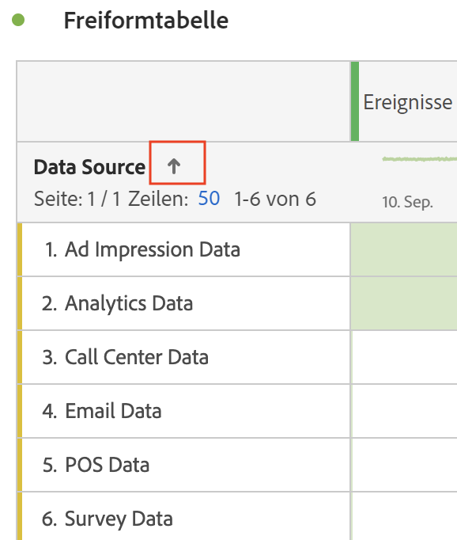

# Paginierung, Filtern und Sortieren von Tabellen

>[!NOTE]
>
>Dies ist die Dokumentation zu Analysis Workspace in Customer Journey Analytics. Seine Funktionen unterscheiden sich geringfügig von denen in [Analysis Workspace im herkömmlichen Adobe Analytics](https://experienceleague.adobe.com/docs/analytics/analyze/analysis-workspace/home.html?lang=de). [Weitere Informationen...](/help/getting-started/cja-aa.md)

Dieses Video-Tutorial bietet eine Übersicht über Paginierungs-, Filter- und Sortiertabellen in Analysis Workspace:

>[!VIDEO](https://video.tv.adobe.com/v/23968)

## Erweiterte Filteroptionen {#section_36E92E31442B4EBCB052073590C1F025}

Wenn Sie auf das Filtersymbol und anschließend neben einer Dimension in einer Freiformtabelle auf **[!UICONTROL Erweiterte Optionen anzeigen]** klicken, können Sie nach folgenden Kriterien filtern. Sie können mehrere Filterregeln anwenden.

* Enthält
* Enthält nicht
* Enthält alle Begriffe
* Enthält einen der Begriffe
* Enthält die Wortgruppe
* Enthält keine Begriffe
* Enthält nicht die Wortgruppe
* Gleich
* Ist nicht gleich
* Beginnt mit
* Endet mit

## Sortieren von Dimensionen in Freiformtabellen

>[!NOTE]
>
>Die Sortierung nach Dimensionen gilt nur für Freiformtabellen in Customer Journey Analytics, nicht im herkömmlichen Adobe Analytics. In beiden Versionen von Analytics kann nach Metriken sortiert werden.

1. Klicken Sie in einer Freiformtabelle in einem Projekt auf den Pfeil neben dem Dimensionsnamen:

* Der Nach-unten-Pfeil sortiert in absteigender Reihenfolge und der Nach-oben-Pfeil (Standard) in aufsteigender Reihenfolge.
* Sie können Dimensionen alphabetisch oder numerisch sortieren. Beispielsweise können Sie in einem Workflow nummerierte Schritte verwenden und nach der Schrittnummer sortieren. Eine datumsbezogene Dimension kann nach Datum sortiert werden. Oder Sie können, wie im Screenshot oben, Datenquellen alphabetisch sortieren.
