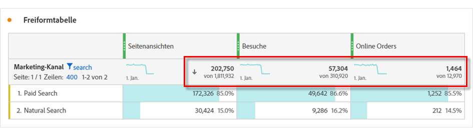

# Workspace-Summen {#workspace-totals}

<!-- markdownlint-disable MD034 -->

>[!CONTEXTUALHELP]
>id="workspace_freeformtable_grandtotal"
>title="Gesamtsumme"
>abstract="Die Gesamtsumme wird für Tabellen oder Aufschlüsselungen mit statischen Zeilen nicht unterstützt"

<!-- markdownlint-enable MD034 -->

In Freiformtabellen wird auf jeder Unterteilungsebene eine Zeile insgesamt angezeigt, die zwei Summen enthalten kann:

* **[!UICONTROL Tabellensumme]** - Dieser Gesamtwert entspricht in der Regel der Gesamtsumme oder einer Teilmenge [!UICONTROL Gesamtsumme]. Die Summe spiegelt alle Tabellenfilter wider, die in der Freiformtabelle angewendet werden, einschließlich der Option [!UICONTROL Ohne einschließen].
* **[!UICONTROL Gesamtsumme]** (**[!UICONTROL von]** *Anzahl*) - Dieser Gesamtwert stellt alle erfassten Ereignisse dar. Wenn ein Filter entweder auf Bedienfeldebene oder in der Freiformtabelle angewendet wird, passt sich diese Summe an, um alle Ereignisse wiederzugeben, die den Filterkriterien entsprechen.

## Gesamtwerte anzeigen

Unter  **[!UICONTROL Spalteneinstellungen]** gibt es Optionen zum **[!UICONTROL Anzeigen von Summen]** und **[!UICONTROL Anzeigen von Gesamtsummen]**. Wenn diese Einstellung nicht aktiviert ist, werden Gesamtwerte aus der Tabelle entfernt, was in Fällen, in denen keine Summen sinnvoll sind, erwünscht sein kann.

[Statische Zeile](/help/analysis-workspace/visualizations/freeform-table/column-row-settings/manual-vs-dynamic-rows.md) Summen verhalten sich anders und werden mithilfe von  **[!UICONTROL Zeileneinstellungen]** gesteuert.

| Option | Beschreibung |
|---|---|
| **[!UICONTROL Summe der aktuellen Zeilen als Summe anzeigen]** | Zeigt eine Client-seitige Summe der Zeilen in der Tabelle an. Diese Gesamtzahl dedupliziert **Metriken wie Sitzungen** Personen nicht. |
| **[!UICONTROL Gesamtsumme anzeigen]** | Eine Server-seitige Summe anzeigen. Metriken wie Sitzungen oder Personen werden insgesamt dedupliziert. |

Siehe [Dynamische und statische Dimensionselemente in Freiformtabellen](column-row-settings/manual-vs-dynamic-rows.md).

## Häufig gestellte Fragen

| Fragen | Antwort |
|---|---|
| Auf *(Summe* basieren die Prozentsätze in den grauen Spalten? | Dieser *insgesamt* hängt von der **[!UICONTROL Prozentsätze]** Einstellungsauswahl unter &quot;**[!UICONTROL &quot;]**:<ul><li>Prozentsätze nach Spalte berechnen : Diese Einstellung ist die Standardeinstellung. Prozentsätze basieren auf der Tabellensumme.</li><li>Prozentsätze nach Zeile berechnen - Prozentsätze basieren auf dem Gesamtwert.</li></ul> |
| Wie wirkt sich die Einstellung &quot;**[!UICONTROL Wert einschließen]** auf die Gesamtwerte aus? | Wenn die Einstellung **[!UICONTROL Kein Wert einschließen]** nicht aktiviert ist, wird die Zeile **[!UICONTROL Kein Wert]** aus der Tabelle und der Tabellensumme entfernt und in alle berechneten Metriken übertragen, die [*Gesamt*-Metriktypen verwenden](/help/components/calc-metrics/cm-workflow/m-metric-type-alloc.md). |
| Wenn benutzerdefinierte Tabellenfilter auf eine Freiformtabelle angewendet werden, werden alle berechneten Metriken und die bedingte Formatierung für den Filter berücksichtigt? | Derzeit nicht. **[!UICONTROL Einschließen von „Kein Wert]** wird berücksichtigt, aber benutzerdefinierte Tabellenfilter haben keine Auswirkungen auf Folgendes:<ul><li>Der von der bedingten Formatierung verwendete Spalten-Max-/Mindestbereich zeigt alle Daten an.</li><li>Berechnete Metriken, die Metriktypen **[!UICONTROL Gesamtsumme]** nutzen.</li><li>Berechnete Metriken mit Funktionen, die über Zeilen in einer Freiformtabelle hinweg berechnen: Spaltensumme, Spaltenmax, Spaltenmin, Anzahl, Mittelwert, Median, Perzentil, Quartil, Zeilenanzahl, Standardabweichung, Varianz, Kumulativ, Kumulativer Durchschnitt, Regressionsvarianten, T-Score, T-Test, Z-Score und Z-Test.</li></ul> |
| Was spiegelt der Metriktyp **[!UICONTROL Gesamtsumme]** in berechneten Metriken wider? | **[!UICONTROL Gesamtsumme]** bezieht sich weiterhin auf die **[!UICONTROL Gesamtsumme]** und spiegelt nicht die auf eine Tabelle angewendeten Filter oder die **[!UICONTROL Tabellensumme]** wider. |
| Welcher Gesamtwert wird angezeigt, wenn Daten entweder kopiert und aus einer Freiformtabelle eingefügt oder über CSV heruntergeladen werden? | Die Zeile Gesamt spiegelt nur die Einstellung **[!UICONTROL Tabellensumme]** wider und respektiert die Einstellung **[!UICONTROL Gesamtwerte anzeigen]**. |
