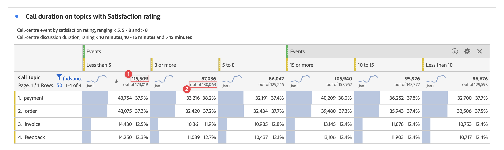

# Gesamt {#workspace-totals}

>[!CONTEXTUALHELP]
>id="workspace_freeformtable_grandtotal"
>title="Gesamtsumme"
>abstract="Die Gesamtsumme wird für Tabellen oder Aufschlüsselungen mit statischen Zeilen nicht unterstützt."

In Freiformtabellen wird auf jeder Unterteilungsebene eine Zeile insgesamt angezeigt, die zwei Summen enthalten kann:

* **[!UICONTROL Tabellensumme]** ➊ - Dieser Gesamtwert entspricht in der Regel der Gesamtsumme oder einer Teilmenge [!UICONTROL Gesamtsumme]. Die Summe spiegelt alle Tabellensegmente wider, die in der Freiformtabelle angewendet wurden, einschließlich der Option [!UICONTROL Ohne einschließen].
* **[!UICONTROL Gesamtsumme]** (**[!UICONTROL von]** *Anzahl*) ➋ - Dieser Gesamtwert stellt alle erfassten Ereignisse dar. Wenn ein Segment entweder auf Panel-Ebene oder in der Freiformtabelle angewendet wird, passt sich diese Summe an, um alle Ereignisse wiederzugeben, die den Segmentkriterien entsprechen.

## Anzeigen von Summen

Unter  **[!UICONTROL Spalteneinstellungen]** finden Sie die Optionen **[!UICONTROL Summen anzeigen]** und **[!UICONTROL Gesamtsumme anzeigen]**. Wenn diese Einstellungen nicht aktiviert sind, werden Summen aus der Tabelle entfernt. In Fällen, in denen Summen nicht sinnvoll sind, kann dies durchaus erwünscht sein.

In einer Freiformtabelle, die (statische [) enthält](/help/analysis-workspace/visualizations/freeform-table/column-row-settings/manual-vs-dynamic-rows.md) verhalten sich Summen anders. und werden mithilfe von  **[!UICONTROL Zeileneinstellungen]**.

| Option | Beschreibung |
|---|---|
| **[!UICONTROL Als Summe der aktuellen Zeilen anzeigen]** | Zeigt eine Client-seitige Summe der Zeilen in der Tabelle an. Bei dieser Summe werden Metriken wie Sitzungen oder Personen **nicht** dedupliziert. |
| **[!UICONTROL Gesamtsumme anzeigen]** | Zeigt eine Server-seitige Summe an. Bei dieser Summe werden Metriken wie Sitzungen oder Personen dedupliziert. |

Siehe [Dynamische und statische Dimensionselemente in Freiformtabellen](column-row-settings/manual-vs-dynamic-rows.md).

## Häufig gestellte Fragen

| Fragen | Antwort |
|---|---|
| Auf welcher *Summe* basieren die grauen Spaltenprozentsätze? | Diese *Summe* hängt von der Einstellung **[!UICONTROL Prozentsatz]** unter **[!UICONTROL Zeileneinstellungen]** ab:<ul><li>Prozentsätze nach Spalte berechnen: Diese Einstellung ist die Standardeinstellung. Prozentsätze basieren auf der Tabellensumme.</li><li>Prozentsätze nach Zeile berechnen: Prozentsätze werden auf Basis der Gesamtsumme berechnet.</li></ul> |
| Wie wirkt sich die Einstellung **[!UICONTROL „Kein Wert“ einschließen]** auf die Gesamtsumme aus? | Wenn die Einstellung **[!UICONTROL „Kein Wert“ einschließen]** deaktiviert ist, wird die Zeile **[!UICONTROL Kein Wert]** aus der Tabelle und der Tabellensumme entfernt und wird in alle berechneten Metriken übernommen, die [*Gesamt* als Metriktypen verwenden](/help/components/calc-metrics/cm-workflow/m-metric-type-alloc.md). |
| Wenn benutzerdefinierte Tabellensegmente auf eine Freiformtabelle angewendet werden, werden die Segmente in allen meinen berechneten Metriken und der bedingten Formatierung berücksichtigt? | Derzeit nicht. **[!UICONTROL Einschließen von „Kein Wert]** wird berücksichtigt, aber benutzerdefinierte Tabellensegmente haben keine Auswirkungen auf Folgendes:<ul><li>Maximaler/minimaler Spaltenbereich, der bei der bedingten Formatierung verwendet wird, wird über alle Daten hinweg angezeigt.</li><li>Berechnete Metriken, die Metriktypen **[!UICONTROL Gesamtsumme]** nutzen.</li><li>Berechnete Metriken mit Funktionen, die über Berechnungen für alle Zeilen in einer Freiformtabelle durchführen – d. h. Spaltensumme, Spaltenmaximum, Spaltenminimum, Anzahl, Mittelwert, Median, Perzentil, Quartil, Zeilenzahl, Standardabweichung, Varianz, kumulativer Wert, kumulativer Durchschnitt, Regressionsvarianten, T-Score, T-Test, Z-Score und Z-Test.</li></ul> |
| Was spiegelt der Metriktyp **[!UICONTROL Gesamtsumme]** in berechneten Metriken wider? | **[!UICONTROL Gesamtsumme]** bezieht sich weiterhin auf die **[!UICONTROL Gesamtsumme]** und spiegelt nicht die Segmente wider, die auf eine Tabelle oder die **[!UICONTROL Tabellensumme]**. |
| Welcher Gesamtwert wird angezeigt, wenn Daten entweder kopiert und aus einer Freiformtabelle eingefügt oder über CSV heruntergeladen werden? | Die Zeile insgesamt spiegelt nur die **[!UICONTROL Tabellensumme]** wider und berücksichtigt die Einstellung **[!UICONTROL Summen anzeigen]**. |
