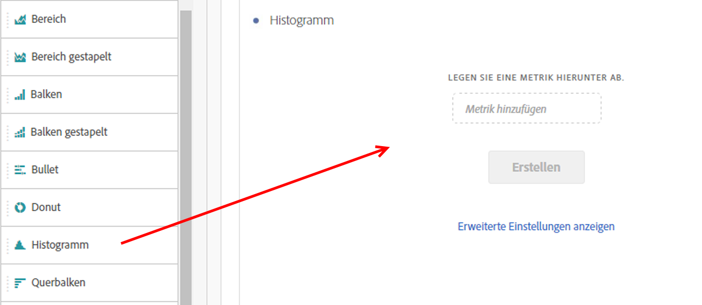

# Histogramm {#histogram}

<!-- markdownlint-disable MD034 -->

>[!CONTEXTUALHELP]
>id="cja_workspace_histogram_button"
>title="Histogramm"
>abstract="Erstellen Sie eine Histogrammvisualisierung, um die Verteilung numerischer Daten in Gruppen von Bereichen darzustellen."

<!-- markdownlint-enable MD034 -->

Die Visualisierung  **[!UICONTROL Histogramm]** ähnelt einer Visualisierung mit [!UICONTROL Balken], gruppiert jedoch Zahlen in Bereiche (Behälter). Analytics automatisiert diese Zusammenfassung von Zahlen zu Bereichen, wobei Sie jedoch die Einstellungen unter [Erweiterte Einstellungen](#advanced-settings) ändern können.

## Verwenden Sie stattdessen 

So erstellen Sie ein Histogramm:

1. Fügen Sie eine Visualisierung für das Histogramm ](/help/assets/icons/Histogram.svg) **[!UICONTROL Histogramm]** hinzu. .
1. Ziehen Sie eine Metrik aus der Komponentenliste **[!UICONTROL Metriken]** oder wählen Sie eine Metrik aus dem Dropdownmenü [!UICONTROL *Metrik hinzufügen*] aus.
1. (optional) Wählen Sie **[!UICONTROL Erweiterte Einstellungen anzeigen]** aus. Siehe [Erweiterte Einstellungen](#advanced-settings).
1. Wählen Sie **[!UICONTROL Erstellen]** aus.

>[!NOTE]
>
>Histogramme unterstützen nur Standardmetriken, keine berechneten Metriken.

Im folgenden Beispiel wird ein Histogramm verwendet, um Sitzungen für die Anzahl der Personen zu bündeln. Das Histogramm zeigt, dass die meisten Personen zwischen 16 und 21 Sitzungen für den ausgewählten Datenbereich haben.

## Erweiterte Einstellungen

Im Rahmen der Visualisierung sind spezifische Histogrammeinstellungen verfügbar.

| Histogrammeinstellungen | Beschreibung |
|---|---|
| **[!UICONTROL Startbehälter]** | Bestimmt, mit welchem Paket das Histogramm beginnt. Die Standardeinstellung lautet 1. Sie können Startwerte von null bis unendlich festlegen, jedoch keine negativen Zahlen. |
| **[!UICONTROL Metrikbehälter]** | Hiermit können Sie die Anzahl der Datumsbereiche (Behälter) erhöhen/verringern. Maximal 50 Buckets sind möglich. |
| **[!UICONTROL Metrik-Behältergröße]** | Hiermit können Sie die Größe der einzelnen Behälter festlegen. So könnten Sie zum Beispiel die Behältergröße von 1 Seitenansicht zu 2 Seitenansichten ändern. |
| **[!UICONTROL Zählmethode]** | Wählen Sie &quot;**[!UICONTROL Person]**&quot;, &quot;**[!UICONTROL Sitzung]**&quot;oder &quot;**[!UICONTROL Ereignis]**&quot;. Zum Beispiel Seitenansichten pro Sitzung, Seitenansichten pro Person oder Seitenansichten pro Ereignis. |

<!--Russ or Meike - Check Hit Type link above. -->

**Beispiele**:

| Startbehälter | Metrikbehälter | Größe des Metrik-Behälters | Ergebnis |
|:----:|:--:|:--:|:--|
| 1 | 5 | 2 |  |
| 0 | 3 | 5 |  |

>[!MORELIKETHIS]
>
>[Hinzufügen einer Visualisierung zu einem Bedienfeld](/help/analysis-workspace/visualizations/freeform-analysis-visualizations.md#add-visualizations-to-a-panel)
>[Visualisierungseinstellungen](/help/analysis-workspace/visualizations/freeform-analysis-visualizations.md#settings)
>[Kontextmenü &quot;Visualisierung&quot;](/help/analysis-workspace/visualizations/freeform-analysis-visualizations.md#context-menu)
>

## Blogpost

In diesem Blogpost finden Sie Informationen zu [mithilfe von Histogrammen zur Identifizierung unerwarteter Datenwerte](https://experienceleaguecommunities.adobe.com/t5/adobe-analytics-blogs/using-histograms-to-identify-unexpected-data-values/ba-p/596168).
