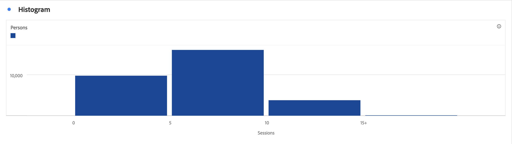

# Histogramm {#histogram}

>[!CONTEXTUALHELP]
>id="workspace_histogram_button"
>title="Histogramm"
>abstract="Erstellen Sie eine Histogrammvisualisierung, um die Verteilung numerischer Daten in Bereichsgruppen darzustellen."

>[!BEGINSHADEBOX]

_In diesem Artikel wird die Histogrammvisualisierung in {_} _&#x200B;**Customer Journey Analytics**._ _Siehe [Histogramm](https://experienceleague.adobe.com/de/docs/analytics/analyze/analysis-workspace/visualizations/histogram)_ für die  _&#x200B;**Adobe Analytics** Version dieses Artikels._

>[!ENDSHADEBOX]

Die Visualisierung  **[!UICONTROL Histogramm]** ähnelt einer Visualisierung [!UICONTROL Balken], fasst jedoch Zahlen zu Bereichen (Buckets) zusammen. Analytics automatisiert diese Zusammenfassung von Zahlen zu Bereichen, wobei Sie jedoch die Einstellungen unter [Erweiterte Einstellungen](#advanced-settings) ändern können.

## Verwenden

So erstellen Sie ein Histogramm:

1. Fügen Sie eine Visualisierung  **[!UICONTROL Histogramm]** hinzu. Siehe [Hinzufügen einer Visualisierung zu einem Panel](freeform-analysis-visualizations.md#add-visualizations-to-a-panel).
1. Ziehen Sie eine Metrik aus **[!UICONTROL Komponentenliste]** Metriken“ oder wählen Sie eine Metrik aus dem [!UICONTROL *Metrik hinzufügen*] Dropdown-Menü aus.
1. (Optional) Wählen Sie **[!UICONTROL Erweiterte Einstellungen einblenden]** aus. Weitere Informationen finden Sie unter [Erweiterte Einstellungen](#advanced-settings).
1. Wählen Sie **[!UICONTROL Erstellen]** aus.

>[!NOTE]
>
>Histogramme unterstützen nur Standardmetriken, keine berechneten Metriken.

Im folgenden Beispiel wird ein Histogramm für das Bucketing von Sitzungen für die Anzahl der Personen verwendet. Das Histogramm zeigt, dass für die meisten Personen für den ausgewählten Datumsbereich zwischen 16 und 21 Sitzungen vorliegen.

## Erweiterte Einstellungen

Im Rahmen der Visualisierung sind bestimmte Histogrammeinstellungen verfügbar.

| Histogrammeinstellungen | Beschreibung |
|---|---|
| **[!UICONTROL Anfangs-Bucket]** | Bestimmt, mit welchem Bucket das Histogramm beginnt. „1“ ist der Standardwert. Sie können Anfangszahlen von 0 bis unendlich festlegen (keine negativen Zahlen). |
| **[!UICONTROL Metrik-Buckets]** | Ermöglicht das Erhöhen/Verringern der Anzahl der Datenbereiche (Buckets). Maximal 50 Buckets sind möglich. |
| **[!UICONTROL Metrik-Bucket-Größe]** | Hier können Sie die Größe der einzelnen Behälter festlegen. Sie können beispielsweise die Größe des Buckets von einer Seitenansicht in zwei Seitenansichten ändern. |
| **[!UICONTROL Zählmethode]** | Wählen Sie aus **[!UICONTROL Globales Konto]** [!BADGE B2B edition]{type=Informative url="https://experienceleague.adobe.com/de/docs/analytics-platform/using/cja-overview/cja-b2b/cja-b2b-edition" newtab=true tooltip="Customer Journey Analytics B2B Edition"}, **[!UICONTROL Account]** [!BADGE B2B edition]{type=Informative url="https://experienceleague.adobe.com/de/docs/analytics-platform/using/cja-overview/cja-b2b/cja-b2b-edition" newtab=true tooltip="Customer Journey Analytics B2B Edition"}, **[!UICONTROL Einkaufsgruppe]** [!BADGE B2B edition]{type=Informative url="https://experienceleague.adobe.com/de/docs/analytics-platform/using/cja-overview/cja-b2b/cja-b2b-edition" newtab=true tooltip="Customer Journey Analytics B2B Edition"}, **[!UICONTROL Opportunity]** [!BADGE B2B edition]{type=Informative url="https://experienceleague.adobe.com/de/docs/analytics-platform/using/cja-overview/cja-b2b/cja-b2b-edition" newtab=true tooltip="Customer Journey Analytics B2B Edition"}, **[!UICONTROL Person]**, **[!UICONTROL Sitzung]**, **[!UICONTROL Event]** oder **[!UICONTROL Object]**. Zum Beispiel Seitenansichten pro Konto [!BADGE B2B Edition]{type=Informative url="https://experienceleague.adobe.com/de/docs/analytics-platform/using/cja-overview/cja-b2b/cja-b2b-edition" newtab=true tooltip="Customer Journey Analytics B2B Edition"}, Seitenansichten pro Sitzung, Seitenansichten pro Person oder Seitenansichten pro Ereignis. Wenn Sie **[!UICONTROL Objekt]** auswählen, wählen Sie den [benutzerdefinierten Container](/help/data-views/create-dataview.md#containers-1) für die Analyse von Unterereignissen aus. |

<!--Russ or Meike - Check Hit Type link above. -->

**Beispiele**:

| Anfangs-Bucket | Metrik-Buckets | Metrik-Bucket-Größe | Ergebnis |
|:----:|:--:|:--:|:--|
| 1 | 5 | 2 |  |
| 0 | 3 | 5 |  |

>[!MORELIKETHIS]
>
>[Hinzufügen einer Visualisierung zu einem BedienfeldEinstellungen der VisualisierungKontextmenü der VisualisierungVerwenden von Histogrammen zur Identifizierung unerwarteter Datenwerte](https://experienceleaguecommunities.adobe.com/t5/adobe-analytics-blogs/using-histograms-to-identify-unexpected-data-values/ba-p/596168)

