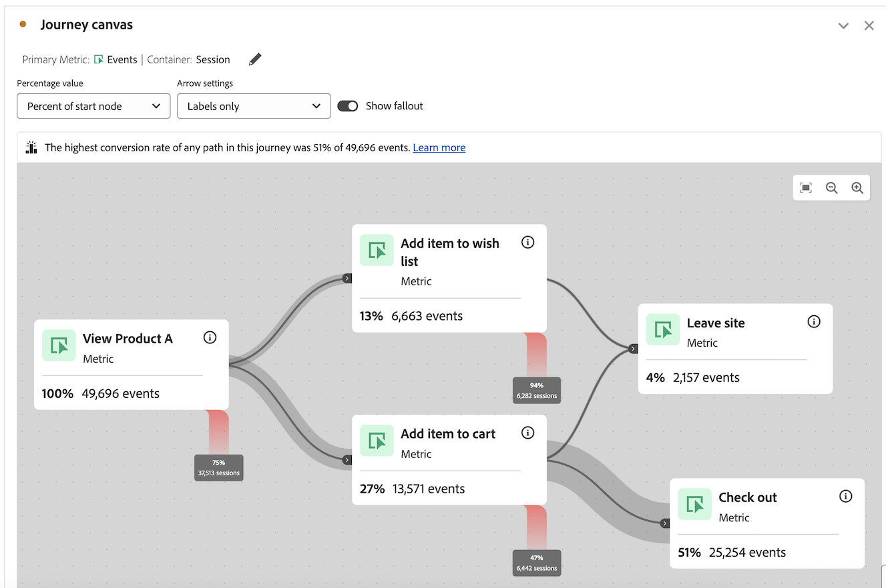

# Konfigurieren einer Journey-Arbeitsflächenvisualisierung

Die Journey-Arbeitsflächen-Visualisierung ermöglicht es Ihnen, die Journey zu analysieren und detaillierte Einblicke zu erhalten, die Sie Ihren Benutzenden und Kunden bieten.

## Überblick über die Journey-Arbeitsfläche

Weitere Informationen zur Journey-Arbeitsfläche finden ](/help/analysis-workspace/visualizations/journey-canvas/journey-canvas.md) unter [Übersicht über die Journey-Arbeitsfläche, einschließlich:

* Wichtigste Funktionen

* Potenzielle Erkenntnisse

* Unterschiede zwischen Journey-Arbeitsfläche und Fallout

* Details zur Analyse von Journey Optimizer Journey

* Und mehr

## Mit dem Erstellen einer Journey-Arbeitsflächen-Visualisierung beginnen

1. Fügen Sie Ihrem Projekt ein leeres Bedienfeld hinzu, wählen Sie in der linken Leiste das Symbol [!UICONTROL **Visualisierungen**] aus und ziehen Sie dann die  [!UICONTROL **Journey-**] in das Bedienfeld.

   Oder

   Fügen Sie eine Journey-Arbeitsflächen-Visualisierung auf eine der Arten hinzu, die im Abschnitt [Hinzufügen von Visualisierungen zu einem Bedienfeld](/help/analysis-workspace/visualizations/freeform-analysis-visualizations.md#add-visualizations-to-a-panel) in [Visualisierungsübersicht](/help/analysis-workspace/visualizations/freeform-analysis-visualizations.md) beschrieben werden.

   

1. Geben Sie die folgenden grundlegenden Informationen zum Konfigurieren der Journey-Arbeitsfläche an:

   | Feld | Funktion |
   |---------|----------|
   | [!UICONTROL **Primäre Metrik**] | Bestimmt die Metrik, die bei der Berechnung der Prozentwerte und Zahlenwerte für jeden Knoten im Journey verwendet wird. 
**Hinweis**: Der Umfang der in den einzelnen Prozentsätzen und Zahlenwerten enthaltenen Daten wird durch die Metrik bestimmt, die Sie im Feld **[!UICONTROL Journey-Arbeitsflächen-Container]** auswählen. Wenn beispielsweise **[!UICONTROL Person]** als Container festgelegt ist, umfassen die auf der Journey angezeigten Statistiken mehrere Sitzungen für eine bestimmte Person. Wenn **[!UICONTROL Sitzung]** als Container festgelegt ist, sind die auf der Journey angezeigten Statistiken auf eine einzige definierte Sitzung für eine bestimmte Person beschränkt.

Sehen Sie sich folgende Beispiele an:
<ul><li>Wenn _Personen_ die primäre Metrik ist und _Person_ der Container ist, bewegen sich nur die Personen im Journey, deren Ereignis den Kriterien jedes aufeinander folgenden Knotens im Journey entspricht. Fallout tritt auf einem Knoten auf, wenn eine Person nie an einem der unmittelbar nächsten Knoten im Journey ankommt. Sie haben möglicherweise andere Aktionen auf der Site durchgeführt, erfüllten jedoch nicht die Kriterien, die von einem der unmittelbar folgenden Knoten definiert wurden.</li><li>Wenn _Personen_ die primäre Metrik ist und _Sitzung_ der Container ist, bewegen sich nur die Personen im Journey, deren Ereignis den Kriterien der einzelnen Knoten auf dem Journey innerhalb einer einzigen Sitzung entspricht. Fallout tritt auf einem Knoten auf, wenn eine Person innerhalb einer einzigen Sitzung nie zu einem der unmittelbar nächsten Knoten auf dem Journey gelangt ist. Sie haben möglicherweise andere Aktionen auf der Site innerhalb der Sitzung durchgeführt, aber sie erfüllten nicht die Kriterien, die von einem der unmittelbar folgenden Knoten definiert wurden.</li></ul> 
Die Hauptmetrik wirkt sich auf die folgenden Aspekte der Journey-Arbeitsflächen-Visualisierung aus:
<ul><li>Die Gesamtzahl, die auf jedem Knoten angezeigt wird.  
Wenn beispielsweise Ereignisse die primäre Metrik ist, zeigt jeder Knoten die Anzahl der Personen an, die ein Ereignis hatten, das den Kriterien dieses Knotens entspricht (und jeden vorherigen Knoten, der in der Journey dazu führte).
</li><li>Der auf jedem Knoten angezeigte Prozentsatz. (Nachdem die Visualisierung erstellt wurde, können Sie das Dropdown-Menü **[!UICONTROL Prozentwert]** verwenden, um entweder den Prozentsatz der Summe, den Prozentsatz des vorherigen Knotens oder den Prozentsatz des Startknotens anzuzeigen.)</li>
Wenn beispielsweise Ereignisse die primäre Metrik ist, zeigt jeder Knoten den Prozentsatz der Personen an, die ein Ereignis hatten, das den Kriterien dieses Knotens entspricht (und jeden vorherigen Knoten, der in der Journey dazu führte).
</li><li>Wenn eine Dimension zur Visualisierung hinzugefügt wird, werden die drei wichtigsten Knoten der Visualisierung hinzugefügt, basierend auf der primären Metrik.</li></ul> |
   | [!UICONTROL **Sekundäre Metrik**] | Bestimmt die sekundäre Metrik, die bei der Berechnung der Prozentwerte und Zahlenwerte für jeden Knoten im Journey verwendet wird. Die sekundäre Metrik ist optional. 
**Hinweis**: Der Umfang der in den einzelnen Prozentsätzen und Zahlenwerten enthaltenen Daten wird durch die Metrik bestimmt, die Sie im Feld **[!UICONTROL Journey-Arbeitsflächen-Container]** auswählen. Wenn beispielsweise **[!UICONTROL Person]** als Container festgelegt ist, umfassen die auf der Journey angezeigten Statistiken mehrere Sitzungen für eine bestimmte Person. Wenn **[!UICONTROL Sitzung]** als Container festgelegt ist, sind die auf der Journey angezeigten Statistiken auf eine einzige definierte Sitzung für eine bestimmte Person beschränkt.

Wenn eine sekundäre Metrik ausgewählt wird, wirkt sich dies auf die folgenden Aspekte der Journey-Arbeitsflächen-Visualisierung aus:
<ul><li>Die Gesamtzahl, die auf jedem Knoten unter der primären Metrik angezeigt wird. 
Wenn beispielsweise Konten die sekundäre Metrik ist, wird die Anzahl der Konten auf dem Knoten für alle Personen angezeigt, die diesen Knoten auf der Journey erreicht haben.
</li><li>Der Prozentsatz, der für jeden Knoten unter der primären Metrik angezeigt wird. (Nachdem die Visualisierung erstellt wurde, können Sie entweder den Prozentsatz der Gesamtzahl oder des Startknotens anzeigen.)</li>
Wenn beispielsweise „Sitzungen“ die sekundäre Metrik ist, zeigt jeder Knoten den Prozentsatz der Sitzungen an, die diesen Knoten auf der Journey erreicht haben (entweder den Prozentsatz der Gesamtzahl oder des Startknotens).
</li></ul> |
   | [!UICONTROL **Journey Optimizer Journey**]<!-- name? --> | Wählen Sie die Journey Optimizer-Journey aus, die Sie als Grundlage für Ihre Analyse auf der Journey-Arbeitsfläche verwenden möchten. Journey mit einem der folgenden Status sind verfügbar: Live, Stopped oder Beendet 
Alternativ können Sie diese Option leer lassen, wenn Sie eine leere Arbeitsfläche benötigen, auf der Sie Ihre Analyse in Analysis Workspace erstellen können.
 
Wenn Sie eine Journey Optimizer-Journey auf der Journey-Arbeitsfläche analysieren, wird die Journey in der gleichen Reihenfolge, Reihenfolge und Struktur angezeigt wie in Journey Optimizer. Weitere Informationen finden Sie unter [Analysieren von Journey Optimizer-Journey](/help/analysis-workspace/visualizations/journey-canvas/journey-canvas.md#analyze-journey-optimizer-journeys) in [Übersicht über die Journey-Arbeitsfläche](/help/analysis-workspace/visualizations/journey-canvas/journey-canvas.md).

**Hinweis**: Diese Option wird nur angezeigt, wenn Journey Optimizer-Daten in derselben Datenansicht erkannt werden, die im Analysis Workspace-Bedienfeld ausgewählt ist, in dem Sie die Visualisierung hinzufügen. Informationen zum Ändern der Datenansicht in einem Bedienfeld in Analysis Workspace finden Sie unter [Übersicht über Analysis Workspace](/help/analysis-workspace/home.md).
 |

1. (Optional) Wählen Sie [!UICONTROL **Erweiterte Einstellungen anzeigen**] und geben Sie dann die folgenden Informationen an:

   | Feld | Funktion |
   |---------|----------|
   | [!UICONTROL **Journey-Arbeitsflächen-Container**] | Wählen Sie den Container aus, auf den Sie sich während der gesamten Journey konzentrieren möchten. Der ausgewählte Container bestimmt den Umfang der auf der Journey erfassten Daten. Dies wirkt sich auf die Statistiken aus, die in der Visualisierung angezeigt werden. (Wenn sich Ihre Container-Namen von den unten gezeigten Standardnamen unterscheiden, wurden sie in Ihrer Datenansicht angepasst.)<ul><li>**Sitzung:** Beschränkt die Statistiken der Visualisierung so, dass sie in eine einzige definierte Sitzung für eine bestimmte Person fallen. Das bedeutet, dass die Zahlen und Prozentsätze, die auf jedem Knoten angezeigt werden (und auf der Basis der primären und sekundären Metrik basieren), in einer einzelnen Sitzung für jede Person auftreten müssen. Mit anderen Worten, eine Person kann mehrmals auf einer Journey dargestellt werden.
Dieser Container verwendet die Metrik Sitzungen .
</li><li>**Person:** (Standard) Ermöglicht es den Statistiken der Visualisierung, mehrere Sitzungen für eine bestimmte Person zu umfassen. Das bedeutet, dass die Zahlen und Prozentsätze, die auf jedem Knoten angezeigt werden (und auf der Basis der primären und sekundären Metrik basieren), in beliebiger Anzahl von Sitzungen auftreten können, solange die Sitzungen derselben Person angehören. Mit anderen Worten, eine Person kann nur einmal in einer Journey dargestellt werden.
Dieser Container verwendet die Metrik Personen .
</li></ul> |

1. Wählen Sie [!UICONTROL **Erstellen**] aus.

   Wenn Sie eine Journey Optimizer-Journey ausgewählt haben, wird die Journey in der gleichen Reihenfolge, Reihenfolge und Struktur angezeigt wie in Journey Optimizer. (Nur Benutzer mit Zugriff auf Journey Optimizer können eine Journey Optimizer-Journey auswählen.)

   <!-- add screen shot -->

   Wenn Sie keine Journey Optimizer-Journey ausgewählt haben, wird eine leere Arbeitsfläche angezeigt, auf der Sie mit dem Hinzufügen von Knoten zur Journey beginnen können. (Nur Benutzer mit Zugriff auf Journey Optimizer können eine Journey Optimizer-Journey auswählen.)

   <!-- add screen shot -->

1. Unabhängig davon, ob Sie eine neue Analyse auf einer leeren Arbeitsfläche erstellen oder eine Journey Optimizer-Journey analysieren, können Sie die Journey konfigurieren, wie in [Visualisierungseinstellungen konfigurieren](#configure-visualization-settings) beschrieben.

## Konfigurieren von Visualisierungseinstellungen

In der Kopfzeile der Journey-Arbeitsfläche stehen verschiedene Konfigurationsoptionen zur Verfügung.

So konfigurieren Sie Einstellungen für die Journey-Arbeitsflächen-Visualisierung:

1. Öffnen Sie in Analysis Workspace eine vorhandene Journey-Arbeitsflächen-Visualisierung oder beginnen [ mit dem Erstellen einer neuen](#begin-building-a-journey-canvas-visualization).

   Optionen zum Konfigurieren der Journey-Arbeitsflächen-Visualisierung sind in der Kopfzeile verfügbar:

   

1. Konfigurieren Sie eine der folgenden Einstellungen, die oben in der Visualisierung angezeigt werden:

   | Einstellung | Funktion |
   |---------|----------|
   | [!UICONTROL **Prozentwert**] | Der auf jedem Knoten im Journey angezeigte Prozentwert.

 
Beachten Sie beim Konfigurieren der auf den Knoten auf der Journey angezeigten Prozentwerte Folgendes:
<ul><li>Für die primäre Metrik wird auf jedem Knoten ein Prozentsatz angezeigt. Ein Prozentsatz wird auch für die sekundäre Metrik angezeigt, wenn eine konfiguriert ist. (Weitere Informationen zu den Einstellungen der primären und sekundären Metrik finden Sie unter [Erstellen einer Journey-Arbeitsflächen-Visualisierung](#begin-building-a-journey-canvas-visualization).)</li><li>Der Prozentsatz umfasst alle Personen oder Sitzungen, die in der Datenansicht innerhalb des Datumsbereichs des Bedienfelds enthalten sind. Ob _Personen_ oder _Sitzungen_ verwendet wird, hängt von der Container-Einstellung ab. (Weitere Informationen zur Container-Einstellung finden Sie unter [Erstellen einer Journey-Arbeitsflächen-Visualisierung](#begin-building-a-journey-canvas-visualization).)</li></ul> 
Wählen Sie aus den folgenden Optionen:
 <ul><li>[!UICONTROL **Prozent des Startknotens**]: Berechnet die Prozentsätze, die für jeden Knoten in Bezug auf den Startknoten angezeigt werden. Prozentsätze basieren auf der ausgewählten primären und sekundären Metrik. 
Ein _Startknoten_ ist ein Knoten, dem keine verbundenen Knoten vorangestellt sind.

Ein Journey kann mehrere Startknoten enthalten. Wird jedoch [!UICONTROL **Prozent der**]) verwendet, wenn die Journey zwei oder mehr Startknoten enthält, die zu einem gemeinsamen Knoten führen. Wenn Sie [!UICONTROL **Prozent des Startknotens**] verwenden möchten, aktualisieren Sie die Journey, damit jeder Knoten auf der Journey auf einen einzelnen Startknoten zurückverfolgt werden kann.
</li><li>[!UICONTROL **Prozent des vorherigen Knotens**]: Berechnet die Prozentsätze, die auf jedem Knoten in Bezug auf den vorherigen Knoten angezeigt werden. Prozentsätze basieren auf der ausgewählten primären und sekundären Metrik.</li><li>[!UICONTROL **Prozent der**]: Berechnet die Prozentsätze, die auf jedem Knoten in Bezug auf alle Daten in der Datenansicht angezeigt werden. Prozentsätze basieren auf der ausgewählten primären und sekundären Metrik.</li></ul> |
   | [!UICONTROL **Pfeileinstellungen**] | Die Pfeile, die zwischen den Knoten auf der Journey-Arbeitsfläche angezeigt werden, können so konfiguriert werden, dass benutzerdefinierte Beschriftungen und Werte angezeigt werden. 

_Beschriftungen_ sind benutzerdefinierte Namen, die auf Pfeilen angezeigt werden. Auf einem Pfeil wird nur eine einzige Beschriftung angezeigt. Kennzeichnungen können eine der folgenden sein und werden in der folgenden Reihenfolge angezeigt:
<ol><li>Ein benutzerdefinierter Name, der von der Journey-Arbeitsfläche hinzugefügt wurde (wie unter [Hinzufügen oder Aktualisieren einer Beschriftung auf einem Pfeil](#add-or-update-a-label-on-an-arrow) beschrieben)</li><li>Ein Journey Optimizer-Label</li><li>Eine Journey Optimizer-Bedingung</li></ol>
_Werte_ sind die Zahlen und Prozentsätze, die auf den Pfeilen angezeigt werden. Sie geben die Personen oder Sitzungen an, die auf dem Journey von einem Knoten zum nächsten verschoben wurden. (Mit anderen Worten, diejenigen, die nicht aus dem Journey gefallen sind.) 

Die folgenden Optionen sind für Journey verfügbar, die nicht aus Journey Optimizer stammen, und für Journey Optimizer-Journey, die auf der Journey-Arbeitsfläche nicht wesentlich geändert wurden: (Zu den wichtigen Änderungen gehören das Hinzufügen oder Entfernen von Knoten, das Hinzufügen oder Entfernen von Pfeilen oder das Ändern der Komponenten eines Knotens.)
<ul><li>[!UICONTROL **Keine Beschriftungen**]: Auf den Pfeilen auf der Journey werden keine Beschriftungen angezeigt.   Diese Option ist nur verfügbar, wenn die Journey geändert wurde in </li><li>[!UICONTROL **Nur Beschriftungen**]: Beschriftungen werden auf den Pfeilen auf der Journey angezeigt.</li></ul>
Die folgenden Optionen sind für Journey Optimizer-Journey verfügbar, die in der Journey-Arbeitsfläche erheblich geändert wurden: (Zu den wichtigen Änderungen gehören das Hinzufügen oder Entfernen von Knoten, das Hinzufügen oder Entfernen von Pfeilen oder das Ändern der Knotenkomponenten.)(**Hinweis**: Diese Optionen werden nur angezeigt, wenn Journey Optimizer-Daten in derselben Datenansicht erkannt werden, die im Analysis Workspace-Bedienfeld ausgewählt ist, in dem Sie die Visualisierung hinzufügen. Informationen zum Ändern der Datenansicht in einem Bedienfeld in Analysis Workspace finden Sie unter [Übersicht über Analysis Workspace](/help/analysis-workspace/home.md).)
<ul><li>[!UICONTROL **Keine Beschriftungen oder Werte**]: Auf der Journey werden keine Beschriftungen oder Werte auf Pfeilen angezeigt.</li><li>[!UICONTROL **Nur Beschriftungen**]: Auf den Pfeilen auf der Journey werden nur Beschriftungen angezeigt. Werte werden nicht angezeigt.</li><li>[!UICONTROL **Nur Werte**]: Auf der Journey werden nur Werte auf den Pfeilen angezeigt. Bezeichnungen werden nicht angezeigt.</li><li>[!UICONTROL **Werte und Beschriftungen**]: Sowohl Beschriftungen als auch Werte werden auf den Pfeilen auf der Journey angezeigt.</li></ul> |
   | [!UICONTROL **Fallout anzeigen**] | Fallout-Daten zeigen einen Prozentsatz und eine Anzahl an, die aus jedem Knoten des Journey herausfallen. Fallout-Daten basieren auf der Metrik, die den Container-Einstellungen der Journey zugeordnet ist; sie basieren nicht auf der primären oder sekundären Metrik. 

Standardmäßig lautet der Container _Person_, sodass die für Fallout-Daten verwendete Metrik _Personen_ lautet. Wenn der Container in _Sitzung_ geändert wird, wird für Fallout-Daten _Sitzungen_ usw. verwendet.

Wenn beispielsweise _Person_ als Container-Einstellung festgelegt ist, zeigt Fallout den Prozentsatz und die Anzahl der Personen auf jedem Knoten der Journey an, die nie auf einem der unmittelbar nächsten Knoten angekommen sind. Sie haben möglicherweise andere Aktionen auf der Site durchgeführt, erfüllten jedoch nicht die Kriterien, die von einem der unmittelbar folgenden Knoten definiert wurden.
 
Weitere Informationen zur Einstellung des Journey-Arbeitsflächen-Containers finden Sie unter [Erstellen einer Journey-Arbeitsflächen-Visualisierung](#begin-building-a-journey-canvas-visualization). |
   | **Zoomsteuerelemente** | Die folgenden Zoom-Steuerelemente sind in der oberen rechten Ecke der Arbeitsfläche verfügbar:<ul><li>**Vergrößern** : Vergrößert bestimmte Bereiche der Visualisierung.
Sie können auch Maussteuerelemente verwenden, z. B. Pinch auf einem Trackpad.
</li><li>**Auszoomen** : Verkleinert die Visualisierung, um mehr Platz auf der Arbeitsfläche zu schaffen.
Sie können auch Maussteuerelemente verwenden, z. B. Pinch auf einem Trackpad.
</li><li>**Bildschirm anpassen** : Passt die aktuellen Zoom- und Schwenkeinstellungen an, um den Bildschirm mit der vollständigen Visualisierung zu füllen.</li></ul>
Um nach dem Vergrößern oder Verkleinern ein- und auszuschwenken, klicken Sie mit der Maus und ziehen Sie die Maus an die gewünschte Position.
 |

1. Fahren Sie mit [Knoten hinzufügen](#add-nodes) fort.

## Hinzufügen von Knoten

Knoten in einer Journey-Arbeitsflächen-Visualisierung stellen die Ereignisse oder Aktionen einer Benutzer-Journey dar.

Sie können Knoten wie folgt erstellen: indem Sie Workspace-Komponenten von der linken Leiste auf die Arbeitsfläche ziehen, indem Sie zulassen, dass Journey-Arbeitsfläche die obersten oder vorherigen Knoten basierend auf vorhandenen Knoten auswählt, oder indem Sie vorhandene Knoten duplizieren.

### Komponenten aus der linken Leiste ziehen

1. Öffnen Sie in Analysis Workspace eine vorhandene Journey-Arbeitsflächen-Visualisierung oder beginnen [ mit dem Erstellen einer neuen](#begin-building-a-journey-canvas-visualization).

1. Ziehen Sie Metriken, Dimensionen, Dimensionselemente, Filter oder Datumsbereiche aus der linken Leiste auf die Arbeitsfläche. Metriken, die auf einem [abgeleiteten Feld“ ](/help/data-views/derived-fields/derived-fields.md), werden unterstützt. Berechnete Metriken sowie Metriken oder Dimensionen, die auf einem [Zusammenfassungsdatensatz“ basieren](/help/data-views/summary-data.md) werden jedoch nicht unterstützt.

   Sie können mehrere Komponenten in der linken Leiste auswählen, indem Sie die Umschalttaste gedrückt halten oder die Befehlstaste (Mac) oder die Strg-Taste (Windows) gedrückt halten.

   Die Visualisierung wird wie folgt aktualisiert, abhängig vom Komponententyp und dem Bereich der Arbeitsfläche, in dem Sie sie platzieren:

   | Typ der Komponente | Platzierung der Komponente | Aktualisierungen der Visualisierung nach dem Hinzufügen eines Knotens |
   |---------|----------|----------|
   | Metrik | Leerer Bereich der Arbeitsfläche | Der Knoten zeigt an, wo die Komponente abgelegt wurde, ohne Verbindung zu vorhandenen Knoten. |
   | Metrik | Ein vorhandener Knoten | Die Komponente wird automatisch mit dem vorhandenen Knoten kombiniert. (Siehe [Kombinieren von ](#combine-nodes)) für weitere Informationen.)
 |
   | Metrik | Ein Pfeil zwischen zwei vorhandenen Knoten | Der Knoten wird zwischen den beiden vorhandenen Knoten angezeigt, auf denen die Komponente abgelegt wurde, und ist mit beiden vorhandenen Knoten verbunden. (Weitere Informationen finden [ unter &quot;](#connect-nodes)&quot;.)
 |
   | Dimension | Leerer Bereich der Arbeitsfläche | 3 Knoten werden für die drei wichtigsten Dimensionselemente erstellt, in denen die Komponente abgelegt wurde, ohne Verbindung zu vorhandenen Knoten. (**Hinweis:** Wenn nur 1 oder 2 Knoten angezeigt werden, bedeutet dies, dass nur für 1 oder 2 der Dimensionselemente Daten verfügbar sind. Wenn keine Knoten angezeigt werden, bedeutet dies, dass für keines der Dimensionselemente Daten verfügbar sind. Versuchen Sie in diesem Fall, ihn zu einem anderen Punkt der Journey hinzuzufügen, den Datumsbereich der Visualisierung anzupassen oder eine andere Dimension auszuwählen.)
Halten Sie die Umschalttaste gedrückt, wenn Sie die Dimension auf der Arbeitsfläche ablegen, um sie als einen einzelnen Knoten mit drei Dimensionselementen hinzuzufügen.

 |
   | Dimension | Ein vorhandener Knoten | Eine Aufschlüsselung wird automatisch auf den Knoten angewendet, wobei die fünf wichtigsten Dimensionselemente angezeigt werden.<!--what happens if you hold Shift?-->
Um die Aufschlüsselung in einer neuen Freiformtabellen-Visualisierung anzuzeigen, klicken Sie auf den [!UICONTROL **In einer Freiformtabelle öffnen**] auf dem Knoten .
 |
   | Dimension | Ein Pfeil, der zwei vorhandene Knoten verbindet | 3 Knoten werden für die drei wichtigsten Dimensionselemente erstellt, die dem ersten Ereignis nach dem ersten Knoten folgen (von Personen/Sitzungen, die schließlich den zweiten Knoten erreichen). Die Knoten werden zwischen den beiden vorhandenen Knoten angezeigt, auf denen die Komponente abgelegt wurde, und jeder Knoten ist mit beiden vorhandenen Knoten verbunden. (**Hinweis:** Wenn nur 1 oder 2 Knoten angezeigt werden, bedeutet dies, dass nur für 1 oder 2 der Dimensionselemente Daten verfügbar sind. Wenn keine Knoten angezeigt werden, bedeutet dies, dass für keines der Dimensionselemente Daten verfügbar sind. Versuchen Sie in diesem Fall, ihn zu einem anderen Punkt der Journey hinzuzufügen, den Datumsbereich der Visualisierung anzupassen oder eine andere Dimension auszuwählen.)
Halten Sie die Umschalttaste gedrückt, wenn Sie die Dimension auf der Arbeitsfläche ablegen, um sie als einen einzelnen Knoten mit drei Dimensionselementen hinzuzufügen. (Weitere Informationen finden [ unter &quot;](#connect-nodes)&quot;.)
 |
   | Dimensionselement | Leerer Bereich der Arbeitsfläche | Der Knoten zeigt an, wo die Komponente abgelegt wurde, ohne Verbindung zu vorhandenen Knoten. |
   | Dimensionselement | Ein vorhandener Knoten | Die Komponente wird automatisch mit dem vorhandenen Knoten kombiniert. |
   | Dimensionselement | Ein Pfeil, der zwei vorhandene Knoten verbindet | Der Knoten wird zwischen den beiden vorhandenen Knoten angezeigt, auf denen die Komponente abgelegt wurde, und ist mit beiden vorhandenen Knoten verbunden. (Weitere Informationen finden [ unter &quot;](#connect-nodes)&quot;.)
 |
   | Filter | Leerer Bereich der Arbeitsfläche | Der Knoten zeigt an, wo die Komponente abgelegt wurde, ohne dass eine Verbindung zu anderen Knoten bestand.
Zu den auf dem Knoten angezeigten Zahlen und Prozentsätzen gehört die Gesamtanzahl der primären Metrik, gefiltert nach dem ausgewählten Filter.
 
Wenn beispielsweise Personen als primäre Metrik für den Journey ausgewählt ist, werden durch Hinzufügen des Filters „Heute“ zu einem leeren Bereich der Arbeitsfläche alle Personen angezeigt, die heute ein Ereignis hatten.
 |
   | Filter | Ein vorhandener Knoten | Wendet den Filter auf den vorhandenen Knoten an. |
   | Filter | Ein Pfeil, der zwei Knoten verbindet | Der Knoten wird zwischen den beiden vorhandenen Knoten angezeigt, auf denen die Komponente abgelegt wurde, und ist mit beiden vorhandenen Knoten verbunden. (Weitere Informationen finden [ unter &quot;](#connect-nodes)&quot;.)

Wendet den Filter auf den Punkt des Pfads an, an dem die Komponente abgelegt wurde.
 |
   | Datumsbereich | Leerer Bereich der Arbeitsfläche | Der Knoten zeigt an, wo die Komponente abgelegt wurde, ohne Verbindung zu anderen Knoten.
Zu den auf dem Knoten angezeigten Zahlen und Prozentsätzen gehört die Gesamtanzahl der primären Metrik, gefiltert nach dem ausgewählten Datumsbereich.
 
Wenn beispielsweise Personen als primäre Metrik für den Journey ausgewählt ist, werden durch Hinzufügen eines Datumsbereichs von „Diesen Monat“ zu einem leeren Bereich der Arbeitsfläche alle Personen angezeigt, die im aktuellen Monat ein Ereignis hatten.
 |
   | Datumsbereich | Ein vorhandener Knoten | Wendet den Datumsbereich auf den vorhandenen Knoten an. |
   | Datumsbereich | Ein Pfeil, der zwei Knoten verbindet | Der Knoten wird zwischen den beiden vorhandenen Knoten angezeigt, auf denen die Komponente abgelegt wurde, und ist mit beiden vorhandenen Knoten verbunden. (Weitere Informationen finden [ unter &quot;](#connect-nodes)&quot;.)

Wendet den Datumsbereich auf den Punkt des Pfads an, an dem die Komponente abgelegt wurde.
 |
   | Mehrere Komponenten | Ein leerer Bereich der Arbeitsfläche | **Wenn keine der Komponenten Dimensionen sind:**
Jede Komponente wird als separater Knoten angezeigt, in dem die Komponenten entfernt wurden, ohne Verbindung zu vorhandenen Knoten.

Halten Sie die Umschalttaste gedrückt, wenn Sie die Komponenten auf der Arbeitsfläche ablegen, um sie als einen kombinierten Knoten hinzuzufügen. 

**Wenn eine der Komponenten, die Sie hinzufügen, Dimensionen sind:**

Jede Komponente wird als separater Knoten angezeigt, in dem die Komponenten entfernt wurden, ohne Verbindung zu vorhandenen Knoten.

Es kann jeweils nur eine Dimension hinzugefügt werden. Wenn die Dimension hinzugefügt wird, werden 3 Knoten für die drei Dimensionselemente erstellt, in denen die Komponente am häufigsten abgelegt wurde.

Halten Sie die Umschalttaste gedrückt, wenn Sie die Komponenten auf der Arbeitsfläche ablegen, um sie als einen kombinierten Knoten hinzuzufügen. Die drei wichtigsten Dimensionselemente werden mit jedem Knoten kombiniert. (Siehe [Kombinieren von ](#combine-nodes)) für weitere Informationen.)
 |
   | Mehrere Komponenten | Ein vorhandener Knoten | Alle Komponenten werden mit dem vorhandenen Knoten kombiniert.
Wenn es sich bei einer der Komponenten, die Sie hinzufügen, um Dimensionen handelt, werden die drei wichtigsten Dimensionselemente mit dem Knoten kombiniert.
 
Es kann jeweils nur eine Dimension hinzugefügt werden.
 |
   | Mehrere Komponenten | Ein Pfeil, der zwei vorhandene Knoten verbindet | **Wenn keine der Komponenten Dimensionen sind:**
Jede Komponente wird als separater Knoten angezeigt, in dem die Komponenten abgelegt wurden und jeder Knoten mit beiden vorhandenen Knoten verbunden ist. (Weitere Informationen finden [ unter &quot;](#connect-nodes)&quot;.)

Halten Sie die Umschalttaste gedrückt, wenn Sie die Komponenten auf der Arbeitsfläche ablegen, um sie als einen kombinierten Knoten hinzuzufügen. (Komponenten müssen vom gleichen Typ sein, damit sie in einem einzelnen Knoten kombiniert werden können.) (Weitere Informationen finden [ unter &quot;](#combine-nodes) kombinieren“.)

**Wenn eine der Komponenten, die Sie hinzufügen, Dimensionen sind:**

Jede Komponente wird als separater Knoten angezeigt, in dem die Komponenten abgelegt wurden und jeder Knoten mit beiden vorhandenen Knoten verbunden ist.

Es kann jeweils nur eine Dimension hinzugefügt werden. Wenn die Dimension hinzugefügt wird, werden 3 Knoten für die drei wichtigsten Elemente der Dimension erstellt, die dem ersten Ereignis nach dem ersten Knoten folgen (Personen oder Sitzungen, die schließlich den zweiten Knoten erreichen). Jeder Knoten ist mit beiden vorhandenen Knoten verbunden. (Weitere Informationen finden [ unter &quot;](#connect-nodes)&quot;.)

Halten Sie die Umschalttaste gedrückt, wenn Sie die Komponenten auf der Arbeitsfläche ablegen, um sie als einen kombinierten Knoten hinzuzufügen. Die drei wichtigsten Dimensionselemente werden mit jedem Knoten kombiniert, und jeder Knoten ist mit beiden vorhandenen Knoten verbunden. (Siehe [Kombinieren von ](#combine-nodes)) für weitere Informationen.)
 |

   Knoten werden als rechteckiges Feld mit den folgenden Informationen angezeigt:

   * Name der Komponente

   * Der Komponententyp (z. B. Metrik oder Dimension)

   * Primäre Metrikstatistiken (insgesamt und in Prozent)

   * Sekundäre Metrikstatistiken (insgesamt und in Prozent)

   Ein pulsierender oder leuchtender Knoten zeigt an, dass Daten für diesen Knoten geladen werden.

1. Wiederholen Sie diesen Vorgang, um weitere Knoten hinzuzufügen und Ihren Journey aufzubauen.

1. Passen Sie die Journey wie in den folgenden Abschnitten beschrieben an. Sie können Knoten verbinden, Knoten umbenennen, Aufschlüsselungen anwenden, Zielgruppen erstellen, Zeitbeschränkungen hinzufügen und vieles mehr.

### Zeigt die obersten Knoten basierend auf vorhandenen Knoten an

Sie können die obersten Knoten automatisch basierend auf den Knoten anzeigen, die sich bereits auf der Arbeitsfläche befinden. Sie können die obersten Knoten zur Journey-Arbeitsfläche hinzufügen oder sie in einer Freiformtabelle anzeigen.

Diese Option ist für die folgenden Objekte auf der Arbeitsfläche verfügbar:

* Einzelne Knoten

* Der Pfeil zwischen den Knoten

#### Top-Knoten nach einem vorhandenen Knoten anzeigen

Sie können einen Knoten auswählen und die obersten Dimensionselemente anzeigen, die danach auf der Journey erscheinen. Sie können die drei wichtigsten Dimensionselemente als separate Knoten zur Journey-Arbeitsfläche hinzufügen oder Sie können alle obersten Dimensionselemente in einer Freiformtabelle anzeigen.

1. Klicken Sie mit der rechten Maustaste auf den Knoten, in dem die Dimensionselemente angezeigt werden sollen, die auf der Journey am häufigsten danach angezeigt werden.

   Der Knoten darf keine vorhandenen Knoten auf der Journey haben, die ihn verlassen.

1. Wählen Sie [!UICONTROL **Top-Knoten nach diesem Knoten anzeigen**].

1. Wählen Sie aus, wo die Dimensionselemente angezeigt werden sollen:

   * [!UICONTROL **Auf Journey-Arbeitsfläche**]: Fügt die drei wichtigsten Knoten auf der Arbeitsfläche hinzu, die hinter diesem Knoten auf der Journey stehen. Jeder Knoten ist mit dem Knoten verbunden, den Sie als separate Verzweigung auf der Arbeitsfläche ausgewählt haben.

   * [!UICONTROL **In einer Freiformtabelle**]: Erstellt eine Freiformtabellen-Visualisierung, die alle Top-Dimensionselemente anzeigt, die nach diesem Knoten auf der Journey kommen.

1. Wählen Sie die gewünschte Dimension aus der Liste der Dimensionen aus.

   Je nachdem, was Sie im vorherigen Schritt ausgewählt haben, werden die drei wichtigsten Dimensionselemente als drei separate Knoten zur Arbeitsfläche hinzugefügt oder alle oberen Dimensionselemente werden in einer Freiformtabelle angezeigt.

#### Top-Knoten vor einem vorhandenen Knoten anzeigen

Sie können einen Knoten auswählen und die obersten Dimensionselemente anzeigen, die ihm auf der Journey vorangestellt werden. Sie können die drei wichtigsten Dimensionselemente als separate Knoten zur Journey-Arbeitsfläche hinzufügen oder Sie können alle obersten Dimensionselemente in einer Freiformtabelle anzeigen.

1. Klicken Sie mit der rechten Maustaste auf den Knoten, in dem die Dimensionselemente angezeigt werden sollen, die auf der Journey oben vor ihm stehen.

   In diesem Knoten dürfen keine vorhandenen Knoten auf der Journey eingehen.

1. Wählen [!UICONTROL **Top-Knoten vor diesem Knoten anzeigen**].

1. Wählen Sie aus, wo die Dimensionselemente angezeigt werden sollen:

   * [!UICONTROL **Auf der Journey-Arbeitsfläche**]: Fügt die drei wichtigsten Knoten auf der Arbeitsfläche hinzu, die vor diesem Knoten auf der Journey liegen. Jeder Knoten ist mit dem Knoten verbunden, den Sie als separate Verzweigung auf der Arbeitsfläche ausgewählt haben.

   * [!UICONTROL **In einer Freiformtabelle**]: Erstellt eine Freiformtabellen-Visualisierung, die alle Top-Dimensionselemente anzeigt, die vor diesem Knoten auf der Journey stehen.

1. Wählen Sie die gewünschte Dimension aus der Liste der Dimensionen aus.

   Je nachdem, was Sie im vorherigen Schritt ausgewählt haben, werden die drei wichtigsten Dimensionselemente als drei separate Knoten zur Arbeitsfläche hinzugefügt oder alle oberen Dimensionselemente werden in einer Freiformtabelle angezeigt.

#### Top-Knoten zwischen vorhandenen Knoten anzeigen

Sie können einen Pfeil auswählen und die oberen Dimensionselemente anzeigen, die zwischen zwei vorhandenen Knoten auf der Journey liegen. Sie können die drei wichtigsten Dimensionselemente als separate Knoten zur Journey-Arbeitsfläche hinzufügen oder Sie können alle obersten Dimensionselemente in einer Freiformtabelle anzeigen.

1. Klicken Sie mit der rechten Maustaste auf den Pfeil zwischen den beiden Knoten, in denen die oberen Dimensionselemente angezeigt werden sollen.

1. Wählen Sie [!UICONTROL **Top-Knoten zwischen diesen Knoten anzeigen**].

1. Wählen Sie aus, wo die Dimensionselemente angezeigt werden sollen:

   * [!UICONTROL **In Journey Canvas**]: Fügt die drei wichtigsten Knoten zur Arbeitsfläche hinzu, die zwischen den zwei vorhandenen Knoten liegen. Jeder Knoten ist mit den umliegenden Knoten als separater Zweig auf der Arbeitsfläche verbunden.

   * [!UICONTROL **In einer Freiformtabelle**]: Erstellt eine Freiformtabellen-Visualisierung, die alle Top-Dimensionselemente anzeigt, die zwischen den beiden vorhandenen Knoten liegen.

1. Wählen Sie die gewünschte Dimension aus der Liste der Dimensionen aus.

   Je nachdem, was Sie im vorherigen Schritt ausgewählt haben, werden die drei wichtigsten Dimensionselemente als drei separate Knoten zur Arbeitsfläche hinzugefügt oder alle oberen Dimensionselemente werden in einer Freiformtabelle angezeigt.

### Duplizieren von Knoten

Die Option zum Duplizieren ist für die folgenden Objekte auf der Arbeitsfläche verfügbar:

* Einzelne Knoten

* Mehrere Knoten

So duplizieren Sie Knoten:

1. Wählen Sie einen oder mehrere Knoten aus, die Sie duplizieren möchten.

   Um mehrere Knoten auszuwählen, halten Sie die Befehlstaste (Mac) oder die Strg-Taste (Windows) gedrückt.

1. Klicken Sie mit der rechten Maustaste auf einen der ausgewählten Knoten und wählen Sie dann [!UICONTROL **Duplizieren**].

## Entwerfen der Journey

Die Reihenfolge der Knoten und die Verbindungen zwischen ihnen wirken sich auf die Daten der Journey-Arbeitsfläche aus. Journey sollten die Ereignissequenz, über die Sie einen Bericht erstellen möchten, visuell und genau widerspiegeln.

Nachdem Knoten zur Arbeitsfläche hinzugefügt wurden, können Sie sie neu anordnen, kombinieren, verbinden und Zeitbeschränkungen zwischen ihnen hinzufügen.

### Knoten neu anordnen

Journey auf der Journey-Arbeitsfläche bestehen aus einem flexiblen Diagramm von Knoten und Pfeilen, die eine beliebige Kombination von Ereignissen, Dimensionselementen und Filtern darstellen.

Sie können Knoten auf die Arbeitsfläche ziehen, um die Ereignisse und Bedingungen des Journey neu anzuordnen.

Wenn Sie die Knotenreihenfolge auf der Journey neu anordnen, werden die Daten entsprechend aktualisiert.

### Kombinieren von Knoten

Ein kombinierter Knoten auf der Journey-Arbeitsfläche ist ein zentraler Punkt auf der Benutzer-Journey (Knoten), der zwei oder mehr Komponenten enthält, die durch Logik miteinander verbunden sind.

#### Kombinierte Knoten erstellen

Sie können einen der folgenden Schritte ausführen, um Knoten auf der Journey-Arbeitsfläche zu kombinieren:

* Ziehen Sie aus der linken Leiste eine einzelne Komponente auf einen Knoten auf der Arbeitsfläche.

* Ziehen Sie in der linken Leiste mehrere Komponenten gleichzeitig auf einen Knoten auf der Arbeitsfläche.

* Ziehen Sie aus der linken Leiste mehrere Komponenten gleichzeitig auf einen leeren Bereich der Arbeitsfläche, während Sie die Umschalttaste gedrückt halten.

<!-- * On the canvas, select the nodes that you want to combine, right-click one of the selected nodes, then select **Combine**. Is there a limit on how many you can combine? -->

#### Logik beim Kombinieren von Knoten

Die Logik, die auf Knoten angewendet wird, wenn sie kombiniert werden, unterscheidet sich je nachdem, welche Komponententypen Sie kombinieren, wie folgt:

>[!TIP]
>
>Sie können die Logik eines kombinierten Knotens anzeigen, indem Sie mit der rechten Maustaste auf den Knoten klicken und dann [!UICONTROL **Filter aus Knoten erstellen**] auswählen. Die Logik wird im Abschnitt [!UICONTROL **Definition**] angezeigt.

| Zu kombinierende Komponententypen | Verwendete Logik (Operator) |
|---------|----------|
| Metrik + Metrik | Verbunden mit ODER |
| Dimension Element + Dimension Element (aus derselben übergeordneten Dimension) | Verbunden mit ODER |
| Dimension + Dimension (aus verschiedenen übergeordneten Dimensionen) | Verbunden mit UND |
| Filter + Filter | Verbunden mit UND |
| Dimension + Metrik, Datumsbereich oder Filter | Verbunden mit UND |
| Datumsbereich + Metrik, Filter oder Dimension | Verbunden mit UND |
| Filter + Metrik, Datumsbereich oder Dimension | Verbunden mit UND |

### Knoten verbinden

Sie können Knoten verbinden, die sich bereits auf der Arbeitsfläche befinden, oder Sie können einen Knoten verbinden, wenn Sie ihn zur Arbeitsfläche hinzufügen.

Sie verbinden -Knoten, um die Ereignissequenz der Journey zu definieren.

#### Pfeile zwischen Knoten

Knoten werden durch einen Pfeil verbunden. Sowohl die Pfeilrichtung als auch die Breite sind von Bedeutung:

* **Direction**: Gibt die Ereignissequenz der Journey an

* **Breite**: Gibt das prozentuale Volumen von einem Knoten zum anderen an

  

#### Logik beim Verbinden von Knoten

Wenn Sie Knoten auf der Journey-Arbeitsfläche verbinden, werden sie mithilfe des THEN-Operators verbunden. Dies wird auch als [sequenzielle Filterung“ ](/help/components/filters/seg-sequential-build.md).

Knoten sind als „endgültiger Pfad“ verbunden, d. h. Besucher werden gezählt, solange sie letztendlich von einem Knoten zum anderen wechseln, unabhängig von Ereignissen, die zwischen den beiden Knoten auftreten. Die Zeit, die Benutzenden zum Verschieben auf dem Pfad zugewiesen wird, wird durch die Container-Einstellung bestimmt. <!-- It can also be controlled by [adding a time constraint](#add-a-time-constraint-between-nodes). -->

Sie können die Logik von verbundenen Knoten anzeigen, indem Sie mit der rechten Maustaste auf den Knoten klicken und dann [!UICONTROL **Filter aus Knoten erstellen**] auswählen. Die Logik wird im Abschnitt [!UICONTROL **Definition**] angezeigt.

#### Vorhandene Knoten verbinden

Journey-Knoten können nicht kreisförmig sein und zu zuvor verbundenen Knoten zurückkehren.

So verbinden Sie Knoten auf der Journey-Arbeitsfläche:

1. Bewegen Sie in einer Journey-Arbeitsflächen-Visualisierung den Mauszeiger über den Knoten, der in der Journey-Sequenz an erster Stelle steht, zu der Sie eine Verbindung mit einem anderen Knoten herstellen möchten.

   Auf jeder Seite des ausgewählten Knotens werden 4 blaue Punkte angezeigt.

1. Ziehen Sie einen der vier blauen Punkte auf eine der vier Seiten des Knotens, mit dem Sie eine Verbindung herstellen möchten.

   Ein Pfeil wird angezeigt, der die beiden Knoten verbindet. Weitere Informationen finden [ unter ](#arrows-between-nodes) zwischen Knoten .

#### Verbinden von Knoten beim Hinzufügen eines Knotens

Beim Hinzufügen eines Knotens zur Arbeitsfläche können Sie ihn zwischen zwei verbundenen Knoten platzieren. Der Knoten wird dem Journey-Fluss zwischen den zwei vorhandenen Knoten hinzugefügt.

Weitere Informationen finden Sie unter [Knoten hinzufügen](#add-nodes).

<!--

### Add a time constraint between nodes

>[!AVAILABILITY]
>
>This feature is not yet available.

You can set a time constraint between nodes. When a time constraint is in place, people are considered to have fallen out of the journey if they follow the defined journey but take longer than the allotted time period to move between the nodes.

The option to add a time constraint is available for the following objects on the canvas:

* The arrow between nodes

To add a time constraint:

1. In a Journey canvas visualization, right-click the arrow between 2 nodes, then select [!UICONTROL **Add time constraint**].

from Travis: You can set time to be within X amount of time or after X amount of time (those are the only two options I think, but we can check with Brandon). 
1. Choose from the following options: 

-->

## Knoten oder Pfeile verwalten

<!--

### Change the color of a node or arrow

>[!AVAILABILITY]
>
>This feature is not yet available.

You can visually customize a journey by changing the color of any node or arrow on the canvas. For example, you could adjust colors to indicate a desirable or undesirable event.

The option to change the color is available for the following objects on the canvas:

* Individual nodes

* The arrow between nodes

To change the color of a node or arrow:

1. In a Journey canvas visualization, right-click the node or arrow whose color you want to change.

1. Select [!UICONTROL **Change color**]. 

1. Select the desired color. 

   The following colors are available: 

-->

### Umbenennen eines Knotens

Wenn Sie eine Komponente auf eine Journey-Arbeitsflächen-Visualisierung ziehen, wird ein Knoten mit demselben Namen wie der Komponentenname erstellt. Sie können den Knoten umbenennen, damit er besser zum Schritt des Journey passt, den der Knoten darstellt.

Die Option zum Umbenennen ist für die folgenden Objekte auf der Arbeitsfläche verfügbar:

* Einzelne Knoten

So benennen Sie einen Knoten um:

1. Klicken Sie in einer Journey-Arbeitsflächen-Visualisierung mit der rechten Maustaste auf den Knoten, den Sie umbenennen möchten.

1. Wählen Sie [!UICONTROL **Umbenennen**] aus.

1. Geben Sie einen neuen Namen ein und drücken Sie dann die Eingabetaste.<!--is that right?-->

### Hinzufügen oder Aktualisieren einer Beschriftung auf einem Pfeil

Die Pfeile, die zwischen den Knoten auf der Journey-Arbeitsfläche angezeigt werden, können so konfiguriert werden, dass benutzerdefinierte Beschriftungen und Werte angezeigt werden.

Beschriftungen sind benutzerdefinierte Namen, die auf Pfeilen angezeigt werden. Auf einem Pfeil wird nur eine einzige Beschriftung angezeigt.

Weitere Informationen zu den Beschriftungen und Werten, die auf den Pfeilen angezeigt werden, finden Sie unter „Pfeileinstellungen“ in [Konfigurieren von Visualisierungseinstellungen](#configure-visualization-settings).

Die Option zum Hinzufügen oder Aktualisieren einer Beschriftung ist für die folgenden Objekte auf der Arbeitsfläche verfügbar:

* Der Pfeil zwischen den Knoten

So fügen Sie einem Pfeil eine Beschriftung hinzu:

1. Klicken Sie in einer Journey-Arbeitsflächen-Visualisierung mit der rechten Maustaste auf den Pfeil, dem Sie eine Beschriftung hinzufügen möchten.

1. Wählen Sie **[!UICONTROL Bezeichnung hinzufügen]** aus.

1. Geben Sie einen Namen für die Bezeichnung ein und drücken Sie dann die Eingabetaste.

   Wenn die Pfeileinstellungen derzeit so konfiguriert sind, dass Beschriftungen ausgeblendet werden, wird eine Meldung angezeigt, in der Sie aufgefordert werden, Beschriftungen anzuzeigen.

So aktualisieren Sie eine vorhandene Beschriftung auf einem Pfeil:

1. Klicken Sie in einer Journey-Arbeitsflächen-Visualisierung mit der rechten Maustaste auf den Pfeil, dem Sie eine Beschriftung hinzufügen möchten.

1. Wählen Sie **[!UICONTROL Bezeichnung aktualisieren]** aus.

1. Geben Sie einen Namen für die Bezeichnung ein und drücken Sie dann die Eingabetaste.

   Wenn die Pfeileinstellungen derzeit so konfiguriert sind, dass Beschriftungen ausgeblendet werden, wird eine Meldung angezeigt, in der Sie aufgefordert werden, Beschriftungen anzuzeigen.

### Aufschlüsselung anwenden

Die Option zum Anwenden einer Aufschlüsselung auf Ihre Daten ist für die folgenden Objekte auf der Arbeitsfläche verfügbar:

* Einzelne Knoten

* Mehrere Knoten

* Der Pfeil zwischen den Knoten

* Mehrere Pfeile zwischen Knoten

Beachten Sie beim Anwenden einer Aufschlüsselung Folgendes:

* Aufschlüsselungen werden auf die primäre Metrik angewendet. Die sekundäre Metrik ist nicht betroffen.

* Die Anwendung einer Aufschlüsselung ändert nichts an der Journey. Stattdessen wird einfach eine Aufschlüsselung der Daten für den Knoten angezeigt, auf den sie angewendet werden.

* Wenn ein Knoten bereits eine Aufschlüsselung aufweist, wird durch Anwenden einer neuen Aufschlüsselung die vorhandene ersetzt.

* Aufschlüsselungsdaten werden aktualisiert, wenn Änderungen an einem früheren Punkt der Journey vorgenommen werden.

#### Anwenden einer Aufschlüsselung auf einen oder mehrere Knoten oder Pfeile

1. Wählen Sie in einer Journey-Arbeitsflächen-Visualisierung mindestens einen Knoten aus, auf den Sie eine Aufschlüsselung anwenden möchten, und klicken Sie dann mit der rechten Maustaste auf einen der ausgewählten Knoten.

   Oder

   Wählen Sie in einer Journey-Arbeitsflächen-Visualisierung einen oder mehrere Pfeile zwischen zwei Knoten aus, auf die Sie die Aufschlüsselung anwenden möchten, und klicken Sie dann mit der rechten Maustaste auf einen der ausgewählten Pfeile.

   Um mehrere Knoten oder Pfeile auszuwählen, halten Sie die Befehlstaste (Mac) oder die Strg-Taste (Windows) gedrückt.

1. Wählen Sie [!UICONTROL **Aufschlüsselung**] aus.

1. Wählen Sie aus, wo die Aufschlüsselung angezeigt werden soll:

   * [!UICONTROL **In Journey-Arbeitsfläche**]

   * [!UICONTROL **In einer Freiformtabelle**]

1. Wählen Sie die Dimension aus, die Sie für die Aufschlüsselung verwenden möchten.

   Wenn Sie die Aufschlüsselung auf der Journey-Arbeitsfläche anzeigen möchten, werden die fünf häufigsten Dimensionselemente auf dem Knoten angezeigt. Auf dem Knoten ist eine Option verfügbar, um die Aufschlüsselung in einer Freiformtabelle zu öffnen.

   Wenn Sie die Aufschlüsselung in einer Freiformtabelle anzeigen möchten, werden die oberen Dimensionselemente in einer neuen Freiformtabelle unmittelbar über der Journey-Arbeitsflächen-Visualisierung angezeigt.

#### Anwenden einer Aufschlüsselung auf einen einzelnen Knoten

Sie können eine Dimension aus der linken Leiste auf den Knoten auf der Arbeitsfläche ziehen, auf den Sie die Aufschlüsselung anwenden möchten.

Weitere Informationen finden Sie unter [Knoten hinzufügen](#add-nodes).

#### Aufschlüsselung entfernen

So entfernen Sie eine angewendete Aufschlüsselung:

1. Klicken Sie mit der rechten Maustaste auf den Knoten, auf den die Aufschlüsselung angewendet wurde.

1. Wählen Sie **[!UICONTROL Aufschlüsselung entfernen]** aus.

### Erstellen einer Zielgruppe

Die Option zum Erstellen einer Zielgruppe ist für die folgenden Objekte auf der Arbeitsfläche verfügbar:

* Einzelne Knoten

* Mehrere Knoten

* Der Pfeil zwischen den Knoten

* Mehrere Pfeile zwischen Knoten

Wenn Sie eine Zielgruppe aus mehreren Knoten oder Pfeilen erstellen, werden diese mit dem OR-Operator verbunden.

So erstellen Sie eine Zielgruppe:

1. Wählen Sie in einer Journey-Arbeitsflächen-Visualisierung einen oder mehrere Knoten aus, an denen Sie eine Zielgruppe erstellen möchten, und klicken Sie dann mit der rechten Maustaste auf einen der ausgewählten Knoten.

   Oder

   Wählen Sie in einer Journey-Arbeitsflächen-Visualisierung einen oder mehrere Pfeile zwischen zwei Knoten aus, in denen Sie eine Zielgruppe erstellen möchten, und klicken Sie dann mit der rechten Maustaste auf einen der ausgewählten Pfeile.

   Um mehrere Knoten oder Pfeile auszuwählen, halten Sie die Befehlstaste (Mac) oder die Strg-Taste (Windows) gedrückt.

   >[!NOTE]
   >
   >Zielgruppen können keine berechneten Metriken oder andere Metriken enthalten, die auf einem [Zusammenfassungsdatensatz“ ](/help/data-views/summary-data.md). Wenn Sie versuchen, eine Zielgruppe aus einem Bereich der Journey-Arbeitsfläche zu erstellen, der eine berechnete Metrik oder eine Metrik enthält, die auf einem Zusammenfassungsdatensatz basiert, wird die berechnete Metrik nicht in die Zielgruppendefinition aufgenommen.

1. Wählen Sie [!UICONTROL **Zielgruppe aus Knoten erstellen**] oder [!UICONTROL **Zielgruppe aus Pfeil erstellen**].

1. Fahren Sie mit dem Erstellen und Veröffentlichen der Zielgruppe fort, wie in [Erstellen und Veröffentlichen von Zielgruppen](/help/components/audiences/publish.md) beschrieben.

### Trenddaten anzeigen

Sie können die Trenddaten in einem Liniendiagramm für Objekte auf der Journey-Arbeitsfläche anzeigen. <!--, with some prebuilt anomaly detection data (this is the definition in Fallout) -->

Die Option „Trend“ ist für die folgenden Objekte auf der Arbeitsfläche verfügbar:

* Einzelne Knoten

* Mehrere Knoten

* Die Pfeile zwischen den Knoten

* Mehrere Pfeile zwischen Knoten

So zeigen Sie Trenddaten an:

1. Wählen Sie in einer Journey-Arbeitsflächen-Visualisierung einen oder mehrere Knoten aus, für die Sie Trenddaten anzeigen möchten, und klicken Sie dann mit der rechten Maustaste auf einen der ausgewählten Knoten.

   Oder

   Wählen Sie in einer Journey-Arbeitsflächen-Visualisierung einen oder mehrere Pfeile zwischen zwei Knoten aus, für die Sie Trenddaten anzeigen möchten, und klicken Sie dann mit der rechten Maustaste auf einen der ausgewählten Pfeile.

   Um mehrere Knoten oder Pfeile auszuwählen, halten Sie die Befehlstaste (Mac) oder die Strg-Taste (Windows) gedrückt.

1. Wählen Sie [!UICONTROL **Trend**] aus.

### Erstellen eines Filters basierend auf einem Knoten oder Pfeil

Sie können einen neuen Filter auf der Grundlage eines Knotens oder Pfeils innerhalb eines Journey erstellen. Nachdem der Filter erstellt wurde, können Sie ihn an einer beliebigen Stelle in Analysis Workspace verwenden.

Auf der Journey-Arbeitsfläche erstellte Filter verwenden [sequenzielle Filterung](/help/components/filters/seg-sequential-build.md). Das bedeutet, dass der Filter den Operator THEN verwendet, um die Ereignissequenz (die Journey), durch die Personen geströmt sind, zu verknüpfen, was zum ausgewählten Knoten oder Pfeil führt. Alle Ereignisse, die mit dem ausgewählten Knoten oder Pfeil übereinstimmen, werden in den Filter aufgenommen.

Wenn Sie einen Filter basierend auf einem Knoten erstellen, in den mehrere Pfade fließen, sind alle Pfade im Filter enthalten. Separate Pfade werden mit dem OR-Operator verbunden.

Erstellen eines Filters:

1. Klicken Sie in einer Journey-Arbeitsflächen-Visualisierung mit der rechten Maustaste auf den Knoten oder Pfeil, den/den Sie zum Erstellen des Filters verwenden möchten.

1. Wählen Sie [!UICONTROL **Filter aus Knoten erstellen**] oder [!UICONTROL **Filter aus Pfeil erstellen**].

   Der Filter-Builder wird angezeigt. Im Abschnitt [!UICONTROL **Definition**] wird die Filterdefinition basierend auf dem ausgewählten Knoten oder Pfeil und seinem Kontext innerhalb der Journey erstellt.

1. Geben Sie einen Titel für den Filter an und nehmen Sie andere Änderungen vor. Weitere Informationen zum Erstellen eines Filters finden Sie unter [Filter Builder](/help/components/filters/filter-builder.md).

1. Wählen Sie [!UICONTROL **Speichern**], um den Filter zu speichern.

### Knoten löschen

Sie können einen oder mehrere Knoten auf einmal innerhalb eines Journey löschen. Wenn Sie einen Knoten löschen, der zwischen zwei Knoten auf dem Journey verbunden ist, werden die zwei verbleibenden Knoten direkt verbunden.

So löschen Sie Knoten auf der Journey-Arbeitsfläche:

1. Wählen Sie in einer Journey-Arbeitsflächen-Visualisierung mindestens einen Knoten aus, den Sie löschen möchten, und klicken Sie dann mit der rechten Maustaste auf einen der ausgewählten Knoten.

1. Wählen Sie [!UICONTROL **Löschen**] aus.

### Löschen von Pfeilen zwischen Knoten

Sie können einen oder mehrere Pfeile gleichzeitig innerhalb einer Journey löschen. Wenn Sie einen Pfeil zwischen zwei Knoten löschen, sind die Knoten nicht mehr verbunden. Wenn der Pfeil Teil eines längeren Pfads war, wird die Verbindung mit dem Pfad getrennt.

So löschen Sie Pfeile zwischen Knoten auf der Journey-Arbeitsfläche:

1. Wählen Sie in einer Journey-Arbeitsflächen-Visualisierung zwischen zwei zu löschenden Knoten einen oder mehrere Pfeile aus, und klicken Sie dann mit der rechten Maustaste auf einen der ausgewählten Pfeile.

1. Wählen Sie [!UICONTROL **Löschen**] aus.

## Öffnen einer Journey aus Journey Optimizer

Wenn Sie eine Journey in Journey Optimizer anzeigen, können Sie sie auf der Journey-Arbeitsfläche anzeigen.

1. Öffnen Sie in Journey Optimizer die Journey, die Sie auf der Journey-Arbeitsfläche analysieren möchten.

1. Wählen Sie [!UICONTROL **Analysieren in CJA**] aus. <!-- ?? -->
