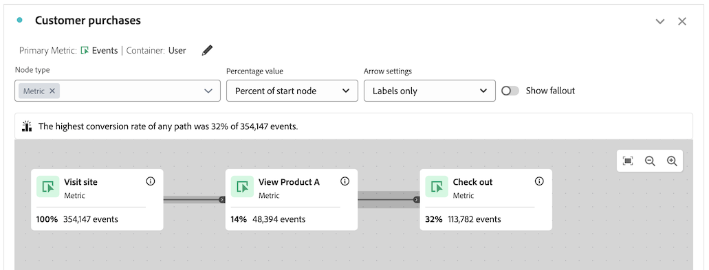

# Fehlerbehebung bei Journey Canvas

{{release-limited-testing}}

Mit der Journey-Arbeitsflächenvisualisierung können Sie tief greifende Einblicke in die Journey erhalten, die Sie Ihren Benutzern und Kunden zur Verfügung stellen.

Weitere Informationen zum Journey-Arbeitsbereich finden Sie unter [Journey-Arbeitsfläche - Übersicht](/help/analysis-workspace/visualizations/journey-canvas/journey-canvas.md) und [Journey-Arbeitsflächenvisualisierung konfigurieren](/help/analysis-workspace/visualizations/journey-canvas/configure-journey-canvas.md).

Die folgenden Informationen helfen Ihnen bei der Fehlerbehebung bei unbeabsichtigten Ergebnissen, die Ihnen möglicherweise angezeigt werden, z. B. Knoten, die später auf der Journey erscheinen und eine höhere Prozentzahl oder Anzahl aufweisen als Knoten, die früher auf der Journey erscheinen.

## Knoten mit einem höheren Prozentsatz oder Wert als vorherige Knoten

Es ist möglich, in der Journey-Arbeitsfläche für Knoten, die später auf der Journey kommen, eine höhere Prozentzahl oder Anzahl anzuzeigen als Knoten, die früher auf der Journey auftreten.

Anders ausgedrückt: Anders als bei Fallout-Visualisierungen, die immer trichter-förmig sind (wobei der Beitrag bei jedem Schritt reduziert wird), können Journey-Canvas-Visualisierungen in späteren Schritten des Journey eine höhere Beteiligung haben als in vorherigen Schritten.

Dies kann in den folgenden Szenarien eintreten:

* Bei Verwendung einer anderen primären Metrik als &quot;Personen oder Sitzungen&quot;

* Wenn mehrere Pfade in einen einzelnen Knoten konvertieren

### Die Journey verwendet eine andere primäre Metrik als Personen oder Sitzung

Da die Journey-Arbeitsfläche es Ihnen ermöglicht, eine beliebige Metrik als primäre Metrik zu verwenden, kann dies dazu führen, dass Knoten, die später im Journey erscheinen, eine höhere Prozentzahl oder eine höhere Anzahl von Knoten anzeigen als Knoten, die früher auf der Journey erscheinen.

Die in den folgenden Szenarien verwendete Journey wird mit den folgenden Einstellungen konfiguriert:

* **[!UICONTROL Person]** wird als Container festgelegt

* **[!UICONTROL Ereignis]** wird als primäre Metrik festgelegt

#### Szenario 1: Benutzer A folgt dem Journey-Pfad in der ersten Sitzung, dann nur späteren Knoten in einer nachfolgenden Sitzung

Angenommen, Benutzer A besucht die Site und schließt die Journey ab (Knoten 1: &quot;Site besuchen&quot; > Knoten 2: &quot;Produkt A anzeigen&quot; > Knoten 3: &quot;Auschecken&quot;). Da Benutzer A die Journey abgeschlossen hat, wird ein Ereignis auf jedem Knoten der Journey gezählt.

Nehmen wir nun an, dass Benutzer A die Site in einer späteren Sitzung erneut besucht. Da Benutzer A die Journey bereits in einer vorherigen Sitzung durch Befolgen des Journey-Pfads abgeschlossen hat, bedeutet dies, dass jedes Mal, wenn Benutzer A über ein Ereignis verfügt, das mit einem beliebigen Knoten im Journey übereinstimmt - selbst wenn Benutzer A in der aktuellen Sitzung nicht dem Pfad der Journey gefolgt ist - ein Ereignis auf den entsprechenden Knoten im Journey gezählt wird. Wenn beispielsweise Benutzer A auscheckt, wird ein Ereignis auf dem Knoten &quot;Auschecken&quot;gezählt. Dies kann zu einem höheren Prozentsatz und einer höheren Zahl auf dem Knoten &quot;Checkout&quot;als auf dem vorherigen Knoten &quot;Produkt A anzeigen&quot;führen.

In diesem Beispiel spielt die Journey-Containereinstellung &quot;Person&quot;eine entscheidende Rolle bei der Bestimmung, dass das Ereignis auf dem dritten Knoten (&quot;Checkout&quot;) in der nachfolgenden Sitzung gezählt wird.

Wenn die Behältereinstellung auf &quot;Sitzung&quot;gesetzt worden wäre, wäre das Ereignis, das nur auf dem dritten Knoten im nachfolgenden Besuch stattfand, nicht in der Journey gezählt worden, da die auf der Journey angezeigten Statistiken auf eine einzelne definierte Sitzung für eine bestimmte Person beschränkt wären. Weitere Informationen zur Containereinstellung finden Sie unter [Erstellen einer Journey-Arbeitsflächenvisualisierung beginnen](/help/analysis-workspace/visualizations/journey-canvas/configure-journey-canvas.md#begin-building-a-journey-canvas-visualization) im Artikel [Konfigurieren einer Visualisierung der Journey-Arbeitsfläche](/help/analysis-workspace/visualizations/journey-canvas/configure-journey-canvas.md) .

<!-- The time allotted for users to move along the path is determined by the container setting. Because "Person" is selected as the container setting in this example, people who followed the journey's path in one session (moving from Node 1 to Node 2 and to Node 3) met the criteria of the journey. On any subsequent visits to the site, any event they have that matches any node on the journey is counted on that node. -->

#### Szenario 2 - Benutzer B fällt aus der Journey

Angenommen, Benutzer B besucht die Site und schließt die Journey nicht ab (besucht die Site, zeigt Produkt B an und checkt dann aus). In diesem Fall wird für den Startknoten &quot;Journey-Site besuchen&quot;ein Ereignis gezählt, aber für die verbleibenden Knoten wird ein-Ereignis nicht gezählt und Benutzer B verlässt die Journey. Auch wenn Benutzer B ausgecheckt ist, wird ein Ereignis nicht auf dem dritten Knoten (&quot;Checkout&quot;) gezählt, da Benutzer B die Journey nicht vor dem Auschecken durch Anzeigen von Produkt A abgeschlossen hat.

Dies liegt daran, dass Ereignisse nur dann für jeden Knoten gezählt werden, wenn Benutzer dem Journey &quot;Endlicher Pfad&quot;folgen. Das bedeutet, dass Ereignisse nur gezählt werden, wenn der Benutzer schließlich von einem Knoten zum anderen wechselt, unabhängig davon, ob Ereignisse zwischen den beiden Knoten auftreten.

### Die Journey hat mehrere Pfade, die zu einem einzelnen Knoten konvertieren

Mit der Journey-Arbeitsfläche können Sie mehrere Startknoten in eine Journey einschließen, was zu mehreren Pfaden führt. Diese Pfade können in einen gemeinsamen Knoten konvertieren, was dazu führt, dass Knoten, die später im Journey auftreten, eine höhere Prozentzahl oder Anzahl aufweisen als Knoten, die früher auf der Journey erscheinen.

<!--

The journey used in the following scenarios is configured with the following settings:

* **[!UICONTROL Person]** is set as the container

* **[!UICONTROL Event]** is set as the primary metric

#### Scenario 

When a journey contains multiple paths that converge into a single node, the two paths are combined into the single node using the OR operator. This can result in the

-->

### Journey-Prozentsätze

Während die auf jedem Knoten einer Journey angezeigten Zahlen unabhängig davon, was im Feld **[!UICONTROL Prozentwert]** ausgewählt ist, konstant bleiben, können sich die Prozentsätze selbst ändern.

Die folgenden Abschnitte zeigen, wie sich die Prozentsätze für dieselbe Journey ändern können, je nachdem, welche der folgenden Optionen im Feld **[!UICONTROL Prozentwert]** ausgewählt ist:

+++Prozentsatz des Startknotens

Die Knoten in diesem Journey enthalten die folgenden Statistiken, wenn das Feld **[!UICONTROL Prozentwert]** auf **[!UICONTROL Prozent des Startknotens]** festgelegt ist:

| Knoten | Statistik |
|---------|----------|
| 1. Knoten - &quot;Besuchsite&quot; | In dieser Journey gab es 354.147 Ereignisse auf der Site innerhalb des Datumsbereichs der Berichterstellung, wie im Journey-Startknoten &quot;Site besuchen&quot;dargestellt. |
| Knoten 2: &quot;Produkt A anzeigen&quot; | Von der Gesamtzahl der im Startknoten angezeigten Ereignisse entsprachen 14 % (48.394) der Ereignisse den Kriterien des zweiten Journey, &quot;Produkt A anzeigen&quot;. |
| 3. Schritt - &quot;Auschecken&quot; | Von der Gesamtzahl der im Startknoten angezeigten Ereignisse entsprachen 32 % (113.782) der Ereignisse den Kriterien des dritten Journey-Knotens, &quot;Checkout&quot;. |

+++

+++Prozentsatz des vorherigen Knotens

Die Knoten in diesem Journey enthalten die folgenden Statistiken, wenn das Feld **[!UICONTROL Prozentwert]** auf **[!UICONTROL Prozent des vorherigen Knotens]** festgelegt ist:

| Knoten | Statistik |
|---------|----------|
| 1. Knoten - &quot;Besuchsite&quot; | In dieser Journey gab es 354.147 Ereignisse auf der Site innerhalb des Datumsbereichs der Berichterstellung, wie im Journey-Startknoten &quot;Site besuchen&quot;dargestellt. |
| Knoten 2: &quot;Produkt A anzeigen&quot; | Von der Gesamtzahl der im vorherigen Knoten angezeigten Ereignisse entsprachen 14 % (48.394) der Ereignisse den Kriterien des zweiten Journey, &quot;Produkt A anzeigen&quot;. |
| 3. Schritt - &quot;Auschecken&quot; | Von der Gesamtzahl der im vorherigen Knoten angezeigten Ereignisse entsprachen mehr als 100 % (113.782) der Ereignisse den Kriterien des dritten Journey-Knotens &quot;Checkout&quot;. |

+++

+++ % der Gesamtsumme

Die Knoten in diesem Journey enthalten die folgenden Statistiken, wenn das Feld **[!UICONTROL Prozentwert]** auf **[!UICONTROL Prozent des Gesamtwerts]** festgelegt ist:

| Knoten | Statistik |
|---------|----------|
| 1. Knoten - &quot;Besuchsite&quot; | In dieser Journey gab es 354.147 Ereignisse auf der Site innerhalb des Datumsbereichs der Berichterstellung, wie im Journey-Startknoten &quot;Site besuchen&quot;dargestellt. |
| Knoten 2: &quot;Produkt A anzeigen&quot; | Von der Gesamtzahl der Ereignisse entsprachen weniger als 1 % (48 394) den Kriterien des zweiten Journey-Knotens &quot;Produkt A anzeigen&quot;. |
| 3. Schritt - &quot;Auschecken&quot; | Von der Gesamtzahl der Ereignisse entsprachen 1% (113.782) den Kriterien des dritten Journey. &quot;Checkout&quot; |

+++

## Kompatibilität zwischen der Container-Metrik und der primären Metrik

Sie können den Journey-Arbeitsflächencontainer so konfigurieren, dass er &quot;Person&quot;(die die Metrik für Personen verwendet) oder &quot;Sitzung&quot;(die die Metrik für Sitzungen verwendet) lautet.

Stellen Sie sicher, dass Sie eine primäre Metrik auswählen, die mit der aktuell ausgewählten Container-Metrik kompatibel ist. Die meisten Metriken sind mit den verfügbaren Containermetriken kompatibel. Einige Kombinationen aus Containermetriken und primären Metriken sollten jedoch vermieden werden.

Beispielsweise kann die Verwendung von Person als Container mit Sitzung als primäre Metrik zu unbeabsichtigten Ergebnissen führen.

<!--

## Percentages that exceed 100%

The following configurations can result in nodes that show percentages that exceed 100%:

* When the **[!UICONTROL Percentage value]** field is set to **[!UICONTROL Percent of total]** or **[!UICONTROL Percent of start node]**, and a primary metric is selected that results in less data for the start node than on subsequent nodes.

  For example, if Revenue is selected as the primary metric, and no revenue is being realized on the primary metric, then on any node where revenue is being realized will show as exceeding 100%. 

-->
