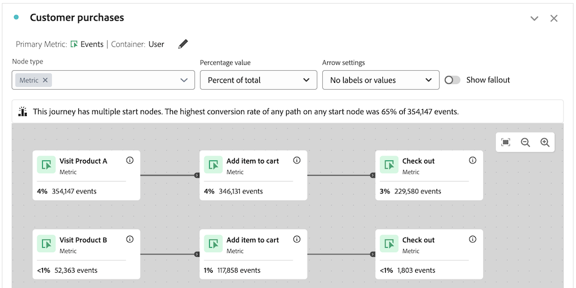

# Überblick über die Journey-Arbeitsfläche {#journey-canvas-overview}

<!-- markdownlint-disable MD034 -->

>[!CONTEXTUALHELP]
>id="cja_journeycanvas_button"
>title="Journey-Arbeitsfläche"
>abstract="Zeigt, wie Personen eine Reihe von Touchpoints durchlaufen oder aus ihr aussteigen. Zur Verwendung für Journeys mit mehreren Einstiegspunkten und Pfaden oder zum Analysieren von Journeys, die in Journey Optimizer erstellt wurden."

<!-- markdownlint-enable MD034 -->

<!-- markdownlint-disable MD034 -->

>[!CONTEXTUALHELP]
>id="cja_journeycanvas_panel"
>title="Journey-Arbeitsfläche"
>abstract="Analysieren Sie, wie Personen eine definierte Journey durchlaufen oder aus ihr aussteigen. Erstellen Sie Analysen von Benutzerereignissen, indem Sie ein flexibles Journey- und Pfeildiagramm erstellen, das eine beliebige Ereigniskombination, Dimensionselemente und  darstellt. Ziehen Sie Knoten auf die Arbeitsfläche, um die Ereignisse und Bedingungen der Journey neu anzuordnen. Die Daten werden dabei entsprechend aktualisiert.   Kundinnen und Kunden mit Zugriff auf Adobe Journey Optimizer können vorhandene Journey Optimizer-Journeys analysieren."

<!-- markdownlint-enable MD034 -->

<!-- markdownlint-disable MD034 -->

>[!CONTEXTUALHELP]
>id="journeycanvas_button"
>title="Journey-Arbeitsfläche"
>abstract="Zeigt, wie Personen eine Reihe von Touchpoints durchlaufen oder aus ihr aussteigen. Zur Verwendung für Journeys mit mehreren Einstiegspunkten und Pfaden oder zum Analysieren von Journeys, die in Journey Optimizer erstellt wurden."

<!-- markdownlint-enable MD034 -->

<!-- markdownlint-disable MD034 -->

>[!CONTEXTUALHELP]
>id="journeycanvas_panel"
>title="Journey-Arbeitsfläche"
>abstract="Analysieren Sie, wie Personen eine definierte Journey durchlaufen oder aus ihr aussteigen. Erstellen Sie Analysen von Benutzerereignissen, indem Sie ein flexibles Journey- und Pfeildiagramm erstellen, das eine beliebige Ereigniskombination, Dimensionselemente und  darstellt. Ziehen Sie Knoten auf die Arbeitsfläche, um die Ereignisse und Bedingungen der Journey neu anzuordnen. Die Daten werden dabei entsprechend aktualisiert.   Kundinnen und Kunden mit Zugriff auf Adobe Journey Optimizer können vorhandene Journey Optimizer-Journeys analysieren."

<!-- markdownlint-enable MD034 -->

>[!BEGINSHADEBOX]

_In diesem Artikel wird die Visualisierung „Journey-Arbeitsflächen“ in_  _**Customer Journey Analytics** beschrieben. Es gibt keine entsprechende Visualisierung in **Adobe Analytics**._

>[!ENDSHADEBOX]

Die Visualisierung „Journey-Arbeitsflächen“ hilft Ihnen, die Journey zu analysieren und tiefgreifende Erkenntnisse zu gewinnen, die Sie Ihren Benutzenden sowie Kundinnen und Kunden bereitstellen können. Sie ermöglicht es Ihnen, eine Journey von Grund auf neu zu definieren oder eine Journey von Journey Optimizer anzuzeigen. Dort sehen Sie dann, wie Personen die Journey verlassen haben (ausgestiegen sind) oder fortgesetzt (durchlaufen) haben.

Sie können [Analysen von Benutzerereignissen erstellen](/help/analysis-workspace/visualizations/journey-canvas/configure-journey-canvas.md) indem Sie eine beliebige Kombination aus Journey, Dimensionselementen, Segmenten und Datumsbereichen verwenden, um Journey-Knoten zu erstellen. Verbinden Sie die Knoten, um den Journey-Fluss zu erstellen, und schließen Sie mehrere Pfade und Entscheidungspunkte ein. Ziehen Sie Knoten auf die Arbeitsfläche, um die Ereignisse und Bedingungen der Journey neu anzuordnen. Daten werden bei Änderungen in Echtzeit aktualisiert.

[Knoten sind verbunden wie ein](/help/analysis-workspace/visualizations/journey-canvas/configure-journey-canvas.md#logic-when-connecting-nodes) „Endgültiger Pfad“, d. h. Besuchende werden gezählt, solange sie letztendlich von einem Knoten zum anderen wechseln, unabhängig von Ereignissen, die zwischen den beiden Knoten auftreten. Die Zeit, die Benutzenden für das Fortbewegen auf dem Pfad zugeteilt wird, wird durch die Container-Einstellung bestimmt.

## Wichtigste Funktionen

Zu den wichtigsten Funktionen der Visualisierung „Journey-Arbeitsfläche“ gehören:

* Detaillierte Fallout- und Fallthrough-Analyse, die auch die komplexesten Journey-Benutzerinnen und -Benutzer berücksichtigt.

* Eine Arbeitsfläche zum Zuordnen und Visualisieren der verschiedenen Einstiegspunkte, Knoten und Pfade einer Benutzer-Journey.

* Drag-and-Drop-Interaktionen zum Hinzufügen von Komponenten zur Arbeitsfläche und zum Neupositionieren vorhandener Knoten.

* Die Option zum Erstellen von Benutzer-Journey-Analysen innerhalb der Journey-Arbeitsfläche oder zum automatischen Erstellen von Benutzer-Journey-Analysen auf der Grundlage von Journey Optimizer-Journeys.

## Potenzielle Erkenntnisse

Die Journey-Arbeitsfläche bietet umsetzbare Erkenntnisse für die komplexesten Journeys.

### Pfad mit der höchsten Konversionsrate {#conversion-rate-caption}

Die auffälligste Erkenntnis auf der Journey-Arbeitsfläche wird oben auf der Arbeitsfläche selbst als Beschriftung angezeigt.

Diese Beschriftung fasst die Pfade der Journey mit der höchsten Konversionsrate zusammen.

Wenn die Journey mehrere Startknoten enthält, sieht die Beschriftung wie folgt aus:

Wenn die Journey einen einzelnen Startknoten enthält, sieht die Beschriftung wie folgt aus:

Beachten Sie bei der Interpretation dieser Beschriftung Folgendes:

* Ein _Pfad_ wird als ein Startknoten definiert, der über Pfeile mit einem Endknoten verbunden ist, wobei eine beliebige Anzahl von Knoten zwischen ihnen verbunden ist.

* Die Berechnung der Konversionsrate hängt vom Typ der Journey ab (die Anzahl der Start- und Endknoten in der Journey und ob sich die Pfade zwischen ihnen schneiden).

  Die folgende Tabelle beschreibt, wie die Konversionsraten anhand des Journey-Typs berechnet werden:

  | Journey-Typ | Berechnung der Konversionsrate | Beispiel |
  |---------|----------|---------|
  | **Ein einzelner Startknoten und ein einzelner Endknoten** | Die Konversionsrate wird berechnet, indem die Zahl des Endknotens durch die Zahl des Startknotens dividiert wird. |  |
  | **Ein einzelner Startknoten und mehrere Endknoten** | Die Konversionsrate wird berechnet, indem der Endknoten mit der höchsten Zahl gefunden und durch die Zahl des Startknotens dividiert wird. |  |
  | **Mehrere eigenständige Pfade, wobei jeder Pfad einen einzelnen Start- und einen einzelnen Endknoten enthält** | Die Konversionsrate wird berechnet, indem die Zahl des Endknotens durch die Zahl des Startknotens dividiert wird. Der Pfad mit der höchsten Konversionsrate wird in der Beschriftung beschrieben. |  |
  | **Mehrere Startknoten, an einem beliebigen Punkt in der Journey zu einem gemeinsamen Knoten zusammenlaufen** | Die Konversionsrate wird berechnet, indem der Endknoten mit der höchsten Zahl gefunden und durch die Zahl des Startknotens mit der niedrigsten Zahl dividiert wird. |  |

### Fallthrough, Fallout und mehr

Im Folgenden finden Sie einige Beispiele für weitere Erkenntnisse, die Sie auf der Journey-Arbeitsfläche finden können. Sie können auswählen, ob diese Erkenntnisse auf allen Personen in der Datenansicht, allen Personen, die die Journey gestartet haben, oder allen Personen aus dem vorherigen Knoten der Journey basieren.

#### Fall-through (Verbleib)

* Die Anzahl und der Prozentsatz der Personen, die die Journey abgeschlossen haben (am Endknoten angekommen)

* Die Anzahl und der Prozentsatz der Personen, die an einem bestimmten Knoten der Journey angekommen sind

* Der häufigste Schritt, der nach oder vor einem bestimmten Knoten des Journey erfolgte

#### Fallout

* Die Knoten der Journey, an denen die Personen am häufigsten aus der Journey ausgestiegen sind (kamen nie an einem der unmittelbar nächsten Knoten an)

#### Zusätzliche Daten für jeden Knoten

* Fügen Sie für jeden Knoten der Journey eine Aufschlüsselungsdimension hinzu, um zusätzliche Daten für diesen bestimmten Knoten anzuzeigen

## Auswählen zwischen den Visualisierungen „Journey-Arbeitsfläche“, „Fallout“ oder „Flussvisualisierung“

Die Visualisierung „Journey-Arbeitsflächen“ weist Ähnlichkeiten mit der Visualisierung [Fallout](/help/analysis-workspace/visualizations/fallout/fallout-flow.md) und der Visualisierung [Fluss](/help/analysis-workspace/visualizations/c-flow/flow.md) auf, jedoch mit wichtigen Unterschieden.

### Informationen zu den Unterschieden

<!-- Information in this snippet is shared between Journey canvas, Fallout, and Flow visualization docs -->

{{journey-visualization-comparisons}}

### Verwendung der Journey-Arbeitsfläche

Die Journey-Arbeitsfläche ist wichtig für Folgendes:

* Fallout-Analyse von Journeys mit mehreren Einstiegspunkten und Pfaden.

* Nichtlineare Journeys mit mehreren Einstiegspunkten und Pfaden und mit einer vordefinierten Seitensequenz.

* Explorative Ad-hoc-Analyse, die auf einer vordefinierten Journey basiert.

* Analyse, für die eine andere primäre Metrik als „Sitzung“, „Person“ oder „Vorfälle“ erforderlich ist. 

* Detaillierte Analyse von Journeys, die ursprünglich aus Adobe Journey Optimizer stammen.

Verwenden Sie [die Tabelle oben](#understand-the-differences), um die Unterschiede zwischen der Visualisierung Journey-Arbeitsfläche, Fallout und Fluss zu verstehen.

## Analysieren von Journey Optimizer-Journeys

>[!NOTE]
>
>Wenn Ihre Organisation keinen Zugriff auf Journey Optimizer hat, können Sie weiterhin [Analysen auf der Journey-Arbeitsfläche erstellen](#build-analyses-in-customer-journey-analytics).

Das Analysieren von Journey Optimizer-Journeys auf der Journey-Arbeitsfläche bietet tiefgreifende, umsetzbare Erkenntnisse in die Interaktion von Personen mit einer Journey.

Wenn Sie eine Journey Optimizer-Journey auf der Journey-Arbeitsfläche analysieren, wird die Journey in der gleichen Reihenfolge, Sequenz und Struktur angezeigt wie in Journey Optimizer. Wenn Sie auf der Journey-Arbeitsfläche wesentliche Änderungen an einer Journey vornehmen, [werden Änderungen nicht mehr über Journey Optimizer synchronisiert](#synchronization-between-journey-optimizer-and-journey-canvas).

### Vorteile der Analyse von Journey Optimizer-Journeys mit der Journey-Arbeitsfläche

Die Journey-Arbeitsfläche bietet eine tiefgehende, gründliche Analyse, die in Journey Optimizer nicht möglich ist.

Die Verwendung der Journey-Arbeitsfläche zur Analyse von in Journey Optimizer erstellten Journeys bietet verschiedene Vorteile:

* Erstellen Sie Ereignisse mithilfe von Customer Journey Analytics-Dimensionen, -Metriken, -Segmenten oder -Datumsbereichen.

  In Journey Optimizer muss eine technische Benutzerin oder ein technischer Benutzer ein Ereignis erstellen, bevor es zu einer Journey hinzugefügt werden kann.

* Erstellen von Zielgruppen basierend auf einem benutzerdefinierten Knoten, den Sie erstellen (startet den Customer Journey Analytics Audience Builder).

  In Journey Optimizer können Sie Zielgruppen nur für vordefinierte Aktivitäten erstellen.

* Analysieren von Fallthrough und Fallout

* Aufschlüsseln von Ereignissen mit einer beliebigen Dimension

* Kombinieren von Ereignissen

* Verbinden von Ereignissen

* Umbenennen und Löschen von Ereignissen

* Vieles mehr

### Synchronisation zwischen Journey Optimizer und der Journey-Arbeitsfläche

Beachten Sie die folgenden Verhaltensweisen, um die Synchronisierung zwischen Journey Optimizer und der Journey-Arbeitsfläche zu verstehen:

* **Die Datensynchronisation erfolgt nur in eine Richtung**

  Nachdem Sie eine Analyse einer Journey Optimizer-Journey auf der Journey-Arbeitsfläche erstellt haben, werden die Daten nur in eine Richtung synchronisiert, und zwar von Journey Optimizer zur Journey-Arbeitsfläche. Das bedeutet, dass Änderungen, die auf der Journey-Arbeitsfläche an einer Journey vorgenommen werden, nie in Journey Optimizer widergespiegelt werden.

* **Beim Ändern einer Journey auf der Journey-Arbeitsfläche wird die Synchronisierung angehalten**

  Änderungen an einer Journey in Journey Optimizer Sync to Journey Canvas [nur wenn die Journey nicht wesentlich auf der Journey Canvas geändert wurde](#differences-after-modifying-a-journey-in-journey-canvas). Nachdem Sie eine Journey auf der Journey-Arbeitsfläche geändert haben, werden Änderungen, die Sie in Journey Optimizer an der Journey vornehmen, nicht auf der Journey-Arbeitsfläche widergespiegelt. Um die Änderungen auf der Journey-Arbeitsfläche anzuzeigen, können Sie die Journey löschen und [auf der Journey-Arbeitsfläche neu erstellen](/help/analysis-workspace/visualizations/journey-canvas/configure-journey-canvas.md).

* **Bei Verwendung eines Links des Typs „Für alle freigeben“ muss das Projekt in Customer Journey Analytics gespeichert werden, nachdem Änderungen in Journey Optimizer vorgenommen wurden**

  Bei Verwendung eines Links des Typs „Für alle freigeben“ werden Änderungen, die in Journey Optimizer vorgenommen wurden, erst dann auf der Journey-Arbeitsfläche angezeigt, wenn das Projekt in Customer Journey Analytics gespeichert wurde.

  Weitere Informationen zu Links des Typs „Für alle freigeben“ finden Sie unter [Freigeben eines Projekts für alle (nicht mehr erforderlich)](/help/analysis-workspace/curate-share/share-projects.md#share-a-project-with-anyone-no-login-required) in [Projekte freigeben](/help/analysis-workspace/curate-share/share-projects.md).

### Unterschiede nach dem Ändern einer Journey auf der Journey-Arbeitsfläche {#differences-after-modifying}

Nachdem Sie eine Journey Optimizer-Journey auf der Journey-Arbeitsfläche geändert haben, können Änderungen bei der Datenverarbeitung, den verfügbaren Funktionen und dem Synchronisationsverhalten auftreten.

Wenn Sie eine wesentliche Änderung an einer Journey Optimizer-Journey auf der Journey-Arbeitsfläche vornehmen, können Änderungen bei der Datenverarbeitung, den verfügbaren Funktionen und dem Synchronisationverhalten auftreten. Zu den wesentlichen Änderungen gehören die Folgenden:

* Hinzufügen oder Entfernen eines Knotens

* Hinzufügen oder Entfernen eines Pfeils zwischen Knoten

* Ändern von Komponenten auf einem Knoten

Wenn Sie andere Änderungen an einer Journey Optimizer-Journey auf der Journey-Arbeitsfläche vornehmen, z. B. einen Knoten ziehen oder eine Aufschlüsselung hinzufügen, gelten die in den folgenden Abschnitten beschriebenen Unterschiede nicht.

>[!NOTE]
>
>Um die Journey in den Originalzustand zurückzuversetzen, drücken Sie Strg+Z, nachdem Sie Ihre erste Änderung auf der Journey-Arbeitsfläche vorgenommen haben. Alternativ können Sie die Journey löschen und [auf der Journey-Arbeitsfläche neu erstellen](/help/analysis-workspace/visualizations/journey-canvas/configure-journey-canvas.md)

#### Unterschiede bei der Datenverarbeitung

Nachdem Sie eine Journey Optimizer-Journey auf der Journey-Arbeitsfläche geändert haben, werden Sie möglicherweise Änderungen an Ihren Daten feststellen, wenn Ihre Journey Metriken mit nicht standardmäßigen Attributionsmodellen enthält.

Dies liegt daran, dass Sie mit der Journey-Arbeitsfläche im Gegensatz zu Journey Optimizer mehrere Dimensionen in einer einzelnen Journey anwenden können. Diese Funktion bedeutet, dass [Metrikattribution](/help/data-views/component-settings/attribution.md) nicht unterstützt wird.

#### Funktionsunterschiede

Nachdem Sie eine Journey Optimizer-Journey in der Journey-Arbeitsfläche geändert haben, ändern sich je nach Ihren Änderungen die Optionen, [!UICONTROL **in der**] „Pfeileinstellungen“ verfügbar sind. Weitere Informationen finden Sie unter [Einstellungen konfigurieren](/help/analysis-workspace/visualizations/journey-canvas/configure-journey-canvas.md).

Das Feld [!UICONTROL **Knotentyp**] ist nur in Journey Optimizer verfügbar. Es ist nicht verfügbar, wenn Sie eine Journey Optimizer-Journey auf der Journey-Arbeitsfläche anzeigen, unabhängig davon, ob Sie Änderungen an der Journey auf der Journey-Arbeitsfläche vornehmen oder nicht.

#### Unterschiede bei der Synchronisation

Änderungen an einer Journey in Journey Optimizer werden nur dann mit der Journey-Arbeitsfläche synchronisiert, wenn die Journey auf der Journey-Arbeitsfläche unverändert bleibt.

Nachdem Sie eine Journey Optimizer-Journey auf der Journey-Arbeitsfläche geändert haben, werden Änderungen, die Sie in Journey Optimizer an der Journey vornehmen, nicht auf der Journey-Arbeitsfläche widergespiegelt. Um die Änderungen auf der Journey-Arbeitsfläche anzuzeigen, können Sie die Journey löschen und [auf der Journey-Arbeitsfläche neu erstellen](/help/analysis-workspace/visualizations/journey-canvas/configure-journey-canvas.md).

### Terminologische Unterschiede zwischen Journey Optimizer und Customer Journey Analytics

Bestimmte Begriffe, die in Journey Optimizer eine Sache bedeuten, haben in Customer Journey Analytics eine andere Bedeutung. Bei Verwendung der Journey-Arbeitsfläche werden die Begriffe von Customer Journey Analytics verwendet.

| Begriff | Journey-Arbeitsfläche | Journey Optimizer |
|---------|----------|---------|
| **Ereignis** | Eine von mehreren Standardmetriken, die in Customer Journey Analytics verfügbar sind. Diese Metrik zählt Aspekte wie Umsatz, Abonnements oder generierte Leads. | Die Aktivitätskategorie, in der eine personalisierte Journey, z. B. ein Online-Kauf, ausgelöst wird. |

### Analysieren einer Journey Optimizer-Journey auf der Journey-Arbeitsfläche

Informationen zum Analysieren einer Journey Optimizer-Journey auf der Journey-Arbeitsfläche finden Sie unter [Konfigurieren einer Visualisierung „Journey-Arbeitsfläche“](/help/analysis-workspace/visualizations/journey-canvas/configure-journey-canvas.md).

## Erstellen von Analysen auf der Journey-Arbeitsfläche

Sie können Analysen auf der Journey-Arbeitsfläche erstellen, die auf beliebigen in Analysis Workspace verfügbaren Dimensionen oder Metriken basieren. Sie können auch Journeys analysieren, die in Journey Optimizer erstellt wurden. Weitere Informationen finden Sie unter [Konfigurieren einer Visualisierung „Journey-Arbeitsfläche“](/help/analysis-workspace/visualizations/journey-canvas/configure-journey-canvas.md).

>[!MORELIKETHIS]
>
> * [Anleitung zum Journey der Arbeitsflächen-Visualisierung in Adobe Customer Journey Analytics](https://experienceleaguecommunities.adobe.com/t5/adobe-analytics-blogs/a-guide-to-journey-canvas-visualization-in-adobe-customer/ba-p/737857)

