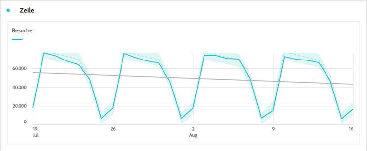

# Linie {#line}

<!-- markdownlint-disable MD034 -->

>[!CONTEXTUALHELP]
>id="workspace_line_button"
>title="Linie"
>abstract="Erstellen Sie eine Linienvisualisierung, die anzeigt, wie sich Werte über einen bestimmten Zeitraum ändern. Eine Linienvisualisierung kann nur verwendet werden, wenn die Zeit als Dimension verwendet wird."

<!-- markdownlint-enable MD034 -->

>[!BEGINSHADEBOX]

*In diesem Artikel wird die Linienvisualisierung in **Customer Journey Analytics.**. Siehe [Line](https://experienceleague.adobe.com/en/docs/analytics/analyze/analysis-workspace/visualizations/line) für die **Adobe Analytics**-Version dieses Artikels.*

>[!ENDSHADEBOX]

Die  **[!UICONTROL Linie]** Visualisierung stellt Metriken dar, die anhand einer Linie zeigen, wie sich Werte über einen bestimmten Zeitraum ändern. Eine Linienvisualisierung kann nur verwendet werden, wenn die Zeit als Dimension verwendet wird.

<!--
>[!NOTE]
>
>The Line visualization soon feature [intelligent captions](/help/analysis-workspace/visualizations/intelligent-captions.md).

The Line visualization represents metrics using a line to show how values change over a period of time. A line chart can be used only when time is used as a dimension.
-->

## Einstellungen

Im Rahmen der [Visualisierungseinstellungen](freeform-analysis-visualizations.md#settings) sind bestimmte Einstellungen für die Linienvisualisierung verfügbar.

| Einstellung | Beschreibung |
|---|---|
| **[!UICONTROL Granularität]** | Wählen Sie aus der Dropdown-Liste Granularität eine Trend-Visualisierung von täglich über wöchentlich bis monatlich usw. aus. Die Granularität wird auch in der Datenquellentabelle aktualisiert. |
| **[!UICONTROL Min. anzeigen]**  **[!UICONTROL Max. anzeigen ]** | Sie können eine Beschriftung für Minimal- und Maximalwerte überlagern, um die Mindest- und Maximalwerte in einer Metrik hervorzuheben. Die Min./Max.-Werte werden von den sichtbaren Datenpunkten in der Visualisierung abgeleitet, nicht von dem vollständigen Satz von Werten innerhalb einer Dimension.  |
| **[!UICONTROL Trendlinie anzeigen]** | Sie können Ihrer Linienserie eine Regression oder eine Trend-Linie für den angepassten Durchschnittswert hinzufügen. Trendlinien helfen, ein Muster in den Daten besser darzustellen. Wählen Sie anschließend ein Modell aus der Liste aus. Unter [Modelle](#models) finden Sie einen Überblick und eine Beschreibung der verfügbaren Modelle. . |

>[!TIP]
>
>Es wird empfohlen, Trendlinien auf Daten anzuwenden, die weder das aktuelle Datum (partielle Daten) noch zukünftige Daten enthalten. Heute oder zukünftige Termine verzerren die Trendlinie. Wenn Sie jedoch zukünftige Datumsangaben einbeziehen müssen, entfernen Sie Nullen aus den Daten, um eine Verfälschung für diese Tage zu vermeiden. Wechseln Sie zur Datenquellentabelle der Visualisierung, wählen Sie Ihre Metrikspalte aus und aktivieren Sie dann **[!UICONTROL Spalteneinstellungen]** > **[!UICONTROL Null als keinen Wert interpretieren]**.

### Modelle

Alle Trendlinien des Regressionsmodells werden über die reguläre Kleinstquadrat-Methode angepasst:

| Modell | Beschreibung |
| --- | --- |
| **[!UICONTROL Linear]** | Erstellen Sie eine Gerade, die am besten für einfache lineare Datensätze geeignet ist, und ist nützlich, wenn die Daten mit einer konstanten Rate steigen oder fallen. Gleichung: `y = a + b * x` |
| **[!UICONTROL Logarithmisch]** | Erstellen Sie eine am besten geeignete gekrümmte Linie. Dies ist nützlich, wenn die Änderungsrate in den Daten schnell ansteigt oder abnimmt und dann abgleicht. Eine logarithmische Trendlinie kann negative und positive Werte verwenden. Gleichung: `y = a + b * log(x)` |
| **[!UICONTROL exponentiell]** | Erstellen Sie eine gekrümmte Linie. Dies ist nützlich, wenn Daten mit ständig steigenden Raten ansteigen oder abfallen. Diese Option sollte nicht verwendet werden, wenn Ihre Daten Null oder negative Werte enthalten. Gleichung: `y = a + e^(b * x)` |
| **[!UICONTROL POWER]** | Erstellen Sie eine gekrümmte Linie. Dies ist nützlich für Datensätze, in denen Messungen verglichen werden, die mit einer bestimmten Rate zunehmen. Diese Option sollte nicht verwendet werden, wenn Ihre Daten Null oder negative Werte enthalten. Gleichung: `y = a * x^b` |
| **[!UICONTROL quadratisch]** | Findet die beste Anpassung für einen Datensatz in Form einer Parabel (konkav nach oben oder unten). Gleichung: `y = a + b * x + c * x^2` |
| **[!UICONTROL Gleitender Mittelwert]** | Erstellen Sie eine glatte Trendlinie basierend auf einer Reihe von Durchschnittswerten. Ein gleitender Mittelwert, der auch als rollierender Durchschnitt bezeichnet wird, nutzt eine bestimmte Anzahl von Datenpunkten (bestimmt durch die Auswahl [!UICONTROL Granularität]), errechnet einen Durchschnittswert und verwendet den Durchschnittswert als Punkt auf der Linie. Beispiele sind ein gleitender Durchschnitt von sieben Tagen oder ein gleitender Durchschnitt von vier Wochen. |

>[!MORELIKETHIS]
>
>[Hinzufügen einer Visualisierung zu einem Bedienfeld](/help/analysis-workspace/visualizations/freeform-analysis-visualizations.md#add-visualizations-to-a-panel)
>[Visualisierungseinstellungen](/help/analysis-workspace/visualizations/freeform-analysis-visualizations.md#settings)
>[Kontextmenü der Visualisierung](/help/analysis-workspace/visualizations/freeform-analysis-visualizations.md#context-menu)
>

