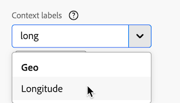

# Zuordnung {#map}

<!-- markdownlint-disable MD034 -->

>[!CONTEXTUALHELP]
>id="workspace_map_button"
>title="Zuordnung"
>abstract="Diese Visualisierung stellt Metriken dar, indem sie sie auf einer Karte überlagert. Dies ist nützlich, um Daten über verschiedene geografische Regionen hinweg zu identifizieren."

<!-- markdownlint-enable MD034 -->

<!-- markdownlint-disable MD034 -->

>[!CONTEXTUALHELP]
>id="workspace_map_bubbles"
>title="Blasen"
>abstract="Plotten Sie Ereignisse mithilfe von Blasen."

<!-- markdownlint-enable MD034 -->

<!-- markdownlint-disable MD034 -->

>[!CONTEXTUALHELP]
>id="workspace_map_heatmap"
>title="Heatmap"
>abstract="Plotten Sie Ereignisse mithilfe einer Heatmap."

<!-- markdownlint-enable MD034 -->

{{release-limited-testing}}

>[!BEGINSHADEBOX]

_In diesem Artikel wird die Zuordnungsvisualisierung in {_} _&#x200B;**Customer Journey Analytics**._ _Siehe [Map](https://experienceleague.adobe.com/de/docs/analytics/analyze/analysis-workspace/visualizations/map-visualization) für die_ _&#x200B;**Adobe Analytics**-Version dieses Artikels._

>[!ENDSHADEBOX]

Mit der **[!UICONTROL Map]**-Visualisierung in Analysis Workspace können Sie eine visuelle Zuordnung einer beliebigen Metrik (einschließlich berechneter Metriken) erstellen. Dies ist nützlich, um Metrikdaten über verschiedene geografische Regionen hinweg zu identifizieren und zu vergleichen.

## Voraussetzungen

### Hinzufügen von Kontextbezeichnungen in Datenansichten

In den Einstellungen für Datenansichten in Customer Journey Analytics können Administratoren [Kontextbeschriftungen](/help/data-views/component-settings/overview.md) zu einer Dimension oder Metrik hinzufügen, und Customer Journey Analytics-Services wie die [!UICONTROL Map]-Visualisierung können diese Beschriftungen für ihre Zwecke verwenden.

#### Erforderliche Kontextbeschriftungen für Breiten- und Längengrad in der Kartenvisualisierung

Kontextbeschriftungen sind erforderlich, damit die Kartenvisualisierung funktioniert. Ohne die folgenden Kontextkennzeichnungen funktioniert die Kartenvisualisierung nicht, da keine Breiten- und Längengraddaten zur Verfügung stehen.

* [!UICONTROL Geo: Latitude]
* [!UICONTROL Geo: Längengrad]

So fügen Sie diese Kontextbeschriftungen hinzu:

1. Wählen Sie in Customer Journey Analytics **[!UICONTROL Daten-Management]** > **[!UICONTROL Datenansichten]**.

1. Wählen Sie auf der Seite Datenansichten die Datenansicht aus, die Daten enthält, die Sie in der Kartenvisualisierung analysieren möchten.

1. Wählen Sie die Registerkarte **[!UICONTROL Komponenten]** aus.

1. (Bedingt) Wenn Sie Web SDK verwenden und Sie Breiten- und Längengrad so konfiguriert haben, dass diese Daten in Ihren Datenstrom eingefügt werden, oder wenn Sie Analytics Source Connector zum Ausfüllen von Ereignisdaten verwenden, sollten die Breiten- und Längengradfelder bereits in Ihrem Schema verfügbar sein und mit den richtigen Kontextkennzeichnungen ausgefüllt werden.

   Suchen Sie diese Schemafelder **[!UICONTROL Breitengrad]** und **[!UICONTROL Längengrad]** (in **[!UICONTROL Ereignisdatensätzen]** > **[!UICONTROL placeContext]** > **[!UICONTROL geo]** > **[!UICONTROL _schema]**) und ziehen Sie sie als Dimensionen in Ihre Datenansicht, wenn sie noch nicht vorhanden sind.

   Wenn diese Schemafelder als Dimensionen in Ihrer Datenansicht vorhanden sind, werden ihre Kontextbeschriftungen automatisch angewendet, und die Zuordnungsvisualisierung verwendet sie ohne zusätzliche Konfiguration.

   

1. (Bedingt) Wenn Sie benutzerdefinierte Dimensionen haben, die Sie für Breiten- und Längengrad-Daten verwenden möchten, können Sie die Kontextkennzeichnungen in den benutzerdefinierten Feldern konfigurieren:

   1. Wählen **[!UICONTROL im Abschnitt]** die Dimension aus, die die Längengrad-Daten enthält.

   1. Beginnen Sie im **[!UICONTROL Komponenteneinstellungen]** in der rechten Leiste im Feld **[!UICONTROL Kontextbeschriftungen]** mit der Eingabe von `Longitude` und wählen Sie diese dann aus dem Dropdown-Menü aus.

      

   1. Wiederholen Sie diesen Vorgang, um die Kontextbeschriftung **[!UICONTROL Breitengrad]** zur Dimension hinzuzufügen, die die Breitengraddaten enthält.

   1. (Optional) Standardmäßig sind diese Dimensionen auf die Stadt- oder Postleitzahlebene in der Kartenvisualisierung genau und zeigen in Workspace-Berichten zwei Dezimalstellen an. Sie können sie in der Kartenvisualisierung innerhalb eines Meters genau anpassen und so 5 Dezimalstellen in Workspace-Berichten anzeigen. Weitere Informationen zum Anpassen der Präzisionsstufe finden Sie unter [Konfigurieren präziser Positionen für Dimensionen](#configure-precise-locations-for-dimensions).

1. Wählen Sie **[!UICONTROL Speichern und fortfahren]** > **[!UICONTROL Speichern und beenden]**.

#### Erforderliche Kontextbeschriftungen für Geo-Vorlagen

Adobe bietet mehrere [vordefinierte Vorlagen](/help/analysis-workspace/templates/use-templates.md#web-audience) die die Zuordnungsvisualisierung verwenden. Um jede Vorlage zu verwenden, müssen Sie die entsprechende Kontextbeschriftung zu einer Dimension in Ihrer Datenansicht hinzufügen.

Im Folgenden finden Sie die Vorlagen und die erforderliche Kontextbeschriftung. Ohne diese Beschriftungen funktionieren die Vorlagen nicht, da keine Geodaten vorhanden sind, mit denen gearbeitet werden kann.

| Vorlagenname | Erforderlicher Kontexttitel |
|---------|----------|
| Geo-Länder | [!UICONTROL Geo: Geo-Land] |
| Geo-Regionen | [!UICONTROL Geo: Geo-Region] |
| Geo-Städte | [!UICONTROL Geo: Geo City] |
| Geo-Bundesstaaten der USA | [!UICONTROL Geo: Geo-Status] |
| Geo US DMA | [!UICONTROL Geo: Geo DMA] |

So fügen Sie diese Kontextbeschriftungen hinzu:

1. Wählen Sie in Customer Journey Analytics **[!UICONTROL Daten-Management]** > **[!UICONTROL Datenansichten]**.

1. Wählen Sie auf der Seite Datenansichten die Datenansicht aus, die Daten enthält, die Sie mit vordefinierten Vorlagen analysieren möchten, die die Zuordnungsvisualisierung verwenden. Wählen Sie in dieser Datenansicht fünf Dimensionen aus: eine mit den Länderdaten, eine mit den Regionsdaten, eine mit den Stadtdaten, eine mit den Bundesstaatsdaten und eine mit den DMA-Daten. Geben Sie diesen Dimensionen dann die entsprechende Kontextbeschriftung.

1. Wählen Sie die Registerkarte **[!UICONTROL Komponenten]** aus.

1. (Bedingt) Wenn Sie Web SDK verwenden und Geofelder konfiguriert haben, die in Ihrem Daten-Stream ausgefüllt werden sollen, oder wenn Sie Analytics Source Connector zum Ausfüllen von Ereignisdaten verwenden, sollten Geofelder bereits in Ihrem Schema verfügbar sein und mit den richtigen Kontextkennzeichnungen ausgefüllt werden.

   Suchen Sie die entsprechenden Schemafelder, z. B. **[!UICONTROL Stadt]**, **[!UICONTROL Postleitzahl]**, **[!UICONTROL Bundesland oder]** (in **[!UICONTROL Ereignisdatensätze]** > **[!UICONTROL placeContext]** > **[!UICONTROL geo]**) und ziehen Sie sie als Dimensionen in Ihre Datenansicht, wenn sie noch nicht vorhanden sind.

   Wenn diese Schemafelder als Dimensionen in Ihrer Datenansicht vorhanden sind, werden ihre Kontextbeschriftungen automatisch angewendet, und die Geo-Vorlagen verwenden sie ohne zusätzliche Konfiguration.

   

1. (Bedingt) Wenn Sie benutzerdefinierte Dimensionen haben, die Sie für Geodaten verwenden möchten, können Sie die Kontextbeschriftungen für die benutzerdefinierten Felder konfigurieren:

   1. Wählen Sie die Dimension aus, die die Länderdaten enthält.

   1. Beginnen Sie im **[!UICONTROL Komponenteneinstellungen]** in der rechten Leiste im Feld **[!UICONTROL Kontextbeschriftungen]** mit der Eingabe von `Geo Country` und wählen Sie diese dann aus dem Dropdown-Menü aus.

      

   1. Wiederholen Sie diesen Vorgang, um jeder Dimension **[!UICONTROL die die entsprechenden Daten enthält, die Kontextkennzeichnungen Geo: Geo-Region]**, **[!UICONTROL Geo:]** Stadt, **[!UICONTROL Geo: Geo-]** und **[!UICONTROL Geo: DMA]** hinzuzufügen.

1. Wählen Sie **[!UICONTROL Speichern und fortfahren]** > **[!UICONTROL Speichern und beenden]**.

### Grafiktreiber müssen WebGL-Rendering unterstützen

Die Kartenvisualisierung verwendet WebGL für die Anzeige von Grafiken. Wenn Ihre Grafiktreiber das WebGL-Rendering nicht unterstützen, müssen Sie möglicherweise Ihre Treiber aktualisieren.

## Kartenvisualisierung in Customer Journey Analytics im Vergleich zu Adobe Analytics

Die Zuordnungsvisualisierung in Customer Journey Analytics unterscheidet sich von der Zuordnungsvisualisierung in Adobe Analytics folgendermaßen:

| Funktion | Customer Journey Analytics | Adobe Analytics |
|---------|----------|---------|
| Datenquelle | Verwenden Sie ein beliebiges Segment, das in Ihrer Datenansicht verfügbar ist, als Datenquelle. | Bietet die folgenden Optionen: <ul><li>Mobiler Breitengrad/Längengrad</li><li>Geografische Dimension Stellt Geosegmentierungsdaten zum Besucherstandort basierend auf der IP-Adresse des Besuchers dar. </li></ul> |
| Genauigkeit | Bei Datensätzen mit hoher Präzision können Sie die Dimensionen in Ihrer Datenansicht so konfigurieren, dass bis zu 5 Dezimalstellen angezeigt werden. Dadurch kann die Kartenvisualisierung innerhalb eines einzigen Meters genau sein. 
Weitere Informationen finden Sie unter [Konfigurieren präziser Positionen für Dimensionen](#configure-precise-locations-for-dimensions).
 | Die Daten sind auf die [!UICONTROL Land], [!UICONTROL Region] und [!UICONTROL Stadt] genau. (Es geht nicht auf die Ebene DMA oder Postleitzahl.) |
| Erstellen eines Segments aus einer Auswahl | Erstellen Sie ein Segment basierend auf einem bestimmten Bereich, den Sie in der Kartenvisualisierung auswählen. 
Weitere Informationen finden Sie unter [Erstellen eines Segments aus der Zuordnungsvisualisierung](#create-a-segment-from-the-map-visualization).
 | Erstellen Sie ein Segment basierend auf den Daten, die in der Kartenvisualisierung im Allgemeinen gemeldet werden. |
| Erstellen einer Audience aus einer Auswahl | Erstellen Sie eine Zielgruppe basierend auf einem bestimmten Bereich, den Sie in der Kartenvisualisierung auswählen. 
Weitere Informationen finden Sie unter [Erstellen einer Zielgruppe aus der Kartenvisualisierung](#create-an-audience-from-the-map-visualization). | Es kann keine Zielgruppe aus der Zuordnungsvisualisierung erstellt werden. |
| Erstellen eines Trends aus einer Auswahl | Erstellen Sie eine Trend-Liniendiagramm-Visualisierung basierend auf einem bestimmten Bereich, den Sie in der Kartenvisualisierung auswählen. 
Weitere Informationen finden Sie unter [Erstellen eines Trendliniendiagramms aus der Kartenvisualisierung](#create-a-trended-line-chart-from-the-map-visualization). <!-- is this correct? --> | Es kann kein Trend aus der Kartenvisualisierung erstellt werden. |
| Aufschlüsselung aus einer Auswahl hinzufügen | Schlüsseln Sie ein bestimmtes Dimensionselement, eine bestimmte Metrik, ein bestimmtes Segment oder einen bestimmten Datumsbereich auf, den Sie in der Kartenvisualisierung auswählen. 
Weitere Informationen finden Sie unter [Aufschlüsselung über die Kartenvisualisierung hinzufügen](#add-a-breakdown-from-the-map-visualization). | Es kann keine Aufschlüsselung aus der Kartenvisualisierung hinzugefügt werden. |

## Eine Zuordnungsvisualisierung erstellen {#begin-building-map}

<!-- markdownlint-disable MD034 -->

>[!CONTEXTUALHELP]
>id="workspace_map_panel"
>title="Konfigurieren der Kartenvisualisierung"
>abstract="Wählen Sie die Metrik oder die berechnete Metrik aus, die als Grundlage für die Kartenvisualisierung verwendet wird. Sie können auch ein Segment hinzufügen, wenn Sie sich auf eine bestimmte Teilmenge der Daten konzentrieren möchten.
Sie können diese Informationen jederzeit aktualisieren, nachdem die Visualisierung gerendert wurde.
"

<!-- markdownlint-enable MD034 -->

1. Wählen Sie in der linken Leiste das [!UICONTROL **Visualisierungen**] aus und ziehen Sie dann die **[!UICONTROL Map]**-Visualisierung  in ein Bedienfeld, das eine Freiformtabelle enthält.

   Oder

   Fügen Sie eine Zuordnungsvisualisierung auf eine der Arten hinzu, die im Abschnitt [Hinzufügen von Visualisierungen zu einem Bedienfeld](/help/analysis-workspace/visualizations/freeform-analysis-visualizations.md#add-visualizations-to-a-panel) in [Übersicht über Visualisierungen](/help/analysis-workspace/visualizations/freeform-analysis-visualizations.md) beschrieben sind.

   {width="50%"}

1. Geben Sie die folgenden grundlegenden Informationen an, um die Zuordnungsvisualisierung zu konfigurieren:

   * **[!UICONTROL Metrik hinzufügen]**: Wählen Sie in der Dropdown-Liste Metrik eine Metrik oder berechnete Metrik aus. (Sie können eine Metrik auch aus der linken Leiste ziehen.)

     >[!IMPORTANT]
     >
     >Wenn Sie eine Metrik mit [angewendete Attribution](/help/data-views/component-settings/attribution.md#attribution-models) auswählen, wird dieselbe Attribution auf die Breiten- und Längengrad-Paare im aktuellen Ansichtsfenster der Kartenvisualisierung angewendet.
     >

     <!-- Only choose metrics that use Last Touch as the [attribution model](/help/data-views/component-settings/attribution.md#attribution-models) (this is the default attribution model for all metrics). Choosing a metric that has an attribution model other than Last Touch results in inaccurate map data, because attribution is applied to the latitude and longitude pairs. -->

   * **[!UICONTROL Segment hinzufügen]** (Optional) Wählen Sie in der Dropdown-Liste des Segments ein Segment aus. Oder ziehen Sie ein Segment aus der Segmentliste in den Arbeitsbereich.

   Sie können diese Informationen nach dem Erstellen der Visualisierung aktualisieren, indem Sie in der Visualisierungskopfzeile auf  klicken.

1. Wählen Sie **[!UICONTROL Erstellen]** aus.

   Es wird eine Weltkartenvisualisierung mit Blasen generiert.

   

1. Fahren Sie mit [Kartenvisualisierung anzeigen](#view-a-map-visualization) und [Visualisierungseinstellungen konfigurieren](#configure-visualization-settings) fort.

## Anzeigen einer Kartenvisualisierung

1. Falls noch nicht geschehen, erstellen Sie eine Kartenvisualisierung, wie in [Erstellen einer Kartenvisualisierung](#begin-building-a-map-visualization) beschrieben.

1. Führen Sie in der Kartenvisualisierung in Analysis Workspace einen der folgenden Schritte aus:

   * **Einzoomen**: Sie können die Karte vergrößern, um bestimmte Bereiche auf eine der folgenden Arten zu vergrößern:

      * Doppelklicken Sie mit der Maus auf die Karte.

      * Verwenden Sie das Mausrad oder eine ähnliche Aktion auf Ihrem Trackpad.

      * Wählen Sie das Pluszeichen  in der Kartenvisualisierung aus.

     Die Karte zoomt entsprechend. Die erforderliche Dimension (Land > Bundesland > Stadt) wird basierend auf der Zoomstufe automatisch aktualisiert.

   * **Verkleinern**: Sie können die Karte verkleinern, um größere Bereiche auf eine der folgenden Arten anzuzeigen:

      * Halten Sie die Umschalttaste gedrückt und doppelklicken Sie mit der Maus auf die Karte.

      * Verwenden Sie das Mausrad oder eine ähnliche Aktion auf Ihrem Trackpad.

      * Wählen Sie das Minussymbol  in der Kartenvisualisierung aus.

     Die Karte zoomt entsprechend. Die erforderliche Dimension (Land > Bundesland > Stadt) wird basierend auf der Zoomstufe automatisch aktualisiert.

   * **Drehen**: Sie können die Karte in 2D oder 3D drehen, indem Sie die [!UICONTROL Strg]-Taste gedrückt halten, während Sie die Karte mit der Maus ziehen.

     Um die Karte auf ihre ursprüngliche Nordausrichtung zurückzusetzen, wählen Sie das Kompasssymbol .

   * **Auswahl-Tool**: Sie können einen Bereich der Zuordnung auswählen, um [ein Segment ](#create-a-segment-from-the-map-visualization), [einen Trend zu ](#create-a-trended-line-chart-from-the-map-visualization) oder [eine Aufschlüsselung hinzuzufügen](#add-a-breakdown-from-the-map-visualization).

     Klicken Sie auf das Auswahlwerkzeug  und ziehen Sie dann die Maus, um den gewünschten Bereich auszuwählen.

   * **Vergleichen**: Sie können zwei oder mehr Kartenvisualisierungen im selben Projekt vergleichen, indem Sie sie nebeneinander platzieren.

   * **Vergleiche von Zeiträumen über Zeiträume anzeigen (z. B. von Jahr zu Jahr)**:

      * Negative Zahlen anzeigen.

        Wenn Sie beispielsweise eine Metrik zum Jahresvergleich plotten, kann auf der Karte für New York -33 % angezeigt werden.

      * Mit Metriken des Typs *Prozent* werden die Prozentanzeigen mit Durchschnitten gebündelt.

      * Ein grünes und rotes Farbschema zeigt positiv und negativ an.

   * **Zusätzliche Visualisierungseinstellungen**: Wählen Sie das Einstellungssymbol  in der Visualisierungskopfzeile aus, um zusätzliche Einstellungen für die Kartenvisualisierung anzuzeigen. Weitere Informationen finden Sie unter [Konfigurieren von Visualisierungseinstellungen](#configure-visualization-settings).

1. **Speichern** Sie das Projekt, um alle Einstellungen an der Landkarte zu speichern (Koordinaten, Zoom, Drehung).
1. (Optional) Die Freiformtabelle unter der Visualisierung kann ausgefüllt werden, indem Standortdimensionen und Metriken aus der linken Leiste gezogen werden.

## Konfigurieren von Visualisierungseinstellungen

So konfigurieren Sie Einstellungen für die Zuordnungsvisualisierung:

1. Öffnen Sie in Analysis Workspace eine vorhandene Kartenvisualisierung oder erstellen [ eine neue](#begin-building-a-map-visualization).

1. Bewegen Sie den Mauszeiger über die Kartenvisualisierung und wählen Sie dann in der Visualisierungskopfzeile das  aus.

   Die folgenden Optionen sind verfügbar:

   | Abschnitt | Einstellung | Beschreibung |
   | --- |--- |--- |
   | **[!UICONTROL Zuordnungstyp]** | | |
   | | **[!UICONTROL Blasen]** | Plottet Ereignisse mithilfe von Blasen. Ein Blasendiagramm ist ein multivariables Diagramm, das eine Kreuzung aus Streudiagramm und proportionalem Flächendiagramm darstellt. Diese Ansicht ist die Standardansicht. |
   | | **[!UICONTROL Heatmap]** | Plottet Ereignisse mithilfe einer Heatmap. Eine Heatmap ist eine graphische Darstellung von Daten, bei der die individuellen Werte in einer Matrix als Farben dargestellt werden. |
   | **[!UICONTROL Stile]** | | |
   | | **[!UICONTROL Farbschema]** | Zeigt das Farbschema für die Heatmap und die Blasen. Sie können zwischen Korallenrot, Rot, Grün oder Blau auswählen. Der Standardwert ist „Koralle“.  |
   | | **[!UICONTROL Zuordnungsstil]** | Sie können zwischen „Allgemein“, „Straßen“, „Leuchtend“ „Hell“, „Dunkel“ und „Satellit“ auswählen. |
   | | **[!UICONTROL Cluster-Radius]** | Gruppiert Datenpunkte zusammen, die sich innerhalb der festgelegten Pixel-Anzahl befinden. Die Standardeinstellung ist „50“.
Diese Option ist nur verfügbar **[!UICONTROL wenn &quot;]**&quot; als **[!UICONTROL Zuordnungstyp“]**.
 |
   | | **[!UICONTROL Benutzerdefinierter Maximalwert]** | Ermöglicht die Änderung des Schwellenwerts für den Maximalwert der Zuordnung. Durch die Anpassung dieses Werts wird der Maßstab für die Blasen- oder Heatmap-Werte (Farbe und Größe) relativ zum von Ihnen festgelegten benutzerdefinierten Maximalwert angepasst. |
   | | **[!UICONTROL Anmerkungen anzeigen]** | Zeigt die Anmerkungen an, die für diese Visualisierung gemacht wurden. |
   | | **[!UICONTROL Titel ausblenden]** | Blendet den Titel der Visualisierung aus. |

## Konfigurieren präziser Positionen für Dimensionen

Wenn Sie über benutzerdefinierte Datensätze mit hoher Präzision verfügen, können Sie die Kartenvisualisierung so konfigurieren, dass die Standortgenauigkeit innerhalb eines Meters erreicht wird.

1. Wählen Sie in Customer Journey Analytics **[!UICONTROL Daten-Management]** > **[!UICONTROL Datenansichten]**.

1. Wählen Sie die Datenansicht aus, die die Dimensionen enthält, die Sie konfigurieren möchten, um präzisere Speicherorte zu verwenden.

1. Wählen Sie in der Datenansicht die Registerkarte **[!UICONTROL Komponenten]** aus.

1. Wählen Sie die Dimensionen aus, die Sie für den Breiten- und Längengrad verwenden, den Sie konfigurieren möchten. Weitere Informationen dazu, welche Dimensionen Sie verwenden, finden Sie unter [Erforderliche Kontextkennzeichnungen für Breiten- und Längengrad in der Kartenvisualisierung](#required-context-labels-for-latitude-and-longitude-in-the-map-visualization).

1. Konfigurieren Sie die Präzision für die Dimension:

   1. Wenn die zu konfigurierende Dimension weiterhin ausgewählt ist, erweitern Sie den Abschnitt **[!UICONTROL Format]** in der rechten Leiste.

      

   1. Ändern Sie im Feld **[!UICONTROL Dezimalstellen]** die Anzahl der Dezimalstellen, um die gewünschte Präzision widerzuspiegeln:

      * **0:** Präzise auf die große Region oder Länderebene in der Kartenvisualisierung. Zeigt 0 Dezimalstellen in Workspace-Berichten an.

      * **1:** Präzise zur Region oder Großstadtebene in der Kartenvisualisierung.  Zeigt eine Dezimalstelle in Workspace-Berichten an.

      * **2:** Präzise zur Stadt- oder Postleitzahlebene in der Kartenvisualisierung. Zeigt zwei Dezimalstellen in Workspace-Berichten an.

        Dies ist die Standardauswahl.

      * **3:** Präzise auf die sehr kleine Stadt- oder Nachbarschaftsebene in der Kartenvisualisierung. Zeigt 3 Dezimalstellen in Workspace-Berichten an.

      * **4:** Präzise auf eine bestimmte Parzelle oder Gebäudeebene in der Kartenvisualisierung. Zeigt vier Dezimalstellen in Workspace-Berichten an.

      * **5:** Präzise auf einen einzelnen Meter in der Kartenvisualisierung. Zeigt 5 Dezimalstellen in Workspace-Berichten an.

1. Wählen Sie **[!UICONTROL Speichern und fortfahren]** > **[!UICONTROL Speichern und beenden]**.

## Erstellen eines Segments aus der Kartenvisualisierung {#map-create-segment}

Sie können ein Segment basierend auf einem bestimmten Bereich erstellen, den Sie in der Kartenvisualisierung auswählen. Wenn Sie ein Segment basierend auf einem ausgewählten Bereich erstellen, werden alle Daten in das Segment aufgenommen, die sich innerhalb des Breiten- und Längengrads Ihrer Auswahl befinden.

So erstellen Sie ein Segment aus der Zuordnungsvisualisierung:

1. Zoomen oder schwenken Sie auf den Bereich der Karte, der die Daten enthält, die Sie für Ihr Segment verwenden möchten.

1. Führen Sie einen der folgenden Schritte aus:

   * **So erstellen Sie ein Segment aus allem, was aktuell in der Karte angezeigt wird:** Klicken Sie mit der rechten Maustaste auf eine beliebige Stelle auf der Karte und wählen Sie **[!UICONTROL Segment aus aktueller Ansicht erstellen]**.

   * **So erstellen Sie ein Segment für einen spezifischeren Bereich der Karte:** Klicken Sie auf das Auswahlwerkzeug  ziehen Sie die Maus, um den gewünschten Bereich auszuwählen, und wählen Sie dann **[!UICONTROL Segment aus Auswahl erstellen]**.

1. Verwenden Sie Segment Builder, um das neue Segment zu definieren. Weitere Informationen finden Sie unter [Segment Builder](/help/components/segments/seg-builder.md).

## Erstellen einer Zielgruppe aus der Kartenvisualisierung

Sie können eine Zielgruppe basierend auf einem bestimmten Bereich erstellen, den Sie in der Kartenvisualisierung auswählen.

So erstellen Sie eine Zielgruppe aus der Kartenvisualisierung:

1. Zoomen oder schwenken Sie auf den Bereich der Karte, der die Daten enthält, die Sie für Ihre Zielgruppe verwenden möchten.

1. Führen Sie einen der folgenden Schritte aus:

   * **So erstellen Sie eine Zielgruppe aus allen aktuell in der Karte angezeigten Inhalten:** Klicken Sie mit der rechten Maustaste auf eine beliebige Stelle auf der Karte und wählen Sie **[!UICONTROL Zielgruppe aus aktueller Ansicht erstellen]**.

   * **So erstellen Sie eine Zielgruppe für einen spezifischeren Bereich der Karte:** Klicken Sie auf das Auswahlwerkzeug , ziehen Sie die Maus, um den gewünschten Bereich auszuwählen, und wählen Sie dann **[!UICONTROL Zielgruppe aus Auswahl erstellen]**.

1. Verwenden Sie den Audience Builder, um die neue Audience zu definieren. Weitere Informationen finden Sie unter [Audience Builder](/help/components/audiences/publish.md#audience-builder) in [Erstellen und Veröffentlichen von Zielgruppen](/help/components/audiences/publish.md)

## Erstellen eines Trend-Liniendiagramms aus der Kartenvisualisierung

Sie können eine Trend-Liniendiagramm-Visualisierung für die Daten innerhalb eines bestimmten Bereichs erstellen, den Sie in der Kartenvisualisierung auswählen.

So erstellen Sie ein Trendliniendiagramm anhand der Kartenvisualisierung:

1. Zoomen oder schwenken Sie auf den Bereich der Karte, der die Daten enthält, die Sie für das Trendliniendiagramm verwenden möchten.

1. Führen Sie einen der folgenden Schritte aus:

   * **So erstellen Sie ein Trendliniendiagramm aus allen aktuell in der Karte angezeigten Elementen:** Klicken Sie mit der rechten Maustaste auf eine beliebige Stelle auf der Karte und wählen Sie dann **[!UICONTROL Trend aus der aktuellen Ansicht]** aus.

   * **So erstellen Sie ein Trendliniendiagramm für einen spezifischeren Bereich der Karte:** Klicken Sie auf das Auswahlwerkzeug , ziehen Sie die Maus, um den gewünschten Bereich auszuwählen, und wählen Sie dann **[!UICONTROL Trend]**.

   Es wird eine Linienvisualisierung erstellt, die eine Trendlinie enthält. Weitere Informationen zu dieser Visualisierung finden Sie unter [Linie](/help/analysis-workspace/visualizations/line.md).

<!--

Can you do this?

## Add a breakdown from the map visualization

You can break down a specific dimension item, metric, segment, or date range for the data within a designated area that you select in the map visualization.

To add a breakdown from the map visualization:

1. (Optional) Zoom in on the specific area of the map that contains the data where you want to add the breakdown.

1. Click the selection tool , then drag your mouse to select the desired area.

1. Select **[!UICONTROL Add breakdown]**. 

-->

<!--

Can you do this?

## Export the map visualization as a PDF

To export the map visualization in PDF format:

1. how...

-->

