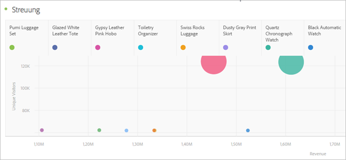

# Streuung {#scatter}

<!-- markdownlint-disable MD034 -->

>[!CONTEXTUALHELP]
>id="cja_workspace_scatter_button"
>title="Streuung"
>abstract="Erstellen Sie eine Streuungsvisualisierung, die die Beziehung zwischen Dimensionselementen und bis zu drei Metriken anzeigt."

<!-- markdownlint-enable MD034 -->

Die Visualisierung  **[!UICONTROL Streuung]** zeigt die Beziehung zwischen Dimensionselementen und bis zu drei Metriken. Sie erfordert drei Komponenten und unterstützt die Visualisierung von bis zu vier Komponenten.

* Die Zeilenkomponente (normalerweise eine Dimension) stellt jeden Punkt im Diagramm dar. Verschiedene Zeilen werden als verschiedenfarbige Punkte angezeigt.
* Die Spalte ganz links (normalerweise eine Metrik) stellt die Position des Punkts auf der Y-Achse (vertikal) dar.
* Die zweite Spalte stellt die Position des Punkts auf der X-Achse (horizontal) dar.
* Die dritte Spalte bestimmt den Radius des Punkts.
* Alle nachfolgenden Spalten in einer Freiform-Tabelle werden von der Streudiagramm-Visualisierung ignoriert.

>[!MORELIKETHIS]
>
>[Hinzufügen einer Visualisierung zu einem Bedienfeld](/help/analysis-workspace/visualizations/freeform-analysis-visualizations.md#add-visualizations-to-a-panel)
>[Visualisierungseinstellungen](/help/analysis-workspace/visualizations/freeform-analysis-visualizations.md#settings)
>[Kontextmenü &quot;Visualisierung&quot;](/help/analysis-workspace/visualizations/freeform-analysis-visualizations.md#context-menu)
>
