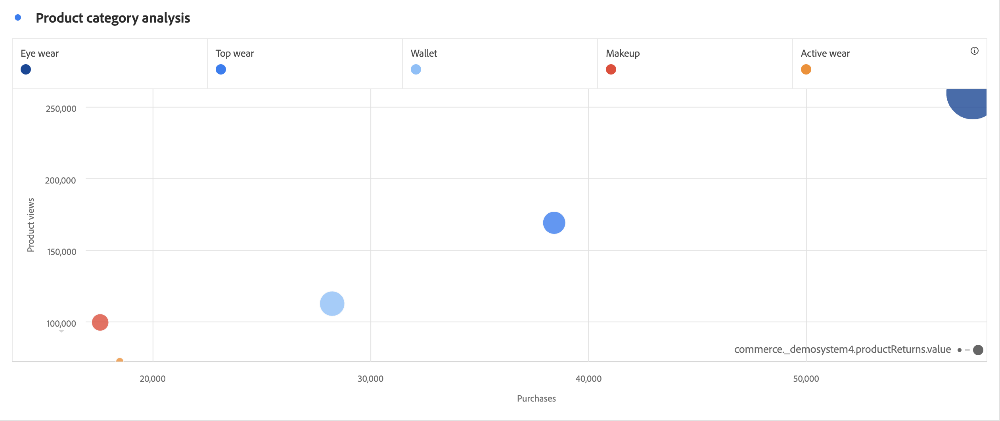

# Streuung {#scatter}

>[!CONTEXTUALHELP]
>id="workspace_scatter_button"
>title="Streuung"
>abstract="Erstellen Sie eine Streudiagrammvisualisierung, die die Beziehung zwischen Dimensionselementen und bis zu drei Metriken anzeigt."

>[!BEGINSHADEBOX]

_In diesem Artikel wird die Streuvisualisierung in {_} _&#x200B;**Customer Journey Analytics**._ _Siehe [Streuung](https://experienceleague.adobe.com/de/docs/analytics/analyze/analysis-workspace/visualizations/scatterplot)_ für die  _&#x200B;**Adobe Analytics** Version dieses Artikels._

>[!ENDSHADEBOX]

Die Visualisierung  **[!UICONTROL Scatter]** hilft Ihnen, Korrelationen und Muster zwischen verschiedenen Metriken in Ihren Daten zu identifizieren. Die Visualisierung zeigt die Beziehung zwischen Dimensionselementen und bis zu drei Metriken. Die Visualisierung erfordert drei Komponenten und unterstützt die Visualisierung von bis zu vier Komponenten.

* Die Zeilenkomponente (normalerweise eine Dimension) stellt jeden Punkt im Diagramm dar. Verschiedene Zeilen werden als verschiedenfarbige Punkte angezeigt.
* Die Spalte ganz links (normalerweise eine Metrik) stellt die Position des Punkts auf der Y-Achse (vertikal) dar.
* Die zweite Spalte stellt die Position des Punkts auf der X-Achse (horizontal) dar.
* Die dritte Spalte bestimmt den Radius des Punkts.
* Alle nachfolgenden Spalten in einer Freiformtabelle werden von der Streudiagrammvisualisierung ignoriert.

>[!BEGINSHADEBOX]

Unter  [Visualisierung „Streudiagramm“](https://experienceleague.adobe.com/en/docs/customer-journey-analytics-learn/tutorials/analysis-workspace/visualizations/use-scatterplot-visualizations){target="_blank"} finden Sie ein Demovideo.

>[!ENDSHADEBOX]

>[!NOTE]
>
>Wenn Sie [&#x200B; Streuung die Legende so konfigurieren](/help/analysis-workspace/visualizations/freeform-analysis-visualizations.md#settings) dass sie sichtbar ist, wird die Legende nur angezeigt, wenn die Datenquelle eine begrenzte Anzahl von (ausgewählten) Dimensionselementen enthält.

>[!MORELIKETHIS]
>
>[Hinzufügen einer Visualisierung zu einem Bedienfeld](/help/analysis-workspace/visualizations/freeform-analysis-visualizations.md#add-visualizations-to-a-panel)
>[Einstellungen der Visualisierung](/help/analysis-workspace/visualizations/freeform-analysis-visualizations.md#settings)
>[Kontextmenü der Visualisierung](/help/analysis-workspace/visualizations/freeform-analysis-visualizations.md#context-menu)
>
