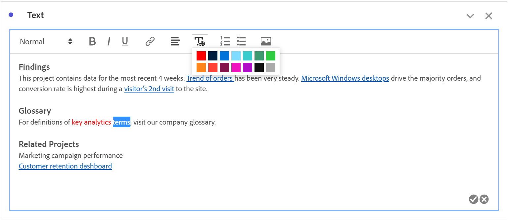
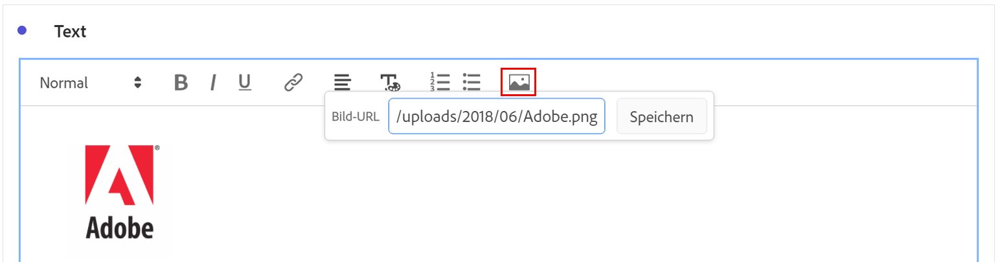

# Text {#text-visualization}

<!-- markdownlint-disable MD034 -->

>[!CONTEXTUALHELP]
>id="workspace_text_button"
>title="Text"
>abstract="Fügen Sie Ihrem Projekt eine benutzerdefinierte Rich-Text-Visualisierung hinzu."

<!-- markdownlint-enable MD034 -->

>[!BEGINSHADEBOX]

*In diesem Artikel wird die Textvisualisierung in **Customer Journey Analytics.**. Siehe [Text](https://experienceleague.adobe.com/en/docs/analytics/analyze/analysis-workspace/visualizations/text) für die **Adobe Analytics**-Version dieses Artikels.*

>[!ENDSHADEBOX]

Um Ihrem Workspace-Projekt benutzerdefinierten Rich-Text hinzuzufügen, können Sie eine -**[!UICONTROL -]**-Visualisierung oder Beschreibungen für eine Visualisierung und ein Bedienfeld verwenden.

## Verwenden

Sie können die Textvisualisierung wie folgt verwenden:

1. Fügen Sie eine /**[!UICONTROL -]** hinzu. Siehe [Hinzufügen einer Visualisierung zu einem Bedienfeld](freeform-analysis-visualizations.md#add-visualizations-to-a-panel).

1. Wählen Sie in einem Bedienfeld oder einer Visualisierung im Kontextmenü die Option **[!UICONTROL Beschreibung bearbeiten]** aus.

   Wählen Sie  aus, wenn Sie die Bearbeitung der Beschreibung abgeschlossen haben, wählen Sie  aus, um den Vorgang abzubrechen.

Sie können die Formatierung Ihres Textes ändern, Hyperlinks hinzufügen und Bilder hinzufügen.

## Formatierung anpassen {#format}

Beim Bearbeiten des Textfelds oder der Beschreibung können Sie Schriftgrad (Überschriftenebenen), Farbe, Formatierung (fett, kursiv, unterstrichen) und Ausrichtung des ausgewählten Textes anpassen. Sie können auch Aufzählungs- und nummerierte Listen hinzufügen.

## Hyperlinks hinzufügen {#hyperlinks}

Um einen Hyperlink hinzuzufügen, markieren Sie den Text und wählen Sie Link“ aus. Sie können Hyperlinks verwenden, um Ihren Projektempfängern weitere Unterstützung zu bieten. Hyperlinks können Links zu externen Websites, Dokumentationsseiten, [Workspace-Projekten, Bedienfeldern oder ](/help/analysis-workspace/curate-share/shareable-links.md) und mehr enthalten.

## Bilder hinzufügen {#images}

Um ein Bild zu Ihrem Projekt hinzuzufügen, wählen Sie  im Menü aus und fügen Sie eine öffentliche Bild-URL ein. Die Bild-URL muss öffentlich zugänglich sein, mit `https` beginnen und das Format `.png`, `.jpeg`, `.jpg` oder `.gif` haben. Statische und animierte Bilder werden unterstützt.

