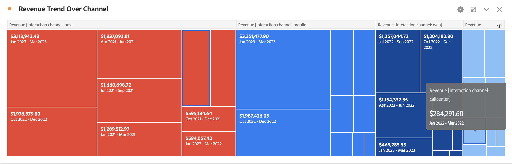

# Treemap

Zeigt hierarchische Daten (Baumstruktur) als Gruppe verschachtelter Rechtecke an.

Jeder Zweig des Baums erhält ein Rechteck, das kleinere Rechtecke enthält, die für untergeordnete Zweige stehen.

Wenn die Farb- und Größendimensionen in irgendeiner Weise mit der Baumstruktur korrelieren, werden oft Muster offensichtlich, die bei anderen Visualisierungen nur schwer sichtbar wären. Beispielsweise wird sichtbar, ob eine bestimmte Farbe besonders relevant ist. Ein weiterer Vorteil von Treemaps besteht darin, dass sie beim Aufbau den vorhandenen Platz effizient nutzen.
