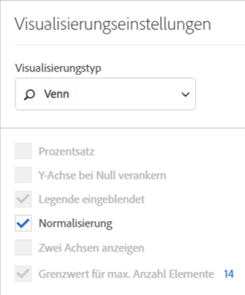

# Venn {#venn}

<!-- markdownlint-disable MD034 -->

>[!CONTEXTUALHELP]
>id="workspace_venn_button"
>title="Venn"
>abstract="Erstellen Sie eine Visualisierung eines Venn-Diagramms, um schnell zwei Elemente und die Größe ihrer Überschneidung visuell zu vergleichen."

<!-- markdownlint-enable MD034 -->

>[!BEGINSHADEBOX]

_In diesem Artikel wird die Venn-Visualisierung in_ _&#x200B;**Customer Journey Analytics**._ _Siehe [Venn](https://experienceleague.adobe.com/de/docs/analytics/analyze/analysis-workspace/visualizations/venn)_ für die  _&#x200B;**Adobe Analytics**-Version dieses Artikels._

>[!ENDSHADEBOX]

Bei der Visualisierung  **[!UICONTROL Venn]** können Sie bis zu drei Segmente und eine Metrik (aus dem Bedienfeld „Komponenten„) einfügen, um ein Venn-Diagramm zu erstellen.

>[!NOTE]
>
>Analysis Workspace verwendet flächenproportionale Venn-Diagramme. Venn-Diagramme mit drei oder mehr Kreisen, die in zwei Dimensionen dargestellt werden, können nicht immer mit perfekten Proportionen gezeichnet werden.
> 
>Workspace versucht, den annähernden Venn-Wert zu erstellen, die Ergebnisse sind jedoch möglicherweise nicht immer visuell korrekt.

Sie können den Mauszeiger über die Segmente bewegen, um mehr insight in Prozentzahlen und mehr zu erhalten.

Um eine [!UICONTROL Freiformtabelle] aus der Visualisierung [!UICONTROL Venn] zu generieren, wählen Sie das farbige Symbol  neben dem Header **[!UICONTROL Venn]** und dann die Option **[!UICONTROL Datenquelle zeigen]** aus. Es wird eine Freiformtabelle **[!UICONTROL Venn-Daten]** mit den Daten angezeigt, die zum Erstellen der Visualisierung [!UICONTROL Venn] verwendet wurden.

<!--
To normalize the Venn diagram (take the size out of it), go select  and select **[!UICONTROL Normalization]**.

-->

>[!BEGINSHADEBOX]

Unter  [Venn](https://experienceleague.adobe.com/en/docs/analytics-learn/tutorials/analysis-workspace/visualizations/venn-diagram-visualization){target="_blank"}-Visualisierung finden Sie ein Demovideo.

{{videoaa}}

>[!ENDSHADEBOX]

>[!MORELIKETHIS]
>
>[Hinzufügen einer Visualisierung zu einem Bedienfeld](/help/analysis-workspace/visualizations/freeform-analysis-visualizations.md#add-visualizations-to-a-panel)
>[Einstellungen der Visualisierung](/help/analysis-workspace/visualizations/freeform-analysis-visualizations.md#settings)
>[Kontextmenü der Visualisierung](/help/analysis-workspace/visualizations/freeform-analysis-visualizations.md#context-menu)
>

