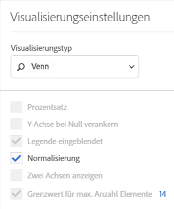

# Venn {#venn}

<!-- markdownlint-disable MD034 -->

>[!CONTEXTUALHELP]
>id="workspace_venn_button"
>title="Venn"
>abstract="Erstellen Sie eine Visualisierung eines Venn-Diagramms, um schnell zwei Elemente und die Größe ihrer Überschneidung visuell zu vergleichen."

<!-- markdownlint-enable MD034 -->

Bei der Visualisierung  **[!UICONTROL Venn]** können Sie bis zu drei Filter und eine Metrik (aus dem Bedienfeld „Komponenten„) einfügen, um ein Venn-Diagramm zu erstellen.

Sie können den Mauszeiger über die Filter bewegen, um mehr über Prozentsätze und mehr zu erfahren.

Um eine [!UICONTROL Freiformtabelle] aus der [!UICONTROL Venn]-Visualisierung zu generieren, wählen Sie die farbige  neben der **[!UICONTROL Venn]**-Kopfzeile aus und klicken Sie auf **[!UICONTROL Datenquelle anzeigen]**. Es wird eine **[!UICONTROL Venn-Daten]**-Freiformtabelle mit den Daten angezeigt, die zum Erstellen der [!UICONTROL Venn]-Visualisierung verwendet wurden.

<!--
To normalize the Venn diagram (take the size out of it), go select  and select **[!UICONTROL Normalization]**.

-->

>[!MORELIKETHIS]
>
>[Hinzufügen einer Visualisierung zu einem Bedienfeld](/help/analysis-workspace/visualizations/freeform-analysis-visualizations.md#add-visualizations-to-a-panel)
>[Visualisierungseinstellungen](/help/analysis-workspace/visualizations/freeform-analysis-visualizations.md#settings)
>[Kontextmenü der Visualisierung](/help/analysis-workspace/visualizations/freeform-analysis-visualizations.md#context-menu)
>

