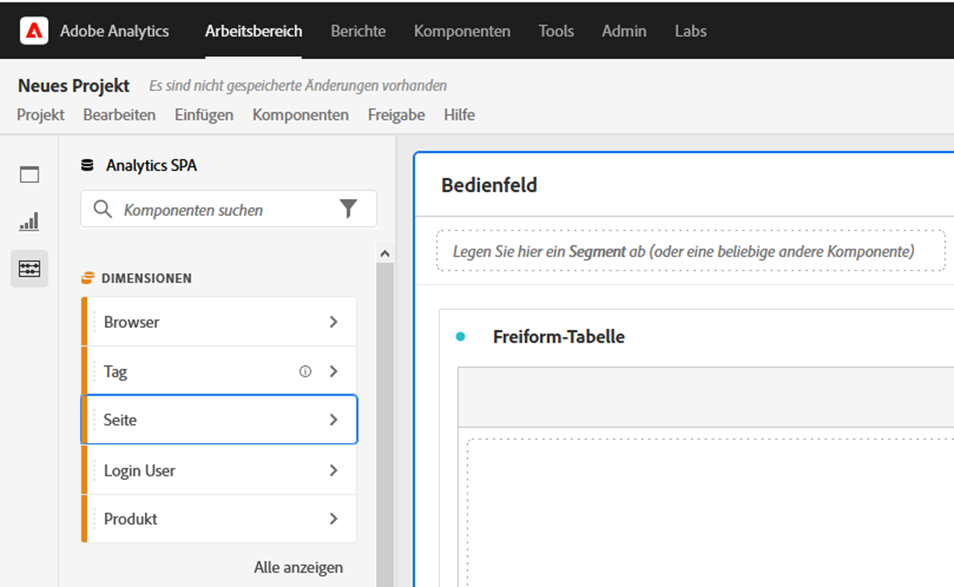
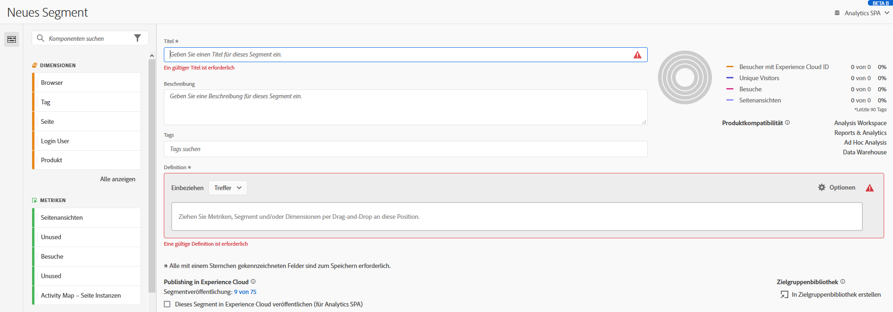

# Barrierefreiheit in Analysis Workspace

Erfahren Sie mehr über die Unterstützung der Barrierefreiheit in [!UICONTROL Analysis Workspace], dem führenden Analyse-Tool für Customer Journey Analytics.

Barrierefreiheit bezieht sich darauf, Produkte für Menschen mit visuellen, akustischen, kognitiven, motorischen und anderen Behinderungen nutzbar zu machen. Beispiele für Funktionen für die Barrierefreiheit für Software-Produkte:

* Bildschirmlesehilfen,
* Textäquivalente für Grafiken,
* Tastaturbefehle
* Änderung der Anzeigefarben auf hohen Kontrast,
* und vieles mehr.

[!UICONTROL Analysis Workspace] bietet einige Tools, um die Verwendung zu ermöglichen, darunter:

## Tastaturnavigation

Die Navigation in [!UICONTROL Analysis Workspace] funktioniert von oben nach unten und von links nach rechts. Die folgenden Navigationselemente erleichtern die Zugänglichkeit:

* Die **[!UICONTROL Tab]**-Taste ermöglicht Markierungskurzbefehle, mit denen Sie zwischen größeren Abschnitten in Workspace wechseln können. Im linken Panel können Sie mit der **[!UICONTROL Tab]**-Taste auch von einer ziehbaren Option zur nächsten wechseln.
* Mit ◀ und ▶ wechseln Sie zwischen einzelnen Elementen, nachdem Sie mit der **[!UICONTROL Tab]**-Taste ein Element hervorgehoben haben.
* Mit der Taste **[!UICONTROL F6]** navigieren Sie zum ersten Panel im Projekt und können zwischen den Visualisierungen in diesem Panel wechseln. Anschließend wird zum nächsten Panel im Projekt gewechselt und es wird wiederholt.
* Es werden Fokusindikatoren angewendet, sodass sehende Tastaturbenutzende einen klaren Hinweis darauf haben, welches Element der Benutzeroberfläche derzeit im Fokus ist. Der Indikator ist ein blauer Rahmen für das Panel, das den Fokus besitzt. Die kürzlich ausgewählte Funktion und die Auswahl innerhalb der Funktion hat einen grauen Hintergrund. In diesem Beispiel wurden kürzlich die [!UICONTROL Komponenten] und die Dimension „Seite“ ausgewählt.

  

### Tastaturnavigation zur Menüleiste

1. Drücken Sie die Tabulatortaste, bis Sie die Menüleiste erreicht haben.
1. Verwenden Sie die Pfeiltasten, um zwischen Menüs und Menüelementen zu navigieren.
1. Drücken Sie die **[!UICONTROL Eingabetaste]** , um ein Menü zu öffnen oder ein Menüelement auszuwählen.
1. Verwenden Sie **[!UICONTROL Esc]**, um ein Menü zu schließen.

### Tastaturnavigation für Drag-and-Drop-Interaktionen

[!UICONTROL Analysis Workspace] ist eine Drag-and-Drop-Benutzeroberfläche. Benutzende können jedoch stattdessen Komponenten über die Tastatur hinzufügen:

1. Navigieren Sie mit der Tab-Taste zu einer Komponente im linken Bedienfeld.
1. Drücken Sie zum Auswählen die **[!UICONTROL Eingabetaste]**.
1. Verwenden Sie die Pfeiltasten, um zu dem Bereich zu navigieren, in dem Sie die Komponente ablegen möchten.
1. Drücken Sie zum Platzieren der Komponente die **[!UICONTROL Eingabetaste]**.

### Tastaturbefehle (Hotkeys)

[!UICONTROL Analysis Workspace] bietet eine umfangreiche Auswahl an [Tastaturbefehlen](/help/analysis-workspace/build-workspace-project/fa-shortcut-keys.md) für einen nahtloseren Workflow. 

## Unterstützung für Bildschirmlesehilfen und Vergrößerungs-Software

Eine Bildschirmlesehilfe liest Text, der auf dem Computer-Bildschirm angezeigt wird. Es werden auch nicht textuelle Informationen wie Schaltflächenbeschriftungen oder Bildbeschreibungen in der Anwendung gelesen.

## Farbpaletten und Kontrast

[!UICONTROL Analysis Workspace] strebt die Konformität mit WCAG 2.1 AA an, einschließlich der Anforderungen an den Farbkontrast.

Darüber hinaus können Benutzer ihre eigene bevorzugte Farbpalette für ein Projekt unter **[!UICONTROL Projekt]** > **[!UICONTROL Projekteinstellungen]** > [Farbpalette](/help/analysis-workspace/build-workspace-project/color-palettes.md) festlegen.

## Erforderliche Validierung

Beim Erstellen einer Komponente, einer Visualisierung oder eines Panels werden die erforderlichen Felder beim Speichern validiert. Wenn ein erforderliches Feld die Validierung nicht erfolgreich durchläuft, wird es mit einer roten Umrandung und einem Fehlersymbol gekennzeichnet. Eine schriftliche Beschreibung erklärt den Handlungsbedarf.

## Unterstützung für Barrierefreiheitsfunktionen des Betriebssystems

Analysis Workspace unterstützt integrierte Windows- und macOS-Eingabehilfen wie den Modus für hohen Kontrast, Einrastfunktionen und Anschlaggeschwindigkeit/Anschlagverzögerung. Es werden auch Informationen über die Benutzeroberfläche des Betriebssystems bereitgestellt, um die Interaktion mit Hilfstechnologien zu ermöglichen, einschließlich Bildschirmlesehilfen wie VoiceOver für macOS und NVDA unter Windows.
