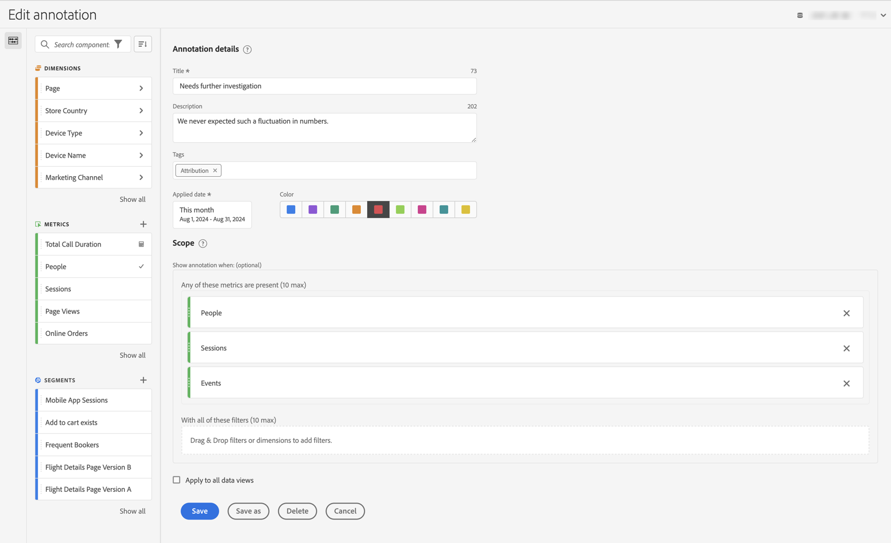

# Erstellen von Anmerkungen

Standardmäßig können nur Admins Anmerkungen erstellen. Benutzende haben die Berechtigung, Anmerkungen anzuzeigen, so wie sie auch andere Komponenten (z. B. Filter und berechnete Metriken) anzeigen können.

Admins können Benutzenden über die Admin Console jedoch die Berechtigung **[!UICONTROL Anmerkungserstellung]** für **[!UICONTROL Reporting-Tools]** unter **[!UICONTROL Berechtigungen für CJA Workspace-Zugriff bearbeiten]** erteilen. Weitere Informationen finden Sie unter [Zugriffskontrolle auf Benutzerebene](/help/technotes/access-control.md#user-level-access).

Sie können Anmerkungen wie folgt erstellen:

* **A**. Wählen Sie in der Hauptbenutzeroberfläche **[!UICONTROL Komponenten]** und anschließend &quot;**[!UICONTROL &quot;]**. Wählen Sie  [!UICONTROL **[!UICONTROL Hinzufügen]**] im [[!UICONTROL Anmerkungs]-Manager](/help/components/annotations/manage-annotations.md) aus.
* **B**. Wählen Sie in einem Workspace-Projekt im Kontextmenü in einer Visualisierung die Option **[!UICONTROL Anmerkung aus Auswahl erstellen]** aus.
* **C**. Wählen Sie in einem Workspace-Projekt im Kontextmenü in einem Liniendiagramm die Option **[!UICONTROL Anmerkungsauswahl]** aus.
* **D**. Wählen Sie in einem Workspace-Projekt **[!UICONTROL Komponenten]** aus dem Menü aus und klicken Sie auf **[!UICONTROL Anmerkung erstellen]**.
* **E**.  Verwenden Sie in einem Workspace-Projekt die Tastenkombination **[!UICONTROL Strg+Umschalt+O]** (Windows) oder **[!UICONTROL Umschalt+Befehl+O]** (macOS)

Verwenden Sie die Funktion zur [[!UICONTROL Anmerkungserstellung]](#annotation-builder), um die Anmerkung zu definieren.

<!-- Should we really mention API here. If so, we can do it all over the place in the docs...
| **Use the [Customer Journey Analytics Annotations API](https://developer.adobe.com/cja-apis/docs/endpoints/annotations/)** | The Customer Journey Analytics Annotations APIs allow you to create, update, or retrieve annotations programmatically through Adobe Developer. These APIs use the same data and methods that Adobe uses inside the product UI. |
-->

## Anmerkungserstellung {#annotation-builder}

<!-- markdownlint-disable MD034 -->

>[!CONTEXTUALHELP]
>id="components_annotations_details"
>title="Anmerkungsdetails"
>abstract="Mit Anmerkungen können Sie Ihrer Organisation kontextbezogene Datennuancen und Einblicke effektiv übermitteln. Durch sie können Sie Kalenderereignisse an bestimmte Dimensionen/Metriken binden. "

<!-- markdownlint-enable MD034 -->

<!-- markdownlint-disable MD034 -->

>[!CONTEXTUALHELP]
>id="components_annotations_scope"
>title="Anwendungsbereich"
>abstract="Mit der Option „Umfang“ können Sie anpassen, welche Daten mit einer Anmerkung versehen werden. Berechnete Metriken und Segmente übernehmen nicht automatisch Anmerkungen, die auf die in ihren Definitionen verwendeten Komponenten angewendet werden. Sie können zu einer vorhandenen Anmerkung im Abschnitt „Umfang“ neue berechnete Metriken hinzufügen. Neue Segmente erfordern eine neue Anmerkung."

<!-- markdownlint-enable MD034 -->

Das Dialogfeld **[!UICONTROL Anmerkungserstellung]** wird zum Erstellen neuer oder Bearbeiten vorhandener Anmerkungen verwendet. Das Dialogfeld hat den Titel **[!UICONTROL Neue Anmerkung]** oder **[!UICONTROL Anmerkung bearbeiten]** für Anmerkungen, die Sie über den [[!UICONTROL Anmerkungs]-Manager erstellen oder verwalten.](/help/components/annotations/manage-annotations.md)

>[!BEGINTABS]

>[!TAB Anmerkungserstellung]

>[!TAB Erstellen/Bearbeiten einer Anmerkung]

>[!ENDTABS]

1. Geben Sie die folgenden Details an ( bedeutet erforderlich):

   | Element | Beschreibung |
   | --- | --- |
   | **[!UICONTROL Datenansicht]** | Sie können die Datenansicht für die Anmerkung auswählen. Die von Ihnen definierte Anmerkung ist in den Workspace-Projekten auf Grundlage der ausgewählten Datenansicht als Anmerkung verfügbar. Diese Auswahl wird überschrieben, wenn Sie [!UICONTROL Auf alle Datenansichten anwenden] aktiviert haben. |
   | **[!UICONTROL Projektspezifische Anmerkungen]** | Ein Informationsfeld, mit dem erklärt wird, dass die von Ihnen erstellte Anmerkung nur im Workspace-Projekt sichtbar ist, an dem Sie arbeiten. Aktivieren Sie **[!UICONTROL Anmerkung für alle Projekte verfügbar machen]**, um die Anmerkung für alle Projekte sichtbar zu machen. Dieses Informationsfeld ist nur sichtbar, wenn Sie eine Anmerkung in einem Workspace-Projekt erstellen. |
   | **[!UICONTROL Titel]**  | Benennen Sie die Regel, beispielsweise mit `Needs further investigation`. |
   | **[!UICONTROL Beschreibung]** | Geben Sie eine Beschreibung für die Anmerkung ein, z. B. `We never expected such a fluctuation in numbers.`. |
   | **[!UICONTROL Tags]** | Organisieren Sie die Anmerkung, indem Sie ein oder mehrere Tags erstellen oder anwenden. Beginnen Sie mit der Eingabe, um nach vorhandenen Tags zu suchen, die Sie auswählen können. Oder drücken Sie die **[!UICONTROL Eingabetaste]**, um ein neues Tag hinzuzufügen. Wählen Sie  aus, um ein Tag zu entfernen. |
   | **[!UICONTROL Anwendungsdatum]**  | Wählen Sie das Datum oder den Datumsbereich aus, das bzw. der vorhanden sein muss, damit die Anmerkung sichtbar ist. Wenn Sie eine Anmerkung mithilfe des Tastaturbefehls erstellen, gibt die Anmerkung standardmäßig einen Datumsbereich für nur diesen Tag vor. Wenn Sie eine Anmerkung mithilfe einer Auswahl in einer Visualisierung erstellen, gibt die Anmerkung standardmäßig einen Datumsbereich basierend auf dem Bedienfeld vor, zu dem die Visualisierung gehört. |
   | **[!UICONTROL Farbe]** | Wenden Sie eine Farbe auf die Anmerkung an. Die Anmerkung wird im Projekt mit der ausgewählten Farbe angezeigt. Mit Farben können Sie Anmerkungen kategorisieren, z. B. Feiertage, externe Ereignisse, Tracking-Probleme usw. |
   | **[!UICONTROL Anwendungsbereich]** | Ziehen Sie die Metriken, die die Anmerkung auslösen, per Drag-and-Drop aus dem Panel mit den Komponenten in das entsprechende Feld. Zum Beispiel Personen, Sitzungen und Ereignisse. Ziehen Sie dann alle Dimensionen oder Filter, die als Filter fungieren, per Drag-and-Drop aus dem Panel mit den Komponenten in das Feld, um zu bestimmen, ob die Anmerkung angezeigt werden soll oder nicht. Wenn Sie keinen Bereich angeben, gilt die Anmerkung für alle Ihre Daten.  Es gibt zwei Optionen:<ul><li>**[!UICONTROL Zumindest eine dieser Metriken ist vorhanden]**: Ziehen Sie per Drag-and-Drop bis zu 10 Metriken in das Feld, die jeweils auslösen sollen, dass die Anmerkung angezeigt wird. Beispielsweise hat die Umsatzmetrik die Erfassung von Daten für einen bestimmten Datumsbereich gestoppt. Ziehen Sie die Umsatzmetrik in dieses Feld.</li><li>**[!UICONTROL Mit allen diesen Filtern]**: Ziehen Sie bis zu 10 Dimensionen oder Filter per Drag-and-Drop in dieses Feld, nach denen gefiltert werden soll, wenn die Anmerkung angezeigt wird.</li></ul>

**Hinweis:** Bei Anmerkungen, die auf eine Komponente angewendet werden, die dann als Teil einer berechneten Metrik oder Filterdefinition verwendet wird, wird die Anmerkung NICHT automatisch übernommen. Die gewünschte berechnete Kennzahl muss auch dem Abschnitt „Umfang“ hinzugefügt werden, damit die Anmerkung angezeigt wird. Für jeden Filter, den Sie mit denselben Informationen versehen möchten, sollte jedoch eine neue Anmerkung erstellt werden. Beispiel: Sie wenden eine Anmerkung auf [!UICONTROL Bestellungen] an einem bestimmten Tag an. Anschließend verwenden Sie [!UICONTROL Bestellungen] in einer berechneten Metrik für denselben Datumsbereich. Die neue berechnete Metrik zeigt die Anmerkung für Bestellungen nicht automatisch an. Fügen Sie die berechnete Metrik außerdem zum Abschnitt „Umfang“ hinzu, damit die Anmerkung angezeigt wird. |
   | **[!UICONTROL Auf alle Datenansichten anwenden]** | Standardmäßig gilt die Anmerkung für die ursprüngliche Datenansicht. Wenn Sie dieses Kontrollkästchen aktivieren, können Sie die Anmerkung für alle Datenansichten im Unternehmen gelten lassen. |

   {style="table-layout:auto"}

1. Auswählen
   * **[!UICONTROL Speichern]**: Speichert die Anmerkung.
   * **[!UICONTROL Speichern unter]**: Speichert eine Kopie der Anmerkung.
   * **[!UICONTROL Löschen]**: Löscht eine Anmerkung.
   * **[!UICONTROL Abbrechen]**: Bricht alle Änderungen ab, die Sie an einer Anmerkung vorgenommen haben, oder bricht die Erstellung einer neuen Anmerkung ab.
