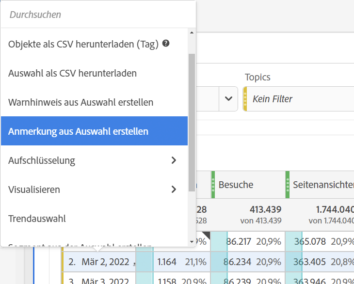
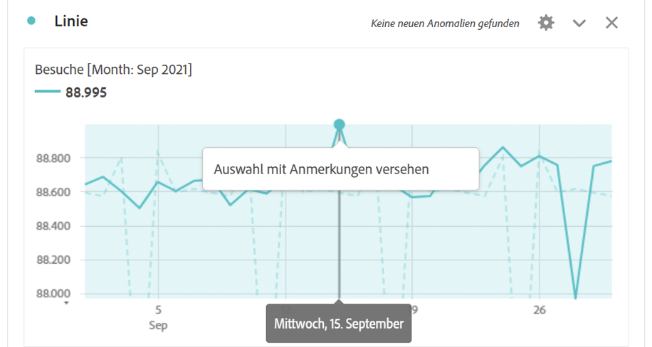
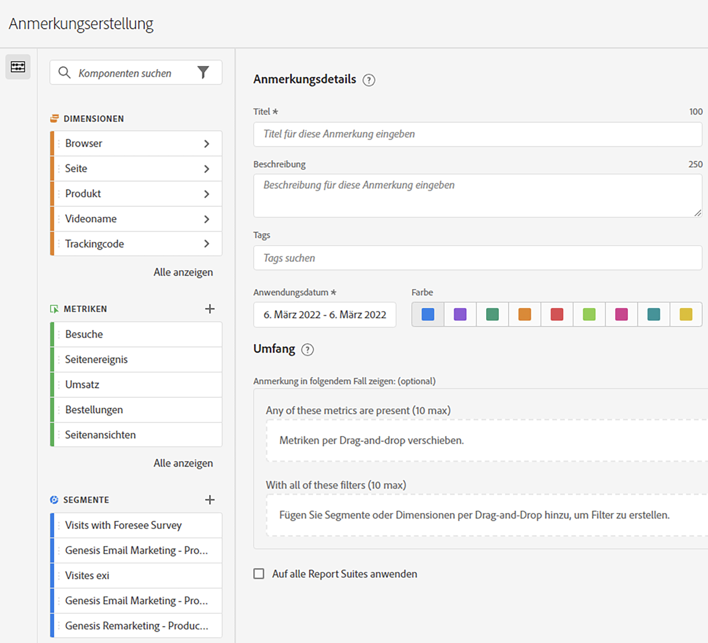

# Erstellen von Anmerkungen

Standardmäßig können nur Admins Anmerkungen erstellen. Benutzende haben die Berechtigung, Anmerkungen anzuzeigen, wie dies bei anderen Analytics-Komponenten der Fall ist (z. B. Filter und berechnete Metriken).

Admins können jedoch über die [Adobe Admin Console](https://experienceleague.adobe.com/docs/analytics/admin/admin-console/permissions/analytics-tools.html?lang=de) Benutzenden die Berechtigung zur [!UICONTROL Erstellung von Anmerkungen] (Analytics-Tools) erteilen.

1. Um Anmerkungen zu erstellen, haben Sie verschiedene Möglichkeiten zur Verfügung:

| Erstellungsmethode | Details |
| --- | --- |
| **Navigieren Sie zu [!UICONTROL Komponenten] > [!UICONTROL Anmerkung].** | Die Seite „Anmerkungsverwaltung“ wird geöffnet. Klicken Sie auf [!UICONTROL Neue Anmerkung erstellen], und der [!UICONTROL Anmerkungsgenerator] wird geöffnet. |
| **Klicken Sie mit der rechten Maustaste auf einen Punkt auf einer Tabelle.** | [!UICONTROL Der Anmerkungsgenerator] wird geöffnet. Beachten Sie, dass die auf diese Weise erstellten Anmerkungen standardmäßig nur in dem Projekt sichtbar sind, in dem sie erstellt wurden. Sie können sie aber für alle Projekte verfügbar machen. Beachten Sie, dass das Datum und ggf. Metriken usw. bereits ausgefüllt sind.
 |
| **Klicken Sie mit der rechten Maustaste auf einen Punkt in einem [!UICONTROL Linien] diagramm.** | Der [!UICONTROL Anmerkungsgenerator] wird geöffnet. Beachten Sie, dass die auf diese Weise erstellten Anmerkungen standardmäßig nur in dem Projekt sichtbar sind, in dem sie erstellt wurden. Sie können sie aber für alle Projekte verfügbar machen. Beachten Sie, dass das Datum und ggf. Metriken usw. bereits ausgefüllt sind.
 |
| **Wechseln Sie in Workspace zu [!UICONTROL Komponenten] > [!UICONTROL Anmerkung erstellen].** | Der [!UICONTROL Anmerkungsgenerator] wird geöffnet. |
| **Verwenden Sie dieses Tastenkürzel**, um den Anmerkungsgenerator zu öffnen: (PC) `ctrl` `shift` + o, (Mac) `shift` + `command` + o | Beachten Sie, dass Sie durch Verwendung des Tastenkürzels zur Erstellung einer Anmerkung eine eintägige Anmerkung für das aktuelle Datum ohne einen vorab ausgewählten Bereich (Kennzahlen oder Dimensionen) erstellen. |
| **Verwenden Sie die [Anmerkungs-API in Customer Journey Analytics](https://developer.adobe.com/cja-apis/docs/endpoints/annotations/)** | Mit den Anmerkungs-APIs in Customer Journey Analytics können Sie Anmerkungen programmgesteuert über Adobe Developer erstellen, aktualisieren oder abrufen. Diese APIs verwenden dieselben Daten und Methoden, die Adobe innerhalb der Produkt-Benutzeroberfläche verwendet. |

{style="table-layout:auto"}

1. Füllen Sie die Elemente des [!UICONTROL Anmerkungsgenerators] aus.

   

   | Element | Beschreibung |
   | --- | --- |
   | [!UICONTROL Titel] | Benennen Sie die Anmerkung, z. B. „Gedenktag“ |
   | [!UICONTROL Beschreibung] | (Optional) Geben Sie eine Beschreibung für die Anmerkung ein, z. B. „Feiertage in den USA“. |
   | [!UICONTROL Tags] | (Optional) Organisieren Sie Anmerkungen, indem Sie ein Tag erstellen oder anwenden. |
   | [!UICONTROL Anwendungsdatum] | Wählen Sie das Datum oder den Datumsbereich aus, das bzw. der vorhanden sein muss, damit die Anmerkung sichtbar ist. |
   | [!UICONTROL Farbe] | Wenden Sie eine Farbe auf die Anmerkung an. Die Anmerkung wird im Projekt mit der ausgewählten Farbe angezeigt. Mit Farben können Sie Anmerkungen kategorisieren, z. B. Feiertage, externe Ereignisse, Tracking-Probleme usw. |
   | [!UICONTROL Anwendungsbereich] | (Optional) Ziehen Sie die Metriken, von denen die Anmerkung ausgelöst werden soll, per Drag-and-Drop in das entsprechende Feld. Ziehen Sie dann alle Dimensionen oder Filter, die als Filter fungieren (d. h. bei deren Anwendung die Anmerkung sichtbar bleiben soll) per Drag-and-Drop in das Feld. Wenn Sie keinen Bereich angeben, gilt die Anmerkung für alle Ihre Daten.<ul><li>**[!UICONTROL Eine dieser Metriken ist vorhanden]**: Ziehen Sie per Drag-and-Drop bis zu 10 Metriken in das Feld, die jeweils auslösen sollen, dass die Anmerkung angezeigt wird.</li><li>**[!UICONTROL Mit allen diesen Filtern]**: Ziehen Sie bis zu 10 Dimensionen oder Filter per Drag-and-Drop in dieses Feld, nach denen gefiltert werden soll, wenn die Anmerkung angezeigt wird.</li></ul>
Anwendungsbeispiele: Eine eVar hat die Erfassung von Daten für einen bestimmten Datumsbereich eingestellt. Ziehen Sie die eVar in das Dialogfeld **[!UICONTROL Eine dieser Metriken ist vorhanden]**. Oder die Metrik [!UICONTROL Besuche] meldet keine Daten – folgen Sie demselben Prozess.
**Hinweis:** Bei Anmerkungen, die auf eine Komponente angewendet werden, die dann als Teil einer berechneten Metrik oder Filterdefinition verwendet wird, wird die Anmerkung NICHT automatisch übernommen. Die gewünschte berechnete Kennzahl muss auch dem Abschnitt „Umfang“ hinzugefügt werden, damit die Anmerkung angezeigt wird. Für jeden Filter, den Sie mit denselben Informationen versehen möchten, sollte jedoch eine neue Anmerkung erstellt werden.
Beispiel: Sie wenden eine Anmerkung auf [!UICONTROL Bestellungen] an einem bestimmten Tag an. Anschließend verwenden Sie [!UICONTROL Bestellungen] in einer berechneten Metrik für denselben Datumsbereich. Die neue berechnete Metrik zeigt die Anmerkung für Bestellungen nicht automatisch an. Die berechnete Metrik muss auch zum Bereich für den Umfang hinzugefügt werden, damit die Anmerkung angezeigt wird. |
   | [!UICONTROL Auf alle Datenansichten anwenden] | Standardmäßig gilt die Anmerkung für die ursprüngliche Datenansicht. Wenn Sie dieses Kontrollkästchen aktivieren, können Sie die Anmerkung für alle Datenansichten im Unternehmen gelten lassen. |
   | [!UICONTROL Auf alle Projekte anwenden] | Standardmäßig gilt die Anmerkung für das aktuelle Projekt. Wenn Sie dieses Kontrollkästchen aktivieren, können Sie die Anmerkung auf alle Projekte anwenden, deren Inhaber Sie sind. Beachten Sie, dass dieses Kontrollkästchen nur angezeigt wird, wenn Sie den Anmerkungsgenerator aus dem Anmerkungsgenerator starten? |

   {style="table-layout:auto"}

1. Klicken Sie auf **[!UICONTROL Speichern]**.
