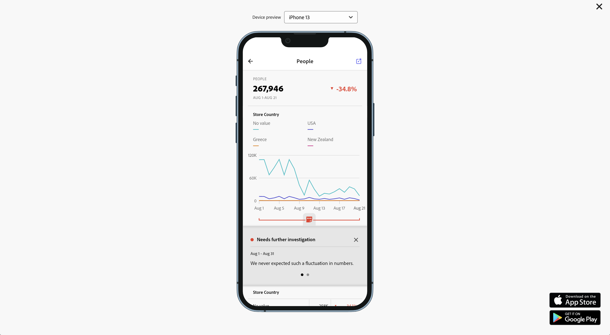

# Freigeben von Anmerkungen in mobilen Scorecards

Sie können in Workspace erstellte Anmerkungen in mobilen Scorecards anzeigen. Anmerkungen in mobilen Scorecards ermöglichen den Austausch kontextueller Datennuancen und Einblicke in Ihre Organisation und Kampagnen.

## Anzeigen von Anmerkungen in mobilen Scorecards

Um Anmerkungen in mobilen Scorecards einzublenden, erstellen Sie die Anmerkung zuerst aus Workspace-Projekten oder aus dem Menü „Komponenten“.

Informationen zum Erstellen von Anmerkungen finden Sie unter [Erstellen von Anmerkungen](create-annotations.md). Anmerkungen sind standardmäßig in mobilen Scorecards deaktiviert und müssen für jede Scorecard aktiviert sein, für die Sie sie in mobilen Scorecards verwenden möchten.

1. Aktivieren Sie Anmerkungen. Informationen zum Aktivieren von Anmerkungen finden Sie unter [Aktivieren oder Deaktivieren von Anmerkungen](overview.md#turn-annotations-on-or-off).

1. Erstellen Sie eine Anmerkung und stellen Sie sicher, dass sie für alle Ihre Projekte freigegeben ist. Weitere Informationen finden Sie unter [Erstellen von Anmerkungen](create-annotations.md) .

1. Wählen Sie **[!UICONTROL Anmerkungen anzeigen]**, um die Anmerkung in mobilen Scorecards anzuzeigen.

   

   Sie können optional bestätigen, dass unter **[!UICONTROL Projekt]** > **[!UICONTROL Projektinformationen und Einstellungen]** die Option **[!UICONTROL Anmerkungen anzeigen]** ausgewählt ist.

## Anzeigen von Anmerkungen in mobilen Scorecards

Wenn Anmerkungen aktiviert sind, werden im Scorecard-Builder Anmerkungssymbole angezeigt. Anmerkungen werden nur in Diagrammen und Tabellen in der Detailansicht angezeigt. in der Ansicht der Hauptkachel der Scorecard sind Anmerkungen nicht sichtbar.

Wenn Anmerkungssymbole sichtbar sind, können Sie Anmerkungen auf der Arbeitsfläche des Builders nicht vollständig anzeigen oder damit interagieren. Verwenden Sie  **[!UICONTROL Vorschau]** , um Anmerkungen so anzuzeigen und mit ihnen zu interagieren, wie sie in der App angezeigt werden.

Anmerkungsfarben werden ausgewählt, wenn die Anmerkung in Workspace erstellt wird. Graue Anmerkungen weisen auf das Vorhandensein von mehr als einer Anmerkung hin.

## Vorschau von Anmerkungen anzeigen

Sie können die Vorschau von Anmerkungen mit der Vorschau  anzeigen. Wählen Sie eine Anmerkung aus, um Details der Anmerkung zu öffnen.

Wenn weitere Anmerkungen verfügbar sind, werden am unteren Rand der Anmerkung mehrere Punkte () angezeigt. Wischen Sie nach links oder rechts, um zwischen Anmerkungen zu wechseln.
