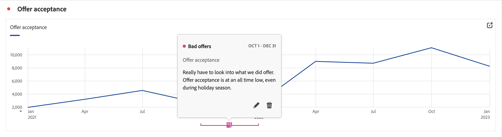

# Anmerkungen – Überblick

Mit Anmerkungen können Sie kontextbezogene Datennuancen und Erkenntnisse auf effektive Weise an andere Stakeholderinnen und Stakeholder in Ihrer Organisation übermitteln. Durch Anmerkungen können Sie Kalenderereignisse an bestimmte Dimensionen und Metriken binden. Sie können etwa zu einem Datum oder Datumsbereich Anmerkungen zu bekannten Datenproblemen, Feiertagen, Kampagnenstarts usw. machen, Anschließend können Sie Ereignisse grafisch anzeigen und sehen, ob sich Kampagnen oder andere Ereignisse auf den Traffic Ihrer Site, die Nutzung mobiler Apps, den Umsatz oder andere Metriken ausgewirkt haben.

Angenommen, Sie geben Projekte für Ihre Organisation frei. Wenn es einen merklichen Rückgang bei der Angebotsannahme gegeben hat, können Sie eine Anmerkung **Schlechte Angebote** erstellen und diese auf Ihre gesamte Datenansicht anwenden. Wenn Ihre Benutzenden Datensätze betrachten, die dieses Datum enthalten, sehen sie die Anmerkung in ihren Projekten gemeinsam mit ihren Daten.

Anmerkungen können für Folgendes gelten:

* ein einzelnes Datum oder einen Datumsbereich.

* Ihren gesamten Datensatz oder bestimmte Metriken, Dimensionen oder Segmente.

* das Projekt, in dem Anmerkungen erstellt werden (Standard), oder alle Projekte.

* die Datenansicht, in der Anmerkungen erstellt werden (Standard), oder alle Datenansichten.

Unter [Erstellen von Anmerkungen](/help/components/annotations/create-annotations.md) finden Sie die verschiedenen Optionen zum Erstellen von Anmerkungen. Anschließend erstellen, ändern und speichern Sie Anmerkungen im Rahmen der [Anmerkungserstellung](create-annotations.md#annotation-builder).

Sie verwenden den [Anmerkungs-Manager](manage-annotations.md) zum Verwalten von Anmerkungen.

## Aktivieren oder Deaktivieren von Anmerkungen

Anmerkungen können auf verschiedenen Ebenen aktiviert oder deaktiviert werden:

| Ebene | Schritte |
|---|---|
| **Visualisierung** | Aktivieren oder deaktivieren Sie  > **[!UICONTROL Einstellungen]** > **[!UICONTROL Anmerkungen anzeigen]**.  |
| **Projekt** | Wählen Sie in einem Workspace-Projektmenü **[!UICONTROL Projekt]** > **[!UICONTROL Projektinformationen und -einstellungen]** aus und aktivieren oder deaktivieren Sie **[!UICONTROL Anmerkungen anzeigen]**.  |
| **Benutzende** | Wählen Sie auf der Registerkarte **[!UICONTROL Komponenten]** die Option **[!UICONTROL Voreinstellungen]** oder im Workspace-Projektmenü die Option **[!UICONTROL Projekt]** > **[!UICONTROL Benutzervoreinstellungen]** aus.  Wählen Sie unter **[!UICONTROL Voreinstellungen]** die Option **[!UICONTROL Projekte und Analysen]** aus. Wählen Sie in der linken Registerkartenleiste die Option **[!UICONTROL Daten]** aus. Aktivieren oder deaktivieren Sie unten unter der Überschrift **[!UICONTROL Freiformtabelle]** die Option **[!UICONTROL Anmerkungen anzeigen]** aus.  |
