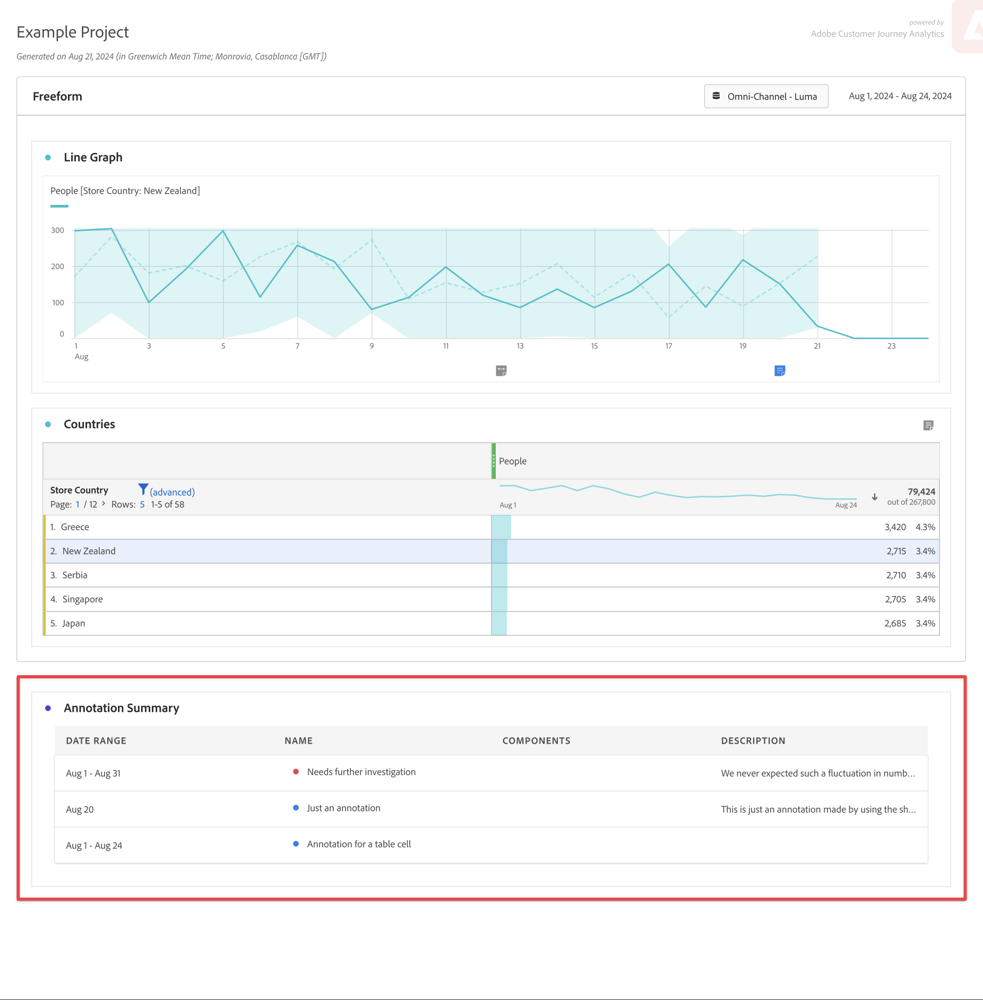

# Anzeigen von Anmerkungen

Anmerkungen werden je nachdem, ob sie sich über einen einzelnen Tag oder einen Datumsbereich erstrecken, etwas unterschiedlich angezeigt.

## Anzeigen von Anmerkungen in Liniendiagrammen oder Tabellen

| Visualization type | Beschreibung |
| --- | --- |
| **Linie ** **Einzeltag** | Wenn Sie in einer Linienvisualisierung  auswählen, wird ein Popup mit den Anmerkungsdetails angezeigt.  Wählen Sie zum Bearbeiten der Anmerkung im [Anmerkungs-Builder](create-annotations.md#annotation-builder) die Option  aus. Um die Anmerkung zu löschen, wählen Sie  aus. |
| **Zeile ** **Datumsbereich** | Wenn Sie  auswählen, sehen Sie ein Popup mit den Anmerkungsdetails und eine Zeile unten, die den Datumsbereich angibt. Wählen Sie zum Bearbeiten der Anmerkung im [Anmerkung-Builder](create-annotations.md#annotation-builder) die Option  aus. Um die Anmerkung zu löschen, wählen Sie  aus. |
| **Freiformtabelle** | In einer Freiformtabelle können Sie über die Schaltfläche &quot;Anmerkungen&quot;oben rechts in der Visualisierung auf alle Anmerkungen zugreifen. Wählen Sie  aus, um eine (Scroll-Liste) aller Anmerkungen anzuzeigen.  Für jede Anmerkung können Sie  auswählen, um die Anmerkung im [Anmerkung-Builder](create-annotations.md#annotation-builder) und im  zu bearbeiten, um die Anmerkung zu löschen. |

{style="table-layout:auto"}

## Anzeigen von Anmerkungen in einer PDF

Wenn Sie Ihr Projekt als PDF herunterladen oder als PDF versenden, werden Anmerkungen in PDF im Abschnitt Anmerkungszusammenfassung zusammengefasst.

