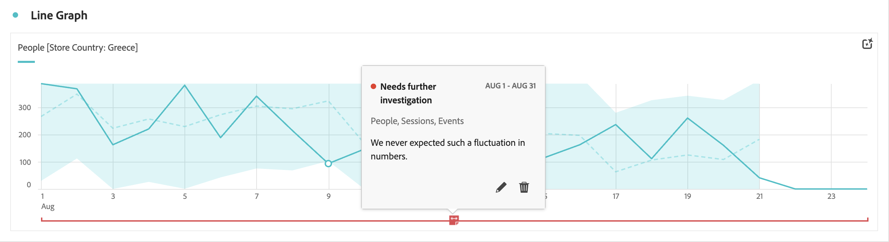
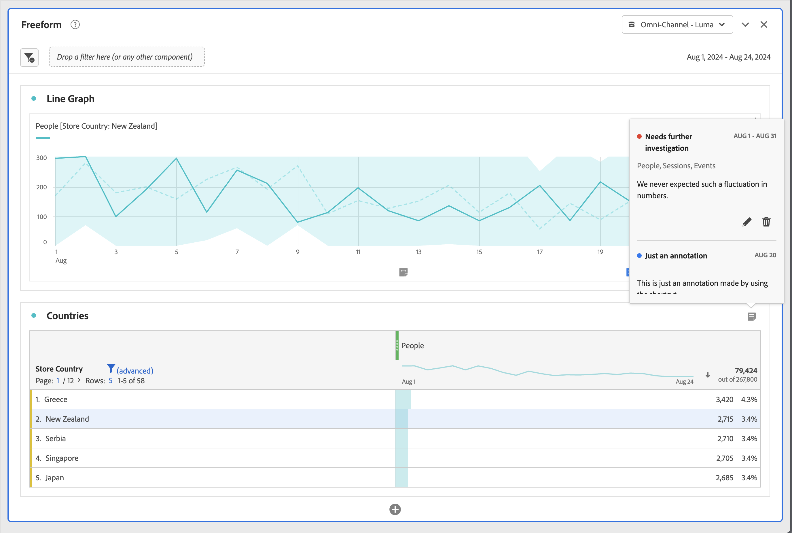

# Anzeigen von Anmerkungen

Anmerkungen werden je nachdem, wo sie angezeigt werden und ob sie sich über einen einzelnen Tag oder einen Datumsbereich erstrecken, etwas unterschiedlich angezeigt.

## Anzeigen von Anmerkungen in Liniendiagrammen oder Tabellen

| Visualisierungs- typ | Beschreibung |
| --- | --- |
| **Linie &#x200B;** **Einzeltag** | Wenn Sie in einer Linienvisualisierung  auswählen, wird ein Popup mit den Anmerkungsdetails angezeigt.  Wählen Sie zum Bearbeiten der Anmerkung unter [Anmerkungserstellung](create-annotations.md#annotation-builder) die Option  aus. Um die Anmerkung zu entfernen, wählen Sie  aus. |
| **Linie &#x200B;** **Datumsbereich** | Wenn Sie  auswählen, werden ein Popup mit den Anmerkungsdetails und unten eine Linie angezeigt, die den Datumsbereich angibt. Wählen Sie zum Bearbeiten der Anmerkung unter [Anmerkungserstellung](create-annotations.md#annotation-builder) die Option  aus. Um die Anmerkung zu entfernen, wählen Sie  aus. |
| **Freiformtabelle** | In einer Freiformtabelle können Sie über die Schaltfläche „Anmerkungen“ oben rechts in der Visualisierung auf alle Anmerkungen zugreifen. Wählen Sie  aus, um eine Bildlaufliste aller Anmerkungen anzuzeigen.  Sie können für jede Anmerkung die Option  auswählen, um die Anmerkung unter [Anmerkungserstellung](create-annotations.md#annotation-builder) zu bearbeiten, und mit  die Anmerkung entfernen. |

{style="table-layout:auto"}

## Anzeigen von Anmerkungen in einer PDF-Datei

Wenn Sie Ihr Projekt als PDF-Datei herunterladen oder versenden, werden Anmerkungen im Abschnitt „Zusammenfassung der Anmerkung“ als PDF zusammengefasst.

