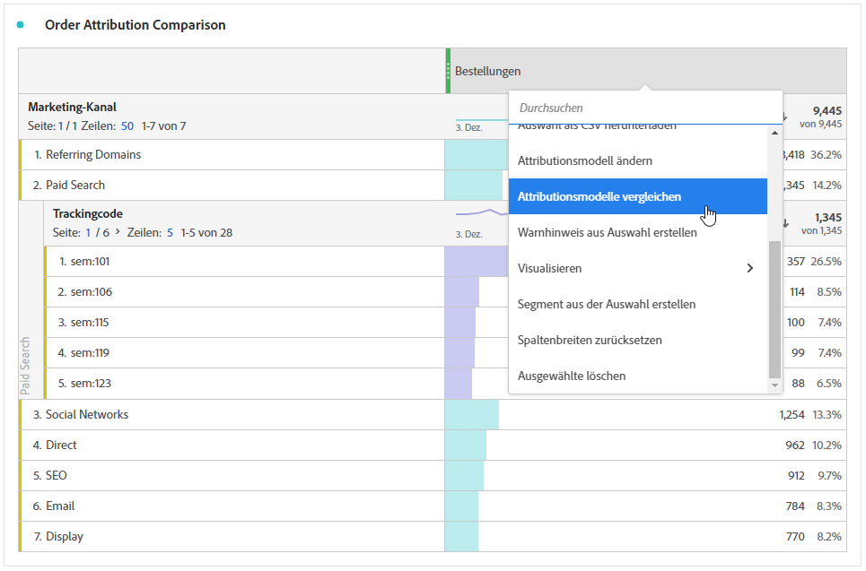

# Metriken

Mit Metriken können Sie Datenpunkte in Analysis Workspace quantifizieren. Sie werden meist als Spalten in einer Visualisierung verwendet und sind an Dimensionen gebunden.

## Verwenden von Metriken in Analysis Workspace

Metriken können in Analysis Workspace flexibel verwendet werden. Ziehen Sie eine Metrik in eine leere Freiformtabelle, um die Entwicklung dieser Metrik über den Datumsbereich des Projekts anzuzeigen. Sie können auch eine Metrik ziehen, wenn eine Dimension vorhanden ist, um diese Metrik mit jedem Dimensionselement zu vergleichen. Wenn Sie eine Metrik über eine vorhandene Metrik-Kopfzeile ziehen, wird sie ersetzt, und wenn Sie eine Metrik neben einer Kopfzeile ziehen, können Sie beide Metriken nebeneinander sehen.

Informationen zum Hinzufügen von Metriken und anderen Komponententypen zu Analysis Workspace finden Sie unter [Verwenden von Komponenten in Analysis Workspace](/help/components/use-components-in-workspace.md).

## Arten von Metriken

Adobe bietet verschiedene Arten von Metriken zur Verwendung in Analysis Workspace:

* **Standardmetriken**: Beispiel für Standardmetriken sind „Personen“, „Sitzungen“ und „Ereignisse“.

  Im Gegensatz zu Adobe Analytics können Sie mit Customer Journey Analytics Standardmetriken im Rahmen einer Verbindung und einer Datenansicht flexibel definieren.

   * **Personen**: Die Personen -Metrik in Customer Journey Analytics entspricht der Anzahl der eindeutigen Personen-IDs. Je nachdem, was Sie bei der Konfiguration von Datensätzen in Ihrer Verbindung als Personen-ID auswählen, kann die Personen -Metrik unterschiedliche Bedeutungen haben.
   * **Sitzungen**: Die Sitzungsmetrik in Customer Journey Analytics wird im Rahmen der Konfiguration der Sitzungseinstellungen in Ihrer Datenansicht definiert. Siehe [Sitzungseinstellungen](/help/data-views/session-settings.md).
   * **Ereignisse**: Die Ereignismetrik in Customer Journey Analytics besteht aus den Ereignissen, die Teil eines Ereignisdatensatzes sind, den Sie als Teil Ihrer Verbindung konfiguriert haben.

* **Berechnete Metriken** : Benutzerdefinierte Metriken, die auf Standardmetriken, statischen Zahlen oder algorithmischen Funktionen basieren.

* **Vorlagen für berechnete Metriken**  : Adobe-definierte Metriken, die sich ähnlich wie berechnete Metriken verhalten. Sie können sie unverändert in Workspace-Projekten verwenden oder eine Kopie speichern, um die Logik anzupassen. Siehe [Standardberechnete Metriken](calc-metrics/cm-workflow/../default-calcmetrics.md).

Sie können sehen, ob eine Metrik genehmigt wurde  oder nicht. Wenn Sie weitere Details zu einer Metrik wünschen, bewegen Sie den Mauszeiger über die Metrik und wählen Sie  aus. Siehe [Komponenteninformationen](use-components-in-workspace.md#component-info) für weitere Informationen.

## Berechnete Metriken 

Berechnete Metriken ermöglichen es Ihnen, die Beziehung zwischen Metriken einfach mithilfe einfacher Operatoren oder statistischer Funktionen zu konfigurieren. Weitere Informationen finden [ unter ](/help/components/calc-metrics/calc-metr-overview.md) Metriken - Übersicht .

<!--

There are several ways to create calculated metrics. See [Create calculated metrics]()

### Create calculated metrics for all projects

You can use the calculated metric builder to create calculated metrics. When created in this way, calculated metrics are available in the component list and can then be used in projects throughout your organization. 

For information about how to access the calculated metrics builder, see [Build metrics](/help/components/calc-metrics/cm-workflow/cm-build-metrics.md).

### Create calculated metrics for a single project

You can create quick calculated metrics that are available only for the project where they were created.

To create a calculated metric for a single project:

1. In Analysis Workspace, open the project where you want to create the calculated metric.

1. In a freeform table, select **[!UICONTROL Create metric from selection]** from the context menu in a column header.

   

1. To create a calculated metric for this project only, choose from the following options:

   * [!UICONTROL **Divide**]
   
   * [!UICONTROL **Subtract**]

   * [!UICONTROL **Add**]

   * [!UICONTROL **Multiply**]

   Or, to open the calculated metric builder and create the calculated metric for all projects, select [!UICONTROL **Open in Calculated Metric Builder**], then continue with [Build metrics](/help/components/calc-metrics/cm-workflow/cm-build-metrics.md).

<!-- This video really shows an AA example using hits, etc.  Not suitable for CJA... >
+++ See the following video on how to create an implementation-less calculated metric from within Analysis Workspace.

[Calculated Metrics: Implementation-less metrics](https://experienceleague.adobe.com/docs/analytics-learn/tutorials/components/calculated-metrics/calculated-metrics-implementationless-metrics.html) (3:42)

>[!VIDEO](https://video.tv.adobe.com/v/25407/?quality=12)

+++

-->

## Vergleichen von Metriken mit verschiedenen Attributionsmodellen

Wenn Sie Attributionsmodelle für eine Metrik schnell und einfach miteinander vergleichen möchten, wählen Sie **[!UICONTROL Attributionsmodelle vergleichen]** aus dem Kontextmenü für eine Metrik aus.

Mit dieser Tastenkombination können Sie Attributionsmodelle schnell und einfach vergleichen.
