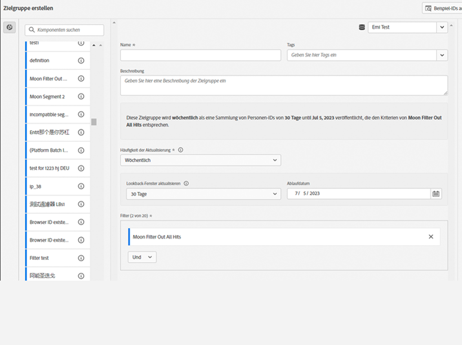

# Erstellen und Veröffentlichen von Zielgruppen {#create-and-publish-audiences}

<!-- markdownlint-disable MD034 -->

>[!CONTEXTUALHELP]
>id="components_audiences_refreshfrequency"
>title="Häufigkeit der Aktualisierung"
>abstract="Ermitteln Sie, wie oft die Mitgliedschaft einer Zielgruppe neu ausgewertet wird. Einmalige Zielgruppen werden nur einmal ausgewertet."

<!-- markdownlint-enable MD034 -->

<!-- markdownlint-disable MD034 -->

>[!CONTEXTUALHELP]
>id="components_audiences_audiencelimit"
>title="Zielgruppen-Limit"
>abstract="Die Aktualisierung von Zielgruppen ist abhängig davon, wie oft sie aktualisiert werden, begrenzt."

<!-- markdownlint-enable MD034 -->

<!-- markdownlint-disable MD034 -->

>[!CONTEXTUALHELP]
>id="component_audiences_refreshlookbackwindow"
>title="Lookback-Fenster aktualisieren"
>abstract="Definieren Sie die Anzahl der Lookback-Tage ab heute, in denen eine Zielgruppe ausgewertet wird."

<!-- markdownlint-enable MD034 -->

<!-- markdownlint-disable MD034 -->

>[!CONTEXTUALHELP]
>id="component_audiences_audiencesizelimit"
>title="Größenlimit für Zielgruppen"
>abstract="Zielgruppen dürfen maximal 20 Millionen Mitglieder umfassen."

<!-- markdownlint-enable MD034 -->

<!-- markdownlint-disable MD034 -->

>[!CONTEXTUALHELP]
>id="component_audiences_namespacesincluded"
>title="Enthaltene Namespaces"
>abstract="Die Identitäten in dieser Zielgruppe bestehen aus den unten stehenden Namespaces."

<!-- markdownlint-enable MD034 -->

In diesem Abschnitt wird beschrieben, wie Sie Zielgruppen, die in Customer Journey Analytics identifiziert wurden, im [Echtzeit-Kundenprofil](https://experienceleague.adobe.com/de/docs/experience-platform/profile/home) in Adobe Experience Platform erstellen und veröffentlichen, um Kunden-Targeting und Personalisierung durchzuführen.

Lesen Sie diesen [Überblick](/help/components/audiences/audiences-overview.md), um sich mit dem Konzept der Customer Journey Analytics-Zielgruppen vertraut zu machen.

## Erstellen und Veröffentlichen einer Zielgruppe {#create}

1. Führen Sie einen der folgenden Schritte aus, um eine Zielgruppe zu erstellen und zu veröffentlichen:

   | Erstellungsmethode | Details |
   | --- | --- |
   | In der Benutzeroberfläche **[!UICONTROL Zielgruppen]** | Wählen Sie im Customer Journey Analytics-Hauptmenü die Option **[!UICONTROL Komponenten]** > **[!UICONTROL Zielgruppen]** aus. Die Benutzeroberfläche „Zielgruppen“ wird angezeigt. Wählen Sie **[!UICONTROL Zielgruppe erstellen]** aus. Daraufhin wird der [!UICONTROL Audience Builder] geöffnet. |
   | Über eine Visualisierung in Analysis Workspace | Viele Visualisierungen in Analysis Workspace ermöglichen es Ihnen, mithilfe des Kontextmenüs eine Zielgruppe zu erstellen. Sie können beispielsweise **[!UICONTROL Zielgruppe erstellen]** aus dem Kontextmenü eines Elements in einer [Freiformtabelle](/help/analysis-workspace/visualizations/freeform-table/freeform-table.md) oder eines Knotens in der [Journey-Arbeitsfläche](/help/analysis-workspace/visualizations/journey-canvas/journey-canvas.md) auswählen.
Mit dieser Methode wird das Segment im Zielgruppen-Builder vorab mit der ausgewählten Dimension oder dem ausgewählten Dimensionselement aufgefüllt.

Mit den folgenden Visualisierungen können Sie mithilfe des Kontextmenüs eine Zielgruppe erstellen:
<ul><li>[Kohortentabelle](/help/analysis-workspace/visualizations/cohort-table/cohort-analysis.md)</li><li>[Fallout](/help/analysis-workspace/visualizations/fallout/fallout-flow.md)</li><li>[Fluss](/help/analysis-workspace/visualizations/c-flow/flow.md)</li><li>[Freiformtabelle](/help/analysis-workspace/visualizations/freeform-table/freeform-table.md)</li><li>[Journey-Arbeitsfläche](/help/analysis-workspace/visualizations/journey-canvas/journey-canvas.md)</li><li>[Zuordnung ](/help/analysis-workspace/visualizations/map.md#create-an-audience-from-the-map-visualization) **Hinweis:** Diese Visualisierung befindet sich in der eingeschränkten Testphase der Version und ist möglicherweise noch nicht in Ihrer Umgebung verfügbar. </li><li>[Venn](/help/analysis-workspace/visualizations/venn.md)</li></ul>
**Hinweis:** Zielgruppen können keine berechneten Metriken enthalten. Wenn Sie versuchen, eine Zielgruppe mit einer berechneten Metrik zu erstellen, wird die berechnete Metrik nicht in die Zielgruppendefinition einbezogen.
 |
   | Über die Benutzeroberfläche zur Erstellung/Bearbeitung von Segmenten | Aktivieren Sie das Kontrollkästchen **[!UICONTROL Zielgruppe aus diesem Segment erstellen]**. Mit dieser Methode wird das Segment vorab aufgefüllt. Weitere Informationen finden Sie unter [Erstellen von Segmenten](/help/components/segments/seg-create.md). |

   {style="table-layout:auto"}

1. Erstellen Sie die Zielgruppe mit dem [Audience Builder](#audience-builder).

1. Interpretieren Sie die Daten mithilfe des Panels [Datumsvorschau](#data-preview).

1. Wählen Sie **[!UICONTROL [!UICONTROL Beispiel-IDs anzeigen]]** aus, um Beispiel-IDs in dieser Zielgruppe anzuzeigen. Im Dialogfeld **[!UICONTROL Beispiel-IDs]** können Sie über  [!UICONTROL *Beispiel-IDs suchen*] nach Beispiel-IDs suchen.

1. Überprüfen Sie Ihre Zielgruppenkonfiguration und wählen Sie **[!UICONTROL Veröffentlichen]** aus.
Sie erhalten eine Nachricht mit der Bestätigung, dass die Zielgruppe veröffentlicht wird. Es dauert nur ein bis zwei Minuten, bis die Veröffentlichung dieser Zielgruppe in Experience Platform angezeigt wird.

1. Wählen Sie in derselben Nachricht die Option **[!UICONTROL Zielgruppe in AEP anzeigen]** aus. Dadurch gelangen Sie zur [Segment-Benutzeroberfläche](https://experienceleague.adobe.com/de/docs/experience-platform/segmentation/ui/overview) in Adobe Experience Platform. Weitere Informationen finden Sie unten.

## Audience Builder

Konfigurieren Sie diese Einstellungen, um Ihre Zielgruppe zu definieren oder zu aktualisieren.

| Einstellung | Beschreibung |
| --- | --- |
|  | Wählen Sie eine Datenansicht aus, die beim Erstellen der Zielgruppe verwendet werden soll. |
| **[!UICONTROL Name]** | Der Name der Zielgruppe. Beispiel: `Really Interested in Potential Car Buyers` |
| **[!UICONTROL Tags]** | Alle Tags, die der Zielgruppe aus organisatorischen Gründen zugewiesen werden sollen. Sie können ein oder mehrere bereits vorhandene Tags auswählen oder ein neues eingeben. |
| **[!UICONTROL Beschreibung]** | Eine Beschreibung der Zielgruppe, um sie von anderen leicht unterscheiden zu können. Beispiel: `Build an audience of really interested potential car buyers` |
| **[!UICONTROL Häufigkeit der Aktualisierung]** | Die Häufigkeit, mit der Sie die Zielgruppe aktualisieren möchten.
Sie haben die Wahl zwischen: <ul><li>**[!UICONTROL Einmalige]** Zielgruppe: Eine Zielgruppe (Standard), die nicht aktualisiert werden muss. Diese Option könnte beispielsweise bei bestimmten einmaligen Kampagnen nützlich sein. Sie müssen einen **[!UICONTROL einmaligen Datumsbereich]** angeben. Sie können den  verwenden, um einen Datumsbereich einzugeben.</li><li>Sich aktualisierende Zielgruppe: Sie können aus den folgenden Optionen auswählen:<ul><li>**[!UICONTROL Alle 4 Stunden]**: Eine Zielgruppe, die alle 4 Stunden aktualisiert wird.</li><li>**[!UICONTROL Täglich]**: Eine Zielgruppe, die täglich aktualisiert wird</li><li>**[!UICONTROL Wöchentlich]**: Eine Zielgruppe, die wöchentlich aktualisiert wird.</li><li>**[!UICONTROL Monatlich]**: Eine Zielgruppe, die monatlich aktualisiert wird</li></ul></li>Für sich aktualisierende Zielgruppen müssen Sie Folgendes angeben:<ul><li>**[!UICONTROL Lookback-Fenster aktualisieren]**: Definieren Sie die Anzahl der Lookback-Tage ab heute, in denen eine Zielgruppe ausgewertet wird. Sie können aus Optionen auswählen oder eine benutzerdefinierte Zeit definieren. Die Höchstdauer beträgt 90 Tage.</li><li>**[!UICONTROL Ablaufdatum]**: Legen Sie fest, wann die Zielgruppe nicht mehr aktualisiert wird. Sie können den  verwenden, um ein Datum auszuwählen. Der Standardwert liegt bei 1 Jahr ab dem Erstellungsdatum. Ablaufende Zielgruppen werden ähnlich wie ablaufende terminierte Berichte behandelt. Die oder der Admin erhält einen Monat vor Ablauf der Zielgruppe eine E-Mail.</li></ul> Beachten Sie, dass es je nach Ihrer Customer Journey Analytics-Berechtigung ein Limit von 75 bis 150 Zielgruppen-Aktualisierungen gibt.</li></ul> |
| **[!UICONTROL Filter]** | Filter sind die Hauptauswahloptionen für die Zielgruppe. Ziehen Sie ein oder mehrere Segmente aus dem linken Panel  **[!UICONTROL Segment]** in den Segmentbereich. Sie können mit  [!UICONTROL *Segmente suchen*] nach Segmenten suchen. Sie können bis zu 20 Segmente hinzufügen. Segmente können mit den Operatoren **[!UICONTROL Und]** oder **[!UICONTROL Oder]** verbunden werden.
Beim Erstellen einer Zielgruppe aus einer Visualisierung in Analysis Workspace (z. B. einer Freiformtabelle oder Journey-Arbeitsfläche) werden alle auf das Panel oder die Spalte angewendeten Segmente beibehalten. Sie können alle automatisch angewendeten Segmente entfernen.
 |
| **[!UICONTROL Datenvorschau]** | Wählen Sie  aus, um die [Datenvorschau](#data-preview) für den ausgewählten Datumsbereich ein- oder auszublenden. |

## Datenvorschau

Das Panel „Datenvorschau“ enthält die folgenden Informationen.

| Element | Beschreibung |
| --- | --- |
| **[!UICONTROL Personen insgesamt]** | Die Gesamtzahl der Personen in dieser Zielgruppe. Die maximale Größe beträgt 20 Millionen Personen. Wenn Ihre Zielgruppe mehr als 20 Millionen Personen umfasst, müssen Sie die Zielgruppengröße verringern, damit Sie sie veröffentlichen können. |
| **[!UICONTROL Zielgruppen-Limit]** | Eine Visualisierung, die zeigt, wie weit diese Zielgruppe vom Limit von 20 Millionen entfernt ist. |
| **[!UICONTROL Geschätzte Zielgruppenrendite]** | Sie können diesen Wert verwenden, um Personen in dieser Zielgruppe erneut anzusprechen, die zu Ihrer Site, Ihrer App oder einem anderen Kanal zurückkehren.
Sie können den Zeitraum (**[!UICONTROL Nächste 7 Tage]**, **[!UICONTROL Nächste 2 Wochen]**, **[!UICONTROL Nächster Monat]**) für die geschätzte Anzahl der Kundinnen und Kunden auswählen, die möglicherweise zurückkehren. |
| **[!UICONTROL Voraussichtliche Rückkehr]** | Mit dieser Zahl erhalten Sie eine geschätzte Anzahl an zurückkehrenden Kunden über den von Ihnen ausgewählten Zeitraum. Diese Zahl wird anhand der historischen Abwanderungsrate für diese Zielgruppe prognostiziert. |
| **[!UICONTROL Metriken in der Vorschau anzeigen]** | Sie können eine bestimmte Metrik auswählen, um zu sehen, inwiefern die Daten für diese Metrik auf der von Ihnen definierten Zielgruppe basieren.  Jede Vorschaumetrik zeigt eine Gesamtzahl für die Metrik auf Grundlage der Zielgruppe. und einen Prozentsatz der zielgruppenbasierten Metrik von der Gesamtzahl der Metrik an, wie durch die Datenansicht definiert. Beispiel: 381 Personen (die von Ihnen ausgewählte Metrik) sind das Ergebnis Ihrer Zielgruppendefinition, was 5 % der insgesamt in der Datenansicht verfügbaren Personen entspricht. Sie können eine beliebige Metrik auswählen, die in Ihrer Datenansicht verfügbar ist. |
| **[!UICONTROL Enthaltene Namespaces]** | Die spezifischen Namespaces, die mit den Personen in Ihrer Zielgruppe verknüpft sind. Beispiele sind ECID, CRM-ID, E-Mail-Adressen usw. |
| **[!UICONTROL Sandbox]** | Die [Experience Platform-Sandbox](https://experienceleague.adobe.com/de/docs/experience-platform/sandbox/home), in der sich diese Zielgruppe befindet. Wenn Sie diese Zielgruppe in Platform veröffentlichen, können Sie sie nur innerhalb dieser Sandbox verwenden. |

{style="table-layout:auto"}

## Was passiert, nachdem eine Zielgruppe erstellt und veröffentlicht wurde? {#after-audience-created}

Nachdem Sie eine Zielgruppe in Customer Journey Analytics erstellt und veröffentlicht haben, ist sie in Experience Platform verfügbar und kann im [Zielgruppenportal](https://experienceleague.adobe.com/de/docs/experience-platform/segmentation/ui/audience-portal) angezeigt werden. Da die Zielgruppe in Experience Platform verfügbar ist, kann sie in anderen Experience Platform-Anwendungen wie Adobe Journey Optimizer verwendet werden.

Ein Adobe Experience Platform-Streaming-Segment wird nur erstellt, wenn die Streaming-Segmentierung für Ihre Organisation eingerichtet ist.

Beachten Sie Folgendes beim Arbeiten mit Zielgruppen, die aus Customer Journey Analytics in Experience Platform veröffentlicht werden:

* Die Zielgruppe in Experience Platform hat denselben Namen und dieselbe Beschreibung wie die Customer Journey Analytics-Zielgruppe. An den Namen wird die Customer Journey Analytics-Zielgruppen-ID angehängt, um sicherzustellen, dass die Zielgruppe eindeutig ist.
* Alle Änderungen am Namen oder an der Beschreibung der Zielgruppe in Customer Journey Analytics werden in Experience Platform übernommen.
* Wenn eine Zielgruppe in Customer Journey Analytics gelöscht wird, ist die Zielgruppe in Experience Platform weiterhin verfügbar, bis die Profilmitgliedschaft der Zielgruppe abläuft. Die Profilmitgliedschaft läuft für einmalige Zielgruppen nach 420 Tagen und für wiederkehrende Zielgruppen nach 16 Tagen ab.

## Latenzaspekte {#latency}

An verschiedenen Stellen vor, während und nach der Veröffentlichung von Zielgruppen können Latenzen auftreten. Im Folgenden finden Sie einen Überblick über mögliche Latenzen.

|  | Latenzpunkt | Latenzdauer |
| --- | --- | --- |
| Nicht gezeigt | Adobe Analytics zu Analytics-Quell-Connector (A4T) | Bis zu 30 Minuten |
| 1 | Datenaufnahme in den Data Lake (vom Analytics-Quell-Connector oder von anderen Quellen) | Bis zu 90 Minuten |
| 2 | Datenaufnahme aus dem Data Lake von Experience Platform in Customer Journey Analytics | Bis zu 90 Minuten |
| 3 | Zielgruppenveröffentlichung im Echtzeit-Kundenprofil, einschließlich der automatischen Erstellung des Streaming-Segments, sodass das Segment bereit für den Empfang der Daten ist. | Einige Sekunden |
| 4 | Aktualisierungshäufigkeit für Zielgruppen | <ul><li>Einmalige Aktualisierung (Latenz von weniger als 5 Minuten)</li><li>Aktualisierung alle 4 Stunden, täglich, wöchentlich, monatlich (die Latenz wird mit der Aktualisierungsrate in Verbindung gebracht) |
| 5 | Erstellung eines Ziels in Adobe Experience Platform: Aktivierung des neuen Segments | 1–2 Stunden |

{style="table-layout:auto"}

## Verwenden von Customer Journey Analytics-Zielgruppen in Experience Platform {#audiences-aep}

Customer Journey Analytics nimmt alle Namespace- und ID-Kombinationen aus Ihrer veröffentlichten Zielgruppe und überträgt sie an die Real-Time Customer Data Platform. Customer Journey Analytics sendet die Zielgruppe an Experience Platform, wobei die primäre Identität auf den Wert festgelegt ist, der bei der Verbindungskonfiguration als [!UICONTROL Personen-ID] ausgewählt wurde.

Real-Time Customer Data Platform untersucht dann jede Namespace/ID-Kombination und sucht nach einem passenden Profil. Ein Profil ist im Grunde eine Gruppe verknüpfter Namespaces, IDs und Geräte. Wenn ein Profil gefunden wird, werden der Namespace und die ID zu den anderen IDs in diesem Profil als Segmentzugehörigkeits-Attribut hinzugefügt. Beispielsweise kann <user@adobe.com> auf allen Geräten und Kanälen als Ziel ausgewählt werden. Wenn kein Profil gefunden wird, wird ein neues erstellt.

So zeigen Sie Customer Journey Analytics-Zielgruppen in Platform an:

1. Erweitern Sie im linken Panel **[!UICONTROL Kundin/Kunde]** und wählen Sie dann **[!UICONTROL Zielgruppen]** aus. <!-- is there a folder called "Customer Journey Analytics? -->

1. Wählen Sie die Registerkarte **[!UICONTROL Durchsuchen]** aus.

1. Führen Sie einen der folgenden Schritte aus, um die von Ihnen aus Customer Journey Analytics veröffentlichte Zielgruppe zu suchen:

   

   * Sortieren Sie die Tabelle nach der Spalte **[!UICONTROL Herkunft]**, um Zielgruppen mit [!UICONTROL **Customer Journey Analytics**] als Ursprung anzuzeigen.

   * Filtern Sie  nach **[!UICONTROL Herkunft]** und wählen Sie **[!UICONTROL Customer Journey Analytics]** aus.

   * Verwenden Sie das  Suchfeld.

Weitere Informationen zum Verwenden von Zielgruppen in Platform finden Sie unter [Zielgruppen](https://experienceleague.adobe.com/de/docs/experience-platform/segmentation/ui/segment-builder) im [Handbuch zur Benutzeroberfläche von Segment Builder](https://experienceleague.adobe.com/de/docs/experience-platform/segmentation/ui/segment-builder) in der Dokumentation zu Experience Platform.

### Wissenswertes zu Diskrepanzen bei der Zielgruppenanzahl

Bei der Anzahl der Zielgruppen können Diskrepanzen zwischen Customer Journey Analytics und Real-Time Customer Data Platform auftreten.

<!--

-->

#### Geschätzte Zahlen im Vergleich zu deterministischen Zahlen

Die Methode, mit der die Anzahl der Zielgruppenzugehörigkeiten berechnet wird, unterscheidet sich zwischen den beiden Apps, wie unten beschrieben.

* **Customer Journey Analytics**: Die Metrik **[!UICONTROL Personen insgesamt]** in Customer Journey Analytics ist ein geschätzter Wert. Das heißt, dass die Anzahl eine Schätzung ist, die auf den Regeln der Zielgruppe basiert, und sich zwischen Aktualisierungsintervallen ändern kann.
* **Real-Time Customer Data Platform**: Die Anzahl in Real-Time Customer Data Platform ist deterministisch, basiert auf täglichen Auswertungsaufträgen und wird zu dem Zeitpunkt festgesetzt, zu dem die Zielgruppe die Veröffentlichung im Zielgruppenportal abschließt.

#### Veröffentlichungsintervall und -rate

Zielgruppen werden mit einer Rate von 1.500 Einträgen pro Sekunde (Records per Second, RPS) in Real-Time Customer Data Platform veröffentlicht. Die vollständige Veröffentlichung einer Zielgruppe von 20 Millionen Mitgliedern dauert beispielsweise ungefähr 3,7 Stunden (20 Millionen / 1500 RPS / 3600 Sekunden pro Stunde). Während dieser Zeit sind Unterschiede bei der Zielgruppenzugehörigkeit zwischen den beiden Apps wahrscheinlich.

#### Profilfragmentierung

Wenn aus Customer Journey Analytics importierte Profile bereits in Real-Time Customer Data Platform vorhanden sind, werden sie nicht als neue Profile gezählt. Dies kann in Real-Time Customer Data Platform zu Profilzahlen führen, die niedriger als erwartet sind.

#### Batch-Zielgruppen im Vergleich zu Streaming-Zielgruppen

Customer Journey Analytics-Zielgruppen sind nicht im täglichen Batch-Auswertungsauftrag enthalten und bleiben bis zum nächsten Veröffentlichungsintervall unverändert. Andere Batch-Zielgruppen in Real-Time Customer Data Platform werden dagegen alle 24 Stunden neu ausgewertet.

### Wichtige Erkenntnisse, die Sie sich merken sollten

* **Geschätzte Anzahl in Customer Journey Analytics**: Seien Sie sich bewusst, dass die Anzahl für **[!UICONTROL Personen insgesamt]** in Customer Journey Analytics eine Schätzung ist und aufgrund von Streaming-Daten und Identitätsverhalten variieren kann.
* **Deterministische Anzahl in Real-Time Customer Data Platform**: Die Anzahl in Real-Time Customer Data Platform ist fest und ändert sich bis zum nächsten Veröffentlichungsintervall nicht.
* **Profilfragmentierung** Beachten Sie, dass in Real-Time Customer Data Platform vorhandene Profile beim Import aus Customer Journey Analytics möglicherweise nicht zu neuen Profilzahlen beitragen.

Durch die klare Unterscheidung dieser Aspekte können Sie Ihre Zielgruppendaten in Customer Journey Analytics und Real-Time Customer Data Platform besser verstehen und verwalten.--->

## Häufig gestellte Fragen (FAQ) {#faq}

Häufig gestellte Fragen zur Veröffentlichung von Zielgruppen.

+++**Was passiert, wenn eine Person nicht mehr Mitglied einer Zielgruppe in Customer Journey Analytics ist?**

In diesem Fall wird ein Exit-Ereignis von Customer Journey Analytics an Experience Platform gesendet.

+++

+++**Was passiert, wenn eine Zielgruppe in Customer Journey Analytics gelöscht wird?**

Wenn eine Customer Journey Analytics-Zielgruppe gelöscht wird, wird sie nicht mehr in der Experience Platform-Benutzeroberfläche angezeigt. Es werden jedoch keine Profile, die mit dieser Zielgruppe verknüpft sind, in Experience Platform gelöscht.

+++

+++**Wenn in Real-Time Customer Data Platform kein entsprechendes Profil existiert, wird dann ein neues Profil erstellt?**

Ja.

+++

+++**Sendet Customer Journey Analytics die Zielgruppendaten als Pipeline-Ereignisse oder als Flatfile, die auch an den Data Lake gesendet wird?**

Die Daten werden von Customer Journey Analytics über die Pipeline in Real-Time Customer Data Platform übertragen. Diese Daten werden auch in einem Systemdatensatz im Data Lake erfasst.

+++

+++**Welche Identitäten sendet Customer Journey Analytics?**

Die Identitäts-/Namespace-Paare, die bei der [Einrichtung der Verbindung](https://experienceleague.adobe.com/de/docs/analytics-platform/using/cja-connections/create-connection) angegeben wurden. Insbesondere der Schritt, in dem Benutzende das Feld auswählen, das sie als ihre Personen-ID verwenden möchten.

+++

+++**Welche ID wird als primäre Identität ausgewählt?**

Siehe oben. Pro Customer Journey Analytics-Person wird nur eine Identität gesendet.

+++

+++**Verarbeitet Real-Time Customer Data Platform auch die Customer Journey Analytics-Nachrichten? Kann Customer Journey Analytics einem Profilidentitätsdiagramm durch Zielgruppenfreigabe Identitäten hinzufügen?**

Nein. Pro Person wird nur eine Identität gesendet, sodass Real-Time Customer Data Platform keine Diagrammränder nutzen kann.

+++

+++**Zu welcher Tageszeit erfolgen tägliche, wöchentliche und monatliche Aktualisierungen? An welchem Wochentag erfolgen wöchentliche Aktualisierungen?**

Der Zeitpunkt der Aktualisierung basiert auf dem Zeitpunkt der Veröffentlichung der ursprünglichen Zielgruppe und auf dieser Tageszeit (und dem Wochentag oder Monat).

+++

+++**Kann die tägliche, wöchentliche und monatliche Aktualisierungszeit konfiguriert werden?**

Nein, Benutzende können den Zeitpunkt der Aktualisierung nicht konfigurieren.

+++

## Nächste Schritte

* Um diese Zielgruppe zu verwalten, navigieren Sie zur [Verwaltungs-Benutzeroberfläche](/help/components/audiences/manage.md).
