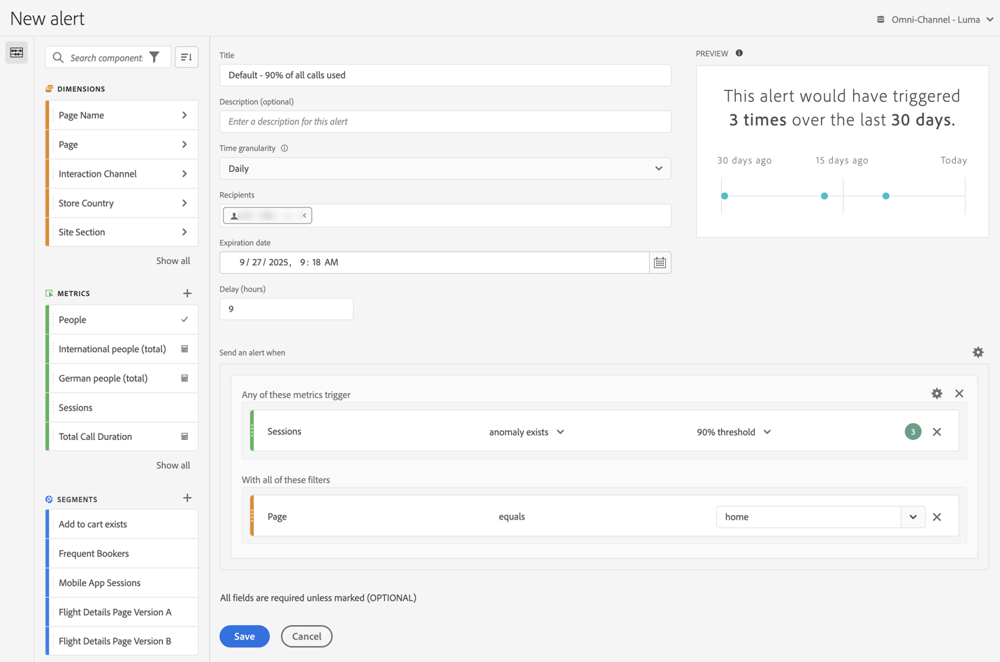

# Erstellen von Warnhinweisen {#create-alerts}

<!-- markdownlint-disable MD034 -->

>[!CONTEXTUALHELP]
>id="components_alerts_timegranularity"
>title="Zeitgranularität"
>abstract="Die Zeitgranularität bestimmt, wie oft der Warnhinweis überprüft wird."

<!-- markdownlint-enable MD034 -->

>[!NOTE]
>
>Die Verwendung von Warnhinweisen mit Anomalieerkennung (auch als _intelligente Warnhinweise_ bezeichnet) ist nur für Organisationen mit einem Customer Journey Analytics Prime- oder Ultimate-Paket verfügbar.

Warnhinweise in Customer Journey Analytics ermöglichen es Ihnen, sich über geänderte Prozentsätze oder bestimmte Datenpunkte benachrichtigen zu lassen. Je nach Customer Journey Analytics-Paket können Sie auch Warnhinweise verwenden, die basierend auf Schwellenwerten für Anomalien ausgelöst werden.

Ausführlichere Informationen zu Warnhinweisen finden Sie unter [Warnhinweise – Überblick](/help/components/c-intelligent-alerts/intelligent-alerts.md).

So erstellen Sie einen Warnhinweis:

<!-- Note that there are difference in how alerts are created in CJA vs AA. In AA you can create alerts from the Workspace menu and using a shortcut; these are not possible in CJA... -->

1. Wählen Sie in Customer Journey Analytics **[!UICONTROL Komponenten]** > **[!UICONTROL Warnhinweise]** aus. Wählen Sie im [Warnhinweis-Manager](alert-manager.md) die Option  **[!UICONTROL Hinzufügen]** aus, um einen neuen Warnhinweis zu erstellen, oder wählen Sie einen der aufgelisteten Warnhinweise aus, um einen vorhandenen Warnhinweis zu ändern.

1. Wählen Sie in Analysis Workspace ein oder mehrere Zeilenelemente in einer Freiformtabelle aus und wählen Sie **[!UICONTROL Warnhinweis aus Auswahl erstellen]** aus dem Kontextmenü aus. Durch diese Aktion wird die Warnhinweiserstellung sofort vorab ausgefüllt, um einen Warnhinweis mit den richtigen Metriken und Segmenten zu erstellen.

Die Benutzeroberfläche des [Warnhinweis-Generators](#alert-builder) wird angezeigt.

## Warnhinweis-Generator

Die Benutzeroberfläche der Warnhinweiserstellung ist mit der Benutzeroberfläche vertraut, die Sie beim Erstellen von Segmenten oder berechneten Metriken in Customer Journey Analytics verwenden:

Geben Sie die folgenden Details im Warnhinweis-Generator für einen Warnhinweis an:

| Element | Beschreibung |
|---------|----------|
| **[!UICONTROL Titel]** | Geben Sie einen Namen für den Warnhinweis an. Der Name des Warnhinweises kann den Namen des Berichts oder den Schwellenwert für die Metriken enthalten. |
| **[!UICONTROL Beschreibung (optional)]** | Geben Sie eine Beschreibung für den Warnhinweis an. |
| **[!UICONTROL Zeitgranularität]** | Wählen Sie aus, wie oft die Metrik überprüft werden soll: täglich, wöchentlich oder monatlich.
<b>Hinweis</b>: Bei Datenansichten mit einem [benutzerdefinierten Kalender](/help/data-views/create-dataview.md#calendar) wird die monatliche Granularität in der Warnhinweiserstellung nicht unterstützt.<!--true?-->
 |
| **[!UICONTROL Empfänger]** | Geben Sie an, wo der Warnhinweis hingeschickt werden soll. Ein Warnhinweis kann an einen Analytics-Benutzer, eine Analytics-Gruppe, eine unformatierte E-Mail-Adresse oder an eine Telefonnummer gesendet werden.
<b>Wichtig:</b> Die Telefonnummer muss über ein vorangestelltes `+` und eine [Landesvorwahl](https://countrycode.org/) verfügen.

Die E-Mail, die ein Benutzer nach einem Warnhinweis erhält:

 |
| **[!UICONTROL Ablaufdatum]** | Legen Sie Datum und Uhrzeit fest, zu denen der Warnhinweis ablaufen soll. |
| **[!UICONTROL Verzögerung]** | Die Zeit, die erforderlich ist, bevor Daten vollständig sind und für die Berichterstellung in Customer Journey Analytics zur Verfügung stehen, variiert je nach Organisation und liegt in der Regel 3 bis 9 Stunden nach der Datenereigniszeit. Damit Warnhinweise genau sind, müssen Ereignisdaten für einen bestimmten Ereignisbereich vollständig sein. Das bedeutet, dass Adobe für den angegebenen Ereignisbereich keine Ereignisdaten mehr erhält.
Um diese Verzögerung bei der Aufnahmezeit zu berücksichtigen, haben Warnhinweise standardmäßig eine Verzögerung von 9 Stunden, bevor sie gesendet werden.

Sie können die Standardverzögerung von 9 Stunden auf einen Wert zwischen 0 und 24 Stunden anpassen. Wenn Sie die Verzögerung jedoch auf weniger als 9 Stunden verkürzen, kann dies bedeuten, dass für Berichte unvollständige Daten vorliegen, was zu ungenauen Warnhinweisinformationen führt.

Beachten Sie beim Verkürzen der Verzögerungszeit Folgendes:
<ul><li>**Datenverfügbarkeit versus Datenvollständigkeit verstehen**: Batch-Daten werden erst nach einem Zeitraum von 3 bis 9 Stunden in einen Experience Platform-Datensatz aufgenommen. Damit Warnhinweise korrekt sind, muss die Datenaufnahme vollständig sein, wobei alle Batch-Daten im Datensatz verfügbar sein müssen.</li><li>**Bestimmen Sie, wie lange es dauert, bis Ihre Daten vollständig und im Datensatz verfügbar sind**: Die Datenaufnahmezeiten variieren je nach Organisation. Stellen Sie sicher, dass die von Ihnen gewählte Verzögerungszeit für die Bereitstellung von Warnhinweisen genauso lang oder kürzer ist als die Zeit, die benötigt wird, bis die Batch-Daten im Platform-Datensatz verfügbar sind<!--add link? -->.</li>
**Tipp:** Die genaueste Methode, um zu ermitteln, wie viel Zeit erforderlich ist, damit alle Batch-Daten vollständig und in den Experience Platform-Datensatz aufgenommen werden, besteht darin, die Dateningenieure in Ihrem Unternehmen zu konsultieren.

Alternativ können Sie sich einen allgemeinen Überblick darüber verschaffen, wie lange es dauert, bis der Batch-Versand in Ihrer Organisation im Platform-Datensatz verfügbar ist. Erstellen Sie die folgende Freiformtabelle in Analysis Workspace:
<ol><li>Fügen Sie in einer Freiformtabelle in Analysis Workspace eine Metrik [!UICONTROL **Ereignisse**] und eine Dimension [!UICONTROL **Tag**] hinzu.</li><li>Schlüsseln Sie die Dimension [!UICONTROL **Tag**] mithilfe einer Dimension [!UICONTROL **Stunden**] auf.
Stunden ohne Daten werden mit dem Wert „0“ angezeigt.
</li></ol><li>**Berücksichtigen Sie mögliche Fehler in Ihren Berechnungen**: Wenn Sie die standardmäßige Verzögerungszeit verringern, konfigurieren Sie sie so, dass die Verzögerung mindestens eine Stunde länger ist als die von Ihrer Organisation für eine vollständige Datenaufnahme benötigte Zeit. Wenn es beispielsweise eine Verzögerung von 3 Stunden gibt, bevor Ihre Datenaufnahme abgeschlossen ist, sollten Sie die Verzögerung auf 4 Stunden festlegen.</li></ul>
Weitere Informationen finden Sie unter [Unterschiedliche Datenaufnahmezeiten in Customer Journey Analytics](/help/components/c-intelligent-alerts/alerts-feature-comparison.md#data-ingestion-times-vary-in-customer-journey-analytics) im Artikel [Warnhinweise – Funktionsvergleich: Customer Journey Analytics und Adobe Analytics](/help/components/c-intelligent-alerts/alerts-feature-comparison.md). |
| **[!UICONTROL Einen Warnhinweis senden, wenn]** | [!UICONTROL **Trigger einer dieser Metriken**]: <ol><li>Ziehen Sie Metriken (einschließlich berechneter Metriken) per Drag-and-Drop in den entsprechenden Bereich, um Trigger für den Warnhinweis zu erstellen.
Eine *Inkompatible Komponenten*-Meldung wird angezeigt, wenn nicht alle Metriken, Dimensionen oder Segmente des Warnhinweises mit der aktuell ausgewählten Report Suite kompatibel sind.

Bestimmen Sie den Schwellenwert (für eine Anomalie), den die Metrik überschreiten muss, oder den Wert (im Fall von Über-, Unter-, Gleich- oder Prozentänderung), der verwendet werden soll, bevor ein Warnhinweis festgelegt wird.</li><li>Wählen Sie eine der folgenden Bedingungen aus:<ul><li>Anomalie vorhanden</li><li>Anomalie höher als erwartet</li><li>Anomalie niedriger als erwartet</li><li>ist größer oder gleich</li><li>ist kleiner oder gleich</li><li>Änderungen von</li></ul></li><li>Wählen Sie einen Schwellenwert aus oder geben Sie einen Wert ein.</li></ol>[!UICONTROL **Mit allen diesen Filtern**]: Ziehen Sie Segmente oder Dimensionen per Drag-and-Drop, um dem Warnhinweis Filter hinzuzufügen. Wenn Sie zum Beispiel ein Segment vom Typ *Nur Mobilgeräte* hinzufügen, würde die Regel nur für Mobilgeräte ausgelöst werden. Mit einer AND-Anweisung können Sie zusätzliche Filter hinzufügen. Per Klick auf das Zahnrad-Symbol können Sie AND- oder OR-Regeln hinzufügen.

Beispiele finden Sie unter [Warnhinweise – Anwendungsfälle](alerts-use-cases.md).
 |
| **[!UICONTROL Vorschau]** | Die interaktive Warnhinweisvorschau zeigt Ihnen basierend auf Daten aus der Vergangenheit, wie oft ein Warnhinweis in etwa ausgelöst wird.
Beispiel: Wenn Sie die Zeitgranularität auf „Stündlich“ festlegen, kann Ihnen die Vorschau verraten, dass der Warnhinweis zu einer bestimmten Metrik während der letzten 30 oder 31 Tage x-mal ausgelöst worden wäre.

Wenn Sie der Ansicht sind, dass Warnhinweise zu oft ausgelöst werden, können Sie den Schwellenwert unter [Warnhinweise verwalten](/help/components/c-intelligent-alerts/alert-manager.md) anpassen.

{width="50%"}
 |
