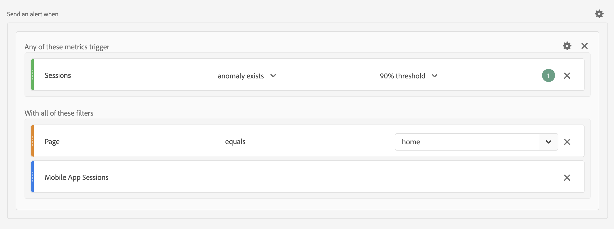

# Warnhinweise - Anwendungsfälle

Sie können Warnhinweise wie in [Warnhinweise erstellen](/help/components/c-intelligent-alerts/alert-builder.md) beschrieben erstellen.

Die folgenden Abschnitte veranschaulichen Beispielanwendungsfälle, die bei der Erstellung von Warnhinweisen berücksichtigt werden sollten.

## Warnhinweise filtern

Sie können einfache Warnhinweise mithilfe von Filtern erstellen. Definieren Sie beispielsweise einen Warnhinweis zur Anzahl der Sitzungen für Personen, die die Startseite über eine mobile App-Sitzung besuchen.

<!-- 

Update screenshots for better readability.

 -->

## Warnhinweise stapeln

Sie können Warnhinweise zusammenfassen (stapeln), anstatt mehrere Warnhinweise zu erstellen. Durch das Stapeln von Warnhinweisen wird sichergestellt, dass Warnhinweise kombiniert werden und Sie keine separaten Warnhinweise erhalten. Im folgenden Beispiel wird ein Warnhinweis gesendet, wenn eine der Metriktresten ausgelöst wird.

