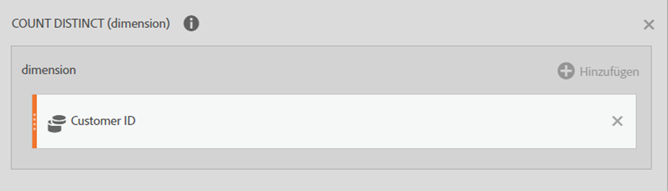
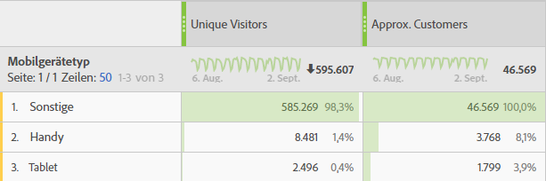

# Referenz – Erweiterte Funktionen

Greifen Sie auf diese Funktionen zu, indem Sie im Komponentenbereich die Liste **[!UICONTROL Alle anzeigen]** unter  **[!UICONTROL Funktionen]** auswählen. Scrollen Sie nach unten, um die Liste der erweiterten Funktionen anzuzeigen.

## Vergleich zwischen Tabellenfunktionen und Zeilenfunktionen

Bei einer Tabellenfunktion ist die Ausgabe für jede Tabellenzeile gleich. Bei einer Zeilenfunktion unterscheidet sich die Ausgabe für jede Tabellenzeile. Gegebenenfalls und relevant wird eine Funktion mit dem Funktionstyp kommentiert.

## Was bedeutet der Parameter include-zeros?

Damit wird angegeben, ob Nullen in die Berechnung einbezogen werden sollen. Manchmal bedeutet Null *nichts*, aber manchmal ist es wichtig.

Wenn Sie beispielsweise eine Umsatzmetrik haben und dann eine Seitenansichtsmetrik zum Bericht hinzufügen, gibt es plötzlich mehr Zeilen für Ihren Umsatz, die alle null sind. Sie möchten wahrscheinlich nicht, dass sich diese zusätzliche Metrik auf [MEAN](cm-functions.md#mean), [MIN](cm-functions.md#row-min), [QUARTILE](cm-functions.md#quartile) und weitere Berechnungen in der Umsatzspalte auswirkt. In diesem Fall würden Sie den Parameter `include-zeros` überprüfen.

Ein alternatives Szenario besteht darin, dass Sie zwei Metriken von Interesse haben und eine Metrik einen höheren Durchschnitt oder ein höheres Minimum aufweist, da einige der Zeilen Nullen sind.  In diesem Fall können Sie festlegen, dass der Parameter keine Nullen enthält.


## Und

 **[!UICONTROL AND(logical_test)]**


Verbindung. &quot;ungleich null&quot;wird als &quot;wahr&quot;betrachtet und &quot;gleich null&quot;wird als &quot;falsch&quot;betrachtet. Die Ausgabe ist entweder 0 (false) oder 1 (true).


| Argument | Beschreibung |
|---|---|
| logical_test | Erfordert mindestens einen Parameter, kann jedoch eine beliebige Anzahl von Parametern annehmen. Jeder Wert oder Ausdruck, der als TRUE oder FALSE ausgewertet werden kann |

## Ungefähres Erfassen bestimmter

 **[!UICONTROL APPROXIMATE COUNT DISTINCT(dimension)]**


Gibt die ungefähre Anzahl von Dimensionselementen für die ausgewählte Dimension zurück.


| Argument | Beschreibung |
|---|---|
| Dimension | Die Dimension, für die Sie die ungefähre Anzahl unterschiedlicher Elemente berechnen möchten |

### Beispiel

Ein häufiges Nutzungsszenario für diese Funktion besteht darin, wenn Sie eine ungefähre Anzahl von Kunden erhalten möchten.


## Arkuskosinus

 **[!UICONTROL ARC COSINE(metric)]**


[!BADGE Zeile ]{type="Neutral"}


| Argument | Beschreibung |
|---|---|
| Metrik | Der Kosinus des gewünschten Winkels von -1 bis 1 |


## Arkussinus

 **[!UICONTROL ARC SINE(metric)]**


[!BADGE Zeile ]{type="Neutral"}


| Argument | Beschreibung |
|---|---|
| Metrik | Der Sinus des gewünschten Winkels von -1 bis 1 |


## Arkustangens

 **[!UICONTROL ARC TANGENT(metric)]**


[!BADGE Zeile ]{type="Neutral"}


| Argument | Beschreibung |
|---|---|
| Metrik | Der Tangens des gewünschten Winkels von -1 bis 1 |


## Cdf-T

 **[!UICONTROL CDF-T(metric, number)]**


Gibt die Wahrscheinlichkeit zurück, dass eine zufällige Variable mit Student-t-Verteilung mit n Freiheitsgraden einen z-Wert unter col aufweist.


| Argument | Beschreibung |
|---|---|
| Metrik | Die Metrik, für die Sie die kumulative Verteilungsfunktion der studentischen t-Verteilung wünschen |
| number | Die Freiheitsgrade für die kumulative Verteilungsfunktion der studentischen t-Verteilung |

### Beispiel

```
CDF-T(-∞, n) = 0
CDF-T(∞, n) = 1
CDF-T(3, 5) ? 0.99865
CDF-T(-2, 7) ? 0.0227501
CDF-T(x, ∞) ? cdf_z(x)
```


## Cdf-Z

 **[!UICONTROL CDF-Z(metric, number)]**


Gibt die Wahrscheinlichkeit zurück, mit der eine zufällige Variable mit einer normalen Verteilung einen z-Wert unter col aufweist.


| Argument | Beschreibung |
|---|---|
| Metrik | Die Metrik, für die die kumulative Verteilungsfunktion der standardmäßigen Normalverteilung verwendet werden soll |

### Beispiele

```
CDF-Z(-∞) = 0
CDF-Z(∞) = 1
CDF-Z(0) = 0.5
CDF-Z(2) ? 0.97725
CDF-Z(-3) ? 0.0013499
```

## Ceiling (Obergrenze)

 **[!UICONTROL CEILING(metric)]**


[!BADGE Zeile ]{type="Neutral"}


| Argument | Beschreibung |
|---|---|
| Metrik | Die Metrik, die gerundet werden soll |


## Konfidenz (untere Grenze)

 **[!UICONTROL CONFIDENCE(Normalisierungs-Container, Erfolgsmetrik, Kontrolle, Signifikanztreshold)]**

Berechnen Sie die beliebig zeitgültige Konfidenz **lower** mithilfe der WASKR-Methode, wie in [Zeitgleichmäßige zentrale Grenztheorie und asymptotische Konfidenzsequenzen](http://arxiv.org/pdf/2103.06476) beschrieben.

Konfidenz ist ein probabilistischer Messwert dafür, wie viele Beweise dafür vorliegen, dass eine bestimmte Variante mit der Kontrollvariante identisch ist. Bei einer höheren Konfidenz deutet weniger darauf hin, dass die Annahme stimmt, dass die Kontroll- und Nicht-Kontrollvariante die gleiche Performance aufweisen.

| Argument | Beschreibung |
| --- | --- |
| normalizing-container | Die Grundlage (Personen, Sitzungen oder Ereignisse), auf der ein Test ausgeführt wird. |
| Erfolgsmetrik | Die Kennzahl(en), die ein(e) Benutzende(r) verwendet, um Varianten zu vergleichen. |
| control | Die Variante, mit der alle anderen Varianten im Experiment verglichen werden. Geben Sie den Namen des Dimensionselements der Kontrollvariante ein. |
| Signifikanzschwellenwert | Der Schwellenwert in dieser Funktion ist auf den Standardwert 95 % eingestellt. |

## Konfidenz (obere Grenze)

 **[!UICONTROL CONFIDENCE(Normalisierungs-Container, Erfolgsmetrik, Kontrolle, Signifikanztreshold)]**

Berechnen Sie die zeitgültige Konfidenz **upper** mithilfe der WASKR-Methode, wie in der [Zeitgleichmäßigen Theorie der mittleren Grenze und asymptotischen Konfidenzsequenzen](http://arxiv.org/pdf/2103.06476) beschrieben.

Konfidenz ist ein probabilistischer Messwert dafür, wie viele Beweise dafür vorliegen, dass eine bestimmte Variante mit der Kontrollvariante identisch ist. Bei einer höheren Konfidenz deutet weniger darauf hin, dass die Annahme stimmt, dass die Kontroll- und Nicht-Kontrollvariante die gleiche Performance aufweisen.

| Argument | Beschreibung |
| --- | --- |
| normalizing-container | Die Grundlage (Personen, Sitzungen oder Ereignisse), auf der ein Test ausgeführt wird. |
| Erfolgsmetrik | Die Kennzahl(en), die ein(e) Benutzende(r) verwendet, um Varianten zu vergleichen. |
| control | Die Variante, mit der alle anderen Varianten im Experiment verglichen werden. Geben Sie den Namen des Dimensionselements der Kontrollvariante ein. |
| Signifikanzschwellenwert | Der Schwellenwert in dieser Funktion ist auf den Standardwert 95 % eingestellt. |


## Kosinus

 **[!UICONTROL COSINE(metric)]**

[!BADGE Zeile ]{type="Neutral"}

| Argument | Beschreibung |
|---|---|
| Metrik | Der Winkel in Radianten, für den Sie den Kosinus benötigen |


## Kubikwurzel

 **[!UICONTROL CUBE ROOT(metric)]**


Gibt die positive Kubikwurzel einer Zahl zurück. Die Kubikwurzel einer Zahl ist der Wert dieser Zahl hoch 1/3.


| Argument | Beschreibung |
|---|---|
| Metrik | Die Metrik, für die Sie den Cube-Stamm berechnen möchten |


## Kumulativ

 **[!UICONTROL CUMULATIVE(number, metric)]**

Gibt die Summe der n letzten Elemente der Spalte x zurück. Wenn n > 0, summieren Sie die letzten n Elemente oder x. Wenn n &lt; 0 ist, werden die vorhergehenden Elemente summiert.

| Argument | Beschreibung |
| --- | --- |
| number | Die letzte n Anzahl von Zeilen, für die die Summe zurückgegeben werden soll. Wenn N &lt;= 0 ist, alle vorherigen Zeilen verwenden. |
| Metrik | Die Metrik, für die Sie die kumulierte Summe erhalten möchten. |

### Beispiele

| Datum | Umsatz | KUMULATIVE(0, Umsatz) | KUMULATIVE(2, Umsatz) |
|------|------:|--------------:|--------------:|
| Mai | 500$ | 500$ | 500$ |
| Juni | 200$ | 700 $ | 700 $ |
| Juli | 400$ | 1100 $ | 600 $ |


## Kumulativ (Durchschnitt)

 **[!UICONTROL KUMULATIVER DURCHSCHNITT(Zahl, Metrik)]**

Gibt den Durchschnitt der n letzten Elemente der Spalte x zurück. Wenn n > 0, summieren Sie die letzten n Elemente oder x. Wenn n &lt; 0 ist, werden die vorhergehenden Elemente summiert.

| Argument | Beschreibung |
| --- | --- |
| number | Die letzte n Anzahl von Zeilen, für die der Durchschnitt zurückgegeben werden soll. Wenn N &lt;= 0 ist, alle vorherigen Zeilen verwenden. |
| Metrik | Die Metrik, für die Sie den kumulativen Durchschnitt ermitteln möchten. |

>[!NOTE]
>
>Diese Funktion funktioniert nicht mit Quotenmetriken wie Umsatz pro Person. Die Funktion berechnet den Durchschnittswert der Raten, anstatt den Umsatz über die letzten N und die Personen über die letzten N zusammenzufassen und sie dann zu teilen. <br/>Verwenden Sie stattdessen [**[!UICONTROL CUMULATIVE(revenue)]**](#cumulative)  [**[!UICONTROL CUMULATIVE(person)]**](#cumulative).
>


## Gleich

 **[!UICONTROL EQUAL()]**


Gleich. Die Ausgabe ist entweder 0 (false) oder 1 (true).


| Argument | Beschreibung |
|---|---|
| metric_X | |
| metric_Y | |

### Beispiel

`Metric 1 = Metric 2`


## Exponentielle Regression: Korrelationskoeffizient

 **[!UICONTROL EXPONENTIAL REGRESSION: CORRELATION COEFFICIENT(metric_X, metric_Y, include_zeros)]**


[!BADGE Tabelle]{type="Neutral"}


| Argument | Beschreibung |
|---|---|
| metric_X | Eine Metrik, die Sie mit metric_Y korrelieren möchten |
| metric_Y | Eine Metrik, die Sie mit metric_X korrelieren möchten |
| include_zeros | Ob Nullwerte in die Berechnungen einbezogen werden sollen |

## Exponentielle Regression: Vorhersage für Y

 **[!UICONTROL EXPONENTIAL REGRESSION: PREDICTED Y(metric_X, metric_Y, include_zeros)]**


[!BADGE Zeile ]{type="Neutral"}


| Argument | Beschreibung |
|---|---|
| metric_X | Eine Metrik, der unabhängiger Datenstatus zugewiesen werden soll. |
| metric_Y | Eine Metrik, der abhängiger Datenstatus zugewiesen werden soll. |
| include_zeros | Ob Nullwerte in die Berechnungen einbezogen werden sollen |


## Exponentielle Regression: Konstante

 **[!UICONTROL EXPONENTIALE REGRESSION: INTERCEPT(metric_X, metric_Y, include_zeros)]**


[!BADGE Tabelle]{type="Neutral"}

| Argument | Beschreibung |
|---|---|
| metric_X | Eine Metrik, die Sie als abhängige Daten festlegen möchten |
| metric_Y | Eine Metrik, die Sie als unabhängige Daten festlegen möchten |
| include_zeros | Ob Nullwerte in die Berechnungen einbezogen werden sollen |


## Exponentielle Regression: Steigung

 **[!UICONTROL EXPONENTIALE REGRESSION: SLOPE(metric_X, metric_Y, include_zeros)]**


[!BADGE Tabelle]{type="Neutral"}


| Argument | Beschreibung |
|---|---|
| metric_X | Eine Metrik, die Sie als abhängige Daten festlegen möchten |
| metric_Y | Eine Metrik, die Sie als unabhängige Daten festlegen möchten |
| include_zeros | Ob Nullwerte in die Berechnungen einbezogen werden sollen |


## Floor

 **[!UICONTROL FLOOR(metric_X, metric_Y, include_zeros)]**

[!BADGE Zeile ]{type="Neutral"}

| Argument | Beschreibung |
|---|---|
| Metrik | Die Metrik, die gerundet werden soll. |


## Größer als

 **[!UICONTROL GRÖSSER THAN()]**


Die Ausgabe ist entweder 0 (false) oder 1 (true).


| Argument | Beschreibung |
|---|---|
| metric_X | |
| metric_Y | |

### Beispiel

`Metric 1 > Metric 2`

## Größer gleich

 **[!UICONTROL GRÖSSER ALS ODER GLEICH()]**


Größer oder gleich. Die Ausgabe ist entweder 0 (false) oder 1 (true).


| Argument | Beschreibung |
|---|---|
| metric_X |  |
| metric_Y |  |

### Beispiel

`Metric 1 >= Metric 2`


## Hyperbelkosinus

 **[!UICONTROL HYPERBOLIC COSINE(metric)]**


[!BADGE Zeile ]{type="Neutral"}


| Argument | Beschreibung |
|---|---|
| Metrik | Der Winkel in Radianten, für den Sie den hyperbolischen Kosinus finden möchten |


## Hyperbelsinus

 **[!UICONTROL HYPERBOLIC SINE(metric)]**


[!BADGE Zeile ]{type="Neutral"}


| Argument | Beschreibung |
|---|---|
| Metrik | Der Winkel in Radianten, für den Sie den Hyperbelsinus finden möchten |


## Hyperbeltangens

 **[!UICONTROL HYPERBOLIC TANGENT(metric)]**


[!BADGE Zeile ]{type="Neutral"}


| Argument | Beschreibung |
|---|---|
| Metrik | Der Winkel in Radianten, für den Sie den hyperbolischen Tangens finden möchten |


## Wenn

 **[!UICONTROL IF(logical_test, value_if_true, value_if_false)]**


[!BADGE Zeile ]{type="Neutral"}


| Argument | Beschreibung |
|---|---|
| logical_test | Erforderlich. Jeder Wert oder Ausdruck, der als TRUE oder FALSE ausgewertet werden kann |
| value_if_true | Der Wert, der ausgegeben werden soll, wenn das Argument des Logiktests also TRUE ausgewertet wird. (Dieses Argument wird automatisch auf 0 gesetzt, wenn es nicht eingesetzt wurde.) |
| value_if_false | Der Wert, der ausgegeben werden soll, wenn das logical_test-Argument als FALSE ausgewertet wird. (Dieses Argument wird automatisch auf 0 gesetzt, wenn es nicht eingesetzt wurde.) |


## Kleiner als

 **[!UICONTROL LESS than()]**


Die Ausgabe ist entweder 0 (false) oder 1 (true).


| Argument | Beschreibung |
|---|---|
| metric_X | |
| metric_Y | |


### Beispiel

`Metric 1 < Metric 2`

## Kleiner gleich

 **[!UICONTROL WENIGER ALS ODER GLEICH()]**

Kleiner oder gleich. Die Ausgabe ist entweder 0 (false) oder 1 (true).


| Argument | Beschreibung |
|---|---|
| metric_X | |
| metric_Y | |

### Beispiel

`Metric 1 <= Metric 2`


## Lineare Regression: Korrelationskoeffizient

 **[!UICONTROL LINEAR REGRESSION: CORRELATION COEFFICIENT(metric_X, metric_Y, include_zeros)]**


[!BADGE Tabelle]{type="Neutral"}


| Argument | Beschreibung |
|---|---|
| metric_X | Eine Metrik, die Sie mit metric_Y korrelieren möchten |
| metric_Y | Eine Metrik, die Sie mit metric_X korrelieren möchten |
| include_zeros | Ob Nullwerte in die Berechnungen einbezogen werden sollen |


## Lineare Regression: Konstante

 **[!UICONTROL LINEAR-REGRESSION: INTERCEPT(metric_X, metric_Y, include_zeros)]**


[!BADGE Tabelle]{type="Neutral"}


| Argument | Beschreibung |
|---|---|
| metric_X | Eine Metrik, die Sie als abhängige Daten festlegen möchten |
| metric_Y | Eine Metrik, die Sie als unabhängige Daten festlegen möchten |
| include_zeros | Ob Nullwerte in die Berechnungen einbezogen werden sollen |


## Lineare Regression: Vorhersage für Y

 **[!UICONTROL LINEAR REGRESSION: PREDICTED Y(metric_X, metric_Y, include_zeros)]**


[!BADGE Zeile ]{type="Neutral"}


| Argument | Beschreibung |
|---|---|
| metric_X | Eine Metrik, die Sie als abhängige Daten festlegen möchten |
| metric_Y | Eine Metrik, die Sie als unabhängige Daten festlegen möchten |
| include_zeros | Ob Nullwerte in die Berechnungen einbezogen werden sollen |


## Lineare Regression: Steigung

 **[!UICONTROL LINEAR-REGRESSION: SLOPE(metric_X, metric_Y, include_zeros)]**


[!BADGE Tabelle]{type="Neutral"}


| Argument | Beschreibung |
|---|---|
| metric_X | Eine Metrik, die Sie als abhängige Daten festlegen möchten |
| metric_Y | Eine Metrik, die Sie als unabhängige Daten festlegen möchten |
| include_zeros | Ob Nullwerte in die Berechnungen einbezogen werden sollen |


## Logarithmus zur Basis 10

 **[!UICONTROL PROTOKOLLBASE 10(Metrik)]**


[!BADGE Zeile ]{type="Neutral"}


| Argument | Beschreibung |
|---|---|
| Metrik | Die positive reale Zahl, für die der Logarithmus zur Basis 10 gewünscht ist |


## Logistische Regression: Korrelationskoeffizient

 **[!UICONTROL PROTOKOLLREGRESSION: CORRELATION COEFFICIENT(metric_X, metric_Y, include_zeros)]**


[!BADGE Tabelle]{type="Neutral"}


| Argument | Beschreibung |
|---|---|
| metric_X | Eine Metrik, die Sie mit metric_Y korrelieren möchten |
| metric_Y | Eine Metrik, die Sie mit metric_X korrelieren möchten |
| include_zeros | Ob Nullwerte in die Berechnungen einbezogen werden sollen |


## Logistische Regression: Konstante

 **[!UICONTROL PROTOKOLLREGRESSION: INTERCEPT(metric_X, metric_Y, include_zeros)]**


[!BADGE Tabelle]{type="Neutral"}


| Argument | Beschreibung |
|---|---|
| metric_X | Eine Metrik, die Sie als abhängige Daten festlegen möchten |
| metric_Y | Eine Metrik, die Sie als unabhängige Daten festlegen möchten |
| include_zeros | Ob Nullwerte in die Berechnungen einbezogen werden sollen |


## Logistische Regression: Vorhersage für Y

 **[!UICONTROL PROTOKOLLREGRESSION: VORHERGESTELLT Y(metric_X, metric_Y, include_zeros)]**


[!BADGE Zeile ]{type="Neutral"}


| Argument | Beschreibung |
|---|---|
| metric_X | Eine Metrik, die Sie als abhängige Daten festlegen möchten |
| metric_Y | Eine Metrik, die Sie als unabhängige Daten festlegen möchten |
| include_zeros | Ob Nullwerte in die Berechnungen einbezogen werden sollen |


## Logistische Regression: Steigung

 **[!UICONTROL PROTOKOLLREGRESSION: SLOPE(metric_X, metric_Y, include_zeros)]**


[!BADGE Tabelle]{type="Neutral"}


| Argument | Beschreibung |
|---|---|
| metric_X | Eine Metrik, die Sie als abhängige Daten festlegen möchten |
| metric_Y | Eine Metrik, die Sie als unabhängige Daten festlegen möchten |
| include_zeros | Ob Nullwerte in die Berechnungen einbezogen werden sollen |


## Natürlicher Logarithmus

 **[!UICONTROL NATÜRLICHES PROTOKOLL(Metrik)]**


Gibt den natürlichen Logarithmus einer Zahl zurück. Natürliche Logarithmen basieren auf der Konstante e (2,71828182845904). LN ist die Umkehrung der Exponentialfunktion.


| Argument | Beschreibung |
|---|---|
| Metrik | Die positive reale Zahl, für die Sie den natürlichen Logarithmus benötigen |


## Nicht

 **[!UICONTROL NOT(logical)]**


Negation als boolescher Wert. Die Ausgabe ist entweder 0 (false) oder 1 (true).


| Argument | Beschreibung |
|---|---|
| logisch | Erforderlich. Ein Wert oder Ausdruck, der als TRUE oder FALSE ausgewertet werden kann |


## Ungleich

 **[!UICONTROL NOT EQUAL()]**


Nicht gleich. Die Ausgabe ist entweder 0 (false) oder 1 (true).


| Argument | Beschreibung |
|---|---|
| metric_X | |
| metric_Y | |

### Beispiel

`Metric 1 != Metric 2`


## Oder

 **[!UICONTROL OR(logical_test)]**


[!BADGE Zeile ]{type="Neutral"}


| Argument | Beschreibung |
|---|---|
| logical_test | Erfordert mindestens einen Parameter, kann jedoch eine beliebige Anzahl von Parametern annehmen. Jeder Wert oder Ausdruck, der als TRUE oder FALSE ausgewertet werden kann |


>[!NOTE]
>
>0 (null) bedeutet „Falsch“ und jeder andere Wert „Wahr“.


## Pi

 **[!UICONTROL PI()]**

Gibt Pi zurück: 3.14159...


## Potenzregression: Korrelationskoeffizient

 **[!UICONTROL POWER-REGRESSION: CORRELATION COEFFICIENT(metric_X, metric_Y, include_zeros)]**


[!BADGE Tabelle]{type="Neutral"}


| Argument | Beschreibung |
|---|---|
| metric_X | Eine Metrik, die Sie mit metric_Y korrelieren möchten |
| metric_Y | Eine Metrik, die Sie mit metric_X korrelieren möchten |
| include_zeros | Ob Nullwerte in die Berechnungen einbezogen werden sollen |


## Potenzregression: Konstante

 **[!UICONTROL POWER-REGRESSION: INTERCEPT(metric_X, metric_Y, include_zeros)]**


[!BADGE Tabelle]{type="Neutral"}


| Argument | Beschreibung |
|---|---|
| metric_X | Eine Metrik, die Sie als abhängige Daten festlegen möchten |
| metric_Y | Eine Metrik, die Sie als unabhängige Daten festlegen möchten |
| include_zeros | Ob Nullwerte in die Berechnungen einbezogen werden sollen |


## Potenzregression: Vorhersage für Y

 **[!UICONTROL POWER-REGRESSION: PREDICTED Y(metric_X, metric_Y, include_zeros)]**


[!BADGE Zeile ]{type="Neutral"}


| Argument | Beschreibung |
|---|---|
| metric_X | Eine Metrik, die Sie als abhängige Daten festlegen möchten |
| metric_Y | Eine Metrik, die Sie als unabhängige Daten festlegen möchten |
| include_zeros | Ob Nullwerte in die Berechnungen einbezogen werden sollen |


## Potenzregression: Steigung

 **[!UICONTROL POWER-REGRESSION: SLOPE(metric_X, metric_Y, include_zeros)]**


[!BADGE Tabelle]{type="Neutral"}


| Argument | Beschreibung |
|---|---|
| metric_X | Eine Metrik, die Sie als abhängige Daten festlegen möchten |
| metric_Y | Eine Metrik, die Sie als unabhängige Daten festlegen möchten |
| include_zeros | Ob Nullwerte in die Berechnungen einbezogen werden sollen |


## Quadratische Regression: Korrelationskoeffizient

 **[!UICONTROL QUADRATISCHE REGRESSION: CORRELATION COEFFICIENT(metric_X, metric_Y, include_zeros)]**


[!BADGE Tabelle]{type="Neutral"}


| Argument | Beschreibung |
|---|---|
| metric_X | Eine Metrik, die Sie mit metric_Y korrelieren möchten |
| metric_Y | Eine Metrik, die Sie mit metric_X korrelieren möchten |
| include_zeros | Ob Nullwerte in die Berechnungen einbezogen werden sollen |

## Quadratische Regression: Konstante

 **[!UICONTROL QUADRATISCHE REGRESSION: INTERCEPT(metric_X, metric_Y, include_zeros)]**


[!BADGE Tabelle]{type="Neutral"}


| Argument | Beschreibung |
|---|---|
| metric_X | Eine Metrik, die Sie als abhängige Daten festlegen möchten |
| metric_Y | Eine Metrik, die Sie als unabhängige Daten festlegen möchten |
| include_zeros | Ob Nullwerte in die Berechnungen einbezogen werden sollen |


## Quadratische Regression: Vorhersage für Y

 **[!UICONTROL QUADRATIC REGRESSION: PREDICTED Y(metric_X, metric_Y, include_zeros)]**


[!BADGE Zeile ]{type="Neutral"}


| Argument | Beschreibung |
|---|---|
| metric_X | Eine Metrik, die Sie als abhängige Daten festlegen möchten |
| metric_Y | Eine Metrik, die Sie als unabhängige Daten festlegen möchten |
| include_zeros | Ob Nullwerte in die Berechnungen einbezogen werden sollen |

## Quadratische Regression: Steigung

 **[!UICONTROL QUADRATISCHE REGRESSION: SLOPE(metric_X, metric_Y, include_zeros)]**


[!BADGE Tabelle]{type="Neutral"}


| Argument | Beschreibung |
|---|---|
| metric_X | Eine Metrik, die Sie als abhängige Daten festlegen möchten |
| metric_Y | Eine Metrik, die Sie als unabhängige Daten festlegen möchten |
| include_zeros | Ob Nullwerte in die Berechnungen einbezogen werden sollen |


## Reziproke Regression: Korrelationskoeffizient

 **[!UICONTROL RECIPROCAL REGRESSION: CORRELATION COEFFICIENT(metric_X, metric_Y, include_zeros)]**


[!BADGE Tabelle]{type="Neutral"}


| Argument | Beschreibung |
|---|---|
| metric_X | Eine Metrik, die Sie mit metric_Y korrelieren möchten |
| metric_Y | Eine Metrik, die Sie mit metric_X korrelieren möchten |
| include_zeros | Ob Nullwerte in die Berechnungen einbezogen werden sollen |


## Reziproke Regression: Konstante

 **[!UICONTROL RECIPROCAL REGRESSION: INTERCEPT(metric_X, metric_Y, include_zeros)]**


[!BADGE Tabelle]{type="Neutral"}


| Argument | Beschreibung |
|---|---|
| metric_X | Eine Metrik, die Sie als abhängige Daten festlegen möchten |
| metric_Y | Eine Metrik, die Sie als unabhängige Daten festlegen möchten |
| include_zeros | Ob Nullwerte in die Berechnungen einbezogen werden sollen |


## Reziproke Regression: Vorhersage für Y

 **[!UICONTROL RECIPROCAL REGRESSION: PREDICTED Y(metric_X, metric_Y, include_zeros)]**


[!BADGE Zeile ]{type="Neutral"}


| Argument | Beschreibung |
|---|---|
| metric_X | Eine Metrik, die Sie als abhängige Daten festlegen möchten |
| metric_Y | Eine Metrik, die Sie als unabhängige Daten festlegen möchten |
| include_zeros | Ob Nullwerte in die Berechnungen einbezogen werden sollen |


## Reziproke Regression: Steigung

 **[!UICONTROL RECIPROCAL REGRESSION: SLOPE(metric_X, metric_Y, include_zeros)]**


[!BADGE Tabelle]{type="Neutral"}


| Argument | Beschreibung |
|---|---|
| metric_X | Eine Metrik, die Sie als abhängige Daten festlegen möchten |
| metric_Y | Eine Metrik, die Sie als unabhängige Daten festlegen möchten |
| include_zeros | Ob Nullwerte in die Berechnungen einbezogen werden sollen |


## Sinus

 **[!UICONTROL SINE(metric)]**


[!BADGE Zeile ]{type="Neutral"}


| Argument | Beschreibung |
|---|---|
| Metrik | Der Winkel in Radianten, für den Sie den Sinus ermitteln möchten |


## t-Transformation

 **[!UICONTROL T-SCORE(metric, include_zeros)]**


Die Abweichung vom [MEAN](cm-functions.md#mean), geteilt durch die Standardabweichung. Alias für [Z-Score](#z-score).


| Argument | Beschreibung |
|---|---|
| Metrik | Die Metrik, für die Sie die T-Punktzahl wünschen |
| include_zeros | Ob Nullwerte in die Berechnungen einbezogen werden sollen |


## t-Test

 **[!UICONTROL T-TEST(metric, grads, tails)]**


Führt einen m-seitigen t-Test mit einem t-Wert von x und n Freiheitsgraden durch.


| Argument | Beschreibung |
|---|---|
| Metrik | Die Metrik, für die Sie einen T-Test durchführen möchten |
| degrees | Die Freiheitsgrade |
| Tails | Die Länge des für die T-Prüfung zu verwendenden Schwanzes |

### Details

Die Signatur lautet T-TEST (Metrik, Grad, Zahl). Darunter wird einfach ***m***  **[[!DNL CDF-T(-ABSOLUTE VALUE(tails), degrees)]](#cdf-t)** aufgerufen. Diese Funktion ähnelt der Funktion **[Z-TEST](#z-test)** , die ***m***  **[[!DNL CDF-Z(-ABSOLUTE VALUE(tails))]](#cdf-z)** ausführt.

- ***m*** ist die Anzahl der Seiten.
- ***n*** ist der Freiheitsgrad und sollte eine konstante Zahl für den gesamten Bericht sein, d. h. nicht auf Zeilenbasis geändert werden.
- ***x*** ist die T-Test-Statistik. Hierbei handelt es sich häufig um eine Formel (z. B. **[Z-SCORE](#z-score)**), die auf einer Metrik basiert und für jede Zeile ausgewertet wird.

Der Rückgabewert ist die Wahrscheinlichkeit, die Teststatistik x zu erhalten, bei gegebenen Freiheitsgraden und der Anzahl an Seiten.

**Beispiele:**

1. Verwenden Sie ihn zum Auffinden von Ausreißern:

   ```
   T-TEST(Z-SCORE(bouncerate), ROW COUNT - 1, 2)
   ```

1. Kombinieren Sie ihn mit **[IF](#if)** , um sehr hohe oder niedrige Absprungraten zu ignorieren und Sitzungen für alles andere zu zählen:

   ```
   IF(T-TEST(Z-SCORE(bouncerate), ROW COUNT - 1, 2) < 0.01, 0, sessions )
   ```


## Tangens

 **[!UICONTROL TANGENT(metric)]**


Gibt den Tangens des angegebenen Winkels zurück. Wenn der Winkel in Grad vorliegt, multiplizieren Sie ihn mit PI( )/180.


| Argument | Beschreibung |
|---|---|
| Metrik | Der Winkel in Radianten, für den Sie den Tangens wünschen |


## z-Transformation

 **[!UICONTROL Z-SCORE(metric, include_zeros)]**


[!BADGE Zeile ]{type="Neutral"}


| Argument | Beschreibung |
|---|---|
| Metrik | Die Metrik, für die Sie die z-Punktzahl wünschen |
| include_zeros | Ob Nullwerte in die Berechnungen einbezogen werden sollen |

Ein z-Wert von 0 (null) bedeutet, dass der Wert mit dem arithmetischen Mittel übereinstimmt. Eine z-Transformation kann positiv oder negativ sein, abhängig davon, ob sie über oder unter dem arithmetischen Mittel liegt und um wie viele Standardabweichungen es sich handelt.

Die Gleichung für z-Transformation lautet:


Wobei ***[!DNL x]*** der Rohwert ist, ***[!DNL μ]*** das arithmetische Mittel der Population und ***[!DNL σ]*** die Standardabweichung der Population.

>[!NOTE]
>
>***[!DNL μ]*** (Mu) und ***[!DNL σ]*** (Sigma) werden automatisch aus der Metrik berechnet.


## z-Test

 **[!UICONTROL Z-TEST(metric_tails)]**


Führt einen n-seitigen z-Test mit einem z-Wert von x durch.


| Argument | Beschreibung |
|---|---|
| Metrik | Die Metrik, für die Sie einen Z-Test durchführen möchten |
| Tails | Die Länge des Schwanzes, der für die Durchführung des Z-Tests verwendet werden soll |

>[!NOTE]
>
>Dabei wird von einer Normalverteilung der Werte ausgegangen.


<!--


## AND

Returns the value of its argument. Use NOT to make sure that a value is not equal to one particular value.

>[!NOTE]
>
>0 (zero) means False, and any other value is True.

```
AND(logical_test1,[logical_test2],...)
```

|  Argument  | Description  |
|---|---|
|  *logical_test1* | Required. Any value or expression that can be evaluated to TRUE or FALSE.  |
|  *logical_test2* | Optional. Additional conditions that you want to evaluate as TRUE or FALSE  |

## Approximate Count Distinct (dimension)

Returns the approximated distinct count of dimension items for the selected dimension. The function uses the HyperLogLog (HLL) method of approximating distinct counts.&nbsp; It is configured to guarantee the value is within 5% of the actual value 95% of the time.

```
Approximate Count Distinct (dimension)
```

|  Argument  |  |
|---|---|
|  *dimension* | The dimension for which you want the approximate distinct item count.  |

### Example Use Case

Approximate Count Distinct (customer ID eVar) is a common use case for this function.

Definition for a new 'Approximate Customers' calculated metric:



This is how the "Approximate Customers" metric could be used in reporting:



### Comparing Count Functions

Approximate Count Distinct() is an improvement over Count() and RowCount() functions because the metric created can be used in any dimensional report to render an approximated count of items for a separate dimension. For example, a count of customer IDs used in a Mobile Device Type report.

This function will be marginally less accurate than Count() and RowCount() because it uses the HLL method, whereas Count() and RowCount() are exact counts.

## Arc Cosine (Row)

Returns the arccosine, or inverse of the cosine, of a metric. The arccosine is the angle whose cosine is number. The returned angle is given in radians in the range 0 (zero) to pi. If you want to convert the result from radians to degrees, multiply it by 180/PI( ).

```
ACOS(metric)
```

|  Argument  |  |
|---|---|
|  *metric* | The cosine of the angle you want from -1 to 1. |

## Arc Sine (Row)

Returns the arcsine, or inverse sine, of a number. The arcsine is the angle whose sine is number. The returned angle is given in radians in the range -pi/2 to pi/2. To express the arcsine in degrees, multiply the result by 180/PI( ).

```
ASIN(metric)
```

|  Argument  |  |
|---|---|
|  *metric* | The cosine of the angle you want from -1 to 1. |

## Arc Tangent (Row)

Returns the arctangent, or inverse tangent, of a number. The arctangent is the angle whose tangent is number. The returned angle is given in radians in the range -pi/2 to pi/2. To express the arctangent in degrees, multiply the result by 180/PI( ).

```
ATAN(metric)
```

|  Argument  |  |
|---|---|
|  *metric* | The cosine of the angle you want from -1 to 1. |

## Exponential Regression: Predicted Y (Row)

Calculates the predicted y-values (metric_Y), given the known x-values (metric_X) using the "least squares" method for calculating the line of best fit based on .

```
ESTIMATE.EXP(metric_X, metric_Y)
```

|  Argument  | Description  |
|---|---|
|  *metric_X* | A metric that you would like to designate as the dependent data.  |
|  *metric_Y* | A metric that you would like to designate as the independent data.  |

## Cdf-T

Returns the percentage of values in a student's t-distribution with n degrees of freedom that have a z-score less than x.

```
cdf_t( -∞, n ) = 0
cdf_t(  ∞, n ) = 1
cdf_t( 3, 5 ) ? 0.99865
cdf_t( -2, 7 ) ? 0.0227501
cdf_t( x, ∞ ) ? cdf_z( x )
```

## Cdf-Z

Returns the percentage of values in a normal distribution that have a z-score less than x.

```
cdf_z( -∞ ) = 0
cdf_z( ∞ ) = 1
cdf_z( 0 ) = 0.5
cdf_z( 2 ) ? 0.97725
cdf_z( -3 ) ? 0.0013499

```

## Exponential Regression: Intercept (Table)

Returns the intercept, *b*, between two metric columns ( *metric_X* and *metric_Y*) for

```
INTERCEPT.EXP(metric_X, metric_Y)
```

|  Argument  | Description  |
|---|---|
|  *metric_X* | A metric that you would like to designate as the dependent data.  |
|  *metric_Y* | A metric that you would like to designate as the independent data.  |

## Exponential Regression: Slope (Table)

Returns the slope, *a*, between two metric columns ( *metric_X* and *metric_Y*) for .

```
SLOPE.EXP(metric_X, metric_Y)
```

|  Argument  | Description  |
|---|---|
|  *metric_X* | A metric that you would like to designate as the dependent data.  |
|  *metric_Y* | A metric that you would like to designate as the independent data.  |

## Floor (Row)

Returns the largest integer not greater than a given value. For example, if you want to avoid reporting currency decimals for revenue and a product has $569.34, use the formula FLOOR( *Revenue*) to round revenue down to the nearest dollar, or $569.

```
FLOOR(metric)
```

|  Argument  | Description  |
|---|---|
|  *metric* | The metric you want to round.  |

## Greater Than

Returns items whose numeric count is greater than the value entered.

## Greater Than or Equal

Returns items whose numeric count is greater than or equal to the value entered.

## Hyperbolic Cosine (Row)

Returns the hyperbolic cosine of a number.

```
COSH(metric)
```

|  Argument  | Description  |
|---|---|
|  *metric* | The angle in radians for which you want to find the hyperbolic cosine.  |

## Hyperbolic Sine (Row)

Returns the hyperbolic sine of a number.

```
SINH(metric)
```

|  Argument  | Description  |
|---|---|
|  *metric* | The angle in radians for which you want to find the hyperbolic sine.  |

## Hyperbolic Tangent (Row)

Returns the hyperbolic tangent of a number.

```
TANH(metric)
```

|  Argument  | Description  |
|---|---|
|  *metric* | The angle in radians for which you want to find the hyperbolic tanget.  |

## IF (Row)

The IF function returns one value if a condition you specify evaluates to TRUE, and another value if that condition evaluates to FALSE.

```
IF(logical_test, [value_if_true], [value_if_false])
```

|  Argument  | Description  |
|---|---|
|  *logical_test* | Required. Any value or expression that can be evaluated to TRUE or FALSE.  |
|  *[value_if_true]* | The value that you want to be returned if the *logical_test* argument evaluates to TRUE. (This argument defaults to 0 if not included.)  |
|  *[value_if_false]* | The value that you want to be returned if the *logical_test* argument evaluates to FALSE. (This argument defaults to 0 if not included.)  |

## Less Than

Returns items whose numeric count is less than the value entered.

## Less Than or Equal

Returns items whose numeric count is less than or equal to the value entered.

## Lift

Returns the Lift a particular variant had in conversions over a control variant. It is the difference in performance between a given variant and the baseline, divided by the performance of the baseline, expressed as a percentage. 

```
fx Lift (normalizing-container, success-metric, control)
```

| Argument | Description |
| --- | --- |
| Normalizing Container | The basis (People, Sessions, or Events) on which a test will be run. |
| Success Metric | The metric or metrics that a user is comparing variants with. |
| Control | The variant that all other variants in the experiment are being compared with. Enter the name of the control variant dimension item. |

{style="table-layout:auto"}

## Linear regression_ Correlation Coefficient

Y = a X + b. Returns the correlation coefficient

## Linear regression_ Intercept

Y = a X + b. Returns b.

## Linear regression_ Predicted Y

Y = a X + b. Returns Y.

## Linear regression_ Slope

Y = a X + b. Returns a.

## Log Base 10 (Row)

Returns the base-10 logarithm of a number.

```
LOG10(metric)
```

|  Argument  | Description  |
|---|---|
|  *metric* | The positive real number for which you want the base-10 logarithm.  |

## Log regression: Correlation coefficient (Table)

Returns the correlation coefficient, *r*, between two metric columns (*metric_X* and *metric_Y*) for the regression equation [!DNL Y = a ln(X) + b]. It is calculated using the CORREL equation.

```
CORREL.LOG(metric_X,metric_Y)
```

|  Argument  | Description  |
|---|---|
|  *metric_X* | A metric that you would like to correlate with *metric_Y*.  |
|  *metric_Y* | A metric that you would like to correlate with *metric_X*.  |

## Log regression: Intercept (Table)

Returns the intercept *b* as the least squares regression between two metric columns (*metric_X* and *metric_Y*) for the regression equation [!DNL Y = a ln(X) + b]. It is calculated using the INTERCEPT equation.

```
INTERCEPT.LOG(metric_X, metric_Y)
```

|  Argument  | Description  |
|---|---|
|  *metric_X* | A metric that you would like to designate as the dependent data.  |
|  *metric_Y* | A metric that you would like to designate as the independent data.  |

## Log Regression: Predicted Y (Row)

Calculates the predicted [!DNL y] values (metric_Y), given the known [!DNL x] values (metric_X) using the "least squares" method for calculating the line of best fit based on [!DNL Y = a ln(X) + b]. It is calculated using the ESTIMATE equation.

In regression analysis, this function calculates the predicted [!DNL y] values (*metric_Y*), given the known [!DNL x] values (*metric_X*) using the logarithm for calculating the line of best fit for the regression equation [!DNL Y = a ln(X) + b]. The [!DNL a] values correspond to each x value, and [!DNL b] is a constant value.

```
ESTIMATE.LOG(metric_X, metric_Y)
```

|  Argument  | Description  |
|---|---|
|  *metric_X* | A metric that you would like to designate as the dependent data.  |
|  *metric_Y* | A metric that you would like to designate as the independent data.  |

## Log regression: Slope (Table)

Returns the slope, *a*, between two metric columns (*metric_X* and *metric_Y*) for the regression equation [!DNL Y = a ln(X) + b]. It is calculated using the SLOPE equation.

```
SLOPE.LOG(metric_A, metric_B)
```

|  Argument  | Description  |
|---|---|
|  *metric_A* | A metric that you would like to designate as the dependent data.  |
|  *metric_B* | A metric that you would like to designate as the independent data.  |

## Natural Log

Returns the natural logarithm of a number. Natural logarithms are based on the constant *e* (2.71828182845904). LN is the inverse of the EXP function.

```
LN(metric)
```

|  Argument  | Description  |
|---|---|
|  *metric* | The positive real number for which you want the natural logarithm.  |

## NOT

Returns 1 if the number is 0 or returns 0 if another number.

```
NOT(logical)
```

|  Argument  | Description  |
|---|---|
|  *logical* | Required. A value or expression that can be evaluated to TRUE or FALSE.  |

Using NOT requires knowing if the expressions (<, >, =, <> , etc.) return 0 or 1 values.

## Not equal

Returns all items that do not contain the exact match of the value entered.

## Or (Row)

Returns TRUE if any argument is TRUE, or returns FALSE if all arguments are FALSE.

>[!NOTE]
>
>0 (zero) means False, and any other value is True.

```
OR(logical_test1,[logical_test2],...)
```

|  Argument  | Description  |
|---|---|
|  *logical_test1* | Required. Any value or expression that can be evaluated to TRUE or FALSE.  |
|  *logical_test2* | Optional. Additional conditions that you want to evaluate as TRUE or FALSE  |

## Pi

Returns the constant PI, 3.14159265358979, accurate to 15 digits.

```
PI()
```

The [!DNL PI]function has no arguments.

## Power regression: Correlation coefficient (Table)

Returns the correlation coefficient, *r*, between two metric columns (*metric_X* and *metric_Y*) for [!DNL Y = b*X].

```
CORREL.POWER(metric_X, metric_Y)
```

|  Argument  | Description  |
|---|---|
|  *metric_X* | A metric that you would like to correlate with *metric_Y*.  |
|  *metric_Y* | A metric that you would like to correlate with *metric_X*.  |

## Power regression: Intercept (Table)

Returns the intercept, *b*, between two metric columns (*metric_X* and *metric_Y*) for [!DNL Y = b*X].

```
 INTERCEPT.POWER(metric_X, metric_Y)
```

|  Argument  | Description  |
|---|---|
|  *metric_X* | A metric that you would like to designate as the dependent data.  |
|  *metric_Y* | A metric that you would like to designate as the independent data.  |

## Power regression: Predicted Y (Row)

Calculates the predicted [!DNL y] values ( [!DNL metric_Y]), given the known [!DNL x] values ( [!DNL metric_X]) using the "least squares" method for calculating the line of best fit for [!DNL Y = b*X].

```
 ESTIMATE.POWER(metric_X, metric_Y)
```

|  Argument  | Description  |
|---|---|
|  *metric_X* | A metric that you would like to designate as the dependent data.  |
|  *metric_Y* | A metric that you would like to designate as the independent data.  |

## Power regression: Slope (Table)

Returns the slope, *a*, between two metric columns (*metric_X* and *metric_Y*) for [!DNL Y = b*X].

```
SLOPE.POWER(metric_X, metric_Y)
```

|  Argument  | Description  |
|---|---|
|  *metric_X* | A metric that you would like to designate as the dependent data.  |
|  *metric_Y* | A metric that you would like to designate as the independent data.  |

## Quadratic regression: Correlation coefficient (Table)

Returns the correlation coefficient, *r*, between two metric columns (*metric_X* and *metric_Y*) for [!DNL Y=(a*X+b)]****.

```
CORREL.QUADRATIC(metric_X, metric_Y)
```

|  Argument  | Description  |
|---|---|
|  *metric_X* | A metric that you would like to correlate with *metric_Y*.  |
|  *metric_Y* | A metric that you would like to correlate with *metric_X*.  |

## Quadratic regression: Intercept (Table)

Returns the intercept, *b*, between two metric columns (*metric_X* and *metric_Y*) for [!DNL Y=(a*X+b)]****.

```
INTERCEPT.POWER(metric_X, metric_Y)
```

|  Argument  | Description  |
|---|---|
|  *metric_X* | A metric that you would like to designate as the dependent data.  |
|  *metric_Y* | A metric that you would like to designate as the independent data.  |

## Quadratic regression: Predicted Y (Row)

Calculates the predicted [!DNL y] values (metric_Y), given the known [!DNL x] values (metric_X) using the least squares method for calculating the line of best fit using [!DNL Y=(a*X+b)]**** .

```
ESTIMATE.QUADRATIC(metric_A, metric_B)
```

|  Argument  | Description  |
|---|---|
|  *metric_A* | A metric that you would like to designate as the dependent data.  |
|  *metric_B* | A metric that you would like to designate as the dependent data.  |

## Quadratic regression: Slope (Table)

Returns the slope, *a*, between two metric columns (*metric_X* and metric_Y) for [!DNL Y=(a*X+b)]****.

```
SLOPE.QUADRATIC(metric_X, metric_Y)
```

|  Argument  | Description  |
|---|---|
|  *metric_X* | A metric that you would like to designate as the dependent data.  |
|  *metric_Y* | A metric that you would like to designate as the independent data.  |

## Reciprocal regression: Correlation coefficient (Table)

Returns the correlation coefficient, *r*, between two metric columns (*metric_X)* and *metric_Y*) for [!DNL Y = a/X+b].

```
CORREL.RECIPROCAL(metric_X, metric_Y)
```

|  Argument  | Description  |
|---|---|
|  *metric_X* | A metric that you would like to correlate with *metric_Y*.  |
|  *metric_Y* | A metric that you would like to correlate with *metric_X*.  |

## Reciprocal regression: Intercept (Table)

Returns the intercept, *b*, between two metric columns (*metric_X* and *metric_Y*) for [!DNL Y = a/X+b].

```
INTERCEPT.RECIPROCAL(metric_A, metric_B)
```

|  Argument  | Description  |
|---|---|
|  *metric_X* | A metric that you would like to designate as the dependent data.  |
|  *metric_Y* | A metric that you would like to designate as the independent data.  |

## Reciprocal regression: Predicted Y (Row)

Calculates the predicted [!DNL y] values (metric_Y), given the known [!DNL x] values (metric_X) using the least squares method for calculating the line of best fit using [!DNL Y = a/X+b].

```
ESTIMATE.RECIPROCAL(metric_X, metric_Y)
```

|  Argument  | Description  |
|---|---|
|  *metric_X* | A metric that you would like to designate as the dependent data.  |
|  *metric_Y* | A metric that you would like to designate as the independent data.  |

## Reciprocal regression: Slope (Table)

Returns the slope, *a*, between two metric columns (*metric_X* and *metric_Y*) for [!DNL Y = a/X+b].

```
SLOPE.RECIPROCAL(metric_X, metric_Y)
```

|  Argument  | Description  |
|---|---|
|  *metric_X* | A metric that you would like to designate as the dependent data.  |
|  *metric_Y* | A metric that you would like to designate as the independent data.  |

## Sine (Row)

Returns the sine of the given angle. If the angle is in degrees, multiply the angle by PI( )/180.

```
SIN(metric)
```

|  Argument  | Description  |
|---|---|
|  *metric* | The angle in radians for which you want the sine.  |

## T-Score

Alias for Z-Score, namely the deviation from the mean divided by the standard deviation

## T-Test

Performs an m-tailed t-test with t-score of col and n degrees of freedom.

The signature is `t_test( x, n, m )`. Underneath, it simply calls `m*cdf_t(-abs(x),n)`. (This is similar to the z-test function which runs `m*cdf_z(-abs(x))`.

Here, `m` is the number of tails, and `n` is the degrees of freedom. These should be numbers (constant for the whole report, i.e. not changing on a row by row basis).

`X` is the t-test statistic, and would often be a formula (e.g. zscore) based on a metric and will be evaluated on every row.

The return value is the probability of seeing the test statistic x given the degrees of freedom and number of tails.

**Examples:**

1. Use it to find outliers:

   ```
   t_test( zscore(bouncerate), row-count-1, 2)
   ```

1. Combine it with `if` to ignore very high or low bounce rates, and count visits on everything else:

   ```
   if ( t_test( z-score(bouncerate), row-count, 2) < 0.01, 0, visits )
   ```

## Tangent

Returns the tangent of the given angle. If the angle is in degrees, multiply the angle by PI( )/180.

```
TAN (metric)
```

|  Argument  | Description  |
|---|---|
|  *metric* | The angle in radians for which you want the tangent.  |

## Z-Score (Row)

Returns the Z-score, or normal score, based upon a normal distribution. The Z-score is the number of standard deviations an observation is from the mean. A Z-score of 0 (zero) means the score is the same as the mean. A Z-score can be positive or negative, indicating whether it is above or below the mean and by how many standard deviations.

The equation for Z-score is:


where [!DNL x] is the raw score, [!DNL μ] is the mean of the population, and [!DNL σ] is the standard deviation of the population.

>[!NOTE]
>
>[!DNL μ] (mu) and[!DNL σ] (sigma) are automatically calculated from the metric.

Z-score(metric)

<table id="table_AEA3622A58F54EA495468A9402651E1B">
 <thead>
  <tr>
   <th colname="col1" class="entry"> Argument </th>
   <th colname="col2" class="entry"> Description </th>
  </tr>
 </thead>
 <tbody>
  <tr>
   <td colname="col1"> <i>metric</i> </td>
   <td colname="col2"> <p> Returns the value of its first non-zero argument. </p> </td>
  </tr>
 </tbody>
</table>

## Z-Test

Performs an n-tailed Z-test with Z-score of A.

Returns the probability that the current row could be seen by chance in the column.

>[!NOTE]
>
>Assumes that the values are normally distributed.

-->