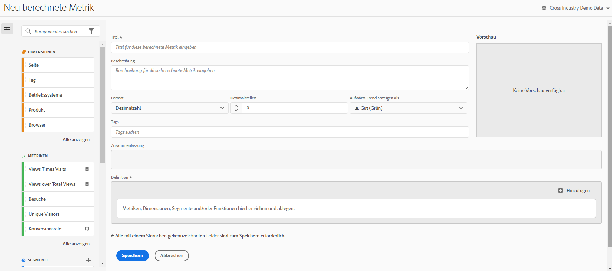

# Erstellen von Metriken

Customer Journey Analytics bietet eine Arbeitsfläche zum Ziehen und Ablegen von Dimensionen, Metriken, Filtern und Funktionen zum Erstellen benutzerdefinierter Metriken basierend auf Containerhierarchielogik, Regeln und Operatoren. Mit diesem integrierten Entwicklungs-Tool können Sie einfache berechnete Metriken oder komplexe, erweiterte berechnete Metriken erstellen und speichern.

## Erstellen einer berechneten Metrik beginnen

Mit dem Generator für berechnete Metriken können Sie berechnete Metriken erstellen. Auf diese Weise werden berechnete Metriken in der Komponentenliste verfügbar und können dann in Projekten in Ihrer gesamten Organisation verwendet werden. Alternativ können Sie eine schnell berechnete Metrik erstellen, wie unter [Berechnete Metriken für ein einzelnes Projekt erstellen](/help/components/apply-create-metrics.md#create-calculated-metrics-for-a-single-project) in [Metriken](/help/components/apply-create-metrics.md) beschrieben.

Greifen Sie auf den Generator für berechnete Metriken zu, um mit der Erstellung einer berechneten Metrik zu beginnen, die in der Komponentenliste verfügbar ist.

1. Greifen Sie auf den Generator für berechnete Metriken wie folgt zu:

   * Öffnen Sie in Analysis Workspace ein Projekt und wählen Sie dann **[!UICONTROL Komponenten]** > **[!UICONTROL Metrik erstellen]** aus.
   * Öffnen Sie in Analysis Workspace ein Projekt und wählen Sie dann in der linken Leiste das Symbol **Plus** neben dem Abschnitt [!UICONTROL **Metriken**] aus.
   * Wechseln Sie in [!DNL Customer Journey Analytics] zu **[!UICONTROL Komponenten]** > **[!UICONTROL Berechnete Metriken]** und wählen Sie dann oben auf der Seite &quot;Berechnete Metriken&quot;die Option **[!UICONTROL + Hinzufügen]** aus.

1. Fahren Sie mit [Bereichen des Generators für berechnete Metriken](#areas-of-the-calculated-metrics-builder) fort.

## Bereiche des Generators für berechnete Metriken

<!-- 

>[!CONTEXTUALHELP]
>id="cja_journeycanvas_viz_product_compatibility"
>title="Product compatibility"
>abstract="Indicates where in Customer Journey Analytics this calculated metric can be used, such as in Analysis Workspace, Report Builder, and so forth."  
>"Some calculated metrics cannot be used with experimentation. Calculated metrics that are not compatible with experimentation have the following value: "Everywhere in Customer Journey Analytics (excluding experimentation)" "
>"Various factors affect whether a calculated metric is compatible with experimentation. Learn more (https://experienceleague.adobe.com/en/docs/analytics-platform/using/cja-workspace/panels/experimentation#use-in-experimentation) ."
>additional-url="https://experienceleague.adobe.com/en/docs/analytics-platform/using/cja-workspace/panels/experimentation#use-in-experimentation" text="Use calculated metrics in experimentation"

-->

Die folgende Abbildung und die zugehörige Tabelle erläutern einige der Hauptbereiche und -funktionen des Generators für berechnete Metriken.

| Feld | Beschreibung |
| --- | --- |
| Anrede/Titel | Ein Name für die Metrik ist obligatorisch. Sie können nur benannte Metriken speichern. |
| Beschreibung | Geben Sie der Metrik eine benutzerfreundliche Beschreibung, um ihren Zweck anzugeben und sie von ähnlichen Metriken zu unterscheiden. 
Die Beschreibung wird auch in Berichten angezeigt. Sie sollten die Formel NICHT in die Beschreibung aufnehmen. Erläutern Sie stattdessen, wofür diese Metrik verwendet werden sollte und wofür nicht. (Die Formel wird unter der Überschrift „Zusammenfassung“ generiert, während Sie die Metrik erstellen. Daher müssen Sie die Formel nicht noch der Beschreibung hinzufügen.) 
 |
| Format | Hier können Sie zwischen „Dezimal“, „Zeit“, „Prozent“ und „Währung“ wählen. |
| Dezimalstellen | Zeigt an, wie viele Dezimalstellen im Bericht angezeigt werden. Sie können maximal 10 Dezimalstellen angeben. |
| Aufwärts-Trend anzeigen als...  | Diese Einstellung für die Metrikpolarität legt fest, ob Analytics einen Aufwärtstrend in der Metrik als positiv (grün) oder negativ (rot) betrachten soll. Dementsprechend wird ein steigendes Diagramm des Berichts grün oder rot angezeigt. |
| Währung | Die Basiswährung für diese Datenansicht. |
| Tags | Anhand von Tagging können Metriken praktisch organisiert werden. Alle Benutzer können Tags erstellen und eines oder mehrere Tags auf eine Metrik anwenden. Sie können Tags jedoch nur für die Filter sehen, deren Inhaber Sie sind oder die für Sie freigegeben wurden. Welche Arten von Tags sollten Sie erstellen? Hier finden Sie einige Vorschläge für nützliche Tags:<ul><li>**Team-Namen**, z. B. Social Marketing, Mobile Marketing.</li><li>**Projekte** (Analyse-Tags), z. B. Entrypage-Analyse.</li><li>**Kategorien**, z. B. Frauen; Geografie.</li><li>**Workflows**, z. B. zu genehmigen, kuratiert für (einen bestimmten Geschäftsbereich)</li></ul> |
| Zusammenfassung | 
Die Formel unter Zusammenfassung wird jedes Mal aktualisiert, wenn Sie die Metrikdefinition ändern. Diese Formel wird auch in der Metrikleiste links angezeigt, wenn Sie den Mauszeiger über eine Metrik bewegen und auf die Symbol &quot;&quot;. 
 |
| Definition | Hier können Sie Metriken/berechnete Metriken, Filter und/oder Funktionen einfügen, um die berechnete Metrik zu erstellen. <ul><li>Wenn Sie eine berechnete Metrik hierhin ziehen, wird die zugehörige Metrikdefinition automatisch eingeblendet. </li> <li>Sie können Definitionen mit Containern verschachteln. Im Gegensatz zu Filtercontainern funktionieren diese Container jedoch wie ein mathematischer Ausdruck und bestimmen die Reihenfolge der Vorgänge. </li> </ul> |
| Operator | Geteilt durch (  ) ist der Standardoperator. Außerdem gibt es die Operatoren +, - und x. |
| Vorschau | Ermöglicht einen schnellen Einblick in potenzielle Fehler. Die Vorschau deckt die letzten 90 Tage ab. So können Sie schnell einschätzen, ob Sie die richtigen Komponenten für die Metrik ausgewählt haben. Bei einem unerwarteten Ergebnis müssten Sie die Metrikdefinition noch einmal genauer prüfen. |
| Produktkompatibilität | Gibt an, wo in der Customer Journey Analytics diese berechnete Metrik verwendet werden kann. 
Die möglichen Werte sind:
<ul><li>[!UICONTROL **Überall auf Customer Journey Analytics**]: Die berechnete Metrik kann für alle Customer Journey Analytics verwendet werden, einschließlich Analysis Workspace, Report Builder usw.</li><li>[!UICONTROL **Überall auf Customer Journey Analytics (ohne Experimentierung)**]: Die berechnete Metrik kann überall auf der Customer Journey Analytics verwendet werden, außer im Bereich &quot;Experimentierung&quot;.</li> 
Informationen zu den Kriterien, die bestimmen, ob eine berechnete Metrik mit Experimenten verwendet werden kann, finden Sie unter [Berechnete Metriken im Experimentierungsbereich verwenden](/help/analysis-workspace/c-panels/experimentation.md#use-calculated-metrics-in-the-experimentation-panel) im [Experimentierungsbereich](/help/analysis-workspace/c-panels/experimentation.md).
</ul> |
| Fügen Sie | Sie können Container und statische Nummern zu den Definitionen aller Arten berechneter Metriken hinzufügen. Für erweiterte berechnete Metriken können Sie auch Filter und Funktionen hinzufügen.<ul><li>Container funktionieren wie mathematische Ausdrücke und bestimmen die Reihenfolge der Vorgänge. Jedes Element in einem Container wird also vor dem nächsten Vorgang verarbeitet.</li><li>Wenn Sie einen Filter auf einen Container ziehen, wird alles in diesem Container gefiltert. (Nur erweiterte berechnete Metriken)</li><li>Sie können mehrere Filter in einem Container stapeln.</li></ul> |
| Zahnradsymbol (Metriktyp, Attribution) | Wenn Sie das Zahnradsymbol neben einer Metrik auswählen, können Sie den Metriktyp und die Attributionsmodelle angeben. 
**Hinweis:** Beachten Sie Folgendes, wenn Sie die Zuordnung einer Komponente auf ein nicht standardmäßiges Attributionsmodell aktualisieren:
<ul><li>**Bei Verwendung der Komponente in einem Bericht mit *einer einzelnen Dimension*:** Die Attribution der Komponente ignoriert das Zuordnungsmodell, wenn ein nicht standardmäßiges Attributionsmodell verwendet wird.</li><li>**Bei Verwendung der Komponente in einem Bericht mit *mehreren Dimensionen*:** Die Attribution der Komponente behält das Zuordnungsmodell bei, wenn ein nicht standardmäßiges Attributionsmodell verwendet wird.</li><li>Mehrere Dimensionen sind nur verfügbar, wenn [Daten in die Cloud exportieren](/help/analysis-workspace/export/export-cloud.md).</li></ul> 
Weitere Informationen zur Zuordnung finden Sie unter [Einstellungen der Persistenz-Komponente](/help/data-views/component-settings/persistence.md).
 |
| Plus-Symbol (+) | Ermöglicht Ihnen die Erstellung einer neuen Komponente, z. B. eines neuen Filters (Sie werden zum Filter Builder geleitet). |
| Suchkomponenten | In dieser Suchleiste können Sie nach Dimensionen, Metriken, Filtern (nur erweiterte berechnete Metriken) und Funktionen (nur erweiterte berechnete Metriken) suchen. |
| Liste von Dimensionen | Anstatt den Generator für berechnete Metriken zu verlassen, um einen einfachen Filter zu erstellen (im Filter-Builder), z. B. &quot;Seite = Homepage&quot;, können Sie die Seite hereinziehen und Startseite direkt aus dem Generator für berechnete Metriken auswählen. So profitieren Sie von einem deutlich optimierten Arbeitsablauf bei der Erstellung gefilterter berechneter Metriken. |
| Liste von Metriken | Metriken sind in drei Kategorien eingeteilt:<ul><li>Standardmetriken</li><li>Berechnete Metriken</li><li>Metrikvorlagen – unten in der Liste.</li></ul>Wenn Sie mit dem Mauszeiger auf eine Metrik zeigen, wird das Infosymbol rechts neben der Metrik angezeigt. Durch Klicken auf dieses Symbol erhalten Sie die folgenden Informationen:<ul><li>Die Formel für die Berechnung der Metrik.</li><li>Ein Vorschautrend der Metrik.</li><li>Ein Bearbeitungssymbol (Bleistift) oben rechts, über das Sie zum Generator für berechnete Metriken gelangen, wo Sie diese berechnete Metrik bearbeiten können.</li></ul> |
| Liste von Filtern | (Nur erweiterte berechnete Metriken) Wenn Sie Administrator sind, zeigt Ihnen diese Liste alle in Ihrem Anmeldeunternehmen erstellten Filter an. Wenn Sie kein Administrator sind, zeigt diese Liste die Filter an, deren Eigentümer Sie sind, sowie die Filter, die für Sie freigegeben wurden. |
| Liste von Funktionen | (Nur erweiterte berechnete Metriken) Funktionen sind in zwei Listen unterteilt: Einfach (am häufigsten verwendet) und Erweitert . |
| Datenansicht-Auswahlhilfe | Mit diesem Selektor (oben rechts) können Sie zu einer anderen Datenansicht wechseln. |
