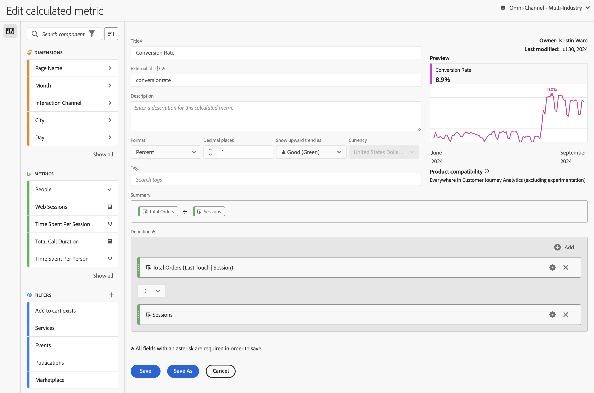

# Erstellen berechneter Metriken {#build-metrics}

<!-- markdownlint-disable MD034 -->

>[!CONTEXTUALHELP]
>id="components_calculatedmetrics_productcompatibility"
>title="Produktkompatibilität"
>abstract="Gibt an, wo in Customer Journey Analytics diese berechnete Metrik verwendet werden kann, z. B. in Analysis Workspace und Report Builder. Einige berechnete Metriken können nicht mit Experimenten verwendet werden."
>additional-url="https://experienceleague.adobe.com/de/docs/analytics-platform/using/cja-workspace/panels/experimentation#use-in-experimentation" text="Verwenden von berechneten Metriken in Experimenten"

<!-- markdownlint-enable MD034 -->

<!-- markdownlint-disable MD034 -->

>[!CONTEXTUALHELP]
>id="components_calculatedmetrics_externalid"
>title="Externe ID"
>abstract="Eine Änderung der externen ID kann sich auf die Darstellung der berechneten Metrik in externen Quellen auswirken, z. B. auf Business Intelligence-Tools"

<!-- markdownlint-enable MD034 -->

Customer Journey Analytics bietet eine Arbeitsfläche zum Ziehen und Ablegen von Dimensionen, Metriken, Segmenten und Funktionen, um benutzerdefinierte Metriken basierend auf Container-Hierarchielogik, Regeln und Operatoren zu erstellen. Mit diesem integrierten Entwicklungs-Tool können Sie einfache oder komplexe berechnete Metriken erstellen und speichern.

## Mit dem Erstellen einer berechneten Metrik beginnen

Sie können den Generator für berechnete Metriken verwenden, um berechnete Metriken zu erstellen oder zu bearbeiten. Wenn berechnete Metriken auf diese Weise erstellt werden, sind sie in der Komponentenliste verfügbar und können dann in Projekten in Ihrer gesamten Organisation verwendet werden. Alternativ können Sie schnell eine berechnete Metrik erstellen, die nur für das Projekt verfügbar ist, in dem sie erstellt wurde, wie in [Erstellen berechneter Metriken für ein einzelnes Projekt](/help/components/apply-create-metrics.md#create-calculated-metrics-for-a-single-project) in [Metriken](/help/components/apply-create-metrics.md) beschrieben.

Greifen Sie auf den Generator für berechnete Metriken zu, um mit der Erstellung einer berechneten Metrik zu beginnen, die in der Komponentenliste verfügbar ist.

1. Greifen Sie auf eine der folgenden Arten auf den Generator für berechnete Metriken zu:

   * Öffnen Sie ein Projekt in Analysis Workspace und wählen Sie dann **[!UICONTROL Komponenten]** > **[!UICONTROL Metrik erstellen]** aus.
   * Öffnen Sie ein Projekt in Analysis Workspace und wählen Sie dann in der linken Leiste das **Plus**-Symbol neben dem Abschnitt [!UICONTROL **Metriken**] aus.
   * Navigieren Sie in [!DNL Customer Journey Analytics] zu **[!UICONTROL Komponenten]** > **[!UICONTROL Berechnete Metriken]** und wählen Sie dann **[!UICONTROL + Hinzufügen]** oben auf der Seite „Berechnete Metriken“ aus.

1. Fahren Sie mit [Bereiche des Generators für berechnete Metriken](#areas-of-the-calculated-metrics-builder) fort.

## Bereiche des Generators für berechnete Metriken

Das Dialogfeld **[!UICONTROL Generator für berechnete Metriken]** wird zum Erstellen neuer oder Bearbeiten vorhandener berechneter Metriken verwendet. Das Dialogfeld hat den Titel **[!UICONTROL Neu berechnete Metrik]** oder **[!UICONTROL Berechnete Metrik bearbeiten]** für Metriken, die Sie über den Manager für [[!UICONTROL berechnete Metriken] erstellen oder verwalten](/help/components/calc-metrics/cm-workflow/cm-manager.md).

>[!BEGINTABS]

>[!TAB Generator für berechnete Metriken]

>[!TAB Berechnete Metrik erstellen oder bearbeiten]

>[!ENDTABS]

1. Geben Sie die folgenden Details an ( bedeutet erforderlich):

   | Element | Beschreibung |
   | --- | --- |
   | **[!UICONTROL Datenansicht]** | Sie können die Datenansicht für die berechnete Metrik auswählen.  Die von Ihnen definierte berechnete Metrik ist in Workspace-Projekten verfügbar, die auf der ausgewählten Datenansicht basieren. |
   | **[!UICONTROL Projektspezifische Metrik]** | Oben in diesem Dialogfeld wird ein Informationsfeld angezeigt, wenn Sie eine berechnete Metrik bearbeiten, die für ein einzelnes Projekt erstellt wurde, wie unter [Erstellen berechneter Metriken für ein einzelnes Projekt](/help/components/apply-create-metrics.md#create-calculated-metrics-for-a-single-project) beschrieben. 
Wenn Sie diese berechnete Metrik für alle Projekte verfügbar machen möchten, wählen Sie die Option **[!UICONTROL Diese Metrik für alle Projekte verfügbar machen und der Komponentenliste hinzufügen]** aus.
 |
   | **[!UICONTROL Titel]**  | Benennen Sie die berechnete Metrik, beispielsweise mit `Conversion Rate`. |
   | **[!UICONTROL Externe ID]**  | Der Name der berechneten Metrik bei Verwendung eines externen BI-Tools und der BI-Erweiterung. Der Wert wird automatisch als `undefined_xxx` definiert, es sei denn, Sie überschreiben den Wert. |
   | **[!UICONTROL Beschreibung]** | Geben Sie eine Beschreibung für das Segment an, z. B. `Calculated metric to define the conversion rate.` Es ist nicht erforderlich, die Formel für die berechnete Metrik zu beschreiben, da die Formel bereits automatisch in [!UICONTROL Zusammenfassung“ &#x200B;]. |
   | **[!UICONTROL Format]** | Wählen Sie ein Format für die berechnete Metrik aus: Sie können zwischen **[!UICONTROL Dezimalzahl]**, **[!UICONTROL Zeit]**, **[!UICONTROL Prozent]** und **[!UICONTROL Währung]** wählen. |
   | **[!UICONTROL Dezimalstellen]** | Geben Sie die Anzahl der Dezimalstellen für das ausgewählte Format an. Nur aktiviert, wenn das ausgewählte Format „Dezimalzahl“, „Währung“ und „Prozent“ ist. |
   | **[!UICONTROL Aufwärts-Trend anzeigen als]** | Geben Sie an, ob ein Aufwärtstrend der berechneten Metrik als ▲ (**[!UICONTROL (grün)]** oder als ▼ (**[!UICONTROL ) (rot)]** angezeigt wird. |
   | **[!UICONTROL Währung]** | Geben Sie die Währung der berechneten Metrik an. Nur aktiviert, wenn das ausgewählte Format „Währung“ ist. |
   | **[!UICONTROL Tags]** | Organisieren Sie die berechnete Metrik, indem Sie ein oder mehrere Tags erstellen oder anwenden. Beginnen Sie mit der Eingabe, um nach vorhandenen Tags zu suchen, die Sie auswählen können. Oder drücken Sie die **[!UICONTROL Eingabetaste]**, um ein neues Tag hinzuzufügen. Wählen Sie  aus, um ein Tag zu entfernen. |
   | **[!UICONTROL Vorschau]** | Die Vorschau umfasst die letzten 90 Tage und ist eine Möglichkeit, abzuschätzen, ob Sie Ihre Metrik richtig definiert haben. |
   | **[!UICONTROL Zusammenfassung]** | Hier wird eine Zusammenfassung der Definition der berechneten Metrik angezeigt.  Beispiel:   **[!UICONTROL Gesamtbestellungen]**   **[!UICONTROL SItzungen]**. |
   | **[!UICONTROL Definition]**  | Definieren Sie Ihr Segment mit dem [Definition Builder](#definition-builder). |

1. Um zu überprüfen, ob Ihre Definition der berechneten Metrik korrekt ist, verwenden Sie die ständig aktualisierte **[!UICONTROL Vorschau]** der Ergebnisse der berechneten Metrik. Der **[!UICONTROL Vorschau]** deckt die letzten 90 Tage ab und bewertet die Definition Ihrer berechneten Metrik kontinuierlich.

   Die **[!UICONTROL Produktkompatibilität]** gibt an, ob die berechnete Metrik beim Experimentieren verwendet werden kann. Mögliche Werte sind:
   * **[!UICONTROL Überall in Customer Journey Analytics]**: Die berechnete Metrik kann überall in Customer Journey Analytics verwendet werden.
   * **[!UICONTROL Überall in Customer Journey Analytics (außer beim Experimentieren)]**: Die berechnete Metrik kann überall in Customer Journey Analytics verwendet werden, mit Ausnahme des Panels „Experimentieren“.

1. Wählen Sie Folgendes aus:
   * **[!UICONTROL Speichern]**: Speichert die berechnete Metrik.
   * **[!UICONTROL Speichern unter]**: Speichert eine Kopie der berechneten Metrik.
   * **[!UICONTROL Abbrechen]**: Verwirft alle Änderungen, die Sie an der berechneten Metrik vorgenommen haben, oder bricht die Erstellung einer neuen berechneten Metrik ab.

## Definition Builder

Mit dem Definition Builder können Sie per Drag-and-Drop Dimensionen, Metriken, Segmente und Funktionen per Drag-and-Drop verschieben und benutzerdefinierte Metriken auf der Grundlage von Container-Hierarchielogik, Regeln und Operatoren erstellen. In dieser Konstruktion können Sie Standardmetriken, von Adobe definierte Metriken, berechnete Metriken, Segmente, Dimensionen und Funktionen verwenden. Alle diese Komponenten sind über das Panel „Komponenten“ im Generator für berechnete Metriken verfügbar. Darüber hinaus können Sie in der Definition Operatoren und Container verwenden.

Nur Metriken werden als einzelne Komponenten im Bereich **[!UICONTROL Definition]** festgelegt. Alle anderen Komponenten sind als Container, Wrapping-Metriken oder andere Container definiert. Weitere Informationen finden Sie unter [Container](#containers).

### Metriken

So fügen Sie eine Metrik hinzu:

* Ziehen Sie eine Komponente  **[!UICONTROL Metriken]** aus dem Bedienfeld „Komponenten“ auf **[!UICONTROL Ziehen Sie Metriken, Dimensionen, Dimensionselemente, Segmente und/oder Funktionen per Drag-and-Drop hierher]**. Sie können  in der Komponentenleiste verwenden, um nach bestimmten Komponenten zu suchen.

Wenn Sie eine berechnete Metrik als Teil Ihrer Definition verwenden, wird die berechnete Metrik erweitert.

So ändern Sie eine Metrik:

1. Wählen Sie  in einer Metrikkomponente im Bereich **[!UICONTROL Definition]** aus.
1. Im Popup-Dialogfeld können Sie den Typ der Metrik und ein Attributionsmodell definieren. Siehe [Metriktyp und Attribution](m-metric-type-alloc.md).

So löschen Sie eine Metrik:

* Wählen Sie  in der Metric aus.

### Operatoren

Mit Operatoren können Sie den Operator zwischen Komponenten oder Containern angeben. Operatoren werden automatisch angezeigt zwischen

* zwei oder mehr Metriken in einem Container
* zwei oder mehr Containern in einem Container
* einer oder mehrere Metriken und einem oder mehreren Containern in einem Container.

Folgende Optionen stehen zur Auswahl:

| Symbol | Operator |
|:---:|---|
|  | Dividieren (Standard) |
|  | Multiplizieren |
|  | Subtrahieren |
|  | Hinzufügen |

### Statische Zahl

Sie können Ihrer Definition der berechneten Metrik eine statische Zahl hinzufügen. So fügen Sie eine statische Zahl hinzu:

* Wählen Sie  **[!UICONTROL Hinzufügen]** in einem Container aus.
* Wählen Sie **[!UICONTROL Statische Zahl]** aus. Ein statischer Zahlen-Container wird angezeigt.
* Wählen Sie [!UICONTROL *Mit Klick hinzufügen*] aus und geben Sie einen Wert ein.

### Container

Sie fügen Dimensionen, Segmente und Funktionen als Container zu einer Definition für berechnete Metriken hinzu. Sie können auch einen generischen Container hinzufügen. Container funktionieren wie mathematische Ausdrücke und bestimmen die Reihenfolge der Vorgänge. Alles in einem Container wird vor der nächsten Komponente oder dem nächsten Container verarbeitet.

#### Segment-Container

Sie verwenden das Konzept eines Segment-Containers, um eine [segmentierte Metrik“ ](metrics-with-segments.md). Sie können einen Segment-Container mithilfe eines Segments oder mithilfe eines Segments erstellen, das Sie aus einer Dimension erstellen.

* So fügen Sie einen Segment-Container aus einer Dimension hinzu:

   1. Ziehen Sie eine Komponente  **[!UICONTROL Dimensionen]** aus dem Bedienfeld „Komponenten“ auf **[!UICONTROL Ziehen Sie Metriken, Dimensionen, Dimensionselemente, Segmente und/oder Funktionen per Drag-and-Drop hierher]**. Sie können  in der Komponentenleiste verwenden, um nach bestimmten Komponenten zu suchen.
   1. Definieren Sie **[!UICONTROL Popup Segment aus Dimension]** die Bedingung für das Segment. Wählen Sie in der Liste der Operatoren einen Wert aus oder geben Sie einen Wert ein, z. B. **[!UICONTROL Monat]** **[!UICONTROL gleich]**  `Sep 2024`.
   1. Wählen Sie **[!UICONTROL Fertig]** aus. Ein Segment-Container wird der **[!UICONTROL Definition]** hinzugefügt.

* Um einen Segment-Container aus einem Segment hinzuzufügen, können Sie Folgendes verwenden:

   * Ziehen Sie eine Komponente  **[!UICONTROL Segmente]** aus dem Bedienfeld „Komponenten“ auf **[!UICONTROL Ziehen Sie Metriken, Dimensionen, Dimensionselemente, Segmente und/oder Funktionen per Drag-and-Drop hierher]**. Sie können den  in der Komponentenleiste verwenden, um nach bestimmten Segmenten zu suchen.
Der **[!UICONTROL Definition“ wird automatisch ein Segment-Container]** den Namen des Segments hinzugefügt.

   * Ziehen Sie eine Komponente **[!UICONTROL Segment]** aus dem Bedienfeld „Komponenten“ in einen generischen Container. Der Container wird in einen Segment-Container geändert.

   * Wählen Sie  **[!UICONTROL Hinzufügen]** in einem Container aus:

      1. Wählen Sie **[!UICONTROL Segment]** aus. Ein Segment-Container wird der **[!UICONTROL Definition]** hinzugefügt.
      1. Wählen Sie im neuen Segment-Container ein Segment aus dem [!UICONTROL *Auswählen…*] Dropdown-Menü aus.

  >[!TIP]
  >
  >Sie können einem Container mehr als ein Segment hinzufügen.

  Die Segmente im Container werden nach der Segmentkomponente benannt. z. B.  **[!UICONTROL Web-Sitzungen]**. Wählen Sie  aus, um ein Popup mit Details zum Segment anzuzeigen. Wählen Sie im Popup die Option  aus, um die Segmentdefinition zu bearbeiten.

So entfernen Sie ein Segment aus einem Container:

* Klicken Sie  neben dem Segmentnamen.

Siehe [Segmentierte Metriken](metrics-with-segments.md) für weitere Details und Beispiele.

#### Funktions-Container

Um einen Funktions-Container hinzuzufügen, können Sie wie folgt vorgehen:

* Verwenden Sie die Drag-and-Drop-Funktion:

   1. Ziehen Sie eine Komponente  **[!UICONTROL Funktionen]** aus dem Bedienfeld „Komponenten“ auf **[!UICONTROL Ziehen Sie Metriken, Dimensionen, Dimensionselemente, Segmente und/oder Funktionen per Drag-and-Drop hierher]**. Sie können  in der Komponentenleiste verwenden, um nach bestimmten Funktionen zu suchen.
   1. Der **[!UICONTROL Definition]** wird automatisch ein Funktions-Container mit dem Namen der Funktion hinzugefügt.

* Wählen Sie  **[!UICONTROL Hinzufügen]** in einem Container aus:

   1. Wählen Sie **[!UICONTROL Funktion]**.
   1. Wählen Sie im Container eine Funktion aus dem [!UICONTROL *Auswählen…*] Dropdown-Menü aus.

Der Funktions-Container ist nach der Funktionskomponente benannt. Beispiel:  **[!UICONTROL SQUARE ROOT (metric)]**. Wählen Sie  aus, um ein Popup mit weiteren Details zur Funktion anzuzeigen. Wählen Sie **[!UICONTROL Weitere Informationen]** aus, um weitere Informationen zur Funktion zu erhalten.

Unter [Verwenden von Funktionen](cm-using-functions.md) finden Sie Details zur Verwendung von Funktionen und dazu, welche Funktionen zum Erstellen einer berechneten Metrik verfügbar sind.

#### Allgemeiner Container 

So fügen Sie einen allgemeinen Container hinzu:

* Wählen Sie  **[!UICONTROL Hinzufügen]** in einem Container aus
* Wählen Sie **[!UICONTROL Container]** aus. Der **[!UICONTROL Definition]** wird ein neuer, leerer allgemeiner Container hinzugefügt. Mit einem allgemeinen Container können Sie eine Hierarchie in der Definition Ihrer berechneten Metrik verschachteln oder erstellen.

#### Löschen eines Containers

Wählen Sie zum Löschen eines Containers  auf Container-Ebene aus.

>[!MORELIKETHIS]
>
>[Funktionen verwenden](cm-using-functions.md)
>[Segmente ](/help/components/filters/filters-overview.md)
>

