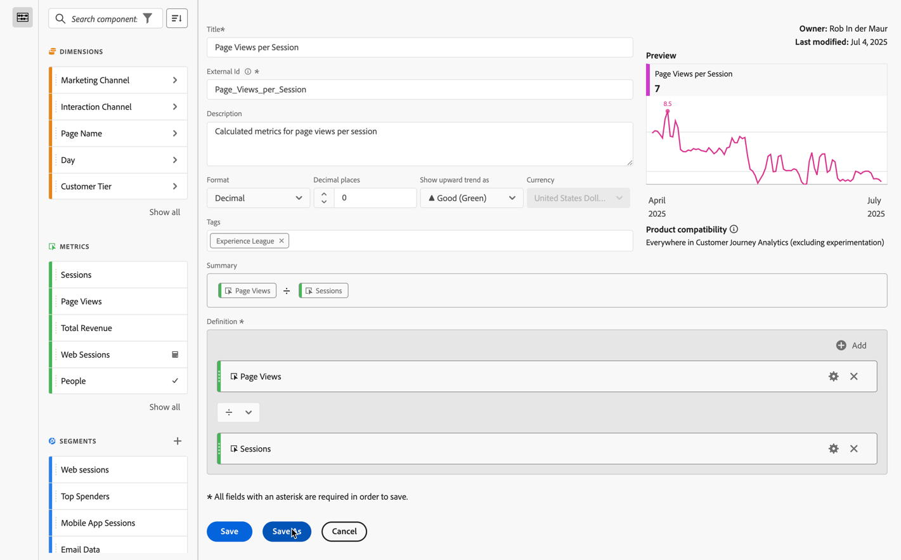

# Einfache berechnete Metrik erstellen

In den folgenden Informationen wird erläutert, wie Sie eine einfache Metrik *Seitenansichten pro Besuch* erstellen.

1. Beginnen Sie mit dem Erstellen einer Metrik, wie in [Metriken erstellen](/help/components/calc-metrics/cm-workflow/cm-build-metrics.md) beschrieben.
1. Benennen Sie die Metrik `Page Views per Session` oder etwas Ähnliches.
1. Geben Sie der Metrik eine benutzerfreundliche **[!UICONTROL Beschreibung]**, um anzuzeigen, wofür die Metrik verwendet wird.
1. Wählen Sie rechts **[!UICONTROL Format]** aus. Wählen Sie für dieses Beispiel &quot;**[!UICONTROL &quot;]**.
1. Legen Sie fest, wie viele Dezimalstellen der Bericht anzeigen soll.
1. Wählen Sie **[!UICONTROL Dropdown-Menü]** Aufwärts-Trend anzeigen als▲ die Option **[!UICONTROL Gut (Grün)]**.
1. Fügen Sie ein **[!UICONTROL Tag]** hinzu, um die Metriken zu organisieren.
1. Ziehen Sie für diese berechnete Metrik zunächst **[!UICONTROL Seitenansichten]** aus den **[!UICONTROL Metriken]**-Komponenten in den **[!UICONTROL Definition]**-Abschnitt der Arbeitsfläche.
1. Ziehen Sie dann **[!UICONTROL Sitzungen]** aus den Komponenten **[!UICONTROL Metriken]** und legen Sie die Metrik unter **[!UICONTROL Seitenansichten]** ab (warten Sie, bis die blaue Linie angezeigt wird, bevor Sie die Metrik ablegen).
1. Wählen Sie den Operator . (Dividieren ist der Standardoperator.)
1. Sie können eine **[!UICONTROL Vorschau]** der Metrik sehen, während Sie die Metrik erstellen.
1. **[!UICONTROL Produktkompatibilität]** Zeigt an, ob die berechnete Metrik überall in Customer Journey Analytics kompatibel ist (ohne Experimente).

   
1. Wählen Sie **[!UICONTROL Speichern]** aus.

   Beachten Sie, dass die Formel unter **[!UICONTROL Zusammenfassung]** jedes Mal, wenn Sie die Metrikdefinition ändern, aktualisiert wird.

1. (Optional) Zum Freigeben, Genehmigen, (erneuten) Taggen, Umbenennen oder Löschen einer Metrik können Sie zum [Manager für berechnete Metriken](/help/components/calc-metrics/cm-workflow/cm-manager.md).

