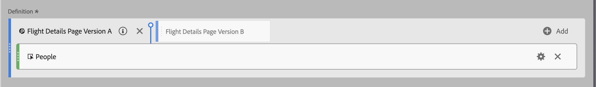

# Segmente stapeln und ersetzen

Sie können Segmente im Generator für berechnete Metriken stapeln und ersetzen.

## Stapeln von Segmenten {#stack-segment}

1. Beginnen Sie mit dem Erstellen einer Metrik, wie in [Berechnete Metriken erstellen](/help/components/calc-metrics/cm-workflow/cm-build-metrics.md) beschrieben.

1. Ziehen Sie das neue Segment auf die Arbeitsfläche „Definition“ und legen Sie es neben dem vorhandenen Segment ab:

   

## Ersetzen eines Segments durch ein anderes {#replace-segment}

1. Beginnen Sie mit dem Erstellen einer Metrik, wie in [Metriken erstellen](/help/components/calc-metrics/cm-workflow/cm-build-metrics.md) beschrieben.

1. Legen Sie das neue Segment auf der Arbeitsfläche „Definition“ auf dem vorhandenen Segment ab:

   
