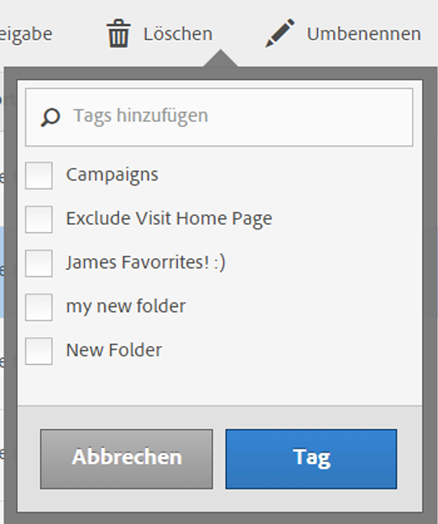

# Berechnete Metriken taggen

Im Manager für berechnete Metriken können Sie Filter organisieren, indem Sie sie mit Tags versehen.

Alle Benutzer können Tags für berechnete Metriken erstellen und eines oder mehrere Tags auf eine Metrik anwenden. Sie können Tags jedoch nur für die berechneten Metriken sehen, deren Inhaber Sie sind oder die für Sie freigegeben wurden.

>[!TIP]
>
>Die nützlichsten Typen von Tags sind normalerweise Tags, die auf den folgenden Kriterien basieren:
>
>* **Team-Namen**, z. B. Social Marketing oder Mobile Marketing.
>* **Projekt** (Analyse-Tags), z. B. Entrypage-Analyse.
>* **Kategorien**, z. B. Frauen oder Geografie.
>* **Workflows**, z. B. Genehmigung oder Kuratierung für (einen bestimmten Geschäftsbereich).

## Anwenden von Tags auf eine berechnete Metrik

1. Wählen Sie unter Customer Journey Analytics [!UICONTROL **Komponenten**] > [!UICONTROL **Berechnete Metriken**] aus.

1. Aktivieren Sie im Manager für berechnete Metriken das Kontrollkästchen neben den Metriken, die Sie taggen möchten.

   

1. Im Dialogfeld [!UICONTROL **Berechnete Metrik taggen**] :

   * Fügen Sie ein neues Tag hinzu. Geben Sie den Namen in das Feld **[!UICONTROL Tags hinzufügen]** ein und drücken Sie dann die Eingabetaste.
   * Wählen Sie einen oder mehrere vorhandene Tags aus, die auf die ausgewählten Metriken angewendet werden sollen.

1. Wählen Sie [!UICONTROL **Speichern**] aus, um die Tags anzuwenden.

## Angewandte Tags anzeigen

1. Wählen Sie unter Customer Journey Analytics [!UICONTROL **Komponenten**] > [!UICONTROL **Berechnete Metriken**] aus, um zum Manager für berechnete Metriken zu wechseln.

1. Im Manager für berechnete Metriken werden Tags in der Spalte [!UICONTROL **Tags**] angezeigt. (Klicken Sie auf das Zahnradsymbol oben rechts, um Ihre Spalten zu verwalten.)

## Metriken nach Tags filtern

1. Wählen Sie unter Customer Journey Analytics [!UICONTROL **Komponenten**] > [!UICONTROL **Berechnete Metriken**] aus, um zum Manager für berechnete Metriken zu wechseln.

1. Wählen Sie im Manager für berechnete Metriken das Symbol **Filter** und dann die Tags aus, nach denen Sie filtern möchten.

   Es werden nur Metriken angezeigt, die den von Ihnen ausgewählten Filter aufweisen.

