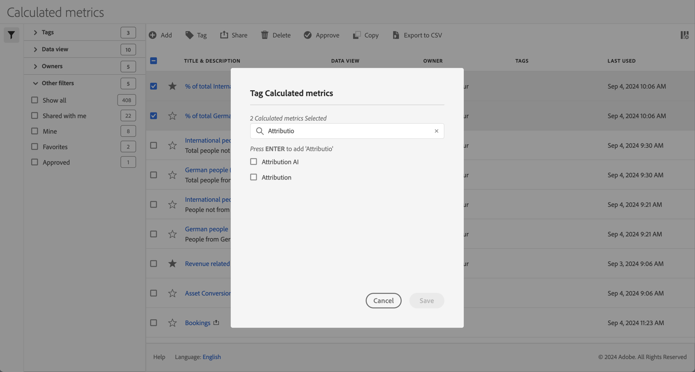

# Berechnete Metriken taggen

Im Manager für berechnete Metriken ](cm-manager.md) können Sie Tags verwenden, um berechnete Metriken zu organisieren. [ Administratoren können alle berechneten Metriken mit Tags versehen. Benutzer ohne Administratorrechte können nur die berechneten Metriken taggen, die sie erstellen oder für sie freigegeben wurden.

So taggen Sie eine oder mehrere berechnete Metriken:

1. Wählen Sie im Manager für [berechnete Metriken](cm-manager.md) eine oder mehrere der berechneten Metriken aus, die Sie taggen möchten.
1. Wählen Sie in der Aktionsleiste  **[!UICONTROL Tag]** aus.
1. Im Dialogfeld **[!UICONTROL Berechnete Metriken taggen]**

   

   1. (Optional) Verwenden Sie  , um nach der Liste der Tags zu suchen und diese einzuschränken.

   2. Basierend auf der Tag-Liste:

      * einen oder mehrere vorhandene Tags aus der Liste auswählen oder
      * Geben Sie ein neues Tag ein und drücken Sie **[!UICONTROL ENTER]**. Wiederholen Sie diesen Vorgang, um mehr als ein neues Tag hinzuzufügen.

1. Wählen Sie **[!UICONTROL Speichern]** aus, um die Tags für die berechneten Metriken zu speichern. Wählen Sie **[!UICONTROL Abbrechen]** aus, um abzubrechen.

Nach dem Speichern werden die Tags im Feld [!UICONTROL Tag] für die ausgewählte berechnete Metrik im [Generator für berechnete Metriken](cm-tagging.md) aufgelistet.

<!--

In the Calculated metric manager, you can organize filters by tagging them.

All users can create tags for calculated metrics and apply one or more tags to a metric. However, you can see tags only for those calculated metrics that you own or that have been shared with you. 

>[!TIP]
>
>The most useful types of tags are usually tags that are based on the following criteria:
>
>* **Team names**, such as Social Marketing or Mobile Marketing.
>* **Project** (analysis tags), such as Entry-page analysis.
>* **Categories**, such as Women's or Geography.
>* **Workflows**, such as To be approved or Curated for (a specific business unit).

## Apply tags to a calculated metric

1. In Customer Journey Analytics, select [!UICONTROL **Components**] > [!UICONTROL **Calculated metrics**].

1. In the Calculated metrics manager, select the checkbox next to any metrics that you want to tag.

   

1. In the [!UICONTROL **Tag Calculated metric**] dialog box: 

   * Add a new tag. Type the name in the **[!UICONTROL Add tags]** field, then press Enter.
   * Select one or more existing tags to apply to the selected metrics.

1. Select [!UICONTROL **Save**] to apply the tags.

## View applied tags

1. In Customer Journey Analytics, select [!UICONTROL **Components**] > [!UICONTROL **Calculated metrics**] to go to the Calculated metrics manager.

1. In the Calculated metrics manager, tags appear in the [!UICONTROL **Tags**] column. (Click the gear icon on the top-right to manage your columns.)

## Filter metrics by tags

1. In Customer Journey Analytics, select [!UICONTROL **Components**] > [!UICONTROL **Calculated metrics**] to go to the Calculated metrics manager.

1. In the Calculated metrics manager, select the **Filter** icon, then select the tags that you want to filter by. 

   Only metrics that have the filter you select are shown.

-->

