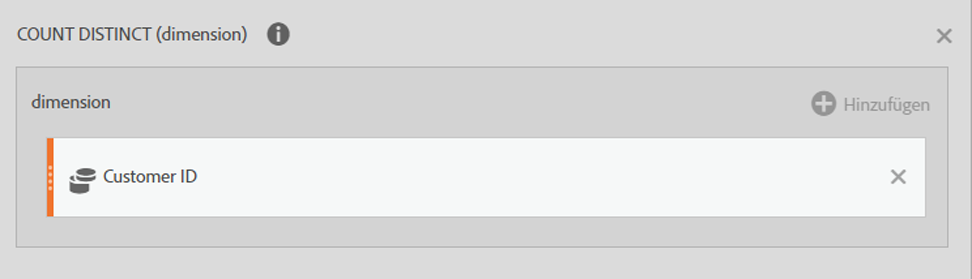
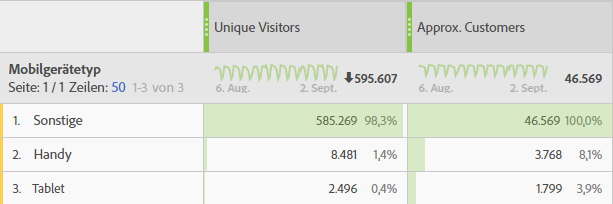

# Funktionen verwenden

Mit Funktionen können Sie Ihre Daten filtern, sortieren und eine einfache und komplexe statistische Analyse durchführen.

Eine Liste aller Funktionen finden Sie unter [Grundfunktionen](/help/components/calc-metrics/cm-functions.md) und [Erweiterte Funktionen](/help/components/calc-metrics/cm-adv-functions.md).


>[!NOTE]
>
>Wenn [!DNL metric] als Argument in einer Funktion angegeben ist, sind auch andere Ausdrücke von Metriken zulässig. Beispiel: [!DNL MAXV(metrics)] ermöglicht auch [!DNL MAXV(PageViews + Visits).]
>

>[!NOTE]
>
>Wenn Sie Funktionen in die Definition des Generators für berechnete Metriken aufnehmen, wenden Sie immer die Funktion an, bevor Sie Metriken oder Filter hineinziehen.
>

## Vergleich zwischen Tabellenfunktionen und Zeilenfunktionen

Bei einer Tabellenfunktion ist die Ausgabe für jede Tabellenzeile gleich. Bei einer Zeilenfunktion ist die Ausgabe für jede Tabellenzeile unterschiedlich.

## Was bedeutet der Parameter „Include-Zeros“?

Damit wird angegeben, ob Nullen in die Berechnung einbezogen werden sollen. In manchen Fällen bedeutet eine Null „nichts“, in anderen Fällen kann sie aber auch wichtig sein.

Beispiel: Wenn Sie mit einer Umsatzmetrik arbeiten und dem Bericht dann eine Seitenansichtsmetrik hinzufügen, gibt es plötzlich mehr Zeilen für den Umsatz, die alle Nullwerte enthalten. Dies soll sich sicherlich nicht auf Berechnungen für arithmetisches MEAN, MIN, QUARTILE usw. auswirken, die Sie für die Umsatzspalte eingerichtet haben. In diesem Fall würden Sie den include-zeros-Parameter aktivieren.

Wenn Sie allerdings an zwei Metriken interessiert sind, soll vielleicht nicht eine Metrik einen höheren Durchschnitt oder Mindestwert erhalten, weil einige seiner Zeilen Null waren. Daher würden Sie den Parameter zum Einbeziehen der Nullwerte nicht aktivieren.

<!-- This video is way too outdated and too much AA oriented to comfortably show as part of CJA functionality 

Watch this [video](https://youtu.be/SSyWvomnewI) to understand the use of functions.

-->

+++ Grundlegende Funktionen


## Absolutwert (Zeile)

Gibt den Absolutwert einer Zahl zurück. Der Absolutwert einer Zahl ist die Zahl mit einem positiven Wert.

```
ABS(metric)
```

| Argument | Beschreibung |
|---|---|
| *metric* | Die Metrik, für die Sie den Absolutwert abrufen möchten. |

## Spaltenmaximum

Gibt den größten Wert in einem Satz aus Dimensionselementen für eine Metrikspalte zurück. MAXV wird vertikal innerhalb einer einzelnen Spalte (Metrik) über Dimensionselemente hinweg ausgewertet.

```
MAXV(metric)
```

| Argument | Beschreibung |
|---|---|
| *metric* | Die Metrik, die Sie auswerten möchten. |

## Spaltenminimum

Gibt den kleinsten Wert in einem Satz aus Dimensionselementen für eine Metrikspalte zurück. MINV wird vertikal innerhalb einer einzelnen Spalte (Metrik) über Dimensionselemente hinweg ausgewertet.

```
MINV(metric)
```

| Argument | Beschreibung |
|---|---|
| *metric* | Die Metrik, die Sie auswerten möchten. |

## Spaltensumme

Addiert alle numerischen Werte für eine Metrik innerhalb einer Spalte (über die Elemente einer Dimension hinweg).

```
SUM(metric)
```

| Argument | Beschreibung |
|---|---|
| *metric* | Die Metrik, für die Sie den Gesamtwert oder die Summe ermitteln möchten. |

## Anzahl (Tabelle)

Gibt die Zahl oder Anzahl der Werte ungleich null für eine Metrik innerhalb einer Spalte zurück (die Anzahl der eindeutigen Elemente innerhalb einer Dimension).

```
COUNT(metric)
```

| Argument | Beschreibung |
|---|---|
| *metric* | Die Metrik, die gezählt werden soll. |

## Exponent (Zeile)

Gibt *e* hoch eine angegebene Zahl zurück. Die Konstante *e* ist gleich 2,71828182845904 (der Basis des natürlichen Logarithmus). EXP ist die Umkehrung von LN, des natürlichen Logarithmus einer Zahl.

```
EXP(metric)
```

| Argument | Beschreibung |
|---|---|
| *metric* | Der Exponent, der auf Basis *e* angewendet wird. |

## Potenzierung

Potenzierungsoperator


pow(x,y) = x<sup>y</sup> = x *x* x*... (y-mal)


## Arithmetisches Mittel (Tabelle)

Gibt das arithmetische Mittel (oder den Durchschnitt) für eine Metrik in einer Spalte zurück.

```
MEAN(metric)
```

| Argument | Beschreibung |
|---|---|
| *metric* | Die Metrik, für die Sie den Durchschnitt ermitteln möchten. |

## Medianwert (Tabelle)

Gibt den Medianwert für eine Metrik in einer Spalte zurück. Der Medianwert ist die Zahl in der Mitte eines Zahlensatzes, d. h. die Hälfte der Zahlen hat Werte größer oder gleich dem Medianwert und die Hälfte ist kleiner oder gleich dem Medianwert.

```
MEDIAN(metric)
```

| Argument | Beschreibung |
|---|---|
| *metric* | Die Metrik, für die Sie den Medianwert ermitteln möchten. |

## Modulo

Der Rest von col1/col2 mit euklidischer Division.

Gibt den Rest zurück, nachdem x durch y geteilt wurde.

```
x = floor(x/y) + modulo(x,y)
```

Der Rückgabewert hat dasselbe Vorzeichen wie die Eingabe (oder ist null).

```
modulo(4,3) = 1 
modulo(-4,3) = -1 
modulo(-3,3) = 0
```

Um immer eine positive Zahl zu erhalten, verwenden Sie

```
modulo(modulo(x,y)+y,y)
```

## Perzentil (Tabelle)

Gibt das k. Perzentil der Werte für eine Metrik zurück. Mit dieser Funktion können Sie einen Akzeptanzschwellenwert einrichten. Sie können beispielsweise Dimensionselemente untersuchen, die über dem 90. Perzentil liegen.

```
PERCENTILE(metric,k)
```

<table id="table_35CD840ACFB44CD9979881DB8823CC53"> 
 <thead> 
  <tr> 
   <th colname="col1" class="entry"> Argument </th> 
   <th colname="col2" class="entry"> Beschreibung </th> 
  </tr> 
 </thead>
 <tbody> 
  <tr> 
   <td colname="col1"> <i>metric</i> </td> 
   <td colname="col2"> Die Metrikspalte, die die relative Position definiert. </td> 
  </tr> 
  <tr> 
   <td colname="col1"> <p>k </p> </td> 
   <td colname="col2"> Der Perzentilwert im Bereich von 0 bis 100 (einschließlich). </td> 
  </tr> 
 </tbody> 
</table>

## Quartil (Tabelle)

Gibt das Quartil der Werte für eine Metrik zurück. Anhand von Quartilen können Sie beispielsweise die oberen 25 % der Produkte finden, die den meisten Umsatz generieren. MINV, MEDIAN und MAXV geben denselben Wert wie QUARTILE zurück, wenn Quartil 0 (null), 2 bzw. 4 entspricht.

```
QUARTILE(metric,quart)
```

<table id="table_64EA3DAAE77541439D59FAF0353F83A2"> 
 <thead> 
  <tr> 
   <th colname="col1" class="entry"> Argument </th> 
   <th colname="col2" class="entry"> Beschreibung </th> 
  </tr> 
 </thead>
 <tbody> 
  <tr> 
   <td colname="col1"> <i>metric</i> </td> 
   <td colname="col2"> Die Metrik, für die Sie den Quartilwert abrufen möchten. </td> 
  </tr> 
  <tr> 
   <td colname="col1"> <p>quart </p> </td> 
   <td colname="col2"> Gibt an, welcher *-Wert zurückgegeben werden soll. </td> 
  </tr> 
 </tbody> 
</table>

&#42;Wenn *quart* = 0 ist, gibt QUARTILE den Mindestwert zurück. Wenn *quart* = 1 ist, gibt QUARTILE das zweite Quartil (25. Perzentil) zurück. Wenn *quart* = 2 ist, gibt QUARTILE das zweite Quartil (50. Perzentil) zurück. Wenn *quart* = 3 ist, gibt QUARTILE das zweite Quartil (75. Perzentil) zurück. Wenn *quart* = 4 ist, gibt QUARTILE den Höchstwert zurück.

## Rund

Gibt die nächste Ganzzahl für einen Wert zurück. Beispiel: Wenn Sie keine Währungsdezimalzahlen für den Umsatz in Berichte aufnehmen möchten und ein Produkt einen Umsatz von 569,34 US-Dollar aufweist, können Sie mit der Formel Round(*Revenue*) den Umsatz bis zum nächsten Dollar runden (in diesem Fall 569 US-Dollar). Ein Produkt mit einem Umsatz von 569,51 US-Dollar wird zum nächsten Dollarbetrag (570 US-Dollar) gerundet.

```
ROUND(metric)
```

| Argument | Beschreibung |
|---|---|
| *number* | Die Metrik, die gerundet werden soll. |

Das Runden ohne Stellenparameter ist mit dem Runden mit dem Stellenparameter 0 identisch, also der Rundung zur nächsten Ganzzahl. Wenn Sie einen Stellenparameter angeben, wird die angegebene Anzahl an Stellen rechts neben dem Dezimalzeichen zurückgegeben. Wenn der Stellenparameter negativ ist, werden Nullen links neben dem Dezimalzeichen zurückgegeben.

```
round( 314.15, 0) = 314 
round( 314.15, 1) = 314.1 
round( 314.15, -1) = 310 
round( 314.15, -2) = 300
```

## Zeilenanzahl

Gibt die Anzahl der Zeilen in einer bestimmten Spalte zurück (die Anzahl berichteter eindeutiger Elemente innerhalb einer Dimension). „Individuelle Werte überschritten“ wird als 1 gezählt.

## Zeilenmaximum

Das Maximum der Spalten in jeder Zeile.

## Zeilenminimum

Das Minimum der Spalten in jeder Zeile.

## Zeilensumme

Die Summe der Spalten in jeder Zeile.

## Quadratwurzel (Zeile)

Gibt die positive Quadratwurzel einer Zahl zurück. Die Quadratwurzel einer Zahl ist der Wert dieser Zahl hoch 1/2.

```
SQRT(metric)
```

| Argument | Beschreibung |
|---|---|
| *number* | Die Metrik, für die Sie die Quadratwurzel abrufen möchten. |

## Standardabweichung (Tabelle)

Gibt die Standardabweichung (oder die Quadratwurzel der Schwankung) basierend auf einer Beispieldatenpopulation zurück.

Die Gleichung für STDEV lautet:


wobei x das arithmetische Beispielmittel (*metric*) und *n* die Beispielgröße ist.

```
STDEV(metric)
```

<table id="table_8BCF2E4B02434AABAAD026FB3C4E8B2F"> 
 <tbody> 
  <tr> 
   <td> <b> Argument</b> </td> 
   <td> <b> Beschreibung</b> </td> 
  </tr> 
  <tr> 
   <td> <b> <i> metric</i> </b> </td> 
   <td> <p> Die Metrik, deren Standardabweichung gewünscht ist. </p> </td> 
  </tr> 
 </tbody> 
</table>

## Varianz (Tabelle)

Gibt die Schwankung basierend auf einer Beispieldatenpopulation zurück.

Die Gleichung für VARIANCE lautet:


wobei x das arithmetische Beispielmittel MEAN(*metric*) und *n* die Beispielgröße ist.

```
VARIANCE(metric)
```

| Argument | Beschreibung |
|---|---|
| *metric* | Die Metrik, für die Sie die Schwankung ermitteln möchten. |

Zur Berechnung einer Varianz sehen Sie sich eine gesamte Spalte von Zahlen an. Aus dieser Liste von Zahlen berechnen Sie zunächst den Durchschnitt. Sobald Sie den Durchschnitt ermittelt haben, sehen Sie sich jeden Eintrag an und tun Folgendes:

1. Ziehen Sie den Durchschnitt von der Zahl ab.

2. Quadrieren Sie das Ergebnis.

3. Fügen Sie diesen Wert zum Gesamtergebnis hinzu.

Sobald Sie die gesamte Spalte durchlaufen haben, haben Sie ein einziges Gesamtergebnis. Teilen Sie dann dieses Gesamtergebnis durch die Anzahl der Elemente in der Spalte. Die resultierende Zahl ist die Varianz für die Spalte. Es handelt sich dabei um eine einzige Zahl. Allerdings wird der Wert in Form einer Spalte mit Zahlen angezeigt.

Bei einer Spalte mit drei Elementen:

1

2

3

Der Durchschnitt dieser Spalte ist 2. Die Varianz für die Spalte ist ((1 - 2)<sup>2</sup> + (2 - 2)<sup>2</sup> + (3 - 2)<sup>2</sup>/3 = 2/3.

+++

+++ Erweiterte Funktionen


## AND

Gibt den Wert des zugehörigen Arguments zurück. Mit „NOT“ können Sie sicherstellen, dass ein Wert nicht mit einem bestimmten Wert übereinstimmt.

>[!NOTE]
>
>0 (null) bedeutet „Falsch“ und jeder andere Wert „Wahr“.

```
AND(logical_test1,[logical_test2],...)
```

| Argument | Beschreibung |
|---|---|
| *logical_test1* | Erforderlich. Jeder Wert oder Ausdruck, der als TRUE oder FALSE ausgewertet werden kann. |
| *logical_test2* | Optional. Zusätzliche Bedingungen, die als TRUE oder FALSE ausgewertet werden sollen. |

## Ungefährer Distinct Count (Dimension)

Gibt den ungefähren Distinct Count für die Elemente der ausgewählten Dimension zurück. Diese Funktion verwendet die HyperLogLog (HLL)-Methode zur ungefähren Bestimmung des Distinct Count. Sie ist entsprechend eingestellt, um zu garantieren, dass der Wert zu 95 % der Zeit 5 % des tatsächlichen Werts beträgt.

```
Approximate Count Distinct (dimension)
```

| Argument |  |
|---|---|
| *Dimension* | Die Dimension, für die Sie den ungefähren Distinct Count für Elemente ermitteln möchten. |

### Beispielanwendungsfall

Ungefährer Distinct Count (Kunden-ID-eVar) ist ein typischer Anwendungsfall für diese Funktion.

Definition für eine neue berechnete „Ungefähre Kunden“-Metrik:



So könnte die „Ungefähre Kunden“-Metrik für Berichte verwendet werden:



### Vergleich von Count-Funktionen

Ungefährer Distinct Count() ist eine Verbesserung im Vergleich zu Count()- und RowCount()-Funktionen, da die dadurch erstellte Metrik in allen Dimensionsberichten verwendet werden kann, um eine ungefähre Elementanzahl für eine separate Dimension zu rendern. Beispielsweise wird eine Anzahl an Kunden-IDs in einem Bericht zu Mobilgerätetypen verwendet.

Diese Funktion ist etwas weniger genau als Count() und RowCount(), da die HLL-Methode verwendet wird. Bei Count() und RowCount() hingegen handelt es sich um genaue Anzahlen.

## Arkuskosinus (Zeile)

Gibt den Arkuskosinus (oder umgekehrten Kosinus) einer Metrik zurück. Der Arkuskosinus ist der Winkel, dessen Kosinus die Zahl ist. Der zurückgegebene Winkel wird in Radianten im Bereich zwischen 0 (null) und Pi angegeben. Wenn Sie das Ergebnis von Radianten in Grad umrechnen möchten, multiplizieren Sie es mit 180/PI( ).

```
ACOS(metric)
```

| Argument |  |
|---|---|
| *metric* | Der Kosinus des gewünschten Winkels von -1 bis 1. |

## Arkussinus (Zeile)

Gibt den Arkussinus (oder umgekehrten Sinus) einer Zahl zurück. Der Arkussinus ist der Winkel, dessen Sinus die Zahl ist. Der zurückgegebene Winkel wird in Radianten im Bereich zwischen -Pi/2 und Pi/2 angegeben. Um den Arkussinus in Grad auszudrücken, multiplizieren Sie das Ergebnis mit 180/PI( ).

```
ASIN(metric)
```

| Argument |  |
|---|---|
| *metric* | Der Kosinus des gewünschten Winkels von -1 bis 1. |

## Arkustangens (Zeile)

Gibt den Arkustangens (oder umgekehrten Tangens) einer Zahl zurück. Der Arkustangens ist der Winkel, dessen Tangens die Zahl ist. Der zurückgegebene Winkel wird in Radianten im Bereich zwischen -Pi/2 und Pi/2 angegeben. Um den Arkustangens in Grad auszudrücken, multiplizieren Sie das Ergebnis mit 180/PI( ).

```
ATAN(metric)
```

| Argument |  |
|---|---|
| *metric* | Der Kosinus des gewünschten Winkels von -1 bis 1. |

## Exponentielle Regression: Vorhersage für Y (Zeile)

Berechnet die prognostizierten y-Werte (metric_Y) anhand der bekannten x-Werte (metric_X) mittels der Methode der kleinsten Quadrate für die Berechnung der Ausgleichsgeraden basierend auf.

```
ESTIMATE.EXP(metric_X, metric_Y)
```

| Argument | Beschreibung |
|---|---|
| *metric_X* | Eine Metrik, der abhängiger Datenstatus zugewiesen werden soll. |
| *metric_Y* | Eine Metrik, der unabhängiger Datenstatus zugewiesen werden soll. |

## Cdf-T

Gibt den Prozentsatz von Werten in studentischer t-Verteilung mit n Freiheitsgraden zurück, die einen z-Wert unter x aufweisen.

```
cdf_t( -∞, n ) = 0
cdf_t(  ∞, n ) = 1
cdf_t( 3, 5 ) ? 0.99865
cdf_t( -2, 7 ) ? 0.0227501
cdf_t( x, ∞ ) ? cdf_z( x )
```

## Cdf-Z

Gibt den Prozentsatz von Werten in einer normalen Verteilung zurück, die einen z-Wert unter x aufweisen.

```
cdf_z( -∞ ) = 0
cdf_z( ∞ ) = 1
cdf_z( 0 ) = 0.5
cdf_z( 2 ) ? 0.97725
cdf_z( -3 ) ? 0.0013499
```

## Nächsthöhere ganze Zahl (Ceiling) (Zeile)

Gibt die kleinste Ganzzahl zurück, die nicht kleiner als ein angegebener Wert ist. Beispiel: Wenn Sie keine Währungsdezimalzahlen für den Umsatz in Berichte aufnehmen möchten und ein Produkt einen Umsatz von 569,34 US-Dollar aufweist, können Sie mit der Formel CEILING(*Revenue*) den Umsatz bis zum nächsten Dollar aufrunden (in diesem Fall 570 US-Dollar).

```
CEILING(metric)
```

| Argument | Beschreibung |
|---|---|
| *metric* | Die Metrik, die gerundet werden soll. |

## Konfidenz

[!UICONTROL Konfidenz] ist ein Maß dafür, wie hoch die Wahrscheinlichkeit ist, dass eine bestimmte Variante mit der Kontrollvariante identisch ist. Bei einer höheren Konfidenz deutet weniger darauf hin, dass die Annahme stimmt, dass die Kontroll- und Nicht-Kontrollvariante die gleiche Performance aufweisen.

```
fx Confidence (normalizing-container, success-metric, control, significance-threshold)
```

| Argument | Beschreibung |
| --- | --- |
| Normalisierungs-Container | Die Grundlage (Personen, Sitzungen oder Ereignisse) für die Ausführung eines Tests. |
| Erfolgskennzahl | Die Kennzahl(en), die ein(e) Benutzende(r) verwendet, um Varianten zu vergleichen. |
| Kontrollvariante | Die Variante, mit der alle anderen Varianten im Experiment verglichen werden. Geben Sie den Namen des Dimensionselements der Kontrollvariante ein. |
| Signifikanzschwelle | Der Schwellenwert in dieser Funktion ist auf den Standardwert 95 % eingestellt. |

{style="table-layout:auto"}

## Kosinus (Zeile)

Gibt den Kosinus des angegebenen Winkels zurück. Wenn der Winkel in Grad vorliegt, multiplizieren Sie ihn mit PI( )/180.

```
COS(metric)
```

| Argument | Beschreibung |
|---|---|
| *metric* | Der Winkel in Radianten, für den Sie den Kosinus ermitteln möchten. |

## Kubikwurzel

Gibt die positive Kubikwurzel einer Zahl zurück. Die Kubikwurzel einer Zahl ist der Wert dieser Zahl hoch 1/3.

```
CBRT(metric)
```

| Argument | Beschreibung |
|---|---|
| *metric* | Die Metrik, für die Sie die Kubikwurzel abrufen möchten. |

## Kumulativ

Gibt die Summe von x für die letzten N Zeilen zurück (angeordnet nach Dimension mit Hashwerten für zeichenfolgenbasierte Felder).

Wenn N &lt;= 0 ist, werden alle vorherigen Zeilen verwendet. Da die Anordnung nach Dimensionen erfolgt, ist dies nur bei Dimensionen mit einer natürlichen Reihenfolge nützlich, wie Datum oder Pfadlänge.

```
| Date | Rev  | cumul(0,Rev) | cumul(2,Rev) |
|------+------+--------------+--------------|
| May  | $500 | $500         | $500         |
| June | $200 | $700         | $700         |
| July | $400 | $1100        | $600         |
```

## Kumulativer Durchschnitt

Gibt den Durchschnitt der letzten N Zeilen zurück.

Wenn N &lt;= 0 ist, werden alle vorherigen Zeilen verwendet. Da die Anordnung nach Dimensionen erfolgt, ist dies nur bei Dimensionen mit einer natürlichen Reihenfolge nützlich, wie Datum oder Pfadlänge.

>[!NOTE]
>
>Mit Quotenmetriken wie Umsatz/Person funktioniert dies nicht so, wie Sie es vielleicht erwarten: Es wird der Quotendurchschnitt ermittelt, anstatt dass der Umsatz über die letzten N summiert und Personen über die letzten N summiert und anschließend geteilt werden. Verwenden Sie stattdessen

```
cumul(revenue)/cumul(person)
```

## Gleich

Gibt Elemente mit einer exakten Entsprechung für numerische oder Zeichenfolgenwerte wieder.

## Exponentielle Regression: Korrelationskoeffizient (Tabelle)

Gibt den Korrelationskoeffizienten *r* zwischen zwei Metrikspalten (*metric_A* und *metric_B*) für die Regressionsgleichung zurück.

```
CORREL.EXP(metric_X, metric_Y)
```

| Argument | Beschreibung |
|---|---|
| *metric_X* | Die Metrik, die mit *metric_Y* korreliert werden soll. |
| *metric_Y* | Die Metrik, die mit *metric_X* korreliert werden soll. |

## Exponentielle Regression: Konstante (Tabelle)

Gibt die Konstante *b* zwischen zwei Metrikspalten (*metric_X* und *metric_Y*) zurück für

```
INTERCEPT.EXP(metric_X, metric_Y)
```

| Argument | Beschreibung |
|---|---|
| *metric_X* | Eine Metrik, der abhängiger Datenstatus zugewiesen werden soll. |
| *metric_Y* | Eine Metrik, der unabhängiger Datenstatus zugewiesen werden soll. |

## Exponentielle Regression: Steigung (Tabelle)

Gibt die Steigung *a* zwischen zwei Metrikspalten (*metric_X* und *metric_Y*) zurück für

```
SLOPE.EXP(metric_X, metric_Y)
```

| Argument | Beschreibung |
|---|---|
| *metric_X* | Eine Metrik, der abhängiger Datenstatus zugewiesen werden soll. |
| *metric_Y* | Eine Metrik, der unabhängiger Datenstatus zugewiesen werden soll. |

## Nächstniedrigere ganze Zahl (Floor) (Zeile)

Gibt die größte Ganzzahl zurück, die nicht größer als ein angegebener Wert ist. Beispiel: Wenn Sie keine Währungsdezimalzahlen für den Umsatz in Berichte aufnehmen möchten und ein Produkt einen Umsatz von 569,34 US-Dollar aufweist, können Sie mit der Formel FLOOR(*Revenue*) den Umsatz bis zum nächsten Dollar abrunden (in diesem Fall 569 US-Dollar).

```
FLOOR(metric)
```

| Argument | Beschreibung |
|---|---|
| *metric* | Die Metrik, die gerundet werden soll. |

## Größer als

Gibt Elemente zurück, deren numerische Anzahl größer als der eingegebene Wert ist.

## Größer gleich

Gibt Elemente zurück, deren numerische Anzahl größer als der eingegebene Wert ist oder damit übereinstimmt.

## Hyperbelkosinus (Zeile)

Gibt den Hyperbelkosinus einer Zahl zurück.

```
COSH(metric)
```

| Argument | Beschreibung |
|---|---|
| *metric* | Der Winkel in Radianten, für den Sie den Hyperbelkosinus ermitteln möchten. |

## Hyperbelsinus (Zeile)

Gibt den Hyperbelsinus einer Zahl zurück.

```
SINH(metric)
```

| Argument | Beschreibung |
|---|---|
| *metric* | Der Winkel in Radianten, für den Sie den Hyperbelsinus ermitteln möchten. |

## Hyperbeltangens (Zeile)

Gibt den Hyperbeltangens einer Zahl zurück.

```
TANH(metric)
```

| Argument | Beschreibung |
|---|---|
| *metric* | Der Winkel in Radianten, für den Sie den Hyperbeltangens ermitteln möchten. |

## IF (Zeile)

Die IF-Funktion gibt einen Wert zurück, wenn eine angegebene Bedingung TRUE ergibt, und einen anderen Wert, wenn diese Bedingung FALSE ergibt.

```
IF(logical_test, [value_if_true], [value_if_false])
```

| Argument | Beschreibung |
|---|---|
| *logical_test* | Erforderlich. Jeder Wert oder Ausdruck, der als TRUE oder FALSE ausgewertet werden kann. |
| *[value_if_true]* | Der Wert, der zurückgegeben soll, wenn das Argument *logical_test* TRUE ergibt. (Für dieses Argument wird standardmäßig 0 verwendet, wenn es nicht angegeben wird.) |
| *[value_if_false]* | Der Wert, der zurückgegeben soll, wenn das Argument *logical_test* FALSE ergibt. (Für dieses Argument wird standardmäßig 0 verwendet, wenn es nicht angegeben wird.) |

## Kleiner als

Gibt Elemente zurück, deren numerische Anzahl kleiner als der eingegebene Wert ist.

## Kleiner gleich

Gibt Elemente zurück, deren numerische Anzahl kleiner als der eingegebene Wert ist oder damit übereinstimmt.

## Anstieg

Gibt den Anstieg zurück, den eine bestimmte Variante bei Konversionen gegenüber einer Kontrollvariante verzeichnete. Dies ist der Performance-Unterschied zwischen einer bestimmten Variante und der Baseline, geteilt durch die Performance der Baseline und ausgedrückt in Prozent.

```
fx Lift (normalizing-container, success-metric, control)
```

| Argument | Beschreibung |
| --- | --- |
| Normalisierungs-Container | Die Grundlage (Personen, Sitzungen oder Ereignisse) für die Ausführung eines Tests. |
| Erfolgskennzahl | Die Kennzahl(en), die ein(e) Benutzende(r) verwendet, um Varianten zu vergleichen. |
| Kontrollvariante | Die Variante, mit der alle anderen Varianten im Experiment verglichen werden. Geben Sie den Namen des Dimensionselements der Kontrollvariante ein. |

{style="table-layout:auto"}

## Lineare Regression: Korrelationskoeffizient

Y = a X + b. Gibt den Korrelationskoeffizienten zurück.

## Lineare Regression: Konstante

Y = a X + b. Gibt b zurück.

## Lineare Regression: Vorhersage für Y

Y = a X + b. Gibt Y zurück.

## Lineare Regression: Steigung

Y = a X + b. Gibt a zurück.

## Logarithmus zur Basis 10 (Zeile)

Gibt den Logarithmus zur Basis 10 einer Zahl zurück.

```
LOG10(metric)
```

| Argument | Beschreibung |
|---|---|
| *metric* | Die positive reale Zahl, dessen Logarithmus zur Basis 10 gewünscht ist. |

## Logistische Regression: Korrelationskoeffizient (Tabelle)

Gibt den Korrelationskoeffizienten *r* zwischen zwei Metrikspalten (*metric_X* und *metric_Y*) für die Regressionsgleichung [!DNL Y = a ln(X) + b] zurück. Dies wird mit der Gleichung CORREL berechnet.

```
CORREL.LOG(metric_X,metric_Y)
```

| Argument | Beschreibung |
|---|---|
| *metric_X* | Die Metrik, die mit *metric_Y* korreliert werden soll. |
| *metric_Y* | Die Metrik, die mit *metric_X* korreliert werden soll. |

## Logistische Regression: Konstante (Tabelle)

Gibt die Konstante *b* als die Regression der kleinsten Quadrate zwischen zwei Metrikspalten (*metric_X* und *metric_Y*) für die Regressionsgleichung [!DNL Y = a ln(X) + b] zurück. Dies wird mit der Gleichung INTERCEPT berechnet.

```
INTERCEPT.LOG(metric_X, metric_Y)
```

| Argument | Beschreibung |
|---|---|
| *metric_X* | Eine Metrik, der abhängiger Datenstatus zugewiesen werden soll. |
| *metric_Y* | Eine Metrik, der unabhängiger Datenstatus zugewiesen werden soll. |

## Logistische Regression: Vorhersage für Y (Zeile)

Berechnet die prognostizierten [!DNL y]-Werte (metric_Y) anhand der bekannten [!DNL x]-Werte (metric_X) mittels der Methode der kleinsten Quadrate für die Berechnung der Ausgleichsgeraden mit [!DNL Y = a ln(X) + b]. Dies wird mit der Gleichung ESTIMATE berechnet.

In der Regressionsanalyse berechnet diese Funktion die prognostizierten [!DNL y]-Werte (*metric_Y*) anhand der bekannten [!DNL x]-Werte (*metric_X*) mithilfe des Logarithmus zur Berechnung der Ausgleichsgraden für die Regressionsgleichung [!DNL Y = a ln(X) + b]. Die [!DNL a]-Werte entsprechen den jeweiligen x-Werten und [!DNL b] ist eine Konstante.

```
ESTIMATE.LOG(metric_X, metric_Y)
```

| Argument | Beschreibung |
|---|---|
| *metric_X* | Eine Metrik, der abhängiger Datenstatus zugewiesen werden soll. |
| *metric_Y* | Eine Metrik, der unabhängiger Datenstatus zugewiesen werden soll. |

## Logistische Regression: Steigung (Tabelle)

Gibt die Steigung *a* zwischen zwei Metrikspalten (*metric_X* und *metric_Y*) für die Regressionsgleichung [!DNL Y = a ln(X) + b] zurück. Dies wird mit der Gleichung SLOPE berechnet.

```
SLOPE.LOG(metric_A, metric_B)
```

| Argument | Beschreibung |
|---|---|
| *metric_A* | Eine Metrik, der abhängiger Datenstatus zugewiesen werden soll. |
| *metric_B* | Eine Metrik, der unabhängiger Datenstatus zugewiesen werden soll. |

## Natürlicher Logarithmus

Gibt den natürlichen Logarithmus einer Zahl zurück. Natürliche Logarithmen basieren auf der Konstante *e* (2,71828182845904). LN ist die Umkehrung der Exponentialfunktion.

```
LN(metric)
```

| Argument | Beschreibung |
|---|---|
| *metric* | Die positive reale Zahl, deren natürlicher Logarithmus gewünscht ist. |

## NOT

Gibt 1 zurück, wenn die Zahl 0 ist, oder gibt 0 zurück, wenn es eine andere Zahl ist.

```
NOT(logical)
```

| Argument | Beschreibung |
|---|---|
| *logisch* | Erforderlich. Ein Wert oder Ausdruck, der als TRUE oder FALSE ausgewertet werden kann. |

Bei Verwendung von NOT müssen Sie wissen, ob die Ausdrücke (&lt;, >, =, &lt;> usw.) 0- oder 1-Werte zurückgeben.

## Ungleich

Gibt alle Elemente zurück, die keine exakte Übereinstimmung mit dem eingegebenen Wert enthalten.

## Oder (Zeile)

Gibt TRUE zurück, wenn ein Argument TRUE ist, oder FALSE, wenn alle Argumente FALSE sind.

>[!NOTE]
>
>0 (null) bedeutet „Falsch“ und jeder andere Wert „Wahr“.

```
OR(logical_test1,[logical_test2],...)
```

| Argument | Beschreibung |
|---|---|
| *logical_test1* | Erforderlich. Jeder Wert oder Ausdruck, der als TRUE oder FALSE ausgewertet werden kann. |
| *logical_test2* | Optional. Zusätzliche Bedingungen, die als TRUE oder FALSE ausgewertet werden sollen. |

## Pi

Gibt die Konstante PI (3,14159265358979) mit 15 Stellen zurück.

```
PI()
```

Die Funktion [!DNL PI] weist keine Argumente auf.

## Potenzregression: Korrelationskoeffizient (Tabelle)

Gibt den Korrelationskoeffizienten *r* zwischen zwei Metrikspalten (*metric_X* und *metric_Y*) für [!DNL Y = b*X] zurück.

```
CORREL.POWER(metric_X, metric_Y)
```

| Argument | Beschreibung |
|---|---|
| *metric_X* | Die Metrik, die mit *metric_Y* korreliert werden soll. |
| *metric_Y* | Die Metrik, die mit *metric_X* korreliert werden soll. |

## Potenzregression: Konstante (Tabelle)

Gibt die Konstante *b* zwischen zwei Metrikspalten (*metric_X* und *metric_Y*) für [!DNL Y = b*X] zurück.

```
 INTERCEPT.POWER(metric_X, metric_Y)
```

| Argument | Beschreibung |
|---|---|
| *metric_X* | Eine Metrik, der abhängiger Datenstatus zugewiesen werden soll. |
| *metric_Y* | Eine Metrik, der unabhängiger Datenstatus zugewiesen werden soll. |

## Potenzregression: Vorhersage für Y (Zeile)

Berechnet die prognostizierten [!DNL y]-Werte ([!DNL metric_Y]) anhand der bekannten [!DNL x]-Werte ([!DNL metric_X]) mittels der Methode der kleinsten Quadrate für die Berechnung der Ausgleichsgeraden für [!DNL Y = b*X].

```
 ESTIMATE.POWER(metric_X, metric_Y)
```

| Argument | Beschreibung |
|---|---|
| *metric_X* | Eine Metrik, der abhängiger Datenstatus zugewiesen werden soll. |
| *metric_Y* | Eine Metrik, der unabhängiger Datenstatus zugewiesen werden soll. |

## Potenzregression: Steigung (Tabelle)

Gibt die Steigung *a* zwischen zwei Metrikspalten (*metric_X* und *metric_Y*) für [!DNL Y = b*X] a zurück.

```
SLOPE.POWER(metric_X, metric_Y)
```

| Argument | Beschreibung |
|---|---|
| *metric_X* | Eine Metrik, der abhängiger Datenstatus zugewiesen werden soll. |
| *metric_Y* | Eine Metrik, der unabhängiger Datenstatus zugewiesen werden soll. |

## Quadratische Regression: Korrelationskoeffizient (Tabelle)

Gibt den Korrelationskoeffizienten *r* zwischen zwei Metrikspalten (*metric_X* und *metric_Y*) für [!DNL Y=(a*X+b)]**** zurück.

```
CORREL.QUADRATIC(metric_X, metric_Y)
```

| Argument | Beschreibung |
|---|---|
| *metric_X* | Die Metrik, die mit *metric_Y* korreliert werden soll. |
| *metric_Y* | Die Metrik, die mit *metric_X* korreliert werden soll. |

## Quadratische Regression: Konstante (Tabelle)

Gibt die Konstante *b* zwischen zwei Metrikspalten (*metric_X* und *metric_Y*) für [!DNL Y=(a*X+b)]**** zurück.

```
INTERCEPT.POWER(metric_X, metric_Y)
```

| Argument | Beschreibung |
|---|---|
| *metric_X* | Eine Metrik, der abhängiger Datenstatus zugewiesen werden soll. |
| *metric_Y* | Eine Metrik, der unabhängiger Datenstatus zugewiesen werden soll. |

## Quadratische Regression: Vorhersage für Y (Zeile)

Berechnet die prognostizierten [!DNL y]-Werte (metric_Y) anhand der bekannten [!DNL x]-Werte (metric_X) mittels der Methode der kleinsten Quadrate für die Berechnung der Ausgleichsgeraden mit [!DNL Y=(a*X+b)]****.

```
ESTIMATE.QUADRATIC(metric_A, metric_B)
```

| Argument | Beschreibung |
|---|---|
| *metric_A* | Eine Metrik, der abhängiger Datenstatus zugewiesen werden soll. |
| *metric_B* | Eine Metrik, der abhängiger Datenstatus zugewiesen werden soll. |

## Quadratische Regression: Steigung (Tabelle)

Gibt die Steigung *a* zwischen zwei Metrikspalten (*metric_X* und metric_Y) für [!DNL Y=(a*X+b)]**** zurück.

```
SLOPE.QUADRATIC(metric_X, metric_Y)
```

| Argument | Beschreibung |
|---|---|
| *metric_X* | Eine Metrik, der abhängiger Datenstatus zugewiesen werden soll. |
| *metric_Y* | Eine Metrik, der unabhängiger Datenstatus zugewiesen werden soll. |

## Reziproke Regression: Korrelationskoeffizient (Tabelle)

Gibt den Korrelationskoeffizienten *r* zwischen zwei Metrikspalten (*metric_X* und *metric_Y*) für [!DNL Y = a/X+b] zurück.

```
CORREL.RECIPROCAL(metric_X, metric_Y)
```

| Argument | Beschreibung |
|---|---|
| *metric_X* | Die Metrik, die mit *metric_Y* korreliert werden soll. |
| *metric_Y* | Die Metrik, die mit *metric_X* korreliert werden soll. |

## Reziproke Regression: Konstante (Tabelle)

Gibt die Konstante *b* zwischen zwei Metrikspalten (*metric_X* und *metric_Y*) für [!DNL Y = a/X+b] zurück.

```
INTERCEPT.RECIPROCAL(metric_A, metric_B)
```

| Argument | Beschreibung |
|---|---|
| *metric_X* | Eine Metrik, der abhängiger Datenstatus zugewiesen werden soll. |
| *metric_Y* | Eine Metrik, der unabhängiger Datenstatus zugewiesen werden soll. |

## Reziproke Regression: Vorhersage für Y (Zeile)

Berechnet die prognostizierten [!DNL y]-Werte (metric_Y) anhand der bekannten [!DNL x]-Werte (metric_X) mittels der Methode der kleinsten Quadrate für die Berechnung der Ausgleichsgeraden mit [!DNL Y = a/X+b].

```
ESTIMATE.RECIPROCAL(metric_X, metric_Y)
```

| Argument | Beschreibung |
|---|---|
| *metric_X* | Eine Metrik, der abhängiger Datenstatus zugewiesen werden soll. |
| *metric_Y* | Eine Metrik, der unabhängiger Datenstatus zugewiesen werden soll. |

## Reziproke Regression: Steigung (Tabelle)

Gibt die Steigung *a* zwischen zwei Metrikspalten (*metric_X* und *metric_Y*) für [!DNL Y = a/X+b] a zurück.

```
SLOPE.RECIPROCAL(metric_X, metric_Y)
```

| Argument | Beschreibung |
|---|---|
| *metric_X* | Eine Metrik, der abhängiger Datenstatus zugewiesen werden soll. |
| *metric_Y* | Eine Metrik, der unabhängiger Datenstatus zugewiesen werden soll. |

## Sinus (Zeile)

Gibt den Sinus des angegebenen Winkels zurück. Wenn der Winkel in Grad vorliegt, multiplizieren Sie ihn mit PI( )/180.

```
SIN(metric)
```

| Argument | Beschreibung |
|---|---|
| *metric* | Der Winkel in Radianten, für den Sie den Sinus ermitteln möchten. |

## t-Transformation

Alias für z-Transformation, also die Abweichung vom arithmetischen Mittel geteilt durch die Standardabweichung.

## t-Test

Führt einen m-seitigen t-Test mit einem t-Wert von Spalte und n Freiheitsgraden durch.

Die Signatur lautet `t_test( x, n, m )`. Darunter wird einfach `m*cdf_t(-abs(x),n)` aufgerufen. (Dies entspricht der z-Test-Funktion, die wie folgt lautet `m*cdf_z(-abs(x))`.

Hier gibt `m` die Anzahl der Seiten und `n` die Freiheitsgrade an. Hierbei sollte es sich um Ziffern handeln (im gesamten Bericht konstant, d. h. die Werte sollten nicht von Zeile zu Zeile variieren).

`X` ist die t-Test-Statistik. Hierbei handelt es sich häufig um eine auf einer Metrik basierende Formel (z. B. z-Wert), die in jeder Zeile bewertet wird.

Der Rückgabewert ist die Wahrscheinlichkeit, die Teststatistik x zu erhalten, bei gegebenen Freiheitsgraden und der Anzahl an Seiten.

**Beispiele:**

1. Verwenden Sie ihn zum Auffinden von Ausreißern:

   ```
   t_test( zscore(bouncerate), row-count-1, 2)
   ```

1. Kombinieren Sie ihn mit `if`, um sehr hohe oder niedrige Absprungraten zu ignorieren und alle weiteren Besuche zu zählen:

   ```
   if ( t_test( z-score(bouncerate), row-count, 2) < 0.01, 0, visits )
   ```

## Tangens

Gibt den Tangens des angegebenen Winkels zurück. Wenn der Winkel in Grad vorliegt, multiplizieren Sie ihn mit PI( )/180.

```
TAN (metric)
```

| Argument | Beschreibung |
|---|---|
| *metric* | Der Winkel in Radianten, für den Sie den Tangens ermitteln möchten. |

## z-Transformation (Zeile)

Gibt die z-Transformation oder Normaltransformation basierend auf einer normalen Verteilung zurück. Die z-Transformation ist die Anzahl der Standardabweichungen, die eine Beobachtung vom arithmetischen Mittel darstellt. Eine z-Transformation von 0 (null) gibt an, dass die Transformation mit dem arithmetischen Mittel identisch ist. Eine z-Transformation kann positiv oder negativ sein, abhängig davon, ob sie über oder unter dem arithmetischen Mittel liegt und um wie viele Standardabweichungen es sich handelt.

Die Gleichung für z-Transformation lautet:


wobei [!DNL x] der Rohwert, [!DNL μ] das arithmetische Mittel der Population und [!DNL σ] die Standardabweichung der Population ist.

>[!NOTE]
>
>[!DNL μ] (Mu) und [!DNL σ] (Sigma) werden automatisch aus der Metrik berechnet.

z-Transformation (Metrik)

<table id="table_AEA3622A58F54EA495468A9402651E1B">
 <thead>
  <tr>
   <th colname="col1" class="entry"> Argument </th>
   <th colname="col2" class="entry"> Beschreibung </th>
  </tr>
 </thead>
 <tbody>
  <tr>
   <td colname="col1"> <i>metric</i> </td>
   <td colname="col2"> <p> Gibt den Wert des ersten Arguments ungleich null zurück. </p> </td>
  </tr>
 </tbody>
</table>

## z-Test

Führt einen n-seitigen z-Test mit einem z-Wert von A durch.

Gibt zurück, wie wahrscheinlich es ist, dass die aktuelle Zeile zufällig in der Spalte gesehen wird.

>[!NOTE]
>
>Dabei wird von einer Normalverteilung der Werte ausgegangen.

+++

