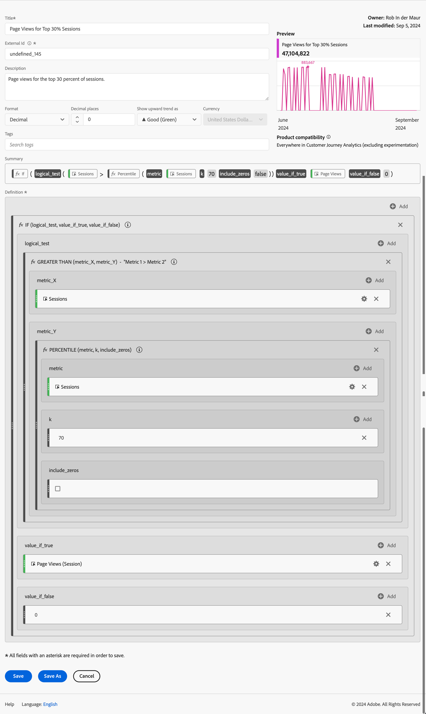

# Beispiele für berechnete Metriken

Dieser Artikel zeigt Beispiele für die Definition erweiterter berechneter Metriken.

## Absprungrate

Sie möchten die Absprungrate berechnen.

+++ Details

Die Definition eines Bounce dient einer weiteren Diskussion. In diesem Beispiel definieren Sie jedoch einen Filter für Bounce-Ereignisse, bei dem der Sitzungsstart gleich 1 und der Sitzungsende gleich 1 ist. Sie verwenden diesen Filter, um die Rate von nicht beendeten Sitzungen zu Sitzungen zu definieren.

### Filter

### Berechnete Metrik

### Abgeleitete Felder

Alternativ können Sie eine [Absprungrate mithilfe abgeleiteter Felder](/help/data-views/derived-fields/derived-fields.md#bounces) definieren.

Abgeleitete Felder sind Teil einer Datenansicht, die den Vorteil hat, dass nicht jeder Benutzer die Definition einer Absprungratenmetrik überschreiben oder ändern kann. Dieser Vorteil führte auch zu einer Einschränkung. Benutzer, die keinen Zugriff auf eine Datenansicht haben, können keine abgeleiteten Felder verwenden und müssen Filter und berechnete Metriken verwenden, um eine Absprungrate zu definieren.

Weitere Hintergrundinformationen zur Berechnung von Absprüngen und Absprungraten in Customer Journey Analytics finden Sie in diesem [Blogpost](https://experienceleaguecommunities.adobe.com/t5/adobe-analytics-blogs/calculating-bounces-amp-bounce-rate-in-adobe-customer-journey/ba-p/706446).

+++

## Bedingte Seitenansichten

Sie möchten eine berechnete Metrik definieren, die nur Seitenansichten für die Seiten berechnet, die in über 100 Sitzungen besucht wurden.

+++ Details

+++

## Seitenansichten für die 30 % wichtigsten Sitzungen

Sie möchten eine berechnete Metrik definieren, die nur Seitenansichten für die 30 % wichtigsten Sitzungen berechnet.

+++ Details

+++
