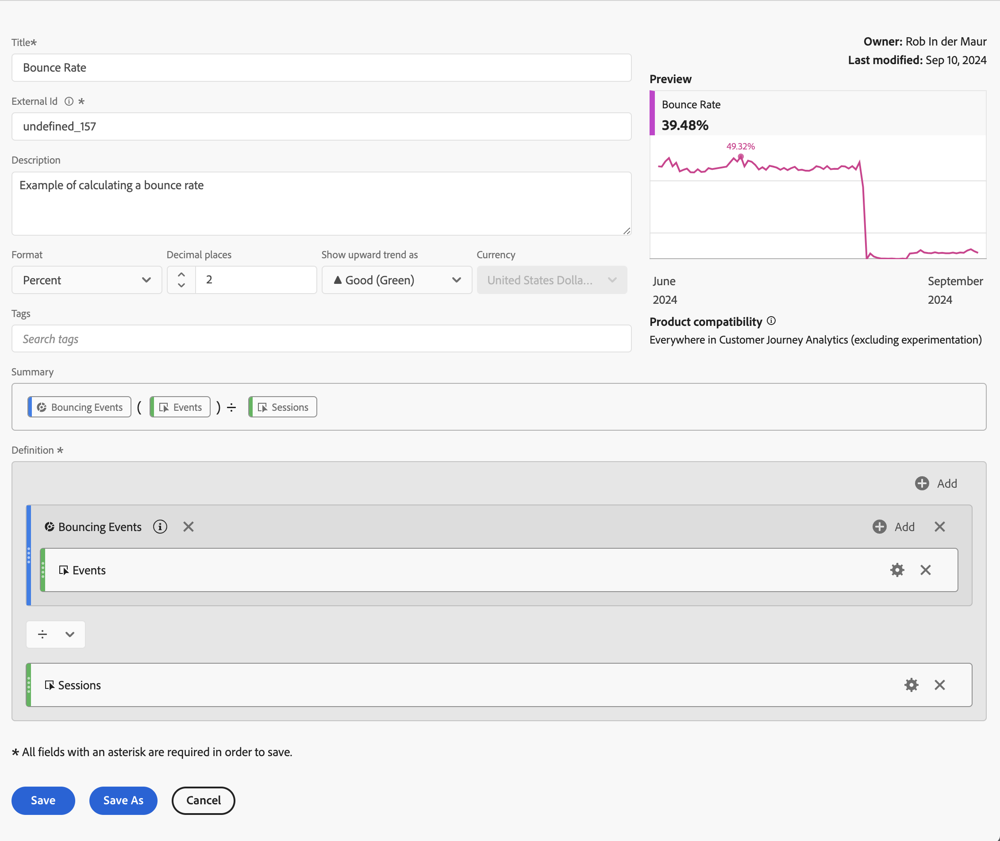

# Beispiele für berechnete Metriken

Dieser Artikel zeigt Beispiele zum Definieren erweiterter berechneter Metriken.

## Absprungrate

Sie möchten die Absprungrate berechnen.

+++ Details

Die Definition eines Bounces ist Thema einer anderen Diskussion, aber in diesem Beispiel definieren Sie ein Segment für Bounce-Ereignisse, bei dem Sitzungsbeginn gleich 1 und Sitzungsende gleich 1 ist. Sie verwenden dieses Segment, um die Rate der nicht zugestellten Sitzungen zu definieren.

### Segment

### Berechnete Metrik

### Abgeleitete Felder

Alternativ können Sie eine [Absprungrate“ mithilfe abgeleiteter Felder ](/help/data-views/derived-fields/derived-fields.md#bounces).

Abgeleitete Felder sind Teil einer Datenansicht, was den Vorteil hat, dass nicht jeder Benutzer die Definition einer Metrik für die Absprungrate überschreiben oder ändern kann. Dieser Vorteil führte auch zu einer Einschränkung. Benutzende, die keinen Zugriff auf eine Datenansicht haben, können keine abgeleiteten Felder verwenden und müssen auf Segmente und berechnete Metriken zurückgreifen, um eine Absprungrate zu definieren.

Weitere Hintergrundinformationen zur Berechnung von Bounces und Absprungraten in Customer Journey Analytics finden Sie in diesem [Blogpost](https://experienceleaguecommunities.adobe.com/t5/adobe-analytics-blogs/calculating-bounces-amp-bounce-rate-in-adobe-customer-journey/ba-p/706446?profile.language=de).

+++

## Bedingte Seitenansichten

Sie möchten eine berechnete Metrik definieren, die nur die Seitenansichten der Seiten berechnet, die in über 100 Sitzungen besucht wurden.

+++ Details

+++

## Seitenansichten für die 30 % wichtigsten Sitzungen

Sie möchten eine berechnete Metrik definieren, die nur die Seitenansichten für die wichtigsten 30 % Sitzungen berechnet.

+++ Details

+++
