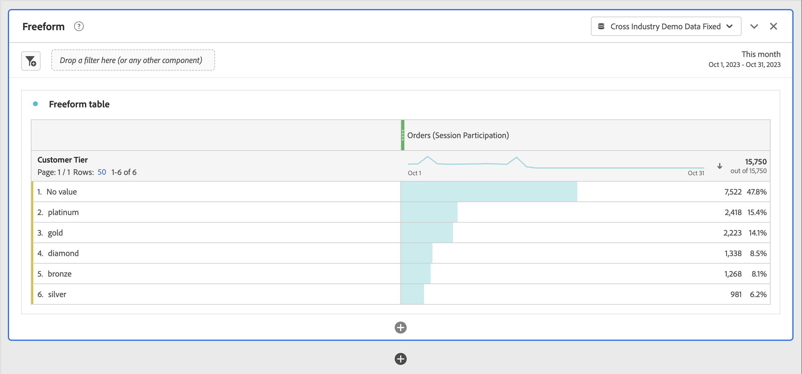

# Beitragsmetriken

Teilnehmermetriken werden verwendet, um zu quantifizieren, wie einzelne Werte für eine Dimension (wie Seitenansichten) zu Sitzungen, die eine bestimmte Metrik enthalten (wie Bestellungen), beitragen oder daran teilnehmen.

>[!NOTE]
>
>Admins können Metriken mit nicht standardmäßigen Attributionsmodellen wie „Teilnahme“ als Teil einer [Datenansicht“ &#x200B;](https://experienceleague.adobe.com/de/docs/analytics-platform/using/cja-dataviews/data-views). Weitere [&#x200B; finden Sie unter &#x200B;](../../../data-views/component-settings/attribution.md) der Attributionskomponente .

Die folgenden Schritte zeigen, wie jeder Benutzer mit der [Berechtigung Berechnete Metrik erstellen](/help/technotes//access-control.md#user-level-access) eine Teilnahmemetrik erstellen kann.

1. [Erstellen Sie eine berechnete &#x200B;](cm-workflow.md) und geben Sie der Metrik im [Generator für berechnete &#x200B;](cm-build-metrics.md)&quot; einen `Participation` oder etwas Ähnliches.
1. Ziehen Sie eine Metrik, die ein Erfolgsereignis enthält, z. B. [!DNL Orders], in den Bereich [!UICONTROL **[!UICONTROL Definition]**].
1. Wählen Sie Zahnrad) aus.
1. Wählen Sie im angezeigten Popup die Option **[!UICONTROL Nicht standardmäßiges Attributionsmodell verwenden]**, um das [Attributionsmodell](/help/components/calc-metrics/cm-workflow/m-metric-type-alloc.md) dieses Ereignisses für **[!UICONTROL Teilnahme]** zu definieren, und wählen Sie **[!UICONTROL Sitzung]** für den [!UICONTROL Container]. Wählen Sie **[!UICONTROL Übernehmen]** zur Bestätigung aus.

   

   **(Teilnahme|Sitzung)** wird zum Komponentennamen für die Metrik hinzugefügt.

1. Wählen [!UICONTROL **Speichern**], um die Metrik zu speichern.
1. Verwenden Sie die berechnete Metrik in Ihrem Bericht. Verwenden Sie beispielsweise die berechnete [!DNL Orders (Session Participation)]-Metrik in einem Bericht, um anzuzeigen, welche Kundenebene zu Sitzungen beigetragen hat, die eine Bestellung enthielten (oder daran teilgenommen hat).

   
