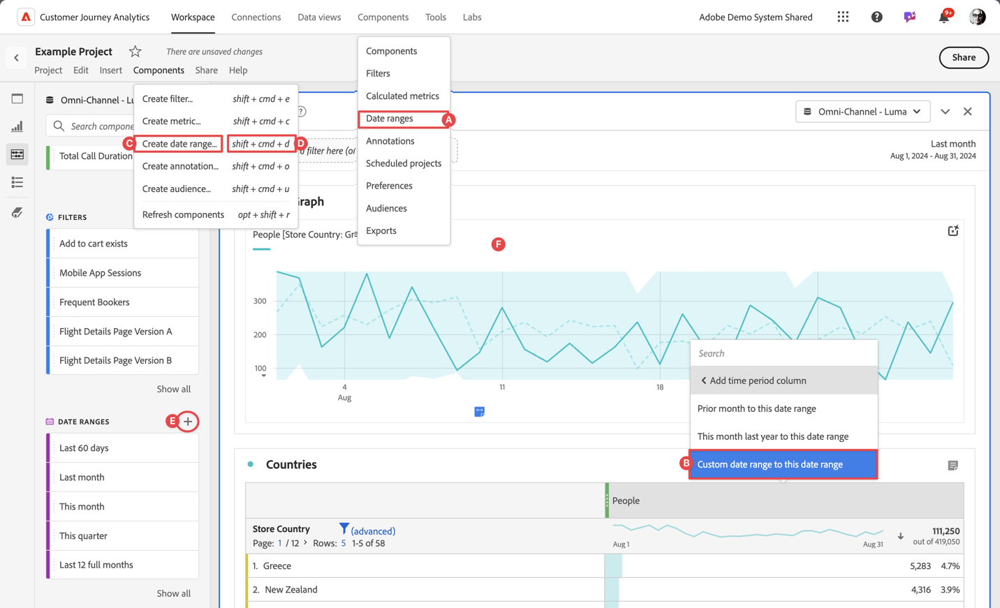

# Erstellen von Datumsbereichen


Jeder kann einen benutzerdefinierten Datumsbereich erstellen. Sie können einen Datumsbereich wie folgt erstellen:



* ?? Wählen Sie in der Hauptbenutzeroberfläche **[!UICONTROL Komponenten]** und dann **[!UICONTROL Datumsbereich]** aus. Wählen Sie  [!UICONTROL **[!UICONTROL Add]**] aus dem [[!UICONTROL Datumsbereich] manager](/help/components/date-ranges/manage.md).
* ?? Wählen Sie in einem Workspace-Projekt im Kontextmenü einer Visualisierung **[!UICONTROL Benutzerdefinierter Datumsbereich für diesen Datumsbereich]** aus.
* ?? Wählen Sie in einem Workspace-Projekt **[!UICONTROL Komponenten]** aus dem Menü und dann **[!UICONTROL Datumsbereich erstellen]** aus.
* ?? Verwenden Sie in einem Workspace-Projekt die Tastenkombination &quot;**[!UICONTROL Strg+Umschalt+D]**&quot;(Windows) bzw. &quot;**[!UICONTROL Umschalt+Befehl+D]**&quot;(macOS).
* ?? Wählen Sie in einem Workspace-Projekt im linken Bedienfeld &quot;Komponenten&quot;unter  **Datumsbereiche** die Option  aus.

Um die Anmerkung zu definieren, verwenden Sie den [[!UICONTROL Generator für Datumsbereiche]](#annotation-builder):

<!-- Should we really mention API here. If so, we can do it all over the place in the docs...
| **Use the [Customer Journey Analytics Annotations API](https://developer.adobe.com/cja-apis/docs/endpoints/annotations/)** | The Customer Journey Analytics Annotations APIs allow you to create, update, or retrieve annotations programmatically through Adobe Developer. These APIs use the same data and methods that Adobe uses inside the product UI. |
-->


## Generator für Datumsbereiche {#date-range-builder}

<!-- markdownlint-disable MD034 -->

>[!CONTEXTUALHELP]
>id="cja_components_dateranges_endtime"
>title="Endzeit"
>abstract="Endzeiten umfassen immer 59 Sekunden."

<!-- markdownlint-enable MD034 -->


Das Dialogfeld **[!UICONTROL Neuer Datumsbereich]** oder **[!UICONTROL Datumsbereich bearbeiten]** wird verwendet, um neue Datumsbereiche zu erstellen oder bestehende zu bearbeiten.


1. Geben Sie einen **[!UICONTROL Titel]** für den Datumsbereich an. Beispiel: **[!UICONTROL vierteljährlich]**.
1. Geben Sie optional eine **[!UICONTROL Beschreibung]** an.
1. Organisieren Sie den Filter, indem Sie einen oder mehrere **[!UICONTROL Tags]** erstellen oder anwenden. Beginnen Sie mit der Eingabe, um vorhandene Tags zu finden, die Sie auswählen können. Oder drücken Sie **[!UICONTROL EINGABETASTE]** , um ein neues Tag hinzuzufügen. Wählen Sie  aus, um ein Tag zu entfernen. |
1. Wählen Sie einen **[!UICONTROL Datumsbereich]** aus, indem Sie zuerst das Startdatum und dann das Enddatum auswählen.
Alternativ können Sie eine **[!UICONTROL Vorgabe]** aus dem Dropdown-Menü [!UICONTROL *Vorgabe auswählen*] auswählen.

1. Wählen Sie optional **[!UICONTROL Erweiterte Einstellungen anzeigen]** aus, um:

   * Geben Sie **[!UICONTROL Startzeit]** und **[!UICONTROL Endzeit]** außer den Standardwerten `12:00 AM` (`0:00`) und `11:59 PM` (`23:59`) an. Endzeiten umfassen immer 59 Sekunden. Für einen Datumsbereich, der viele Tage umfasst, gilt die Startzeit für den ersten Tag des Datumsbereichs und die Endzeit für den letzten Tag in Ihrem Datumsbereich. Verwenden Sie **[!UICONTROL (Zeitwerte zurücksetzen)]** , um die Start- und Endzeit auf ihre Standardwerte zurückzusetzen.
   * **[!UICONTROL Verwenden Sie rollierende Datumswerte]**. Wenn diese Option aktiviert ist, werden voreingestellte Datumsbereiche wie **[!UICONTROL Letzte 7 volle Tage]** dynamisch als aktueller Fortschritt von Datum und Uhrzeit aktualisiert. Wenn diese Option deaktiviert ist, werden diese Vorgaben nach der Anwendung nicht aktualisiert.

     Sie können den Text in eckigen Klammern auswählen (z. B. **[!UICONTROL Fester Start - Rollierender Quartalsstart]**), um den Bereich zu erweitern, und Details für **[!UICONTROL Start]** und **[!UICONTROL Ende]** angeben.

     

      1. Wählen Sie **[!UICONTROL Start von]**, **[!UICONTROL Ende von]** oder **[!UICONTROL Fester Tag]** aus.
      1. Wenn Sie **[!UICONTROL Beginn von]** oder **[!UICONTROL Ende von]** ausgewählt haben, können Sie einen vollständigen Ausdruck erstellen. Beispiel: **[!UICONTROL Ende von]** **[!UICONTROL aktuelles Quartal]** **[!UICONTROL minus]** `20` **[!UICONTROL Tage]**. Wählen Sie den entsprechenden Wert für jeden einzelnen Teil des Ausdrucks aus.
         * Wählen Sie einen Wert für den aktuellen Wert aus. Beispiel: **[!UICONTROL Aktuelles Quartal]**.
         * Wählen Sie einen Wert für die zusätzliche Berechnung aus. Beispiel: **[!UICONTROL minus]**.
         * Wenn Sie eine zusätzliche Berechnung angegeben haben, geben Sie einen Wert an. Zum Beispiel `20`.
         * Wenn Sie eine zusätzliche Berechnung angegeben haben, wählen Sie den Zeitraum aus, der für die Berechnung verwendet werden soll. Beispiel: **[!UICONTROL days]**.

     Wählen Sie **[!UICONTROL Details ausblenden]** aus, um die Details für die Berechnung rollierender Datumswerte auszublenden.

1. Wählen Sie :
   * **[!UICONTROL Speichern]** zum Speichern des Datumsbereichs.
   * **[!UICONTROL Speichern unter]** , um eine Kopie des Datumsbereichs zu speichern.
   * **[!UICONTROL Abbrechen]** , um alle Änderungen abzubrechen, die Sie am Datumsbereich vorgenommen haben, oder um die Erstellung eines neuen Datumsbereichs abzubrechen.


<!--


You can create a date range using either of the following two methods:

* Directly in a workspace project by clicking the '`+`' button next to the list of date range components on the left
* Within the date range manager

To create a date range in the date range manager:

1. Log in to [analytics.adobe.com](https://analytics.adobe.com) using your AdobeID credentials.
1. Navigate to [!UICONTROL Components] > [!UICONTROL Date Ranges].
1. Click the [!UICONTROL Add] button to open the modal window that creates a date range.

## Create a date range modal window

The modal window has four fields you can edit:

* **Date range**: The date range you want for this component.
* **Title**: The name you want for this component. The title is used in workspace projects.
* **Description**: The description you want for this component. The description is seen when clicking the  icon.
* **Tags**: Use tags to organize your date ranges. A date range can belong to multiple tags.

## Selecting a date range

When clicking the date range in the modal window, you have several options:

* **Calendar**: Select the start and end date.
* **Use rolling dates**: Check this box if you want the date range to change as time goes on. Do not check this box if you want your date range to remain static.
* **Select preset**: Use this drop-down selection if you want a custom date range based on a range that Adobe offers by default. When you select a preset, you can further customize the date range to suit your needs. It does not affect the preset that Adobe offers.

## Rolling date ranges

If you want a rolling date range, you can customize when it rolls. You can control when the start and end dates roll independently of each other.

* **When the date starts**: Choose if the date starts at the beginning of a time period, at the end of a time period, or use a fixed day.
* **The time period to use**: Choose how often the date range rolls. You can have it roll every day, every week, every month, every quarter, or every year.
* **Offset**: Choose the offset of the date range. You can add or subtract days, weeks, months, quarters, or years.

## Rolling date examples

Some date ranges can be useful in certain reports.

Year-to-date:

```text
Start: Start of current year
End: End of current day
```

Last Thursday to this Thursday:

```text
Start: Start of current week minus 3 days
End: Start of current week plus 4 days
```

Fiscal year (for example, if a fiscal year starts in December)

```text
Start: Start of current year minus 1 month
End: End of current year minus 1 month
```


-->