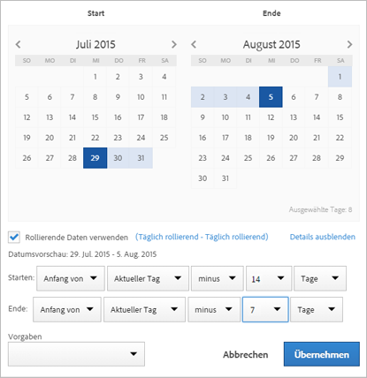

# Beispiel für benutzerdefinierte Datumsbereiche

Dieser Artikel zeigt weitere Beispiele für benutzerdefinierte Datumsbereiche.

## Letzte vor zwei Monaten

+++ Details

Sie möchten einen benutzerdefinierten Datumsbereich definieren, der vor zwei Monaten definiert wurde. Sie verwenden eine der Vorgaben.

+++

## Rollierend bis Ende letzter Woche

+++ Details

Sie möchten einen Datumsbereich definieren, der den Zeitraum zwischen dem aktuellen Tag vor einer Woche und dem Ende derselben letzten Woche definiert. Wenn heute beispielsweise Mittwoch, der 11. September 2024 ist. Sie möchten einen Datumsbereich von Mittwoch, 4. September 2024 bis Samstag, 7. September 2024.

+++

<!--
## Example: Use a 7-day rolling date range

You can create a date range that specifies a 7-day rolling window that ends one week ago:

Use *`rolling daily`*.

* The Start settings would be *`current day minus 6 days`*.

* The End settings would be *`current day minus 7 days`*.

This date range can be a component that you drag onto any freeform table.
-->