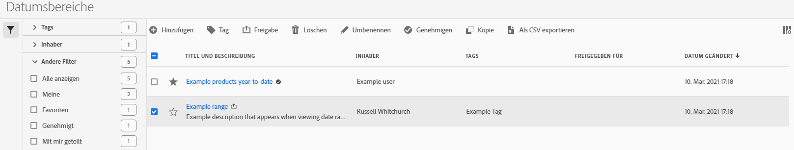

# Verwalten von Datumsbereichen

Sie können Datumsbereiche freigeben, filtern, taggen, genehmigen, kopieren, freigeben und löschen und Datumsbereiche über eine zentrale Verwaltungsoberfläche von [!UICONTROL Datumsbereiche] als Favoriten markieren. So verwalten Sie Datumsbereiche:

* Wählen Sie **[!UICONTROL Komponenten]** in der Hauptbenutzeroberfläche und dann **[!UICONTROL Datumsbereiche]** aus.

## Datumsbereichsmanager

Der Datumsbereichsmanager verfügt über die folgenden Elemente der Benutzeroberfläche:

### Liste der Datumsbereiche

In der Datumsbereichsliste werden alle Datumsbereiche angezeigt. Die Liste enthält die folgenden Spalten:

| Spalte | Beschreibung |
| --- | --- | 
|  | Wählen Sie aus, um einen Datumsbereich für  zu bevorzugen oder  nicht zu bevorzugen. |
| **[!UICONTROL Titel und Beschreibung]** | Um den Titel und die Beschreibung zu bearbeiten, wählen Sie den Titel-Link aus, der den [Generator für Datumsbereiche](/help/components/date-ranges/create.md#date-range-builder) öffnet. |
| **[!UICONTROL Inhabende]** | Der Eigentümer des Datumsbereichs. |
| **[!UICONTROL Tags]** | Die Tags für diesen Datumsbereich. |
| **[!UICONTROL Freigegeben für]** | Die Personen oder Gruppen, für die Sie den Datumsbereich freigegeben haben. Wählen Sie diese Option aus, um das Dialogfeld **[!UICONTROL Datumsbereich freigeben]** zu öffnen. |
| **[!UICONTROL Datum geändert]** | Zeigt Datum und Uhrzeit der letzten Änderung des Datumsbereichs an. |

{style="table-layout:auto"}

Verwenden Sie  , um anzugeben, welche Spalten angezeigt werden sollen.

### Symbolleiste

Sie können Datumsbereiche in der Aktionsleiste aufrufen. Die Aktionsleiste enthält die folgenden Aktionen:

| Aktion | Beschreibung |
|---|---|
|  **[!UICONTROL Add]** | Fügen Sie mit dem [Generator für Datumsbereiche](create.md#date-range-builder) einen weiteren Datumsbereich hinzu. |
|  [!UICONTROL *Suche nach Titel*] | Wenn in der Liste kein Datumsbereich ausgewählt ist, suchen Sie mithilfe dieses Suchfelds nach Datumsbereichen. |
|  **[!UICONTROL Tag]** | Taggen Sie die ausgewählten Datumsbereiche. Wählen Sie im Dialogfeld **[!UICONTROL Datumsbereich taggen]** die Tags für die ausgewählten Datumsbereiche aus oder heben Sie die Auswahl auf. Wählen Sie **[!UICONTROL Speichern]** aus, um die Tags für die ausgewählten Datumsbereiche zu speichern. |
|  **[!UICONTROL share]** | Geben Sie die ausgewählten Datumsbereiche frei. Im Dialogfeld **[!UICONTROL Datumsbereich freigeben]** können Sie  *Nach Personen oder Gruppen suchen* oder Sie können **[!UICONTROL Organisation]** oder **[!UICONTROL Gruppen]** auswählen. Wählen Sie **[!UICONTROL Speichern]** aus, um Freigabedetails für die ausgewählten Datumsbereiche zu speichern. |
|  **[!UICONTROL Löschen]** | Löschen Sie die ausgewählten Datumsbereiche. Sie werden zur Bestätigung aufgefordert. |
|  **[!UICONTROL Umbenennen]** | Umbenennen eines einzelnen ausgewählten Datumsbereichs Wenn diese Option aktiviert ist, können Sie den Datumsbereich inline umbenennen. |
|  **[!UICONTROL Approve]** | Genehmigen Sie die ausgewählten Datumsbereiche. |
|  **[!UICONTROL Kopieren]** | Kopieren Sie die ausgewählten Datumsbereiche. Neue Datumsbereiche werden mit demselben Namen und Suffix (Kopieren) erstellt. |
|  **[!UICONTROL Export in CSV]** | Exportieren Sie die ausgewählten Datumsbereiche in eine `Date ranges List.csv` -Datei. |

### Aktive Filterleiste

Die Filterleiste zeigt die aktiven Filter an (falls vorhanden). Mit  können Sie schnell einen Filter entfernen. Wenn mehr als ein Filter angegeben ist, verwenden Sie **[!UICONTROL Alle entfernen]** , um alle Filter zu entfernen.

### Filterbereich

Sie können Datumsbereiche mithilfe des linken Fensterbereichs &quot; **[!UICONTROL Filter]**&quot;filtern. Im Filterbereich werden der Filtertyp und die Anzahl der Datumsbereiche angezeigt, die den Filter berücksichtigen. Wählen Sie  aus, um die Anzeige des Filterbereichs umzuschalten.

So filtern Sie die Filterliste:

1. Wählen Sie  aus, um den Bereich &quot;Filter&quot;zu öffnen. Wenn Sie mehr Platz für die Liste &quot;Filter&quot;benötigen, können Sie  erneut auswählen, um den Bereich zu schließen.
1. Sie können die Datumsbereiche mit einem der verfügbaren [Filterabschnitte](#filter-sections) filtern.

   >[!INFO]
   >
   >*Elemente* beziehen sich auf die Datumsbereichselemente, die in der [Liste der Datumsbereiche](#date-ranges-list) angezeigt werden.
   > 

#### Filterabschnitte

{{tagfiltersection}}
{{ownerfiltersection}}
{{otherfiltersfiltersection}}

Die [Liste der Datumsbereiche](#date-ranges-list) wird automatisch entsprechend Ihrer Filterkonfiguration aktualisiert. Die konfigurierten Filter werden in der [aktiven Filterleiste](#active-filter-bar) angezeigt.

## Datumsbereiche bearbeiten

Sie können einen Datumsbereich auf zwei Arten bearbeiten:

* Verwenden Sie in einem Workspace-Projekt das Symbol [Komponenteninformationen](/help/components/use-components-in-workspace.md#component-info) .

* Wählen Sie in der Liste [[!UICONTROL Datumsbereiche] den Titel des Datumsbereichs aus.](#date-ranges-list)

Verwenden Sie den [Generator für Datumsbereiche](/help/components/date-ranges/create.md#date-range-builder), um den Datumsbereich zu bearbeiten.

Verwenden Sie den Datumsbereichs-Manager, um Datumsbereiche freizugeben, umzubenennen oder zu löschen. So greifen Sie auf den Datumsbereichs-Manager zu:

1. Melden Sie sich mit Ihren Adobe ID-Anmeldeinformationen bei [analytics.adobe.com](https://analytics.adobe.com) an.
1. Navigieren Sie zu [!UICONTROL Komponenten] > [!UICONTROL Datumsbereiche].

<!--

## Interface

The date range manager includes the following options:

* **Add**: Create a new date range. See [create a date range](create.md) for more information.
* **Search by title**: Search for a date range by title. Results are filtered based on text entered here.
* **Filter**: Filter date ranges using the left column. You can filter by custom tag, owner, created by you, your favorites, approved, or shared with you. You can also search for desired filters.
* **Favorite**: Click the  icon next to a date range to add it to your favorites.
* **Customize columns**: Click the  icon to show or hide columns in the date range manager.

Click the checkbox next to one or more date ranges for more options.

* **Tag**: Apply a tag to all selected date ranges. Tags help you organize date ranges, and let you filter them using the left column.
* **Share**: Share a date range to other Experience Cloud users. If you are a product administrator, you can also share to the entire organization or groups. Date ranges that are shared to other users in your organization include a  icon next to the title.
* **Delete**: Permanently delete the selected date range(s).
* **Rename**: If a single date range is selected, you can change its title.
* **Approve**: If you are a product admin, you can add a stamp of approval to a date range. Approved date ranges inform users in your organization that they are 'official', differentiating them from date ranges created by other users in your organization. Approved date ranges include a  icon next to the title.
* **Unapprove**: If you are a product admin and select a date range that is already approved, you can unapprove it.
* **Copy**: Create a copy of the selected date range(s). Copying date ranges appends `(Copy)` to the end of the title of the newly copied date range(s).
* **Export to CSV**: Exports all selected date ranges into a CSV file. Columns in the resulting CSV file include all visible columns in the date range manager.
-->