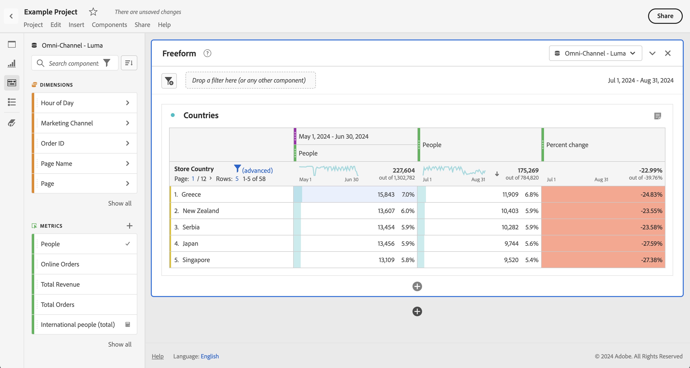
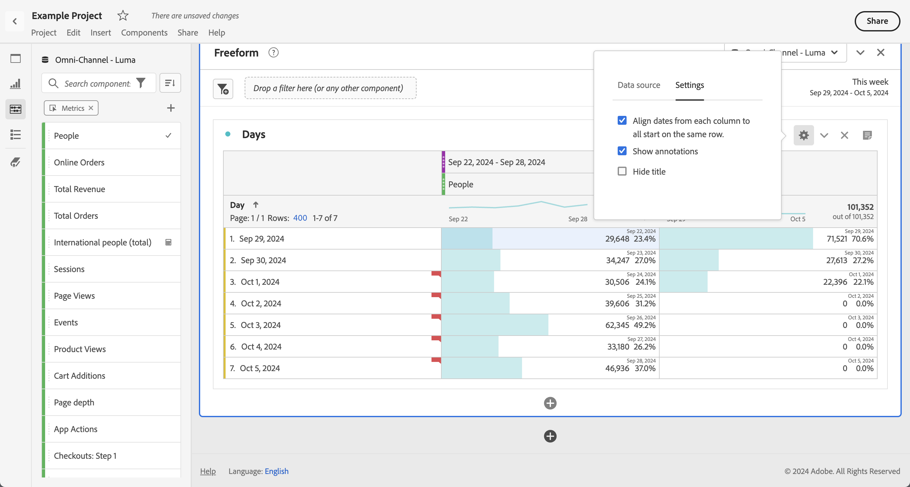

# Datumsvergleich

Mit dem Datumsvergleich in Analysis Workspace können Sie eine beliebige Spalte mit einem Datumsbereich verwenden und einen allgemeinen Datumsvergleich erstellen, z. B. Jahres-, Quartals- oder Monatsvergleich.

## Zeiträume vergleichen

Für Analysen wird Kontext benötigt, der oft durch einen vorherigen Zeitraum geliefert wird. Zum Beispiel die Frage *Wie viel besser oder schlechter geht es Ihnen jetzt im Vergleich zu dieser Zeit im letzten Jahr?* ist grundlegend für das Verständnis Ihres Unternehmens. Der Datumsvergleich enthält automatisch eine Spalte *Differenz*, die die prozentuale Veränderung im Vergleich zu einem bestimmten Zeitraum angibt.

1. Erstellen Sie eine [Freiformtabelle](/help/analysis-workspace/visualizations/freeform-table/freeform-table.md) mit beliebigen Dimensionen und Metriken, die Sie mit einem bestimmten Zeitraum vergleichen möchten.
1. Legen Sie den Zeitraum im Panel oder in der Spalte fest, um den Vergleichszeitrahmen zu bestimmen und um anzugeben, ob es sich um einen rollierenden oder einen festen Zeitvergleich handelt.

   Zum Erstellen eines rollierenden Zeitvergleichs legen Sie für den Datumsbereich des Bedienfelds oder der Spalte einen rollierenden Datumsbereich fest (z. B. **[!UICONTROL Letzte 7 Tage]**, **[!UICONTROL Letzte 30 Tage]** usw.).

   Zum Erstellen eines festen Zeitvergleichs legen Sie für den Datumsbereich des Panels oder der Spalte einen benutzerdefinierten Datumsbereich fest.

1. Öffnen Sie das Kontextmenü für eine Tabellenzeile und wählen Sie **[!UICONTROL Zeiträume vergleichen]** aus.

   

   >[!NOTE]
   >
   >Diese Kontextmenüoption ist für Metrikzeilen, Datumsbereichzeilen und Zeitdimensionszeilen deaktiviert.

1. Abhängig davon, wie Sie den Datumsbereich der Tabelle festgelegt haben, stehen Ihnen die folgenden Vergleichsoptionen zur Verfügung:

   | Option | Beschreibung |
   |---|---|
   | **[!UICONTROL Vorherige *x* Wochen/Monate/Quartale/Jahre bis zu diesem Datumsbereich]** | Vergleich mit dem ausgewählten Datumsbereich unmittelbar vor diesem Datumsbereich. |
   | **[!UICONTROL Diese x Wochen/Monate/Quartale/Jahre im letzten Jahr vor diesem Datumsbereich]** | Vergleich mit demselben Datumsbereich vor einem Jahr. |
   | **[!UICONTROL Benutzerdefinierter Datumsbereich vor diesem Datumsbereich]** | Ermöglicht die Definition eines benutzerdefinierten Datumsbereichs. |

   >[!NOTE]
   >
   >Wenn Sie eine benutzerdefinierte Anzahl an Tagen auswählen, z. B. 7.–20. Oktober (ein Zeitraum von 14 Tagen), stehen nur zwei Optionen zur Verfügung: **[!UICONTROL Vorhergehende 14 Tage vor diesem Datumsbereich]** und **[!UICONTROL Benutzerdefinierter Datumsbereich vor diesem Datumsbereich]**.

1. Der resultierende Vergleich sieht wie folgt aus:

   

   Zeilen in der Spalte „Prozentuale Veränderung“ sind rot bei negativen Werten und grün bei positiven Werten.

## Hinzufügen einer Zeitraumspalte zum Vergleich

Sie können jetzt allen Spalten in einer Tabelle Zeiträume hinzufügen. So können Sie einen Zeitraum hinzufügen, der von dem abweicht, auf den Ihr Kalender eingestellt ist.

1. Klicken Sie mit der rechten Maustaste auf eine Spalte in der Tabelle und wählen Sie **[!UICONTROL Spalte für Zeitraum hinzufügen]** aus

   

1. Abhängig davon, wie Sie den Datumsbereich der Tabelle festgelegt haben, stehen Ihnen die folgenden Vergleichsoptionen zur Verfügung:

   | Option | Beschreibung |
   |---|---|
   | **[!UICONTROL Vorherige *x* Wochen/Monate/Quartale/Jahre bis zu diesem Datumsbereich]** | Fügen Sie unmittelbar vor diesem Datumsbereich eine Spalte mit dem Wochentag/Monat usw. hinzu. |
   | **[!UICONTROL Diese *x* Wochen/Monate/Quartale/Jahre im letzten Jahr vor diesem Datumsbereich]** | Fügt denselben Datumsbereich des Vorjahres hinzu. |
   | **[!UICONTROL Benutzerdefinierter Datumsbereich vor diesem Datumsbereich]** | Ermöglicht die Erstellung eines benutzerdefinierten Datumsbereichs. |

   >[!NOTE]
   >
   >Wenn Sie eine benutzerdefinierte Anzahl an Tagen auswählen, z. B. 7.–20. Oktober (ein Zeitraum von 14 Tagen), stehen nur zwei Optionen zur Verfügung: **[!UICONTROL Vorhergehende 14 Tage vor diesem Datumsbereich]** und **[!UICONTROL Benutzerdefinierter Datumsbereich vor diesem Datumsbereich]**.

1. Der Zeitraum wird am Anfang der ausgewählten Spalte eingefügt:

   

1. Sie können so viele Zeitspalten hinzufügen, wie Sie möchten, sowie verschiedene Datumsbereiche kombinieren:

1. Sie können außerdem nach jeder Spalte sortieren. Dadurch wird die Reihenfolge der Tage abhängig von der jeweiligen Spalte geändert.

## Beginn der Spaltendaten an derselben Zeile ausrichten

Sie können die Daten in den einzelnen Spalten so ausrichten, dass sie alle in derselben Zeile beginnen.

Sie führen beispielsweise einen Tagesvergleich für die letzte Woche (bis zum 5. Oktober 2024) und die vorherige Woche durch. Standardmäßig beginnt die linke Spalte am 22. September und die rechte Spalte am 29. September.

Sie können unter [Einstellungen](/help/analysis-workspace/visualizations/freeform-table/freeform-table.md#settings-1) für die Freiformtabellen-Visualisierung die Option **[!UICONTROL Datum in allen Spalten ausrichten, sodass es in derselben Zeile beginnt]** aktivieren, um Spaltendaten so anzuordnen, dass sie in derselben Zeile beginnen.

Beachten Sie beim Verwenden dieser Option Folgendes:

* Diese Einstellung ist standardmäßig für alle neuen Projekte aktiviert.

* Diese Einstellung gilt für die gesamte Tabelle. Wenn Sie diese Einstellung beispielsweise für eine Aufschlüsselung innerhalb der Tabelle ändern, wird die Einstellung auf die gesamte Tabelle angewendet.

