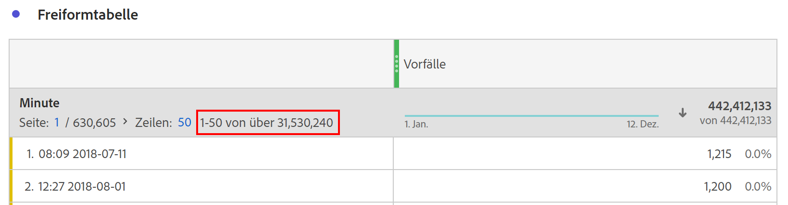

# Dimensionen hoher Kardinalität

Bei Verwendung einer Dimension, die viele eindeutige Werte enthält, kann der resultierende Bericht zu viele eindeutige Dimensionselemente enthalten, um sie anzuzeigen oder zu berechnen. Die Ergebnisse werden abgeschnitten, indem Dimensionselemente entfernt werden, die als am wenigsten wichtig erachtet werden. Diese Optimierungen werden vorgenommen, um die Projekt- und Produktleistung zu erhalten.

Wenn Sie einen Bericht mit zu vielen eindeutigen Werten anfordern, zeigt Analysis Workspace in der Kopfzeile der Dimension einen Indikator an, der angibt, dass nicht alle Dimensionselemente enthalten sind. Beispiel: **[!UICONTROL : 1-50 von mehr als 22.343.156]**. Das **[!UICONTROL -Schlüsselwort]** more than“ zeigt an, dass der Bericht optimiert wurde, um die wichtigsten Dimensionselemente zurückzugeben.

## Bestimmen, welche Dimensionselemente angezeigt werden sollen

Customer Journey Analytics verarbeitet Berichte zum Zeitpunkt ihrer Ausführung und verteilt den kombinierten Datensatz an mehrere Server. Die Daten pro Verarbeitungs-Server werden nach Personen-ID gruppiert, d. h., ein einzelner Verarbeitungs-Server enthält alle Daten für eine bestimmte Person. Sobald ein Server die Verarbeitung abgeschlossen hat, übergibt er seine Teilmenge der verarbeiteten Daten an einen Aggregator-Server. Alle Teilmengen verarbeiteter Daten werden kombiniert und in Form eines Workspace-Berichts zurückgegeben.

Wenn ein einzelner Server Daten verarbeitet, die einen eindeutigen Schwellenwert überschreiten, werden die Ergebnisse gekürzt, bevor die verarbeitete Teilmenge der Daten zurückgegeben wird. Abgeschnittene Dimensionselemente werden basierend auf der Metrik bestimmt, die für die Sortierung verwendet wird.

Wenn es sich bei der Sortiermetrik um eine berechnete Metrik handelt, verwendet der Server die Metriken innerhalb der berechneten Metrik, um zu bestimmen, welche Dimensionselemente abgeschnitten werden sollen. Da berechnete Metriken mehrere Metriken unterschiedlicher Bedeutung enthalten können, können die Ergebnisse weniger genau sein. Beispielsweise werden bei der Berechnung des „Umsatzes pro Person“ der Gesamtbetrag der Einnahmen und die Gesamtzahl der Personen zurückgegeben und vor der Teilung aggregiert. Daher wählt jeder einzelne Verarbeitungs-Server aus, welche Elemente entfernt werden sollen, ohne zu wissen, wie sich die Ergebnisse auf die Sortierung insgesamt auswirken.

Obwohl einige einzelne Dimensionselemente in Berichten mit hoher Kardinalität fehlen können, sind die Spaltensummen korrekt und basieren nicht auf abgeschnittenen Daten. Die Funktion „Distinct Count“ in berechneten Metriken ist ebenfalls nicht von abgeschnittenen Dimensionselementen betroffen.

## Best Practices für Dimensionen mit hoher Kardinalität

Die beste Möglichkeit, Dimensionen mit hoher Kardinalität zu berücksichtigen, besteht darin, die Anzahl der Dimensionselemente zu begrenzen, die ein Bericht verarbeitet. Da alle Berichte zum Zeitpunkt ihrer Anforderung verarbeitet werden, können Sie die Berichtsparameter für sofortige Ergebnisse anpassen. Adobe empfiehlt eine der folgenden Optimierungen für Dimensionen mit hoher Kardinalität:

* Verwenden Sie ein [Segment](/help/components/segments/seg-create.md). Segmente gelten zu dem Zeitpunkt, zu dem jeder Server eine Teilmenge von Daten verarbeitet.
* Verwenden Sie eine Suche. Dimension-Elemente, die vom Suchbegriff ausgeschlossen sind, werden aus den Berichtsergebnissen entfernt, sodass die Wahrscheinlichkeit höher ist, dass die gewünschten Dimensionselemente angezeigt werden.
* Verwenden Sie eine Lookup-Datensatzdimension. Lookup-Datensatzdimensionen kombinieren Elemente von Ereignis-Datensatzdimensionen, die die Anzahl der zurückgegebenen eindeutigen Werte begrenzen.
* Verwenden Sie die [Einschließen/ausschließen](/help/data-views/component-settings/include-exclude-values.md) im Datenansichts-Manager.
* Kürzen Sie den Datumsbereich der Anfrage. Wenn im Laufe der Zeit viele eindeutige Werte gesammelt werden, kann eine Verkürzung des Datumsbereichs des Workspace-Berichts die Anzahl der eindeutigen Werte für die zu verarbeitenden Server einschränken.
* Erwägen Sie [vollständigen Tabellenexport](/help/analysis-workspace/export/export-cloud.md), um alle Zeilen der Tabelle zurückzugeben.
