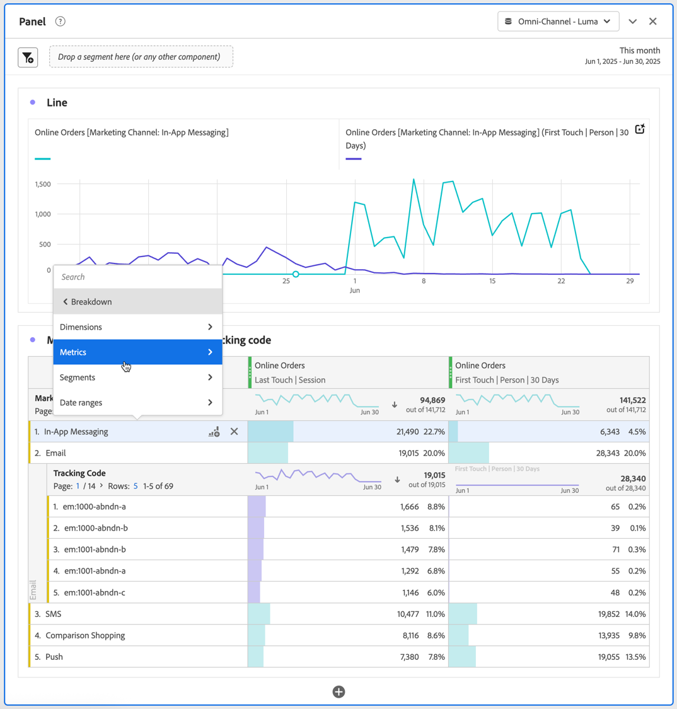

# Aufschlüsseln von Dimensionen in Workspace

Sie können Ihre Daten unbegrenzt für Ihre spezifischen Anforderungen aufschlüsseln und Abfragen mithilfe relevanter Metriken, Dimensionen, Filter, Zeitlinien und anderer Analyseaufschlüsselungswerte erstellen.

1. Wählen Sie in einer [Freiformtabelle](/help/analysis-workspace/visualizations/freeform-table/freeform-table.md) im Kontextmenü einer oder mehrerer ausgewählter Zeilen die Option **[!UICONTROL Aufschlüsselung]** .

   

1. Wählen Sie im Untermenü **[!UICONTROL Dimensionen]**, **[!UICONTROL Metriken]**, **[!UICONTROL Filter]** oder **[!UICONTROL Datenbereiche]** aus und wählen Sie dann ein Element aus.

Sie können Metriken nach Dimensionselementen oder Zielgruppenfiltern über ausgewählte Zeiträume aufschlüsseln. Sie können auch noch granularer aufschlüsseln.

>[!NOTE]
>
>Die Anzahl der in der Tabelle angezeigten Aufschlüsselungen ist auf 200 beschränkt. Dieses Limit erhöht sich beim Exportieren von Aufschlüsselungen.

## Aufschlüsselung nach Position

Standardmäßig sind Aufschlüsselungen auf statische Zeilenelemente fixiert. Angenommen, Sie unterteilen die drei wichtigsten Dimensionselemente der Seite (Startseite, Suchergebnisse, Checkout) nach Marketing-Kanal. Dann verlassen Sie das Projekt und kehren zwei Wochen später zurück. Beim erneuten Öffnen des Projekts haben sich die drei oberen Seiten geändert, und jetzt sind Startseite, Suchergebnisse und Checkout stattdessen die oberen Seiten vier bis sechs. Standardmäßig werden Ihre Marketing-Kanal-Aufschlüsselungen weiterhin unter Startseite, Suchergebnisse und Checkout angezeigt, auch wenn sie sich jetzt in den Zeilen 4 bis 6 befinden.

Im Gegensatz dazu werden bei **Aufschlüsselung nach Position** immer die drei obersten Elemente aufgeschlüsselt, unabhängig davon, welche Elemente vorhanden sind. Wenn Sie zum Beispiel zurückkehren und Ihr Projekt erneut öffnen, sind die Aufschlüsselungen des Marketing-Kanals an die drei oberen Seiten in der Tabelle gebunden. Und nicht zu Homepage, Suchergebnissen und Checkout, die jetzt in den Zeilen 4-6 sind. Informationen zum Konfigurieren dieser Einstellung finden Sie unter [Zeileneinstellungen](/help/analysis-workspace/visualizations/freeform-table/column-row-settings/table-settings.md) .

## Attributionsmodelle auf Aufschlüsselungen anwenden

Auf jede Aufschlüsselung innerhalb einer Tabelle kann auch ein beliebiges Attributionsmodell angewandt werden. Dieses Attributionsmodell kann mit der übergeordneten Spalte identisch sein oder sich von ihr unterscheiden. Sie können beispielsweise lineare Bestellungen in Ihrer Dimension „Marketing-Kanäle“ analysieren, jedoch U-förmige Bestellungen auf spezifische Trackingcodes in einem Kanal anwenden. Um das auf eine Aufschlüsselung angewendete Attributionsmodell zu bearbeiten, bewegen Sie den Mauszeiger über das Aufschlüsselungsmodell und wählen Sie **[!UICONTROL Bearbeiten]** aus.

Dies ist das erwartete Verhalten, wenn Attributionsmodelle auf Aufschlüsselungen angewendet oder bearbeitet werden:

* Wenn Sie eine Attribution anwenden und keine anderen Attributionen vorhanden sind, gilt die Attribution für die gesamte Spaltenstruktur.

* Wenn Sie eine Aufschlüsselung hinzufügen, nachdem eine Attribution angewendet wurde, wird für die hinzugefügte Aufschlüsselung der Standardwert verwendet (wenn diese Dimension einen Standardwert hat). Andernfalls wird die Aufschlüsselung aus der übergeordneten Spalte verwendet. Einige Dimensionen haben eine Standardzuordnung. Beispielsweise verwenden Zeitdimensionen und Referrer „Same Touch“. Die Dimension „Produkt“ verwendet „Last Touch“. Andere Dimensionen haben keinen Standardwert und verwenden die Zuordnung der übergeordneten Spalte.

* Wenn im Spaltenbaum bereits Zuordnungen vorhanden sind, wirkt sich eine Änderung der Zuordnung nur auf diejenige aus, die Sie gerade bearbeiten.

+++ Videos mit Erläuterungen zu Aufschlüsselungen anzeigen

Dimensionen in Analysis Workspace

>[!VIDEO](https://video.tv.adobe.com/v/23971)

Aufschlüsselungen der Dimension

>[!VIDEO](https://video.tv.adobe.com/v/23969)

Hinzufügen von Dimensionen und Metriken zu Ihrem Projekt in Analysis Workspace:

>[!VIDEO](https://video.tv.adobe.com/v/30606)

Arbeiten mit Dimensionen in einer Freiformtabelle:

>[!VIDEO](https://video.tv.adobe.com/v/40179)

Aufschlüsselung der Dimension nach Position:

>[!VIDEO](https://video.tv.adobe.com/v/24033)

{{videoaa}}

+++
