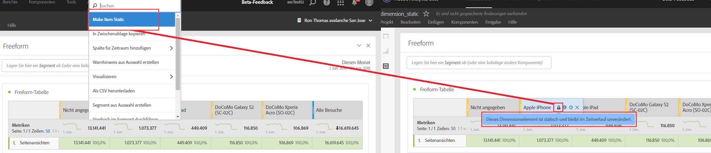

# Vorschau von Dimensionen in Analysis Workspace

Sie können die [Komponenteninformationen](/help/components/use-components-in-workspace.md#component-info) für eine Komponente verwenden, um die obersten Elemente für eine Dimension anzuzeigen.

<!--
Now, by default, we show dynamic values instead of static ones, with the option to turn them into static values. Other things to note:

* As your data updates, the dynamic dimension columns will update to show the current 5/15 dimension items.
* A dynamic dimension column that is copied or moved will become static.
* When hovering a static dimension column you will see a lock icon, indicating that the dimension is static.

-->

## Anzeige von Dimensionselementen

Wenn Sie  Dimension im Bedienfeld „Komponenten“ auswählen, wird eine Liste mit den Dimensionselementen angezeigt. Die Liste der Dimensionselemente zeigt normalerweise die wichtigsten Elemente der letzten 30 Tage an. Wenn weitere Elemente verfügbar sind, wählen Sie außerhalb des für das Bedienfeld ausgewählten Datumsbereichs den Link aus, um weitere Elemente anzuzeigen. Beispiel: **[!UICONTROL Elemente aus dem letzten Monat anzeigen]**.

