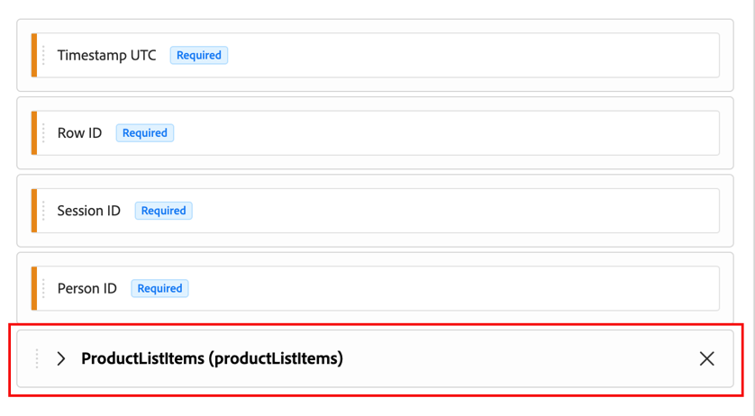

# Komponenten von Unter-Containern in Daten-Feeds

{{release-limited-testing}}

Unter-Container-Komponenten sind Dimensionen und Metriken, die auf Feldern innerhalb eines Arrays oder einer Zuordnung in Ihrem XDM-Schema basieren. Sie ermöglichen Ihnen die Analyse von Daten auf einer detaillierteren Ebene als auf Ereignisebene, z. B. die einzelnen Produkte bei einem Kauf. Informationen zur Verwendung dieser Daten in Segmenten finden Sie [Unter-Ereignisse](/help/components/segments/sub-event.md).

Verwenden Sie die folgenden Informationen, um zu verstehen, wie Untercontainer-Komponenten aus Array- und Zuordnungsfeldern in Ihren Customer Journey Analytics-Daten-Feeds angezeigt werden.

## Grundlagen zu Komponenten von Unter-Containern

### Untergeordnete Container-Komponenten im XDM-Schema

Im XDM-Schema ist jedes Element eines Arrays (ein Zeichenfolgen-Array oder ein Objekt-Array) ein Unter-Container. Jeder Eintrag in einem Zuordnungsfeld ist auch ein Untercontainer, wie unter [Zuordnungsfelder in Daten-Feeds](#map-fields-in-data-feeds) beschrieben. Dimensionen und Metriken, die auf den Feldern in einem Unter-Container basieren, sind Komponenten von Unter-Containern.

Um Untercontainer innerhalb des XDM-Schemas in Adobe Experience Platform anzuzeigen, wählen Sie [!UICONTROL **Schemas**] aus und erweitern Sie dann ein Ereignis, das Untercontainer enthält.

Im folgenden Beispiel ist `Product list items` ein Objekt-Array, das verschiedene Untercontainer-Komponenten enthält.


### Unterschiede zwischen Unter-Containern zwischen Analysis Workspace und Daten-Feeds

Komponenten von Unter-Containern werden in Analysis Workspace anders dargestellt als Daten-Feeds in Customer Journey Analytics.

| Standort | Darstellung der Untercontainer-Komponenten |
| --- | --- |
| **Analysis Workspace (in Customer Journey Analytics)** | Kann als einzelne Komponenten getrennt von einer sichtbaren Hierarchie ausgewählt werden. |
| **Daten-Feeds (in Customer Journey Analytics)** | Wird als Gruppe mit intakter Hierarchie dargestellt. |

### Unterschiede zwischen Untercontainern in Adobe Analytics und Customer Journey Analytics

Daten von Unter-Containern (z. B. mehrere Produktdetails in einem einzigen Kaufereignis) werden in Customer Journey Analytics-Daten-Feeds anders angezeigt als in Adobe Analytics-Daten-Feeds. In der folgenden Tabelle wird verglichen, wie jedes Produkt Unter-Container-Daten darstellt.

| Produkt | So werden Untercontainer-Daten in Daten-Feeds angezeigt | Beispiel: Produktliste |
| --- | --- | --- |
| **Adobe Analytics** | In eine durch Trennzeichen getrennte Zeichenfolge in einer einzigen Spalte reduziert. | Eine Produktliste enthält mehrere Produkte, die in einer einzigen Zeichenfolge gruppiert sind:<p>`Power Tools;Cordless Drill;1;129.99,Power Tools;Drill Battery Pack;2;39.98` <!--screenshot of what this looks like: product lists, list vars. --></p> |
| **Customer Journey Analytics** | Komponenten von Unter-Containern behalten die in Ihrem XDM-Schema definierte Hierarchie bei. Obwohl sie in derselben Spalte gruppiert sind, zeigen sie ihre relationale Hierarchie zum übergeordneten Ereignis und den gleichrangigen Untercontainern an. | Eine Produktliste behält ihre Hierarchie bei, die im XDM-Schema als Array definiert ist:<p>`[{"category":"Power Tools","product":"Cordless Drill","quantity":1,"revenue":129.99},{"category":"Power Tools","product":"Drill Battery Pack","quantity":2,"revenue":39.98}]` <!--screenshot of what this looks like: product lists, list vars. --></p> |

{style="table-layout:auto"}

### Beispiel für Unter-Container: Produkte in einem Kaufereignis

Ein Kunde kauft zwei Produkte in einer Bestellung: einen Akku-Bohrer und zwei Akku-Bohrer. Ihre Implementierung sendet ein einzelnes Kaufereignis, das beide Produkte im `productListItems` Objekt-Array enthält:

```json
{
  "eventType": "commerce.purchases",
  "timestamp": "2026-09-16T14:32:07.512Z",
  "commerce": {
    "purchases": { "value": 1 }
  },
  "productListItems": [
    { "SKU": "CD-2000", "name": "Cordless Drill", "quantity": 1, "priceTotal": 129.99 },
    { "SKU": "BP-2000", "name": "Drill Battery Pack", "quantity": 2, "priceTotal": 39.98 }
  ]
}
```

Dieses Ereignis enthält zwei Untercontainer, einen für jedes Objekt im `productListItems`-Array. Die folgende Tabelle zeigt, welche Felder zum Ereignis und welche zu dessen Unter-Containern gehören.

| Ebene | Felder | Beschreibung der Felder |
| --- | --- | --- |
| **Ereignis** | `eventType`, `timestamp`, `commerce.purchases.value` | Der Kauf insgesamt. Jedes Feld hat einen Wert für das Ereignis. Die Metrik **Bestellungen** zählt `1` für dieses Ereignis, unabhängig davon, wie viele Produkte es enthält. |
| **Unter-Container** | `SKU`, `name`, `quantity`, `priceTotal` in jedem `productListItems` | Ein einzelnes Produkt im Kauf. Jedes Feld hat einen -Wert pro Produkt. Beispielsweise ist `quantity` für den Akku-Bohrer und `2` für den Akku-Bohrer `1`. |

{style="table-layout:auto"}

>[!NOTE]
>
>Untercontainer enthalten nur die Daten, die mit dem Ereignis gesendet werden. Customer Journey Analytics rekonstruiert den Inhalt des Warenkorbs nicht aus früheren Ereignissen, z. B. Hinzufügungen zum Warenkorb oder Checkouts. Damit Produkte als Untercontainer eines Kaufereignisses angezeigt werden, muss Ihre Implementierung sie in `productListItems` dieses Kaufereignisses einschließen.

## Hinzufügen von Unter-Container-Komponenten zu einem Daten-Feed

Wenn Sie eine Unter-Container-Komponente zu einem Daten-Feed hinzufügen, werden Sie in einem Dialogfeld aufgefordert, die anderen Komponenten aus demselben Unter-Container hinzuzufügen.


Felder aus demselben Untercontainer werden auf der Arbeitsfläche als ausblendbare verschachtelte Gruppe und nicht als flaches Element angezeigt.



Diese Gruppe spiegelt die zugrunde liegende Datenstruktur wider.

In der Daten-Feed-Ausgabe werden alle diese Komponenten als verschachteltes Array in einer einzigen Spalte angezeigt.

Informationen zum Hinzufügen von Komponenten, einschließlich Unter-Container-Komponenten, zu einem Daten-Feed finden Sie unter [Erstellen eines Daten-Feeds](/help/components/exports/cja-data-feeds/create-feed.md).

## Abfrage von Unter-Container-Daten in der Daten-Feed-Ausgabe

Da Untercontainer-Daten [in Customer Journey Analytics-Daten-Feeds anders angezeigt werden](#sub-container-differences-between-adobe-analytics-and-customer-journey-analytics) unterscheiden sich die Abfragen, die Sie dafür verwenden, von denen, die Sie für Adobe Analytics-Daten-Feeds verwenden.

Die folgenden Beispiele zeigen, wie Sie Ereignisse finden, die ein bestimmtes Produkt enthalten. Die Beispiele verwenden die Google BigQuery-Syntax. Andere Data Warehouses, wie Snowflake und Databricks, unterstützen denselben Ansatz mit geringfügigen Syntaxunterschieden.

+++ Abfragen von Produktdaten in Customer Journey Analytics-Daten-Feeds

In Customer Journey Analytics-Daten-Feeds werden dieselben beiden Produkte als Array von Objekten in der Spalte `product_list_items` angezeigt. Es ist kein Parsen von Trennzeichen erforderlich:

```json
{
  "row_id": "01K3F2M9-...-4821",
  "timestamp_utc": "2026-09-16T14:32:07.512000Z",
  "product_list_items": [
    { "category": "Power Tools", "product": "Cordless Drill", "quantity": 1, "revenue": 129.99,
      "events": {"event1": 1}, "merchandising": {"eVar10": "DrillBundle"} },
    { "category": "Power Tools", "product": "Drill Battery Pack", "quantity": 2, "revenue": 39.98,
      "events": {"event1": 1}, "merchandising": {"eVar10": "DrillBundle"} }
  ]
}
```

Wie Sie die Abfrage schreiben, hängt davon ab, ob Sie eine Zeile pro Ereignis oder eine Zeile pro übereinstimmendem Produkt wünschen.

**Gibt eine Zeile pro Ereignis zurück**

Um Ereignisse zu filtern, ohne die Anzahl der Zeilen zu ändern, verwenden Sie `UNNEST` in einer `EXISTS` Unterabfrage:

```sql
SELECT row_id, timestamp_utc, product_list_items
FROM `project.dataset.cja_data_feed` AS f
WHERE EXISTS (
  SELECT 1
  FROM UNNEST(f.product_list_items) AS item
  WHERE item.product = 'Cordless Drill'
);
```

Diese Abfrage gibt für jedes übereinstimmende Ereignis eine Zeile zurück, wobei das vollständige `product_list_items`-Array intakt ist, unabhängig davon, wie viele Produkte im Array übereinstimmen.

**Gibt eine Zeile pro übereinstimmendem Produkt zurück**

Um für jedes übereinstimmende Produkt eine Zeile zurückzugeben, verschieben Sie `UNNEST` in die äußere `FROM`:

```sql
SELECT f.row_id, f.timestamp_utc, item.product, item.quantity, item.revenue
FROM `project.dataset.cja_data_feed` AS f,
     UNNEST(f.product_list_items) AS item
WHERE item.product = 'Cordless Drill';
```

Ein Ereignis mit mehr als einem übereinstimmenden Produkt wird als mehrere Zeilen angezeigt, und die Spalten des Ereignisses, wie `row_id`, wiederholen sich in jeder Zeile. Verwenden Sie diesen Ansatz nur, wenn Sie Details auf Produktebene benötigen. Um Ereignisse in den Ergebnissen zu zählen, verwenden Sie `COUNT(DISTINCT row_id)` anstelle von Zeilen zu zählen.

Dieser Ansatz gilt für alle Array-Felder in Ihrem XDM-Schema, nicht nur für Produkte.

+++

+++ Abfragen von Produktdaten in Adobe Analytics-Daten-Feeds

In Adobe Analytics-Daten-Feeds wird ein Ereignis mit zwei gemeinsam gekauften Produkten als einzelne, durch Trennzeichen getrennte Zeichenfolge in der `product_list` angezeigt:

```text
Power Tools;Cordless Drill;1;129.99;event1=1;eVar10=DrillBundle,Power Tools;Drill Battery Pack;2;39.98;event1=1;eVar10=DrillBundle
```

Um Ereignisse zu finden, die einen Akku-Bohrer enthalten, analysieren Sie diese Zeichenfolge mit einem regulären Ausdruck:

```sql
SELECT hitid_high, hitid_low, post_evar10
FROM aa_hit_data
WHERE REGEXP_CONTAINS(product_list, r'(^|,)[^;]*;Cordless Drill;')
```

+++

## Verwenden von Zuordnungsfeldern in Daten-Feeds

Zuordnen von Feldern in Schlüssel-Wert-Paaren Ihres XDM-Schemas. Daten-Feeds exportieren jede Zuordnung als Array von Objekten auf die gleiche Weise wie andere [Unter-Container-Daten](#query-sub-container-data-in-data-feed-output). Jedes -Objekt enthält den Zuordnungsschlüssel und dessen Wert als separate Felder.

Feldnamen in der Ausgabe stammen von den Komponenten-IDs, die Sie für den Daten-Feed konfigurieren, und nicht von festen Namen wie `key` oder `value`. Die Beispiele in diesem Abschnitt verwenden Beispiel-Komponenten-IDs.

<!-- Confirm with Nate before publishing: how the outer array column is named in the output (for example, `survey_responses`). -->

### Einfache Karten

Einfache Zuordnungen sind der Zuordnungstyp, den Sie in Ihrem eigenen Schema erstellen können. Jeder Schlüssel ist eine Zeichenfolge und jeder Wert eine Zeichenfolge oder eine Ganzzahl.

Beispielsweise speichert eine Umfragezuordnung jede Frage als Schlüssel und die Antwort als Wert:

```json
{
  "_yourtenant": {
    "surveyResponses": {
      "How did you hear about us?": "Search engine",
      "How likely are you to recommend us?": 9
    }
  }
}
```

In der Daten-Feed-Ausgabe sind `survey_question` und `survey_answer` die Komponenten-IDs für den Schlüssel und den Wert:

```json
{
  "survey_responses": [
    { "survey_question": "How did you hear about us?", "survey_answer": "Search engine" },
    { "survey_question": "How likely are you to recommend us?", "survey_answer": 9 }
  ]
}
```

### Identitätszuordnung

Jede Identität im [`identityMap`](https://experienceleague.adobe.com/de/docs/experience-platform/xdm/field-groups/profile/identitymap) wird als ein Objekt exportiert. Das -Objekt enthält den Identity-Namespace (den Schlüssel), die Kennung, den authentifizierten Status und das primäre Flag. Der Namespace wiederholt sich für jede Identität in diesem Namespace.

Nur die Identitätszuordnungsattribute, die als Dimensionen in Ihrer Datenansicht vorhanden sind und die Sie dem Daten-Feed hinzufügen, werden exportiert.

```json
{
  "identity_map": [
    { "identity_namespace": "ECID", "identity_id": "83290187457380573620940587193016478103", "authenticated_state": "ambiguous", "is_primary": true },
    { "identity_namespace": "CRMID", "identity_id": "C-1048576", "authenticated_state": "authenticated", "is_primary": false }
  ]
}
```

### Verschachtelte Zuordnungen

Einige von Adobe definierte Felder, z. B. `segmentMembership`, sind Zuordnungen von Zuordnungen. Daten-Feeds reduzieren diese in einem einzigen Array, wobei der Schlüssel der ersten Ebene und der Schlüssel der zweiten Ebene als separate Felder in jedem Objekt verwendet werden. Die Schlüssel der ersten Ebene werden in jedem Objekt wiederholt, für das sie gilt, sodass keine Daten oder Beziehungen verloren gehen.

Beispielsweise sind `segment_namespace` und `segment_id` die Komponenten-IDs für den Schlüssel der ersten Ebene und den Schlüssel der zweiten Ebene:

```json
{
  "segment_membership": [
    { "segment_namespace": "ups", "segment_id": "04a81716-43d6-4e7a-a49c-f1d8b3129ba9", "status": "realized" },
    { "segment_namespace": "ups", "segment_id": "53cba6b2-a23b-454a-8069-fc41308f1c0f", "status": "exited" }
  ]
}
```


