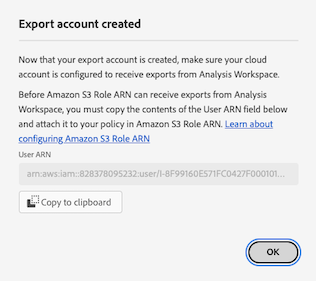

# Konfigurieren von Cloud-Exportkonten

Bevor Sie Customer Journey Analytics-Berichte an ein Cloud-Ziel exportieren können, wie [Exportieren von Customer Journey Analytics-Berichten in die Cloud](/help/analysis-workspace/export/export-cloud.md) beschrieben, müssen Sie das Ziel hinzufügen und konfigurieren, an das die Daten gesendet werden sollen.

Dieser Prozess besteht darin, das Konto (z. B. Amazon S3, Google Cloud Platform usw.) wie in diesem Artikel beschrieben hinzuzufügen und zu konfigurieren und dann den Speicherort innerhalb dieses Kontos (z. B. einen Ordner innerhalb des Kontos) hinzuzufügen und zu konfigurieren, wie in [Konfigurieren von Cloud-Exportspeicherorten](/help/components/exports/cloud-export-locations.md) beschrieben.

Informationen zum Verwalten vorhandener Konten, einschließlich Anzeigen, Bearbeiten und Löschen von Konten, finden Sie unter [Verwalten von Cloud-Exportspeicherorten und -Konten](/help/components/exports/manage-export-locations.md).

## Erstellen eines Cloud-Exportkontos

1. Stellen Sie sicher, dass Sie die [Mindestanforderungen](/help/analysis-workspace/export/export-cloud.md#minimum-requirements) für den Export von Berichten in die Cloud erfüllen.
1. Wählen Sie beim Customer Journey Analytics [!UICONTROL **Komponenten**] > [!UICONTROL **Exporte**] aus.
1. Wählen Sie auf [!UICONTROL  Seite ] die Registerkarte [!UICONTROL **Standortkonten**] aus.

   

1. Wählen Sie [!UICONTROL **Konto hinzufügen**] aus.

   Das Dialogfeld Konto hinzufügen wird angezeigt.

1. Geben [!UICONTROL **im Feld**] einen Namen für das Speicherort-Konto an. Dieser Name wird beim Erstellen eines Speicherorts angezeigt.

1. Geben Sie im Feld [!UICONTROL **Standortkontenbeschreibung**] eine kurze Beschreibung des Kontos ein, um es von anderen Konten desselben Kontotyps zu unterscheiden.

1. Aktivieren Sie die Option [!UICONTROL **Konto für alle Benutzer in Ihrer Organisation verfügbar machen**], wenn Sie anderen Benutzern in Ihrer Organisation die Verwendung des Kontos erlauben möchten.

   Beachten Sie beim Freigeben von Konten Folgendes:

   * Die Freigabe von Konten, die Sie freigeben, kann nicht aufgehoben werden.

   * Freigegebene Konten können nur vom Kontoinhaber bearbeitet werden.

   * Jeder kann einen Speicherort für das freigegebene Konto erstellen.

1. Wählen [!UICONTROL **Feld Kontotyp**] den Typ des Cloud-Kontos aus, in das Sie exportieren. Verfügbare Kontotypen sind Amazon S3 Role ARN, Google Cloud Platform, Azure SAS, Azure RBAC, Snowflake und AEP Data Landing Zone.

1. Fahren Sie mit dem folgenden Abschnitt fort, der dem ausgewählten [!UICONTROL **Kontotyp**] entspricht.

   * [AEP Data Landing Zone](#aep-data-landing-zone)

   * [Amazon S3 Role ARN](#amazon-s3-role-arn)

   * [Google Cloud Platform](#google-cloud-platform)

   * [Azure SAS](#azure-sas)

   * [Azure RBAC](#azure-rbac)

   * [Snowflake](#snowflake)

### AEP Data Landing Zone

>[!IMPORTANT]
>
>Beachten Sie Folgendes bei der Verwendung der AEP Data Landing Zone für Ihr Exportkonto:
>
> * Stellen Sie beim Exportieren von Customer Journey Analytics-Berichten in die Data Landing Zone von Adobe Experience Platform sicher, dass Sie die Daten innerhalb von 7 Tagen herunterladen und dann aus der Data Landing Zone von AEP löschen. Nach 7 Tagen werden die Daten automatisch aus der Data Landing Zone von AEP gelöscht.
> * AEP Data Landing Zone verwendet entweder Azure- oder AWS-Speicher. Wenn Ihr Unternehmen eine Unternehmensanmeldung verwendet, die für die Verwendung von Azure konfiguriert ist, verwendet AEP Data Landing Zone Azure. Wenn das Anmeldeunternehmen für die Verwendung von AWS konfiguriert ist, verwendet AEP Data Landing Zone AWS.
>

1. Beginnen Sie mit der Erstellung eines Cloud-Exportkontos auf eine der folgenden Arten:

   * Führen Sie auf der Seite Exporte wie oben beschrieben unter [Erstellen eines Cloud-Exportkontos aus](#begin-creating-a-cloud-export-account)

   * Beim [Exportieren vollständiger Tabellen aus Analysis Workspace](/help/analysis-workspace/export/export-cloud.md#export-full-tables-from-analysis-workspace)

1. Wählen Sie anschließend **[!UICONTROL AEP Data Landing Zone]** im Feld **[!UICONTROL Kontotyp]** die Option [!UICONTROL **Speichern**].

   Je nachdem, ob Ihre AEP Data Landing Zone für die Verwendung von Azure- oder AWS-Speicher konfiguriert ist, wird eines der folgenden Dialogfelder angezeigt:

   * **Azure-Speicher:**

     Das [!UICONTROL **Exportkonto erstellt**] wird angezeigt.

     

   * **AWS-Speicher:**

     >[!AVAILABILITY]
     >
     >Dieser Abschnitt gilt für Implementierungen von Experience Platform, die auf Amazon Web Services (AWS) ausgeführt werden. Experience Platform, das auf AWS ausgeführt wird, steht derzeit einer begrenzten Anzahl von Kunden zur Verfügung. Weitere Informationen zur unterstützten Experience Platform-Infrastruktur finden Sie in der Übersicht zur [Experience Platform-Multi-Cloud](https://experienceleague.adobe.com/en/docs/experience-platform/landing/multi-cloud).

     Das [!UICONTROL **Konto erstellt**] wird angezeigt.

     

1. (Bedingt) Wenn Sie Azure-Speicher verwenden:

   1. Kopieren Sie den Inhalt des Felds [!UICONTROL **SAS-URI**] in die Zwischenablage. Sie verwenden diesen SAS-URI, um auf die Daten zuzugreifen, die aus Analysis Workspace aus der Data Landing Zone von AEP exportiert werden.

      Wenn dieses Feld leer ist, müssen Sie über die Berechtigung für den Zugriff auf Adobe Experience Platform verfügen.

   1. Konfigurieren Sie in Adobe Experience Platform Ihren Data Landing Zone-Container so, dass er den kopierten SAS-URI verwendet.

      >[!NOTE]
      >
      >Wenn Sie ein auf Azure basierendes AEP Data Landing Zone-Konto verwenden, können Sie am einfachsten auf Berichte zugreifen, die Sie in die AEP Data Landing Zone exportieren, indem Sie den Azure Storage-Explorer verwenden. Die folgenden Schritte verwenden diese Methode.

      1. Falls noch nicht geschehen, laden Sie den [Microsoft Azure Storage Explorer](https://azure.microsoft.com/en-us/products/storage/storage-explorer/) herunter.

      1. Befolgen Sie in der Adobe Experience Platform-Dokumentation die unter [Verbinden Ihres Data Landing Zone-Containers mit dem Azure Storage Explorer](https://experienceleague.adobe.com/docs/experience-platform/destinations/catalog/cloud-storage/data-landing-zone.html#connect-your-data-landing-zone-container-to-azure-storage-explorer) beschriebenen Schritte.

         Sie können die in den Abschnitten [Abrufen der Anmeldeinformationen für Ihre Data Landing Zone](https://experienceleague.adobe.com/docs/experience-platform/destinations/catalog/cloud-storage/data-landing-zone.html#retrieve-dlz-credentials) und [Aktualisieren der Anmeldeinformationen für die Data Landing Zone](https://experienceleague.adobe.com/docs/experience-platform/destinations/catalog/cloud-storage/data-landing-zone.html#update-dlz-credentials) beschriebenen Aufgaben überspringen, da der von Ihnen kopierte URI diese Anmeldeinformationen enthält.

      1. Wenn Sie der Adobe Experience Platform-Dokumentation folgen und zum Feld [!UICONTROL **Blob-Container-SAS-URL**] kommen, fügen Sie den SAS-URI ein, den Sie in Schritt 3 kopiert haben.

         >[!NOTE]
         >
         >Sie müssen diese Aktion alle 7 Tage durchführen, da der SAS-URI 7 Tage nach seiner Erstellung abläuft. Sie können ein Skript zur Automatisierung dieses Prozesses erstellen.

         

   1. Wählen Sie [!UICONTROL **Weiter**] > [!UICONTROL **Verbinden**] aus.

   1. Klicken Sie auf Customer Journey Analytics im Dialogfeld [!UICONTROL **Exportkonto erstellt**] auf [!UICONTROL **OK**].

      

1. (Bedingt) Wenn Sie AWS-Speicher verwenden:

   1. Kopieren Sie den Inhalt der folgenden Felder in die Zwischenablage (Sie verwenden diese Informationen, um auf die Daten zuzugreifen, die aus Analysis Workspace aus der Data Landing Zone von AEP exportiert werden):

      * [!UICONTROL **Zugriffsschlüssel-ID**]

      * **[!UICONTROL Geheimer Zugriffsschlüssel]**

      * **[!UICONTROL Sitzungs-Token]**

      * **[!UICONTROL Bucket-Name]**

      * **[!UICONTROL DLZ-Ordner]**

      

   1. Klicken Sie [!UICONTROL **OK**].

1. Fahren Sie mit [Cloud-Exportspeicherorte konfigurieren](/help/components/exports/cloud-export-locations.md) fort.

### Amazon S3 Role ARN

1. Beginnen Sie mit der Erstellung eines Cloud-Exportkontos auf eine der folgenden Arten:

   * Führen Sie auf der Seite Exporte wie oben beschrieben unter [Erstellen eines Cloud-Exportkontos aus](#begin-creating-a-cloud-export-account)

   * Beim [Exportieren vollständiger Tabellen aus Analysis Workspace](/help/analysis-workspace/export/export-cloud.md#export-full-tables-from-analysis-workspace)

1. Geben Sie [!UICONTROL **Abschnitt**] des Dialogfelds [!UICONTROL **Konto hinzufügen**] die folgenden Informationen an:

   | Feld | Funktion |
   |---------|----------|
   | [!UICONTROL **Rollen-ARN**] | Sie müssen einen Rollen-ARN (Amazon Resource Name) bereitstellen, den Adobe verwenden kann, um Zugriff auf das Amazon S3-Konto zu erhalten. Erstellen Sie hierfür eine IAM-Berechtigungsrichtlinie für das Quellkonto, hängen Sie die Richtlinie an eine Benutzerin oder einen Benutzer an und erstellen Sie dann eine Rolle für das Zielkonto. Spezifische Informationen finden Sie in [dieser AWS-Dokumentation](https://aws.amazon.com/premiumsupport/knowledge-center/cross-account-access-iam/). |

   {style="table-layout:auto"}

1. Wählen Sie [!UICONTROL **Speichern**] aus.

   Das [!UICONTROL **Exportkonto erstellt**] wird angezeigt.

   

1. Kopieren Sie den Inhalt des Felds [!UICONTROL **Benutzer-ARN**] in die Zwischenablage. Der Benutzer-ARN (Amazon Resource Name) wird von Adobe bereitgestellt. Sie müssen diesen Benutzer der Richtlinie anhängen, die Sie in Amazon S3 Role ARN erstellt haben.

1. Klicken Sie [!UICONTROL **OK**].

1. Fahren Sie mit [Cloud-Exportspeicherorte konfigurieren](/help/components/exports/cloud-export-locations.md) fort.

### Google Cloud Platform

1. Beginnen Sie mit der Erstellung eines Cloud-Exportkontos auf eine der folgenden Arten:

   * Führen Sie auf der Seite Exporte wie oben beschrieben unter [Erstellen eines Cloud-Exportkontos aus](#begin-creating-a-cloud-export-account)

   * Beim [Exportieren vollständiger Tabellen aus Analysis Workspace](/help/analysis-workspace/export/export-cloud.md#export-full-tables-from-analysis-workspace)

1. Geben Sie [!UICONTROL **Abschnitt**] des Dialogfelds [!UICONTROL **Konto hinzufügen**] die folgenden Informationen an:

   | Feld | Funktion |
   |---------|----------|
   | [!UICONTROL **Projekt-ID**] | Ihre Google Cloud-Projekt-ID, die Sie aus Ihrem Google Cloud-Konto kopieren. Siehe [Dokumentation zu Google Cloud zum Abrufen einer Projekt-ID](https://cloud.google.com/resource-manager/docs/creating-managing-projects#identifying_projects). |

   {style="table-layout:auto"}

1. Wählen Sie [!UICONTROL **Speichern**] aus.

   Das [!UICONTROL **Exportkonto erstellt**] wird angezeigt.

   

1. Kopieren Sie den Inhalt des Felds [!UICONTROL **Prinzipal**] in die Zwischenablage und stellen Sie dann sicher, dass Sie dem Prinzipal die Berechtigung zum Hochladen von Dateien in diesen Bucket in Google Cloud Platform erteilen. <!-- add link to Google Cloud docs on how to do this -->

1. Klicken Sie [!UICONTROL **OK**].

1. Fahren Sie mit [Cloud-Exportspeicherorte konfigurieren](/help/components/exports/cloud-export-locations.md) fort.

### Azure SAS

1. Beginnen Sie mit der Erstellung eines Cloud-Exportkontos auf eine der folgenden Arten:

   * Führen Sie auf der Seite Exporte wie oben beschrieben unter [Erstellen eines Cloud-Exportkontos aus](#begin-creating-a-cloud-export-account)

   * Beim [Exportieren vollständiger Tabellen aus Analysis Workspace](/help/analysis-workspace/export/export-cloud.md#export-full-tables-from-analysis-workspace)

1. Geben Sie [!UICONTROL **Abschnitt**] des Dialogfelds [!UICONTROL **Konto hinzufügen**] die folgenden Informationen an:

   | Feld | Funktion |
   |---------|----------|
   | [!UICONTROL **Anwendungs-ID**] | Kopieren Sie diese ID aus der von Ihnen erstellten Azure-Anwendung. In Microsoft Azure befinden sich diese Informationen auf der Registerkarte **Übersicht** in Ihrer Anwendung. Weitere Informationen finden Sie in der [Microsoft Azure-Dokumentation zur Registrierung einer Anwendung bei der Microsoft Identity Platform](https://learn.microsoft.com/de-de/azure/active-directory/develop/quickstart-register-app). |
   | [!UICONTROL **Mandanten-ID**] | Kopieren Sie diese ID aus der von Ihnen erstellten Azure-Anwendung. In Microsoft Azure befinden sich diese Informationen auf der Registerkarte **Übersicht** in Ihrer Anwendung. Weitere Informationen finden Sie in der [Microsoft Azure-Dokumentation zur Registrierung einer Anwendung bei der Microsoft Identity Platform](https://learn.microsoft.com/de-de/azure/active-directory/develop/quickstart-register-app). |
   | [!UICONTROL **Key Vault-URI**] | <p>Der Pfad zum SAS-Token im Azure Key Vault. Um Azure SAS zu konfigurieren, müssen Sie einen SAS-URI mithilfe des Azure Key Vault als Geheimnis speichern. Weitere Informationen finden Sie in der [Microsoft Azure-Dokumentation zum Einrichten und Abrufen eines Geheimnisses aus Azure Key Vault](https://learn.microsoft.com/de-de/azure/key-vault/secrets/quick-create-portal?source=recommendations).</p><p>Nachdem die Key Vault-URI erstellt wurde:<ul><li>Fügen Sie im Key Vault eine Zugriffsrichtlinie hinzu, um der von Ihnen erstellten Azure-Anwendung Berechtigungen zu erteilen.<p><p>Weitere Informationen finden Sie unter [Microsoft Azure-Dokumentation für die Zuweisung einer Key Vault-Zugriffsrichtlinie](https://learn.microsoft.com/de-de/azure/key-vault/general/assign-access-policy?tabs=azure-portal).</p>Oder</p><p>Wenn Sie eine Zugriffsrolle direkt gewähren möchten, ohne eine Zugriffsrichtlinie zu erstellen, finden Sie weitere Informationen zum Zuweisen von Azure-Rollen mithilfe des Azure-Portals in der [Microsoft Azure-Dokumentation](https://learn.microsoft.com/en-us/azure/role-based-access-control/role-assignments-portal). Dadurch wird die Rollenzuweisung für die Anwendungs-ID hinzugefügt, um auf den Schlüsseltresor-URI zuzugreifen. </p></li><li>Stellen Sie sicher, dass der Anwendungs-ID die `Key Vault Certificate User` integrierte Rolle für den Zugriff auf den URI des Key Vault zugewiesen wurde.</br><p>Weitere Informationen finden Sie unter [Integrierte Azure-Rollen](https://learn.microsoft.com/de-de/azure/role-based-access-control/built-in-roles).</p></li></ul> |
   | [!UICONTROL **Key Vault-Geheimnisname**] | Der Geheimnisname, den Sie beim Hinzufügen des Geheimnisses zum Azure Key Vault erstellt haben. In Microsoft Azure befinden sich diese Informationen im von Ihnen erstellten Key Vault auf den **Key Vault**-Einstellungsseiten. Weitere Informationen finden Sie unter [Microsoft Azure-Dokumentation zum Einrichten und Abrufen eines Geheimnisses aus Azure Key Vault](https://learn.microsoft.com/de-de/azure/key-vault/secrets/quick-create-portal?source=recommendations). |
   | [!UICONTROL **Geheimnis des Standortkontos**] | Kopieren Sie das Geheimnis aus der von Ihnen erstellten Azure-Anwendung. In Microsoft Azure befinden sich diese Informationen auf der Registerkarte **Zertifikate und Geheimnisse** in Ihrer Anwendung. Weitere Informationen finden Sie in der [Dokumentation zu Microsoft Azure zum Registrieren einer Anwendung bei der Microsoft Identity Platform](https://learn.microsoft.com/de-de/azure/active-directory/develop/quickstart-register-app). <!-- need to grant permission to the bucket. Jun will send info on where that is documented) --> |

   {style="table-layout:auto"}

1. Wählen Sie [!UICONTROL **Speichern**] aus.

   Das [!UICONTROL **Exportkonto erstellt**] wird angezeigt.

   

1. Wenn Sie dies noch nicht getan haben, stellen Sie sicher, dass Sie Berechtigungen für den Bucket in Azure SAS erteilen. <!-- add link to Google Cloud docs on how to do this -->

1. Klicken Sie [!UICONTROL **OK**].

1. Fahren Sie mit [Cloud-Exportspeicherorte konfigurieren](/help/components/exports/cloud-export-locations.md) fort.

### Azure RBAC

1. Beginnen Sie mit der Erstellung eines Cloud-Exportkontos auf eine der folgenden Arten:

   * Führen Sie auf der Seite Exporte wie oben beschrieben unter [Erstellen eines Cloud-Exportkontos aus](#begin-creating-a-cloud-export-account)

   * Beim [Exportieren vollständiger Tabellen aus Analysis Workspace](/help/analysis-workspace/export/export-cloud.md#export-full-tables-from-analysis-workspace)

1. Geben Sie [!UICONTROL **Abschnitt**] des Dialogfelds [!UICONTROL **Konto hinzufügen**] die folgenden Informationen an:

   | Feld | Funktion |
   |---------|----------|
   | [!UICONTROL **Anwendungs-ID**] | Kopieren Sie diese ID aus der von Ihnen erstellten Azure-Anwendung. In Microsoft Azure befinden sich diese Informationen auf der Registerkarte **Übersicht** in Ihrer Anwendung. Weitere Informationen finden Sie in der [Microsoft Azure-Dokumentation zur Registrierung einer Anwendung bei der Microsoft Identity Platform](https://learn.microsoft.com/de-de/azure/active-directory/develop/quickstart-register-app). |
   | [!UICONTROL **Mandanten-ID**] | Kopieren Sie diese ID aus der von Ihnen erstellten Azure-Anwendung. In Microsoft Azure befinden sich diese Informationen auf der Registerkarte **Übersicht** in Ihrer Anwendung. Weitere Informationen finden Sie in der [Microsoft Azure-Dokumentation zur Registrierung einer Anwendung bei der Microsoft Identity Platform](https://learn.microsoft.com/de-de/azure/active-directory/develop/quickstart-register-app). |
   | [!UICONTROL **Geheimnis des Standortkontos**] | Kopieren Sie das Geheimnis aus der von Ihnen erstellten Azure-Anwendung. In Microsoft Azure befinden sich diese Informationen auf der Registerkarte **Zertifikate und Geheimnisse** in Ihrer Anwendung. Weitere Informationen finden Sie in der [Microsoft Azure-Dokumentation zur Registrierung einer Anwendung bei der Microsoft Identity Platform](https://learn.microsoft.com/de-de/azure/active-directory/develop/quickstart-register-app). |

   {style="table-layout:auto"}

1. Wählen Sie [!UICONTROL **Speichern**] aus.

   Das [!UICONTROL **Exportkonto erstellt**] wird angezeigt.

   

1. Falls noch nicht geschehen, stellen Sie sicher, dass Sie dem Bucket in Azure RBAC Berechtigungen erteilen. <!-- add link to Google Cloud docs on how to do this -->

1. Klicken Sie [!UICONTROL **OK**].

1. Fahren Sie mit [Cloud-Exportspeicherorte konfigurieren](/help/components/exports/cloud-export-locations.md) fort.

### Snowflake

1. Beginnen Sie mit der Erstellung eines Cloud-Exportkontos auf eine der folgenden Arten:

   * Führen Sie auf der Seite Exporte wie oben beschrieben unter [Erstellen eines Cloud-Exportkontos aus](#begin-creating-a-cloud-export-account)

   * Beim [Exportieren vollständiger Tabellen aus Analysis Workspace](/help/analysis-workspace/export/export-cloud.md#export-full-tables-from-analysis-workspace)

1. Geben Sie [!UICONTROL **Abschnitt**] des Dialogfelds [!UICONTROL **Konto hinzufügen**] die folgenden Informationen an:

   | Feld | Funktion |
   |---------|----------|
   | [!UICONTROL **Kontokennung**] | Identifiziert auf einzigartige Weise ein Snowflake-Konto innerhalb Ihres Unternehmens sowie im gesamten globalen Netzwerk von Snowflake-unterstützten Cloud-Plattformen und Cloud-Regionen. <p>Sie müssen die Kontokennung von Ihrem Snowflake-Konto abrufen und die Informationen hier einfügen.</p><p>Informationen zum Abrufen dieser Informationen finden Sie auf der [Kontokennungen“ in der Snowflake-Dokumentation](https://docs.snowflake.com/en/user-guide/admin-account-identifier).</p> |
   | [!UICONTROL **Benutzende**] | Der Benutzername, der für die Verbindung verwendet wird. Es wird empfohlen, einen neuen Benutzer zu erstellen, der speziell für das Adobe verwendet wird. Geben Sie hier den Namen an und erstellen Sie dann einen Benutzer auf Snowflake mit demselben Namen. Sie können einen Benutzer auf Snowflake mit dem Befehl `CREATE USER` erstellen.  <p>Weitere Informationen finden Sie unter [Befehle für Benutzer, Rollen und Berechtigungen](https://docs.snowflake.com/en/sql-reference/commands-user-role).</p> |
   | [!UICONTROL **Rolle**] | Die Rolle, die dem Benutzer zugewiesen wird. Es wird empfohlen, eine neue Rolle zu erstellen, die speziell für das Adobe verwendet wird. Geben Sie hier die Rolle an, erstellen Sie dann eine Rolle in Snowflake mit demselben Namen und gewähren Sie dem Benutzer die Rolle. Sie können eine Rolle beim Snowflake mit dem Befehl `CREATE ROLE` erstellen. <p>Weitere Informationen finden Sie unter [Befehle für Benutzer, Rollen und Berechtigungen](https://docs.snowflake.com/en/sql-reference/commands-user-role).</p> |

   {style="table-layout:auto"}

1. Wählen Sie [!UICONTROL **Speichern**] aus.

   Das [!UICONTROL **Exportkonto erstellt**] wird angezeigt.

   

1. Kopieren Sie den Inhalt des Felds [!UICONTROL **Öffentlicher Schlüssel**] in die Zwischenablage. Der öffentliche Schlüssel wird von Adobe bereitgestellt.

   Verwenden Sie den öffentlichen Schlüssel auf Snowflake, um eine Verbindung zu Ihrem Snowflake-Konto herzustellen. Sie müssen den von Ihnen erstellten Benutzer mit diesem öffentlichen Schlüssel verknüpfen.

   Geben Sie beispielsweise in Snowflake den folgenden Befehl an:

   ```
   CREATE USER <your_adobe_user> RSA_PUBLIC_KEY = '<your_public_key>';
   ```

   Weitere Informationen finden Sie auf der Seite [Schlüsselpaar-Authentifizierung und Schlüsselpaar-Rotation“ in der Snowflake-Dokumentation](https://docs.snowflake.com/en/user-guide/key-pair-auth).

1. Klicken Sie [!UICONTROL **OK**].

1. Fahren Sie mit [Cloud-Exportspeicherorte konfigurieren](/help/components/exports/cloud-export-locations.md) fort.
