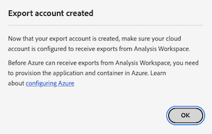

# Konfigurieren von Cloud-Exportkonten

Bevor Sie Customer Journey Analytics-Berichte an ein Cloud-Ziel exportieren können, wie unter [Customer Journey Analytics-Berichte in die Cloud exportieren](/help/analysis-workspace/export/export-cloud.md) beschrieben, müssen Sie das Ziel hinzufügen und konfigurieren, an das die Daten gesendet werden sollen.

Dieser Prozess besteht aus dem Hinzufügen und Konfigurieren des Kontos (z. B. Amazon S3, Google Cloud Platform usw.), wie in diesem Artikel beschrieben, und anschließendem Hinzufügen und Konfigurieren des Speicherorts innerhalb dieses Kontos (z. B. eines Ordners innerhalb des Kontos), wie unter [Konfigurieren von Cloud-Exportspeicherorten](/help/components/exports/cloud-export-locations.md) beschrieben.

Informationen zum Verwalten vorhandener Konten, einschließlich Anzeigen, Bearbeiten und Löschen von Konten, finden Sie unter [Verwalten von Cloud-Exportspeicherorten und -konten](/help/components/exports/manage-export-locations.md).

## Erstellen eines Cloud-Exportkontos beginnen

1. Stellen Sie sicher, dass Sie die [Mindestanforderungen](/help/analysis-workspace/export/export-cloud.md#minimum-requirements) für den Export von Berichten in die Cloud erfüllen.
1. Wählen Sie unter Customer Journey Analytics [!UICONTROL **Komponenten**] > [!UICONTROL **Exporte**] aus.
1. Wählen Sie auf der Seite [!UICONTROL Exporte] die Registerkarte [!UICONTROL **Standortkonten**] aus.

   

1. Wählen Sie [!UICONTROL **Konto hinzufügen**] aus.

   Das Dialogfeld Konto hinzufügen wird angezeigt.

1. Geben Sie im Feld [!UICONTROL **Name des Standortkontos**] einen Namen für das Standortkonto an. Dieser Name wird beim Erstellen eines Standorts angezeigt.

1. Geben Sie im Feld [!UICONTROL **Beschreibung des Standortkontos**] eine kurze Beschreibung des Kontos ein, um es von anderen Konten desselben Kontotyps zu unterscheiden.

1. Aktivieren Sie die Option &quot;[!UICONTROL **Konto für alle Benutzer in Ihrer Organisation verfügbar machen**]&quot;, wenn Sie anderen Benutzern in Ihrer Organisation die Verwendung des Kontos ermöglichen möchten.

   Beachten Sie beim Freigeben von Konten Folgendes:

   * Die Freigabe von Konten, die Sie freigeben, kann nicht aufgehoben werden.

   * Freigegebene Konten können nur vom Eigentümer des Kontos bearbeitet werden.

   * Jeder kann einen Speicherort für das freigegebene Konto erstellen.

1. Wählen Sie im Feld [!UICONTROL **Kontotyp**] den Typ des Cloud-Kontos aus, in das Sie exportieren. Verfügbare Kontotypen sind Amazon S3 Role ARN, Google Cloud Platform, Azure SAS, Azure RBAC, Snowflake und AEP Data Landing Zone.

1. Fahren Sie mit dem folgenden Abschnitt fort, der dem von Ihnen ausgewählten [!UICONTROL **Kontotyp**] entspricht.

   * [AEP Data Landing Zone](#aep-data-landing-zone)

   * [Amazon S3 Role ARN](#amazon-s3-role-arn)

   * [Google Cloud Platform](#google-cloud-platform)

   * [Azure SAS](#azure-sas)

   * [Azure RBAC](#azure-rbac)

   * [Snowflake](#snowflake)

### AEP Data Landing Zone

>[!IMPORTANT]
>
>Achten Sie beim Exportieren von Customer Journey Analytics-Berichten in die Adobe Experience Platform Data Landing Zone darauf, die Daten innerhalb von 7 Tagen herunterzuladen und sie dann aus der AEP Data Landing Zone zu löschen. Nach 7 Tagen werden die Daten automatisch aus der AEP Data Landing Zone gelöscht.

1. Beginnen Sie mit der Erstellung eines Cloud-Export-Kontos auf eine der folgenden Arten:

   * Beginnen Sie auf der Seite &quot;Exporte&quot;wie oben beschrieben in [Erstellen eines Cloud-Exportkontos ](#begin-creating-a-cloud-export-account)

   * Beim [Exportieren vollständiger Tabellen aus Analysis Workspace](/help/analysis-workspace/export/export-cloud.md#export-full-tables-from-analysis-workspace)

1. Wählen Sie [!UICONTROL **Speichern**] aus.

   Das Dialogfeld [!UICONTROL **Konto exportieren erstellt**] wird angezeigt.

   

1. Kopieren Sie den Inhalt des Felds [!UICONTROL **SAS URI**] in die Zwischenablage. Mit diesem SAS-URI greifen Sie auf die Daten zu, die aus Analysis Workspace aus der AEP Data Landing Zone exportiert werden.

   Wenn dieses Feld leer ist, müssen Sie eine Zugriffsberechtigung für Adobe Experience Platform erhalten.

1. Konfigurieren Sie in Adobe Experience Platform Ihren Dateneinstiegszonen-Container, um den von Ihnen kopierten SAS-URI zu verwenden.

   >[!NOTE]
   >
   >Da das AEP Data Landing Zone-Konto auf Azure basiert, können Sie am einfachsten auf Berichte zugreifen, die Sie in die AEP Data Landing Zone exportieren, indem Sie den Azure Storage Explorer verwenden. Die folgenden Schritte verwenden diese Methode.

   1. Laden Sie den [Microsoft Azure Storage Explorer](https://azure.microsoft.com/en-us/products/storage/storage-explorer/) herunter, falls Sie dies noch nicht getan haben.

   1. Führen Sie in der Adobe Experience Platform-Dokumentation die unter [Verbinden des Data Landing Zone Containers mit Azure Storage Explorer](https://experienceleague.adobe.com/docs/experience-platform/destinations/catalog/cloud-storage/data-landing-zone.html#connect-your-data-landing-zone-container-to-azure-storage-explorer) beschriebenen Schritte aus.

      Sie können die in den Abschnitten [Abrufen der Anmeldeinformationen für Ihre Data Landing Zone](https://experienceleague.adobe.com/docs/experience-platform/destinations/catalog/cloud-storage/data-landing-zone.html#retrieve-dlz-credentials) und [Aktualisieren der Daten-Landingzone-Anmeldeinformationen](https://experienceleague.adobe.com/docs/experience-platform/destinations/catalog/cloud-storage/data-landing-zone.html#update-dlz-credentials) beschriebenen Aufgaben überspringen, da der kopierte URI diese Anmeldeinformationen enthält.

   1. Wenn Sie die Adobe Experience Platform-Dokumentation befolgen und zum Feld [!UICONTROL **Blob-Container-SAS-URL**] gelangen, fügen Sie den SAS-URI ein, den Sie in Schritt 3 kopiert haben.

      >[!NOTE]
      >
      >Sie müssen diese Aktion alle 7 Tage ausführen, da der SAS-URI 7 Tage nach seiner Erstellung abläuft. Sie können ein Skript erstellen, um diesen Prozess zu automatisieren.


      

   1. Wählen Sie [!UICONTROL **Weiter**] > [!UICONTROL **Verbinden**] aus.

1. Wählen Sie unter Customer Journey Analytics im Dialogfeld [!UICONTROL **Konto exportieren erstellt**] die Option [!UICONTROL **OK**].

   

1. Fahren Sie mit [Konfigurieren von Cloud-Exportspeicherorten](/help/components/exports/cloud-export-locations.md) fort.

### Amazon S3 Role ARN

1. Beginnen Sie mit der Erstellung eines Cloud-Export-Kontos auf eine der folgenden Arten:

   * Beginnen Sie auf der Seite &quot;Exporte&quot;wie oben beschrieben in [Erstellen eines Cloud-Exportkontos ](#begin-creating-a-cloud-export-account)

   * Beim [Exportieren vollständiger Tabellen aus Analysis Workspace](/help/analysis-workspace/export/export-cloud.md#export-full-tables-from-analysis-workspace)

1. Geben Sie im Abschnitt [!UICONTROL **Kontoeigenschaften**] des Dialogfelds [!UICONTROL **Konto hinzufügen**] die folgenden Informationen an:

   | Feld | Funktion |
   |---------|----------|
   | [!UICONTROL **Rollen-ARN**] | Sie müssen einen Rollen-ARN (Amazon Resource Name) bereitstellen, den Adobe verwenden kann, um Zugriff auf das Amazon S3-Konto zu erhalten. Erstellen Sie hierfür eine IAM-Berechtigungsrichtlinie für das Quellkonto, hängen Sie die Richtlinie an eine Benutzerin oder einen Benutzer an und erstellen Sie dann eine Rolle für das Zielkonto. Spezifische Informationen finden Sie in [dieser AWS-Dokumentation](https://aws.amazon.com/premiumsupport/knowledge-center/cross-account-access-iam/). |

   {style="table-layout:auto"}

1. Wählen Sie [!UICONTROL **Speichern**] aus.

   Das Dialogfeld [!UICONTROL **Konto exportieren erstellt**] wird angezeigt.

   

1. Kopieren Sie den Inhalt des Felds [!UICONTROL **Benutzer-ARN**] in die Zwischenablage. Der Benutzer-ARN (Amazon Resource Name) wird von Adobe bereitgestellt. Sie müssen diesen Benutzer an die Richtlinie anhängen, die Sie in Amazon S3 Role ARN erstellt haben.

1. Wählen Sie [!UICONTROL **OK**] aus.

1. Fahren Sie mit [Konfigurieren von Cloud-Exportspeicherorten](/help/components/exports/cloud-export-locations.md) fort.

### Google Cloud Platform

1. Beginnen Sie mit der Erstellung eines Cloud-Export-Kontos auf eine der folgenden Arten:

   * Beginnen Sie auf der Seite &quot;Exporte&quot;wie oben beschrieben in [Erstellen eines Cloud-Exportkontos ](#begin-creating-a-cloud-export-account)

   * Beim [Exportieren vollständiger Tabellen aus Analysis Workspace](/help/analysis-workspace/export/export-cloud.md#export-full-tables-from-analysis-workspace)

1. Geben Sie im Abschnitt [!UICONTROL **Kontoeigenschaften**] des Dialogfelds [!UICONTROL **Konto hinzufügen**] die folgenden Informationen an:

   | Feld | Funktion |
   |---------|----------|
   | [!UICONTROL **Projekt-ID**] | Ihre Google Cloud-Projekt-ID, die Sie aus Ihrem Google Cloud-Konto kopieren. Siehe [Dokumentation zu Google Cloud zum Abrufen einer Projekt-ID](https://cloud.google.com/resource-manager/docs/creating-managing-projects#identifying_projects). |

   {style="table-layout:auto"}

1. Wählen Sie [!UICONTROL **Speichern**] aus.

   Das Dialogfeld [!UICONTROL **Konto exportieren erstellt**] wird angezeigt.

   

1. Kopieren Sie den Inhalt des Felds [!UICONTROL **Prinzipal**] in die Zwischenablage und stellen Sie sicher, dass Sie dem Prinzipal Berechtigungen zum Hochladen von Dateien in diesen Behälter in Google Cloud Platform erteilen. <!-- add link to Google Cloud docs on how to do this -->

1. Wählen Sie [!UICONTROL **OK**] aus.

1. Fahren Sie mit [Konfigurieren von Cloud-Exportspeicherorten](/help/components/exports/cloud-export-locations.md) fort.

### Azure SAS

1. Beginnen Sie mit der Erstellung eines Cloud-Export-Kontos auf eine der folgenden Arten:

   * Beginnen Sie auf der Seite &quot;Exporte&quot;wie oben beschrieben in [Erstellen eines Cloud-Exportkontos ](#begin-creating-a-cloud-export-account)

   * Beim [Exportieren vollständiger Tabellen aus Analysis Workspace](/help/analysis-workspace/export/export-cloud.md#export-full-tables-from-analysis-workspace)

1. Geben Sie im Abschnitt [!UICONTROL **Kontoeigenschaften**] des Dialogfelds [!UICONTROL **Konto hinzufügen**] die folgenden Informationen an:

   | Feld | Funktion |
   |---------|----------|
   | [!UICONTROL **Anwendungs-ID**] | Kopieren Sie diese ID aus der von Ihnen erstellten Azure-Anwendung. In Microsoft Azure befinden sich diese Informationen auf der Registerkarte **Übersicht** in Ihrer Anwendung. Weitere Informationen finden Sie in der [Microsoft Azure-Dokumentation zur Registrierung einer Anwendung bei der Microsoft Identity Platform](https://learn.microsoft.com/de-de/azure/active-directory/develop/quickstart-register-app). |
   | [!UICONTROL **Mandanten-ID**] | Kopieren Sie diese ID aus der von Ihnen erstellten Azure-Anwendung. In Microsoft Azure befinden sich diese Informationen auf der Registerkarte **Übersicht** in Ihrer Anwendung. Weitere Informationen finden Sie in der [Microsoft Azure-Dokumentation zur Registrierung einer Anwendung bei der Microsoft Identity Platform](https://learn.microsoft.com/de-de/azure/active-directory/develop/quickstart-register-app). |
   | [!UICONTROL **Key Vault-URI**] | <p>Der Pfad zum SAS-Token im Azure Key Vault. Um Azure SAS zu konfigurieren, müssen Sie einen SAS-URI mithilfe des Azure Key Vault als Geheimnis speichern. Weitere Informationen finden Sie in der [Microsoft Azure-Dokumentation zum Einrichten und Abrufen eines Geheimnisses aus Azure Key Vault](https://learn.microsoft.com/de-de/azure/key-vault/secrets/quick-create-portal?source=recommendations).</p><p>Nachdem die Key Vault-URI erstellt wurde:<ul><li>Fügen Sie im Key Vault eine Zugriffsrichtlinie hinzu, um der von Ihnen erstellten Azure-Anwendung Berechtigungen zu erteilen.<p><p>Weitere Informationen finden Sie unter [Microsoft Azure-Dokumentation für die Zuweisung einer Key Vault-Zugriffsrichtlinie](https://learn.microsoft.com/de-de/azure/key-vault/general/assign-access-policy?tabs=azure-portal).</p>Oder</p><p>Wenn Sie eine Zugriffsrolle direkt ohne Erstellung einer Zugriffsrichtlinie zuweisen möchten, finden Sie in der Dokumentation zu [Microsoft Azure Informationen zum Zuweisen von Azure-Rollen mit Azure Portal](https://learn.microsoft.com/en-us/azure/role-based-access-control/role-assignments-portal) weitere Informationen. Dadurch wird die Rollenzuweisung für die Anwendungs-ID hinzugefügt, um auf den Schlüssel-Vault-URI zuzugreifen. </p></li><li>Stellen Sie sicher, dass der Anwendungs-ID die `Key Vault Certificate User` integrierte Rolle für den Zugriff auf den URI des Key Vault zugewiesen wurde.</br><p>Weitere Informationen finden Sie unter [Integrierte Azure-Rollen](https://learn.microsoft.com/de-de/azure/role-based-access-control/built-in-roles).</p></li></ul> |
   | [!UICONTROL **Key Vault-Geheimnisname**] | Der Geheimnisname, den Sie beim Hinzufügen des Geheimnisses zum Azure Key Vault erstellt haben. In Microsoft Azure befinden sich diese Informationen im von Ihnen erstellten Key Vault auf den **Key Vault**-Einstellungsseiten. Weitere Informationen finden Sie unter [Microsoft Azure-Dokumentation zum Einrichten und Abrufen eines Geheimnisses aus Azure Key Vault](https://learn.microsoft.com/de-de/azure/key-vault/secrets/quick-create-portal?source=recommendations). |
   | [!UICONTROL **Geheimnis des Standortkontos**] | Kopieren Sie das Geheimnis aus der von Ihnen erstellten Azure-Anwendung. In Microsoft Azure befinden sich diese Informationen auf der Registerkarte **Zertifikate und Geheimnisse** in Ihrer Anwendung. Weitere Informationen finden Sie in der [Microsoft Azure-Dokumentation zur Registrierung einer Anwendung bei der Microsoft-Identitätsplattform](https://learn.microsoft.com/de-de/azure/active-directory/develop/quickstart-register-app). <!-- need to grant permission to the bucket. Jun will send info on where that is documented) --> |

   {style="table-layout:auto"}

1. Wählen Sie [!UICONTROL **Speichern**] aus.

   Das Dialogfeld [!UICONTROL **Konto exportieren erstellt**] wird angezeigt.

   

1. Wenn Sie dies noch nicht getan haben, stellen Sie sicher, dass Sie dem Behälter in Azure SAS <!-- add link to Google Cloud docs on how to do this --> Berechtigungen erteilen.

1. Wählen Sie [!UICONTROL **OK**] aus.

1. Fahren Sie mit [Konfigurieren von Cloud-Exportspeicherorten](/help/components/exports/cloud-export-locations.md) fort.

### Azure RBAC

1. Beginnen Sie mit der Erstellung eines Cloud-Export-Kontos auf eine der folgenden Arten:

   * Beginnen Sie auf der Seite &quot;Exporte&quot;wie oben beschrieben in [Erstellen eines Cloud-Exportkontos ](#begin-creating-a-cloud-export-account)

   * Beim [Exportieren vollständiger Tabellen aus Analysis Workspace](/help/analysis-workspace/export/export-cloud.md#export-full-tables-from-analysis-workspace)

1. Geben Sie im Abschnitt [!UICONTROL **Kontoeigenschaften**] des Dialogfelds [!UICONTROL **Konto hinzufügen**] die folgenden Informationen an:

   | Feld | Funktion |
   |---------|----------|
   | [!UICONTROL **Anwendungs-ID**] | Kopieren Sie diese ID aus der von Ihnen erstellten Azure-Anwendung. In Microsoft Azure befinden sich diese Informationen auf der Registerkarte **Übersicht** in Ihrer Anwendung. Weitere Informationen finden Sie in der [Microsoft Azure-Dokumentation zur Registrierung einer Anwendung bei der Microsoft Identity Platform](https://learn.microsoft.com/de-de/azure/active-directory/develop/quickstart-register-app). |
   | [!UICONTROL **Mandanten-ID**] | Kopieren Sie diese ID aus der von Ihnen erstellten Azure-Anwendung. In Microsoft Azure befinden sich diese Informationen auf der Registerkarte **Übersicht** in Ihrer Anwendung. Weitere Informationen finden Sie in der [Microsoft Azure-Dokumentation zur Registrierung einer Anwendung bei der Microsoft Identity Platform](https://learn.microsoft.com/de-de/azure/active-directory/develop/quickstart-register-app). |
   | [!UICONTROL **Geheimnis des Standortkontos**] | Kopieren Sie das Geheimnis aus der von Ihnen erstellten Azure-Anwendung. In Microsoft Azure befinden sich diese Informationen auf der Registerkarte **Zertifikate und Geheimnisse** in Ihrer Anwendung. Weitere Informationen finden Sie in der [Microsoft Azure-Dokumentation zur Registrierung einer Anwendung bei der Microsoft Identity Platform](https://learn.microsoft.com/de-de/azure/active-directory/develop/quickstart-register-app). |

   {style="table-layout:auto"}

1. Wählen Sie [!UICONTROL **Speichern**] aus.

   Das Dialogfeld [!UICONTROL **Konto exportieren erstellt**] wird angezeigt.

   

1. Wenn Sie dies noch nicht getan haben, stellen Sie sicher, dass Sie dem Behälter in Azure RBAC Berechtigungen erteilen. <!-- add link to Google Cloud docs on how to do this -->

1. Wählen Sie [!UICONTROL **OK**] aus.

1. Fahren Sie mit [Konfigurieren von Cloud-Exportspeicherorten](/help/components/exports/cloud-export-locations.md) fort.

### Snowflake

1. Beginnen Sie mit der Erstellung eines Cloud-Export-Kontos auf eine der folgenden Arten:

   * Beginnen Sie auf der Seite &quot;Exporte&quot;wie oben beschrieben in [Erstellen eines Cloud-Exportkontos ](#begin-creating-a-cloud-export-account)

   * Beim [Exportieren vollständiger Tabellen aus Analysis Workspace](/help/analysis-workspace/export/export-cloud.md#export-full-tables-from-analysis-workspace)

1. Geben Sie im Abschnitt [!UICONTROL **Kontoeigenschaften**] des Dialogfelds [!UICONTROL **Konto hinzufügen**] die folgenden Informationen an:

   | Feld | Funktion |
   |---------|----------|
   | [!UICONTROL **Kontokennung**] | Identifiziert eindeutig ein Snowflake-Konto innerhalb Ihres Unternehmens sowie im gesamten globalen Netzwerk von Snowflake-unterstützten Cloud-Plattformen und Cloud-Regionen. <p>Sie müssen die Kontokennung von Ihrem Snowflake-Konto abrufen und die Informationen hier einfügen.</p><p>Informationen dazu, wo Sie diese Informationen abrufen können, finden Sie auf der Seite [Kontokennungen in der Snowflake-Dokumentation](https://docs.snowflake.com/en/user-guide/admin-account-identifier).</p> |
   | [!UICONTROL **Benutzer**] | Der Anmeldename des Benutzers, der für die Verbindung verwendet wird. Es wird empfohlen, einen neuen Benutzer zu erstellen, der speziell für das Adobe verwendet wird. Geben Sie hier den Namen an und erstellen Sie dann einen Benutzer im Snowflake mit demselben Namen. Sie können einen Benutzer im Snowflake mithilfe des Befehls `CREATE USER` erstellen.  <p>Weitere Informationen finden Sie unter den Befehlen [Benutzer, Rolle und Berechtigung](https://docs.snowflake.com/en/sql-reference/commands-user-role).</p> |
   | [!UICONTROL **Rolle**] | Die Rolle, die dem Benutzer zugewiesen wird. Es wird empfohlen, eine neue Rolle zu erstellen, die speziell für das Adobe verwendet wird. Geben Sie hier die Rolle an, erstellen Sie dann eine Rolle im Snowflake mit demselben Namen und weisen Sie dem Benutzer die Rolle zu. Sie können eine Rolle beim Snowflake mit dem Befehl `CREATE ROLE` erstellen. <p>Weitere Informationen finden Sie unter den Befehlen [Benutzer, Rolle und Berechtigung](https://docs.snowflake.com/en/sql-reference/commands-user-role).</p> |

   {style="table-layout:auto"}

1. Wählen Sie [!UICONTROL **Speichern**] aus.

   Das Dialogfeld [!UICONTROL **Konto exportieren erstellt**] wird angezeigt.

   

1. Kopieren Sie den Inhalt des Felds [!UICONTROL **Öffentlicher Schlüssel**] in die Zwischenablage. Der öffentliche Schlüssel wird von Adobe bereitgestellt.

   Verwenden Sie den öffentlichen Schlüssel im Snowflake, um eine Verbindung zu Ihrem Snowflake-Konto herzustellen. Sie müssen den von Ihnen erstellten Benutzer mit diesem öffentlichen Schlüssel verknüpfen.

   Geben Sie beispielsweise unter Snowflake den folgenden Befehl an:

   ```
   CREATE USER <your_adobe_user> RSA_PUBLIC_KEY = '<your_public_key>';
   ```

   Weitere Informationen finden Sie auf der Seite [Schlüsselpaarauthentifizierung und Schlüsselpaar-Rotation in der Snowflake-Dokumentation](https://docs.snowflake.com/en/user-guide/key-pair-auth).

1. Wählen Sie [!UICONTROL **OK**] aus.

1. Fahren Sie mit [Konfigurieren von Cloud-Exportspeicherorten](/help/components/exports/cloud-export-locations.md) fort.
