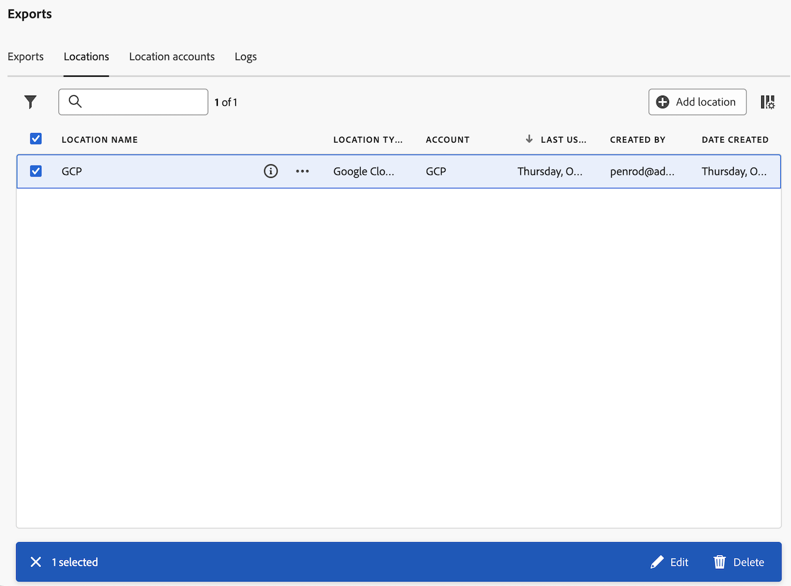

# Verwalten von Cloud-Exportspeicherorten und -Konten

Sie können Cloud-Export-Speicherorte anzeigen, bearbeiten und löschen.

Informationen zum Erstellen eines neuen Speicherorts finden Sie unter [Konfigurieren von Cloud-Exportspeicherorten](/help/components/exports/cloud-export-locations.md).

## Filtern und Suchen von Standorten

Um die benötigten Informationen zu finden, können Sie entweder die Liste der Standorte filtern oder nach einem Standort suchen.

### Filtern der Standortliste

1. Wählen Sie beim Customer Journey Analytics [!UICONTROL **Komponenten**] > [!UICONTROL **Exporte**] aus.

1. Wählen Sie die [!UICONTROL **Standorte**] aus.

1. Wählen Sie das Symbol **Filter** aus.

   <!-- add screenshot -->

   Sie können nach den folgenden Kriterien filtern:

   | Filter | Beschreibung |
   |---------|----------|
   | [!UICONTROL **Standorttyp**]<!--should this be changed to Account type?--> | Der Kontotyp, mit dem der Speicherort verknüpft ist. Die folgenden Kontotypen können verfügbar sein: <ul><li>[!UICONTROL **AEP-Data Landing Zone**]</li><li>[!UICONTROL **Amazon S3-Rollen-ARN**]</li><li>[!UICONTROL **Azure SAS**]</li><li>[!UICONTROL **Azure RBAC**]</li><li>[!UICONTROL **Google Cloud Platform**]</li><li>[!UICONTROL **Snowflake**]</li></ul> |
   | [!UICONTROL **Konto**] | Der Name des Kontos, mit dem der Speicherort verknüpft ist. |
   | [!UICONTROL **Erstellt von**] | Die E-Mail-Adresse des Benutzers, der den Standort erstellt hat. |

   {style="table-layout:auto"}

### Suchen nach Standorten

1. Wählen Sie beim Customer Journey Analytics [!UICONTROL **Komponenten**] > [!UICONTROL **Exporte**] aus.

1. Wählen Sie die [!UICONTROL **Standorte**] aus.

1. (Bedingt) Wenn Sie Systemadministrator sind, können Sie die Option [!UICONTROL **Standorte für alle Benutzer anzeigen**] aktivieren, um Standorte anzuzeigen, die von allen Benutzern in Ihrer Organisation erstellt wurden.

1. Geben Sie im Suchfeld zunächst alle Informationen ein, die mit dem gesuchten Ort verknüpft sind. Sie können nach Daten aus jeder in der Tabelle verfügbaren Spalte suchen.

## Standorte bearbeiten

Ein Speicherort kann nur von dem Benutzer, der ihn erstellt hat, oder von einem Systemadministrator bearbeitet werden.

So bearbeiten Sie einen Speicherort:

1. Wählen Sie beim Customer Journey Analytics [!UICONTROL **Komponenten**] > [!UICONTROL **Exporte**] aus.

1. Wählen Sie die [!UICONTROL **Standorte**] aus.

1. (Bedingt) Wenn Sie Systemadministrator sind, können Sie die Option [!UICONTROL **Standorte für alle Benutzer anzeigen**] aktivieren, um Standorte anzuzeigen, die von allen Benutzern in Ihrer Organisation erstellt wurden.

1. Wählen Sie den Speicherort aus, den Sie bearbeiten möchten.

   

1. Wählen Sie [!UICONTROL **Bearbeiten**] aus.

1. Nehmen Sie die gewünschten Änderungen vor und klicken Sie dann auf [!UICONTROL **Speichern**].

## Löschen von Speicherorten

Wenn Sie einen Speicherort löschen, werden alle Exporte, die diesen Speicherort verwenden, ebenfalls gelöscht. Überprüfen Sie beim Löschen das Bestätigungsdialogfeld, um sicherzustellen, dass mit dem Speicherort keine Exporte verknüpft sind.

So löschen Sie einen Speicherort:

1. Wählen Sie beim Customer Journey Analytics [!UICONTROL **Komponenten**] > [!UICONTROL **Exporte**] aus.

1. Wählen Sie die [!UICONTROL **Standorte**] aus.

1. (Bedingt) Wenn Sie Systemadministrator sind, können Sie die Option [!UICONTROL **Standorte für alle Benutzer anzeigen**] aktivieren, um Standorte anzuzeigen, die von allen Benutzern in Ihrer Organisation erstellt wurden.

1. Wählen Sie einen oder mehrere Standorte aus, die Sie löschen möchten.

   

1. Wählen Sie [!UICONTROL **Löschen**] aus.

   Das Dialogfeld Speicherort löschen wird angezeigt.

1. Stellen Sie im Dialogfeld Speicherort löschen sicher, dass der Speicherort mit keinem Export verknüpft ist, bevor Sie den Löschvorgang bestätigen.

   

1. Wählen [!UICONTROL **zur Bestätigung erneut**] Löschen) aus.

## Konten bearbeiten

Ein Konto kann nur von dem Benutzer, der es erstellt hat, oder von einem Systemadministrator bearbeitet werden.

So bearbeiten Sie ein Konto:

1. Wählen Sie beim Customer Journey Analytics [!UICONTROL **Komponenten**] > [!UICONTROL **Exporte**] aus.

1. Wählen Sie die [!UICONTROL **Speicherort-Konten**] aus.

   

1. (Bedingt) Wenn Sie Systemadministrator sind, können Sie die Option [!UICONTROL **Konten für alle Benutzer anzeigen**] aktivieren, um Speicherorte anzuzeigen, die von allen Benutzern in Ihrer Organisation erstellt wurden.

1. Wählen [!UICONTROL **für**] Konto, das Sie bearbeiten möchten, die Option „Details anzeigen“ aus.

1. Nehmen Sie die gewünschten Änderungen vor und klicken Sie dann auf [!UICONTROL **Speichern**].

## Kontoschlüssel anzeigen

Nachdem Sie ein Konto erstellt haben, können Sie alle zugehörigen Kontoschlüssel für dieses Konto anzeigen. Möglicherweise müssen Sie diese Informationen anzeigen, wenn Sie die Konfiguration des Kontos mit Ihrem Cloud-Anbieter ([ der ursprünglichen Konfiguration des Kontos) nicht ](/help/components/exports/cloud-export-accounts.md) haben.

So zeigen Sie die mit einem Exportkonto verknüpften Schlüssel an:

1. Wählen Sie beim Customer Journey Analytics [!UICONTROL **Komponenten**] > [!UICONTROL **Exporte**] aus.

1. Wählen Sie die [!UICONTROL **Speicherort-Konten**] aus.

   

1. (Bedingt) Wenn Sie Systemadministrator sind, können Sie die Option [!UICONTROL **Konten für alle Benutzer anzeigen**] aktivieren, um Speicherorte anzuzeigen, die von allen Benutzern in Ihrer Organisation erstellt wurden.

1. Klicken Sie auf das Dreipunkt-Symbol des Kontos, das Sie bearbeiten möchten, und klicken Sie dann auf [!UICONTROL **Kontoschlüssel**].

## Löschen von Konten

1. Wählen Sie beim Customer Journey Analytics [!UICONTROL **Komponenten**] > [!UICONTROL **Exporte**] aus.

1. Wählen Sie die [!UICONTROL **Speicherort-Konten**] aus.

   

1. (Bedingt) Wenn Sie Systemadministrator sind, können Sie die Option [!UICONTROL **Konten für alle Benutzer anzeigen**] aktivieren, um Speicherorte anzuzeigen, die von allen Benutzern in Ihrer Organisation erstellt wurden.

1. Wählen Sie das 3-Punkt-Symbol für das Konto, das Sie bearbeiten möchten, und dann [!UICONTROL **Konto löschen**].

1. Wählen [!UICONTROL **im Bestätigungsdialogfeld**] Löschen“ erneut aus.

## Konfigurieren von unternehmensweiten Einstellungen (nur Administratoren)

Systemadministratoren können Benutzer daran hindern, Konten und Standorte zu erstellen, oder sie können die Arten von Konten einschränken, die Benutzer erstellen und verwenden können.

### Konfigurieren, ob Benutzer Konten erstellen und bearbeiten können

Standardmäßig können alle Benutzerinnen und Benutzer im Unternehmen Konten erstellen und Konten bearbeiten, die sie in Ihrer Customer Journey Analytics-Umgebung erstellen, wie in [Konfigurieren von Cloud-Exportkonten](/help/components/exports/cloud-export-accounts.md) beschrieben.

Sie können das Erstellen von Konten durch Benutzer einschränken. Wenn Sie dies tun, können Benutzer weiterhin alle Konten verwenden, die sie bereits erstellt haben, sie können sie jedoch nicht mehr bearbeiten. Von Benutzern erstellte Konten können gelöscht werden, wie unter [Löschen eines Kontos](#delete-an-account) beschrieben.

So verhindern Sie, dass alle Benutzer Konten erstellen und bearbeiten:

1. Wählen Sie beim Customer Journey Analytics **[!UICONTROL Komponenten]** > **[!UICONTROL Exporte]** und klicken Sie dann auf die Registerkarte [!UICONTROL **Admin-Einstellungen**].

1. Deaktivieren Sie im Abschnitt [!UICONTROL **Standortkonten**] die Option [!UICONTROL **Benutzern das Erstellen und Verwalten von Standortkonten ermöglichen**].

1. Wählen Sie [!UICONTROL **Speichern**] aus.

1. (Optional) Löschen Sie alle Konten, die von Benutzern erstellt wurden und die diese nicht mehr verwenden sollen, wie in [Konto löschen](#delete-an-account) beschrieben.

### Konfigurieren, ob Benutzer Standorte erstellen und bearbeiten können

Standardmäßig können alle Benutzerinnen und Benutzer im Unternehmen Speicherorte erstellen und Speicherorte bearbeiten, die sie in Ihrer Customer Journey Analytics-Umgebung erstellen, wie in [Konfigurieren von Cloud-Exportspeicherorten](/help/components/exports/cloud-export-locations.md) beschrieben.

Sie können Benutzer daran hindern, Standorte zu erstellen. Wenn Sie dies tun, können Benutzerinnen und Benutzer weiterhin alle Speicherorte verwenden, die sie bereits erstellt haben, sie können sie jedoch nicht mehr bearbeiten. Sie können von Benutzern erstellte Speicherorte löschen, wie unter [Löschen von Speicherorten](#delete-a-location) beschrieben.

So verhindern Sie, dass alle Benutzer Standorte erstellen und bearbeiten:

1. Wählen Sie beim Customer Journey Analytics **[!UICONTROL Komponenten]** > **[!UICONTROL Exporte]** und klicken Sie dann auf die Registerkarte [!UICONTROL **Admin-Einstellungen**].

1. Deaktivieren Sie im [!UICONTROL **Standorte**] die Option [!UICONTROL **Benutzern das Erstellen und Verwalten von Standorten ermöglichen**].

1. Wählen Sie [!UICONTROL **Speichern**] aus.

1. (Optional) Löschen Sie alle von Benutzern erstellten Standorte, die diese nicht mehr verwenden sollen, wie in [Löschen eines Standorts](#delete-a-location) beschrieben.

### Einschränken der Kontotypen, die Benutzer erstellen und verwenden können

Sie können die Kontotypen, die Benutzerinnen und Benutzer sehen, in den folgenden Fällen einschränken:

* Beim [Erstellen neuer Konten](/help/components/exports/cloud-export-accounts.md)
* Bei der Auswahl der Konten, die beim Exportieren von Dateien verwendet werden sollen, wird [vollständiger Tabellenexport](/help/analysis-workspace/export/export-cloud.md) verwendet.

Wenn Sie Kontotypen wie in diesem Abschnitt beschrieben einschränken, sind alle Konten des Typs, den Sie einschränken, für Benutzerinnen und Benutzer nicht mehr sichtbar. Dies bedeutet, dass keine neuen Konten dieses Typs erstellt werden können und dass vorhandene Konten dieses Typs beim Exportieren von Dateien mit dem vollständigen Tabellenexport nicht verwendet werden können.

Vorhandene Konten, die für geplante Exporte konfiguriert sind, müssen jedoch gelöscht werden, wenn Sie ihre Verwendung einschränken möchten.

#### Sicherstellen, dass keine Konten für geplante Exporte verwendet werden

Wenn Sie Kontotypen einschränken, werden vorhandene Konten ausgeblendet, nicht gelöscht.

Wenn Zeitpläne bereits so konfiguriert sind, dass Daten an ein Konto gesendet werden, das von dem Typ ist, den Sie einschränken, werden die Zeitpläne auch nach dem Einschränken des Kontotyps weiter ausgeführt und die Daten werden weiterhin an das Konto gesendet. Wenn beispielsweise ein vollständiger Tabellenexport geplant ist, um Daten an einen Kontotyp zu senden, den Sie einschränken, wird der Zeitplan weiterhin ausgeführt.

Wenn Sie sicherstellen müssen, dass Konten eines bestimmten Typs nicht in geplanten Exporten verwendet werden, können Sie die Konten löschen, bevor Sie [die Kontotypen beschränken](#limit-the-account-types-that-are-available-to-users).

Löschen von Konten:

1. Suchen Sie die Konten des Kontotyps, den Sie beschränken möchten und der für geplante Exporte verwendet wird.

1. Löschen Sie die Konten, wie unter [Löschen eines Kontos](#delete-an-account) beschrieben.

1. Fahren Sie mit dem folgenden Abschnitt fort[ „Beschränken Sie die Kontotypen, die Benutzern zur Verfügung stehen](#limit-the-account-types-that-are-available-to-users).

#### Beschränken Sie die Kontotypen, die Benutzern zur Verfügung stehen

So beschränken Sie die Kontotypen, die Benutzern beim Erstellen und Verwenden von Konten zur Verfügung stehen:

1. Wählen Sie beim Customer Journey Analytics **[!UICONTROL Komponenten]** > **[!UICONTROL Exporte]** und klicken Sie dann auf die Registerkarte [!UICONTROL **Admin-Einstellungen**].

1. Suchen Sie den Abschnitt [!UICONTROL **Zulässige**]).

   Die folgenden Kontotypen stehen Benutzern standardmäßig zur Verfügung. Heben Sie die Auswahl eines dieser Kontotypen auf, deren Verwendung für Benutzer eingeschränkt werden soll.

   * [!UICONTROL **AEP-Data Landing Zone**]

   * [!UICONTROL **Amazon S3-Rollen-ARN**]

   * [!UICONTROL **Google Cloud Platform**]

   * [!UICONTROL **Azure SAS**]

   * [!UICONTROL **Azure RBAC**]

   * [!UICONTROL **Snowflake**]

1. Wählen Sie [!UICONTROL **Speichern**] aus.
